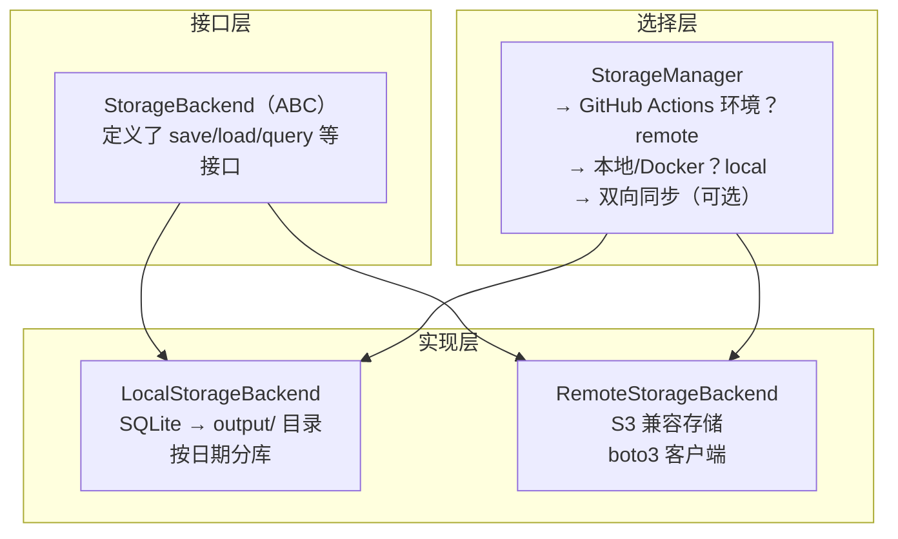

# （三）数据采集与存储层

> 基于 TrendRadar v6.9.1。

## 数据从哪来

TrendRadar 的数据源分两类：

| 类型 | 来源 | 数量 |
|------|------|------|
| 热搜榜 | NewsNow API——聚合了 11 个中文平台的热搜数据 | 固定 |
| RSS | 用户自定义的 RSS/Atom 订阅源 | 不限 |

### NewsNow API

```python
# crawler/fetcher.py
class DataFetcher:
    API_URL = "https://newsnow.busiyi.world/api/s"

    def crawl_websites(self, platforms: list[str]) -> list[dict]:
        """调用 NewsNow API，拉取各平台热搜榜"""
        response = self._request_with_retry(self.API_URL)
        data = response.json()

        results = []
        for platform_id, platform_name in self.PLATFORM_MAP.items():
            if platform_name in platforms:
                items = data.get(platform_id, [])
                for item in items:
                    results.append({
                        "title": item["title"],
                        "url": item.get("url", ""),
                        "rank": item.get("rank", 0),
                        "platform": platform_name,
                        "hot_score": item.get("hot_score", 0)
                    })
        return results
```

NewsNow 是一个免费的热搜聚合 API，一次请求返回所有平台的数据。TrendRadar 不需要自己对接 11 个平台的 API——NewsNow 已经做了清洗和标准化。

`DataFetcher` 的核心职责不是爬虫，而是**适配器**——把 NewsNow 的返回格式转成 TrendRadar 的内部数据模型。

v6.9.0 新增了**域名安全检查**——如果某条新闻的 URL 不在允许的域名列表中，自动拒绝。这是一个防御性设计：防止恶意链接混入推送。

### RSS/Atom 抓取

```python
# crawler/rss/fetcher.py
class RSSFetcher:
    def fetch_all(self, feeds: list[RSSFeedConfig]) -> list[RSSData]:
        """并行抓取所有 RSS 源"""
        async def _fetch():
            tasks = [self._fetch_single(feed) for feed in feeds]
            return await asyncio.gather(*tasks, return_exceptions=True)

        results = asyncio.run(_fetch())
        # 过滤掉失败的，只返回成功的结果
        return [r for r in results if not isinstance(r, Exception)]

    async def _fetch_single(self, feed: RSSFeedConfig) -> RSSData:
        """抓取单个 RSS 源"""
        async with httpx.AsyncClient() as client:
            response = await client.get(feed.url, timeout=30)
            parsed = feedparser.parse(response.text)
            
            items = []
            for entry in parsed.entries:
                published = entry.get("published_parsed") or entry.get("updated_parsed")
                if published and self._is_fresh(published, feed.max_age_days):
                    items.append({
                        "title": entry.title,
                        "url": entry.link,
                        "source": feed.name,
                        "published": published
                    })
            
            return RSSData(feed_name=feed.name, items=items)
```

关键设计是**异步并行**——10 个 RSS 源同时抓，总耗时 ≈ 最慢的那个源的响应时间，而不是累加。如果串行，每个 2 秒就是 20 秒。并行后 2-3 秒全部搞定。

**新鲜度过滤**在抓取阶段就做了——超过 `max_age_days`（默认 1 天）的条目直接丢弃，不进存储层。

## 数据模型

`storage/base.py` 定义了数据结构的标准形式：

```python
@dataclass
class NewsItem:
    """热搜新闻条目——NewsNow API 返回的单条数据"""
    title: str
    url: str
    platform: str
    rank: int
    hot_score: int
    crawl_time: str

@dataclass
class RSSItem:
    """RSS 条目"""
    title: str
    url: str
    source: str
    published: str

@dataclass
class NewsData:
    """一次采集的完整数据"""
    items: list[NewsItem]
    crawl_time: str
    platform_stats: dict[str, int]  # 各平台采集数量

@dataclass
class RSSData:
    """一次 RSS 采集的完整数据"""
    items: list[RSSItem]
    feed_name: str
```

用 `dataclass` 而不是 `dict` 有一个关键好处：**类型安全**。存储层的下游代码（分析引擎、通知分发）拿到的不是松散的 dict，是有明确字段的数据对象。如果字段名拼错了——IDE 直接报红，不用等到运行时。

## 存储层：抽象与实现分离

TrendRadar 支持两种存储后端：本地 SQLite 和远程 S3（Cloudflare R2 / AWS S3 / 腾讯 COS）。



### 抽象基类

```python
# storage/base.py（简化）
from abc import ABC, abstractmethod

class StorageBackend(ABC):
    @abstractmethod
    def save_news(self, date: str, data: NewsData) -> None: ...
    
    @abstractmethod
    def load_news(self, date: str) -> NewsData | None: ...
    
    @abstractmethod
    def query_news(self, date: str, keyword: str) -> list[NewsItem]: ...
    
    @abstractmethod
    def get_available_dates(self) -> list[str]: ...

# 两种实现
class LocalStorageBackend(StorageBackend):   # SQLite
class RemoteStorageBackend(StorageBackend):  # S3
```

上层代码只依赖 `StorageBackend` 接口——它不关心数据在 `output/2026-06-11/news.db` 还是 `s3://my-bucket/2026-06-11/news.db`。

### 本地存储：SQLite

```python
# storage/local.py（简化）
class LocalStorageBackend(StorageBackend):
    def __init__(self, output_dir="output"):
        self.output_dir = Path(output_dir)

    def save_news(self, date: str, data: NewsData):
        db_path = self.output_dir / date / "news.db"
        db_path.parent.mkdir(parents=True, exist_ok=True)

        with sqlite3.connect(str(db_path)) as conn:
            conn.execute("""
                CREATE TABLE IF NOT EXISTS news (
                    id INTEGER PRIMARY KEY AUTOINCREMENT,
                    title TEXT, url TEXT, platform TEXT,
                    rank INTEGER, hot_score INTEGER,
                    crawl_time TEXT, created_at TIMESTAMP DEFAULT CURRENT_TIMESTAMP
                )
            """)
            for item in data.items:
                conn.execute(
                    "INSERT INTO news (title, url, platform, rank, hot_score, crawl_time) "
                    "VALUES (?, ?, ?, ?, ?, ?)",
                    (item.title, item.url, item.platform, item.rank, item.hot_score, item.crawl_time)
                )
```

几个设计决策：

1. **按日期分库**——`output/2026-06-11/news.db`、`output/2026-06-12/news.db`... 好处是天然的按天隔离，旧数据归档就是删目录，不会出现一个几十 GB 的 SQLite 文件
2. **SQLite 足够**——每次运行的数据量（几百到几千条新闻）SQLite 完全扛得住，不需要 MySQL/PostgreSQL
3. **自动建表**——`CREATE TABLE IF NOT EXISTS`，首次运行不需要手动初始化

### 远程存储：S3

```python
# storage/remote.py（简化）
class RemoteStorageBackend(StorageBackend):
    def __init__(self, endpoint_url, access_key, secret_key, bucket):
        self.s3 = boto3.client(
            "s3",
            endpoint_url=endpoint_url,       # Cloudflare R2 或 AWS S3 或 COS
            aws_access_key_id=access_key,
            aws_secret_access_key=secret_key
        )
        self.bucket = bucket

    def save_news(self, date: str, data: NewsData):
        # 先存到本地临时文件，再上传到 S3
        key = f"{date}/news.db"
        tmp_path = f"/tmp/{date}_news.db"
        # ... 同 local.py 的逻辑写 SQLite
        self.s3.upload_file(tmp_path, self.bucket, key)
```

远程存储的逻辑和本地一样——都在 SQLite 文件上操作，只是最后存的位置不同。**本地和远程共享同一套 schema**——迁移只需要把 SQLite 文件换个位置存。

### StorageManager：自动选择

```python
# storage/manager.py（简化）
class StorageManager:
    def __init__(self, config):
        self.local = LocalStorageBackend(config.output_dir)
        self.remote = None

        if self._is_github_actions():       # GITHUB_ACTIONS 环境变量
            self.remote = RemoteStorageBackend(...)
            self.active = self.remote       # 远程优先
        else:
            self.active = self.local        # 本地优先

    def save_news(self, date, data):
        self.active.save_news(date, data)   # 只写主后端
        if self.remote:
            self.remote.save_news(date, data)  # 有远程则同步一份
```

**GitHub Actions 自动选远程，本地自动选 SQLite**——用户不需要理解后端选择逻辑。

## 数据流的两个关键细节

### 1. 去重——同一条新闻不反复存

```python
def _is_new_item(self, conn, title, url, crawl_time):
    cursor = conn.execute(
        "SELECT 1 FROM news WHERE title = ? AND url = ? AND date(crawl_time) = date(?)",
        (title, url, crawl_time)
    )
    return cursor.fetchone() is None
```

同标题 + 同 URL + 同一天 = 同一条。热搜榜的特点是同一条新闻可能在榜上挂几个小时——每次采集都会拉到。不去重的话，分析时同一条新闻会被算多次。

### 2. 新条目检测——增量模式的核心

```python
def detect_new_titles(self, today_titles, historical_titles):
    """找出今天新出现、昨天没出现过的标题"""
    historical_set = {t.title for t in historical_titles}
    return [t for t in today_titles if t.title not in historical_set]
```

增量模式（`report_mode: incremental`）只推"新上热搜的"内容。一个话题如果在榜上挂了三天，用户三天都收到——体验会很差。这个函数保证了**只推送新进入榜单的新闻**。

## 小结

数据层的设计取舍：

| 决策 | 选择 | 理由 |
|------|------|------|
| 数据源 | NewsNow API 而非自己对接 11 个平台 | 清洗和标准化别人做了，专注在分析上 |
| RSS 抓取 | 异步并行 | 10 个源串行 20 秒 → 并行 2 秒 |
| 存储引擎 | SQLite 而非 MySQL | 数据量小、无运维、天然按日期分库 |
| 远程方案 | S3 兼容而非自建 | Cloudflare R2 免费额度够用、零运维 |
| 后端选择 | 环境自动检测 | GitHub Actions → remote，本地 → local |

一个贯穿始终的原则：**不做基础设施能做的事**。不用 PostgreSQL 因为 SQLite 够用；不对接 11 个平台因为 NewsNow 做了；不自建文件存储因为 S3 兼容方案到处都是。工程资源集中在分析引擎和通知分发上——那才是用户感知到的价值。

下一篇看分析引擎——关键词怎么匹配、AI 怎么过滤、加权评分怎么算。
