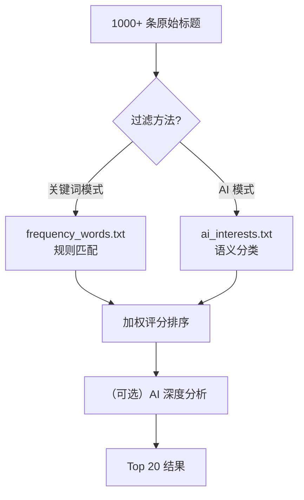
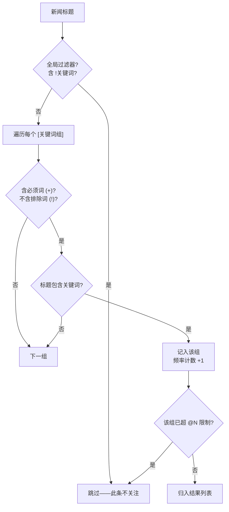
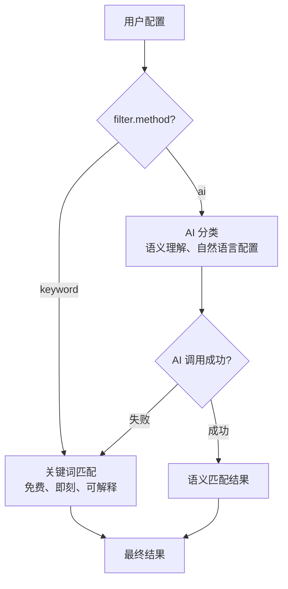

# （四）分析引擎：关键词匹配与 AI 过滤

> 基于 TrendRadar v6.9.1。

## 从一个数字说起

NewsNow API 一次返回约 500 条热搜标题。加上 RSS 源，每天轻松上千条。用户通常只关心其中 5-20 条。从 1000 条里捞出 10 条——这是分析引擎的全部工作。



## 三种上报模式

配置里的 `report.mode` 有三个选项，各自对应不同场景：

| 模式 | 数据源 | 推送什么 | 场景 |
|------|--------|----------|------|
| `current` | 最新一次采集 | 这次的增量 | "我现在就想看看有什么新东西" |
| `daily` | 今天所有采集 | 今天全部匹配结果 | 日报——"今天有什么值得关注的" |
| `incremental` | 今天 vs 昨天 | 只推新出现的热点 | 去重——"有什么新热点" |

在 `__main__.py` 中，三种模式的分支：

```python
def _execute_mode_strategy(self, mode, ctx):
    if mode == "current":
        titles = ctx.load_latest_titles()          # 只取最新一批
    elif mode == "daily":
        titles = ctx.load_today_titles()           # 今天全部
    elif mode == "incremental":
        today = ctx.load_today_titles()
        yesterday = ctx.load_yesterday_titles()
        titles = self._detect_new_titles(today, yesterday)  # 新出现的
    return self._run_analysis_pipeline(titles)
```

## 加权评分公式

匹配出相关新闻后，需要排序——用户最先看到的最重要。TrendRadar 用了一个简单的加权公式：

```
score = rank_weight × rank_score + frequency_weight × freq_score + hotness_weight × hot_score
```

默认权重：

```yaml
# config.yaml
weight:
  rank_weight: 0.6       # 排名权重——在热搜榜上排第几
  frequency_weight: 0.3  # 频率权重——匹配了多少个关键词
  hotness_weight: 0.1    # 热度权重——平台给的热度值
```

```python
# core/analyzer.py（简化）
def calculate_news_weight(item, matched_count, config):
    # 排名分：排名越靠前（rank 越小），得分越高
    rank_score = 1.0 / (item.rank + 1)

    # 频率分：匹配的关键词越多越重要
    freq_score = min(matched_count / 5.0, 1.0)  # 上限 5 个关键词

    # 热度分：平台热度的归一化值
    hot_score = min(item.hot_score / 1000000.0, 1.0)

    return (
        config["rank_weight"] * rank_score +
        config["frequency_weight"] * freq_score +
        config["hotness_weight"] * hot_score
    )
```

排名权重（0.6）最高——热搜榜第一比热搜榜第五十重要得多。这个设计反映了直觉：**位置比热度值更可靠**，因为热度值的计算方式各平台不一样。

## 关键词匹配引擎

`core/frequency.py` 是整个系统调用最频繁的模块——每条标题都要跑一次匹配。

### 匹配流程



### 关键实现

```python
# core/frequency.py（简化）
def matches_word_groups(title: str, groups: dict[str, list[WordRule]]) -> list[str]:
    """返回这条标题匹配的所有组名"""
    matched_groups = []

    for group_name, rules in groups.items():
        if group_name == "GLOBAL_FILTER":
            continue

        must_words = [r for r in rules if r.mode == "required"]
        exclude_words = [r for r in rules if r.mode == "exclude"]

        # 必须词：全部出现才算（AND）
        if must_words and not all(w.text in title for w in must_words):
            continue

        # 排除词：任一出现就跳过（OR）
        if exclude_words and any(w.text in title for w in exclude_words):
            continue

        # 普通关键词：任一匹配即可（OR）
        for rule in rules:
            if rule.mode == "regex" and re.search(rule.pattern, title):
                matched_groups.append(group_name)
                break
            elif rule.mode == "normal" and rule.text in title:
                matched_groups.append(group_name)
                break

    return matched_groups
```

三种匹配模式的关系：**必须词是 AND 门，排除词是 NOT 门，普通词是 OR 门**。这给了用户足够的表达力而不会过于复杂——不需要学正则，大部分场景用普通关键词就够。

### 频率统计

```python
def count_word_frequency(matched_results):
    """按组统计频率，附带每条新闻的排名、平台、时间"""
    stats = {}
    for group_name, items in matched_results.items():
        stats[group_name] = {
            "count": len(items),               # 该组匹配了多少条
            "items": items,                     # 完整列表
            "top_platforms": Counter(           # 哪个平台出现最多
                item.platform for item in items
            ).most_common(3),
            "rank_range": (                     # 排名范围
                min(item.rank for item in items),
                max(item.rank for item in items)
            ),
            "time_range": _format_time_range(items)  # "08:30 - 14:20"
        }
    return stats
```

这些统计数据直接喂给通知模板和 HTML 报告——用户看到的"AI 领域 3 条热点，主要来自知乎和微博，排名 1-15"就是从 `stats` 里取的。

## AI 过滤模式

关键词模式足够直接，但有两个局限：
1. 用户得**知道自己想监控什么关键词**——有时候你只知道"我对 AI 和量化感兴趣"，列不出精确的关键词列表
2. 关键词匹配是**字面匹配**——"大模型"不匹配"LLM"，"量化"不匹配"Quant"

AI 模式解决这两个问题。

### 核心流程

```python
# ai/filter.py（简化）
class AIFilter:
    def __init__(self, client: AIClient):
        self.client = client
        self.tag_cache = {}      # 缓存提取的标签
        self.news_hash_cache = {}  # 已分析新闻的 hash → 结果缓存

    def filter(self, interests: str, news_items: list[NewsItem]) -> list[AiFilterResult]:
        # Step 1: 从兴趣描述提取标签
        tags = self._extract_tags(interests)

        # Step 2: 过滤已分析过的新闻（用 hash 去重）
        new_items = self._filter_cached(news_items)

        # Step 3: 批量分类——每条新闻对每个标签打分
        results = self._classify_batch(tags, new_items)

        # Step 4: 筛选——只返回相关性 > min_score 的
        return [r for r in results if r.score >= self.min_score]
```

### 标签提取

```python
def _extract_tags(self, interests: str) -> list[str]:
    """从自然语言兴趣描述中提取标签。

    输入: "我对AI编程工具和量化交易感兴趣，也关注Rust语言的发展"
    输出: ["AI编程工具", "量化交易", "Rust语言"]
    """
    if interests in self.tag_cache:
        return self.tag_cache[interests]

    prompt = load_prompt("config/ai_filter/extract_prompt.txt")
    response = self.client.chat(
        messages=[
            {"role": "system", "content": prompt},
            {"role": "user", "content": interests}
        ]
    )
    tags = [line.strip("- ") for line in response.split("\n") if line.startswith("-")]
    self.tag_cache[interests] = tags
    return tags
```

`tag_cache` 缓存了"兴趣描述 → 标签列表"的映射——同一次运行中不重复调 AI 提取。

### 新闻 hash 去重

```python
def _filter_cached(self, news_items):
    """只返回未分析过的新闻"""
    new_items = []
    for item in news_items:
        item_hash = hashlib.md5(
            f"{item.title}{item.url}".encode()
        ).hexdigest()
        if item_hash not in self.news_hash_cache:
            new_items.append(item)
            self.news_hash_cache[item_hash] = None
    return new_items
```

每天热搜榜上大部分是"旧闻"——昨天就在榜上，今天还在。这个 hash 去重省掉了大量重复的 AI 调用。

### 增量机制

当用户修改 `ai_interests.txt` 时，AI 会判断变更程度：

1. **新增兴趣**——只对新兴趣的标签做增量分类
2. **删除兴趣**——移除对应标签的旧结果
3. **修改兴趣**——AI 判断是否等价于标签重构，决定增量还是全量重新分类

```
修改 "关注AI与量化交易" → "关注大模型与量化策略"
AI 判断: 两个兴趣都变了 → 触发全量重新分类
```

## AI 深度分析

关键词和 AI 过滤解决"捞出来"的问题。AI 深度分析（`ai/analyzer.py`）解决"怎么看"的问题。

```python
def run_ai_analysis(self, stats, news_items, config):
    """对过滤后的新闻做深度分析——4 段式输出"""
    prompt = load_prompt(config.get("prompt_template", "config/ai_analysis_prompt.txt"))

    # 构建 prompt——把统计数据注入
    prompt = prompt.format(
        topic_stats=self._format_stats(stats),
        news_list=self._format_news(news_items[:50])  # 最多传 50 条
    )

    response = self.client.chat(
        messages=[
            {"role": "system", "content": prompt},
            {"role": "user", "content": "请分析以上新闻"}
        ],
        temperature=0.3,     # 要分析不要创意
        max_tokens=2000
    )

    return self._parse_analysis_response(response)
```

AI 分析的输出是 4 段结构化内容：

```json
{
  "core_trends": "今天AI Agent领域的主要趋势是...",
  "sentiment": "整体情绪偏正面，3条融资消息，1条负面裁员新闻...",
  "key_signals": "值得关注的信号：OpenAI新模型发布可能影响...",
  "strategy_insights": "对投资者的建议：关注应用层的机会..."
}
```

每段有独立的摘要版本（`standalone_summary`，约 50 字）——给通知推送用（消息框里放不了 500 字的分析）。

## LiteLLM 封装：多模型支持的关键

`ai/client.py` 是整个 AI 模块的基座：

```python
import litellm
from tenacity import retry, stop_after_attempt, wait_exponential

class AIClient:
    def __init__(self, config):
        self.model = config["model"]              # "deepseek/deepseek-chat"
        self.fallback = config.get("fallback_model")  # "openai/gpt-4o-mini"
        self.temperature = config.get("temperature", 0.3)
        self.max_tokens = config.get("max_tokens", 2000)
        self.timeout = config.get("timeout", 60)

    @retry(
        stop=stop_after_attempt(3),
        wait=wait_exponential(multiplier=1, min=2, max=30)
    )
    def chat(self, messages: list[dict]) -> str:
        try:
            response = litellm.completion(
                model=self.model,
                messages=messages,
                temperature=self.temperature,
                max_tokens=self.max_tokens,
                timeout=self.timeout
            )
            return response.choices[0].message.content

        except litellm.exceptions.APIError as e:
            if self.fallback:
                # 主模型失败 → 切到 fallback
                return self._chat_with_fallback(messages)
            raise
```

几个设计点：
- **`litellm`** 是统一接口——切换模型只改 `model` 字符串，不改代码
- **tenacity 重试**——指数退避：2s → 4s → 8s，最多 3 次
- **fallback 自动切换**——DeepSeek 挂了自动用 GPT-4o-mini
- **便宜模型拆任务**——分析用 gpt-4o，标签提取用 gpt-4o-mini，翻译用 gpt-4o-mini

## 关键词 vs AI 的协同关系



**AI 是增强，关键词是保底。** AI 挂了不会丢新闻——自动降级到关键词匹配。这种设计哲学是"做加法，不做乘法"：AI 能力是给关键词加了一个语义层，不是替代。

## 小结

分析引擎是 TrendRadar 从"新闻搬运工"变成"信息筛选器"的关键：

| 组件 | 做什么 | 核心代码 |
|------|--------|----------|
| 模式策略 | daily / current / incremental | `__main__._execute_mode_strategy()` |
| 加权评分 | 排名 × 0.6 + 频率 × 0.3 + 热度 × 0.1 | `core/analyzer.calculate_news_weight()` |
| 关键词匹配 | AND/OR/NOT 三态逻辑 | `core/frequency.matches_word_groups()` |
| AI 过滤 | 兴趣 → 标签 → 语义分类 → 评分 | `ai/filter.py` |
| AI 深度分析 | 4 段式结构化输出 | `ai/analyzer.py` |
| LiteLLM 客户端 | 重试 + fallback + 多厂商 | `ai/client.py` |

下一篇看最后一步——分析结果怎么变成飞书消息、HTML 报告、MCP 工具调用。
