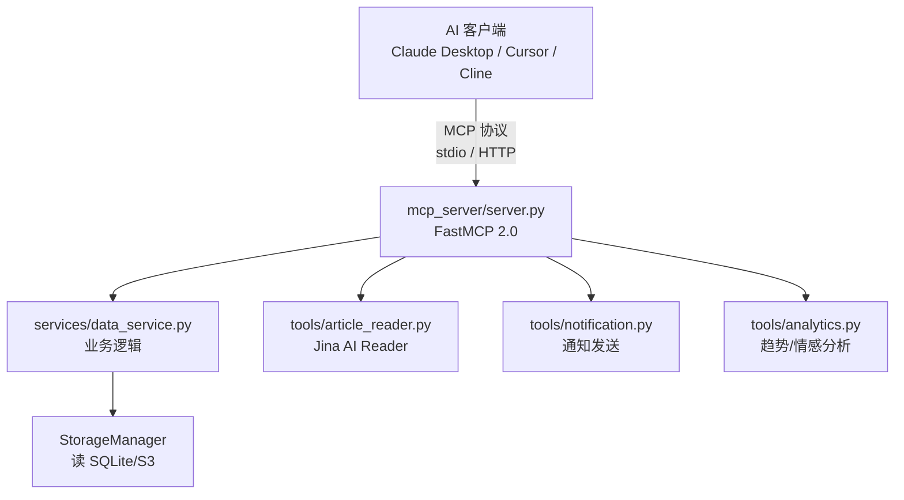
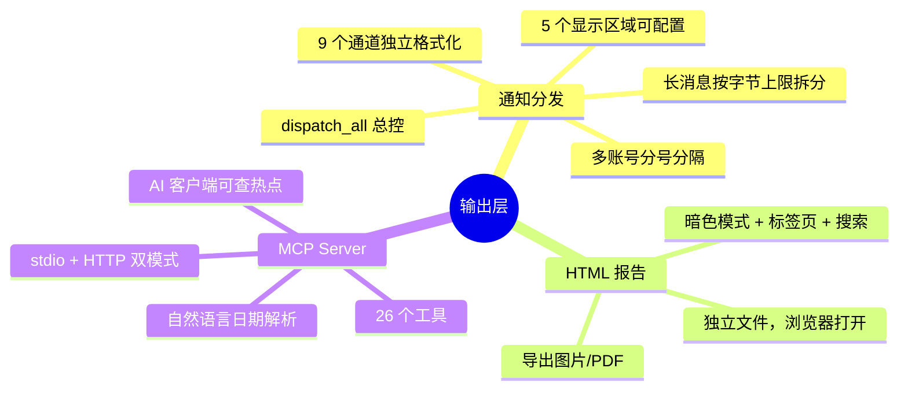

# （五）通知分发、报告生成与 MCP Server

> 基于 TrendRadar v6.9.1。

## 分析完了，然后呢

前 4 篇串下来，数据已经被采集、过滤、分析——现在有一堆结果等着被"送出去"。TrendRadar 给出了两种形态：

1. **主动推送**——9 个通知通道，用户被动收到消息
2. **被动查询**——HTML 报告（用户打开看）+ MCP Server（AI 客户端查）

## 通知分发：一条消息走九条路

### dispatcher 的总控逻辑

```python
# notification/dispatcher.py（简化）
class NotificationDispatcher:
    def dispatch_all(self, stats, ai_result, config):
        """一次调用，推送到所有配置的通道"""
        channels = self._get_enabled_channels(config)

        for channel in channels:
            # 1. 格式化——不同通道用不同模板
            content = self._format_for_channel(channel, stats, ai_result)

            # 2. 拆分——超长消息切成多段
            batches = split_content_into_batches(content, channel)

            # 3. 多账号——分号分隔的多个账号，逐个推送
            accounts = self._parse_accounts(config, channel)
            for account in accounts:
                for batch in batches:
                    sender = SENDERS[channel]
                    sender.send(batch, account)

    def _format_for_channel(self, channel, stats, ai_result):
        """按通道格式化——核心差异化逻辑"""
        regions = self._get_display_regions(config, channel)

        # 按用户配置的显示区域和顺序组装
        parts = []
        for region in regions:
            if region == "hotlist" and stats.hotlist:
                parts.append(formatters.format_hotlist(stats, channel))
            elif region == "rss" and stats.rss:
                parts.append(formatters.format_rss(stats, channel))
            elif region == "new_items" and stats.new_items:
                parts.append(formatters.format_new_items(stats, channel))
            elif region == "standalone" and ai_result:
                parts.append(formatters.format_standalone(ai_result, channel))
            elif region == "ai_analysis" and ai_result:
                parts.append(formatters.format_ai_analysis(ai_result, channel))

        return "\n\n".join(parts)
```

### 5 个显示区域

用户在配置里选择每条推送中显示哪些内容块，以及顺序：

```yaml
# config.yaml
display:
  feishu:
    regions:
      - ai_analysis     # AI 分析放最上面
      - hotlist         # 热搜列表其次
      - rss             # RSS 最后
  telegram:
    regions:
      - ai_analysis
      - rss             # Telegram 上 RSS 排前面
```

不同通道有不同的最佳展示方式——飞书支持富文本卡片，Telegram 最适合 Markdown，邮件可以放完整 HTML。区域排序让用户按场景定制。

### 9 个通道的格式化差异

```python
# notification/formatters.py（简化）

def render_feishu_content(stats, ai_result):
    """飞书——富文本卡片（interactive card JSON）"""
    return {
        "msg_type": "interactive",
        "card": {
            "header": {"title": {"content": "📊 今日热点", "tag": "plain_text"}},
            "elements": [
                {"tag": "div", "text": {"content": ai_result.summary}},
                {"tag": "hr"},
                *[{"tag": "div", "text": {"content": f"• [{item.title}]({item.url})"}}
                  for item in stats.items[:10]]
            ]
        }
    }

def render_telegram_content(stats, ai_result):
    """Telegram——MarkdownV2，需要转义特殊字符"""
    text = f"*📊 今日热点*\n\n{self._escape_md(ai_result.summary)}\n\n"
    for item in stats.items[:10]:
        text += f"• [{self._escape_md(item.title)}]({item.url})\n"
    return text

def render_email_content(stats, ai_result):
    """邮件——完整 HTML 模板"""
    return f"""
    <html><body>
    <h2>📊 今日热点</h2>
    <p>{ai_result.summary}</p>
    <hr>
    {"".join(f'<p><a href="{item.url}">{item.title}</a></p>' for item in stats.items)}
    </body></html>
    """
```

每种通道有自己的限制：

| 通道 | 格式 | 单条字节上限 |
|------|------|-------------|
| 飞书 | 富文本卡片 JSON | 30KB |
| 钉钉 | Markdown | 20KB |
| 企业微信 | Markdown | 20KB |
| Telegram | MarkdownV2 | 4096 字符 |
| 邮件 | HTML | 无硬限制（但建议 < 1MB） |
| ntfy | 纯文本 | 4096 字节 |
| Bark | JSON | 4096 字符 |
| Slack | mrkdwn | 3000 字符 |

### 长消息拆分

```python
# notification/splitter.py（简化）
def split_content_into_batches(content: str, channel: str) -> list[str]:
    """按通道的字节/字符上限拆成多段"""
    limit = CHANNEL_LIMITS.get(channel, 4096)

    if len(content) <= limit:
        return [content]

    batches = []
    current = ""
    for line in content.split("\n"):
        if len(current) + len(line) + 1 > limit:
            batches.append(current)
            current = line + "\n"
        else:
            current += line + "\n"

    if current:
        batches.append(current)

    # 每段末尾加 "（1/3）" 标识
    total = len(batches)
    return [f"{batch}\n\n（{i+1}/{total}）" for i, batch in enumerate(batches)]
```

拆分逻辑是**按行断**，不在半行截断——保证 Markdown 格式不被破坏。

### 多账号支持

```yaml
# config.yaml
notification:
  feishu:
    webhook_url: "https://open.feishu.cn/xxx;https://open.feishu.cn/yyy"
    #                                         ↑ 分号分隔多个 webhook
  telegram:
    bot_token: "token1;token2"
    chat_id: "chat1;chat2"
    # token 和 chat_id 必须等量——validate_paired_configs 校验
```

`_parse_accounts()` 把分号分隔的字符串拆成列表，验证配对数量一致。一个配置错误不会影响其他通道——`try/except` 包裹每个通道的发送。

## HTML 报告：一个页面装下所有数据

`report/html.py` 生成的是一个**独立的 HTML 文件**——不需要 Web 服务器，浏览器直接打开。

```python
# report/html.py（简化）
def render_html_content(stats, ai_result, config):
    return f"""
    <!DOCTYPE html>
    <html lang="zh-CN" data-theme="light">
    <head>
        <meta charset="UTF-8">
        <title>TrendRadar 日报 - {stats.date}</title>
        <style>
            {INLINE_CSS}   /* 所有样式内联——文件自包含 */
        </style>
    </head>
    <body>
        <div class="toolbar">
            <button onclick="toggleTheme()">🌓 暗色模式</button>
            <button onclick="exportImage()">📸 导出图片</button>
            <button onclick="exportPDF()">📄 导出 PDF</button>
        </div>
        <div class="tab-bar">
            <button class="tab active" data-tab="hotlist">🔥 热搜</button>
            <button class="tab" data-tab="rss">📡 RSS</button>
            <button class="tab" data-tab="analysis">🤖 AI 分析</button>
        </div>
        <div id="content">
            {render_hotlist_tab(stats)}
            {render_rss_tab(stats)}
            {render_ai_analysis_tab(ai_result)}
        </div>
        <script>
            {INLINE_JS}    /* 暗色模式切换、标签页、搜索、快捷键 */
        </script>
    </body>
    </html>
    """
```

功能清单：

| 功能 | 实现 |
|------|------|
| 暗色模式 | CSS 变量 + `data-theme` 切换 + localStorage 记住偏好 |
| 标签页 | 热搜 / RSS / AI 分析三个 tab，按需切换 |
| 搜索 | `Ctrl+K` 打开搜索框，输入关键词实时筛选 |
| 导出图片 | html2canvas 截图 → 下载 PNG |
| 导出 PDF | `window.print()` → 浏览器打印为 PDF |
| 阅读进度 | 页面顶部进度条 |
| 回到顶部 | 滚动超过一屏时显示按钮 |

报告生成后默认用系统浏览器打开：

```python
import webbrowser
webbrowser.open(f"file://{html_path}")
```

## MCP Server：让 AI 能查热点数据

这是 v6.5.0 新增的最重要功能。前面的通知通道是**推（push）**——用户被动接收。MCP Server 是**拉（pull）**——AI 客户端主动查询。

### 为什么需要 MCP Server

假设你在 Claude Desktop 里问："最近一周 AI Agent 领域有什么热点？"

没有 MCP Server：Claude 的训练数据截止到几个月前，它不知道。
有 MCP Server：Claude 调用 `get_trending_topics(topic="AI Agent", days=7)` → 拿到真实数据 → 回答。

MCP（Model Context Protocol）是 Anthropic 定义的标准协议——让 AI 客户端能调用外部工具。TrendRadar 的 MCP Server 把 26 个功能暴露为 MCP 工具。

### 架构



### 26 个工具分类

```python
# mcp_server/server.py（工具注册，简化）

# 数据查询类（7 个）
@server.tool()
def get_latest_news(platforms: list[str] = None, limit: int = 20):
    """获取最新采集的热搜新闻"""

@server.tool()
def get_news_by_date(date: str, keyword: str = None):
    """按日期查询历史新闻"""

@server.tool()
def get_trending_topics(topic: str, days: int = 7):
    """获取某话题最近 N 天的趋势"""

@server.tool()
def search_news(query: str, mode: str = "keyword", days: int = 1):
    """搜索新闻——支持 keyword/fuzzy/entity 三种模式"""

# 分析类（6 个）
@server.tool()
def analyze_topic_trend(topic: str, days: int = 7):
    """分析话题变化趋势——热度曲线、平台分布、情感走向"""

@server.tool()
def analyze_sentiment(news_ids: list[str]):
    """对指定新闻做情感分析"""

@server.tool()
def compare_periods(period1: str, period2: str):
    """对比两个时间段的热点差异"""

# 存储类（3 个）
@server.tool()
def sync_from_remote():
    """从 S3 同步数据到本地"""

@server.tool()
def get_storage_status():
    """查看存储状态——可用日期、数据量"""

# 文章阅读类（2 个）
@server.tool()
def read_article(url: str) -> str:
    """用 Jina AI Reader 将任意网页转成 Markdown——AI 可阅读全文"""

# 通知类（3 个）
@server.tool()
def send_notification(channel: str, content: str):
    """手动发送通知到指定通道"""

# 系统类（3 个）
@server.tool()
def get_system_status():
    """查看系统状态——上次采集时间、数据日期范围"""

@server.tool()
def trigger_crawl():
    """手动触发一次采集"""
```

### 双传输模式

```python
# 模式 1: stdio——本地 Claude Desktop 用
# 模式 2: HTTP——远程 AI 客户端用

def main():
    import sys
    if "--http" in sys.argv:
        server.run(transport="http", port=8888)
    else:
        server.run(transport="stdio")
```

HTTP 模式启动后：

```bash
curl -X POST http://localhost:8888/mcp \
  -H "Content-Type: application/json" \
  -d '{"method": "tools/call", "params": {"name": "get_trending_topics", "arguments": {"topic": "AI", "days": 3}}}'
```

### 日期解析——自然语言 → 日期范围

```python
# mcp_server/utils/date_parser.py（简化）
class DateParser:
    PATTERNS = {
        "今天": lambda: (today(), today()),
        "昨天": lambda: (yesterday(), yesterday()),
        "本周": lambda: (this_monday(), today()),
        "上周": lambda: (last_monday(), last_sunday()),
        "最近N天": lambda n: (days_ago(n), today()),
    }

    def parse(self, text: str) -> tuple[str, str]:
        for pattern, resolver in self.PATTERNS.items():
            if pattern in text:
                return resolver()
        raise MCPError(f"无法解析日期: {text}")
```

用户说"本周"、"最近 3 天"——AI 客户端传过来的通常是这种自然语言表达。`DateParser` 统一转成 `(start_date, end_date)` 元组。

## 小结

输出层是用户感知到全部价值的界面：



五个模块串在一起，TrendRadar 做了一件完整的事：**从几千条信息噪音中提取信号，推送到用户面前**。它的架构值得学习不是因为用了什么新技术——SQLite、YAML、feedparser 都是十几年的老技术——而是因为它把每层都做对了：采集、存储、分析、输出各有独立的职责，层级之间不耦合，AI 是增强不是替代。

---

*（系列完）*
