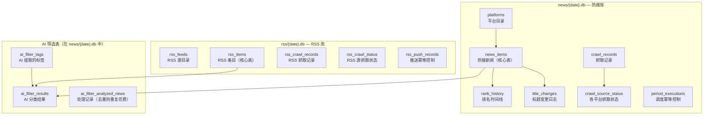
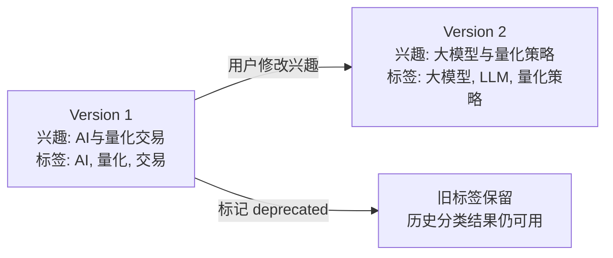
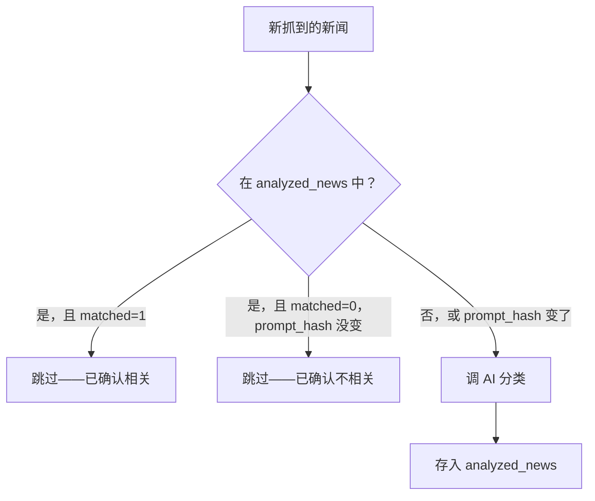
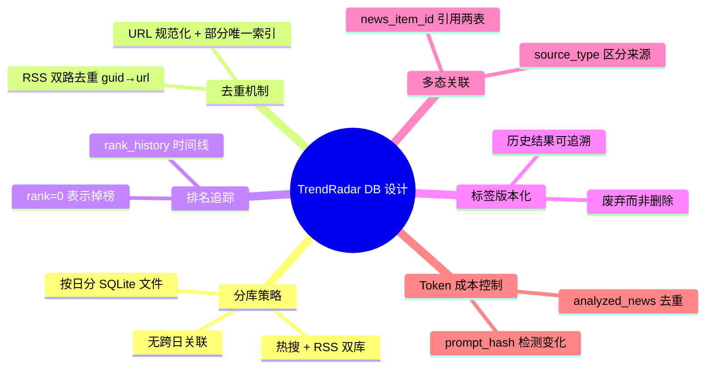

# （六）数据库设计：三套 Schema、按日分库与多态关联

> 基于 TrendRadar v6.9.1。

## 一句话概括

TrendRadar 的数据库设计可以总结为：**每天两个 SQLite 文件，三套 Schema，无跨日关联**。

```
output/
├── news/
│   └── 2026-06-11.db      # 热搜数据 + AI 筛选（7 张表）
└── rss/
    └── 2026-06-11.db      # RSS 数据（5 张表）
```

没有 MySQL，没有 PostgreSQL，没有跨日期的 JOIN。为什么不？因为没必要。

## 为什么 SQLite + 按日分库

一个设计决策在被理解之前，先被质疑。SQLite 做生产数据库？按日分文件？但这些选择背后有清晰的理由：

| 选择 | 替代方案 | 为什么选 SQLite + 按日分库 |
|------|---------|--------------------------|
| SQLite | MySQL/PostgreSQL | 零运维——不需要启动数据库进程；数据量每天几百到几千条，并发为 1 |
| 按日分文件 | 单库累积 | 归档就是删文件；出错只影响一天；`git` 友好 |
| 无跨日关联 | 全量 JOIN | 业务不需要——用户查的是"今天有什么"，不是"过去 30 天的趋势" |

趋势分析是 MCP Server 在查询时**跨文件扫描**，而不是在存储层预先关联——按需计算比预关联更灵活。

## Schema 总览



三套 Schema，15 张表。下面逐张拆解。

---

## 热搜库：7 张表

### 1. platforms — 平台目录

```sql
CREATE TABLE platforms (
    id        TEXT PRIMARY KEY,           -- "toutiao", "baidu", "zhihu"
    name      TEXT NOT NULL,              -- 显示名（运行时可变）
    is_active INTEGER DEFAULT 1,
    updated_at TIMESTAMP DEFAULT CURRENT_TIMESTAMP
);
```

| 设计点 | 说明 |
|--------|------|
| `id` 是字符串主键 | 自增 ID 无意义——平台标识本身已经是唯一键 |
| `name` 和 `id` 分离 | 显示名可能变（"今日头条"→"头条"），但 `id` 不变 |
| 只有 11 行 | 平台的枚举目录，不是增长表 |

### 2. news_items — 热搜新闻（核心表）

```sql
CREATE TABLE news_items (
    id               INTEGER PRIMARY KEY AUTOINCREMENT,
    title            TEXT NOT NULL,
    platform_id      TEXT NOT NULL REFERENCES platforms(id),
    rank             INTEGER NOT NULL,
    url              TEXT DEFAULT '',
    mobile_url       TEXT DEFAULT '',
    first_crawl_time TEXT NOT NULL,          -- 首次上榜时间 HH:MM
    last_crawl_time  TEXT NOT NULL,          -- 最近在榜时间 HH:MM
    crawl_count      INTEGER DEFAULT 1,     -- 在榜抓取次数
    created_at       TIMESTAMP DEFAULT CURRENT_TIMESTAMP,
    updated_at       TIMESTAMP DEFAULT CURRENT_TIMESTAMP
);

-- 关键索引：URL + 平台唯一（仅限有 URL 的条目）
CREATE UNIQUE INDEX idx_news_url_platform
    ON news_items(url, platform_id) WHERE url != '';
```

这是整个系统写入最频繁的表。每个平台每个独特新闻一条记录。

**去重策略**：以规范化 URL + 平台 ID 为唯一键。URL 为空（部分平台不提供链接）的条目直接插入，不去重。

```python
# 规范化——去掉动态参数
normalize_url("https://weibo.com/xxx?band_rank=5")
# → "https://weibo.com/xxx"

# 去重查询
SELECT id FROM news_items WHERE url = ? AND platform_id = ?
```

**同标题跨平台**是不同行——微博的"A股暴跌"和百度的"A股暴跌"各自独立，因为它们在不同平台的排名不同。

### 3. rank_history — 排名时间线

```sql
CREATE TABLE rank_history (
    id           INTEGER PRIMARY KEY AUTOINCREMENT,
    news_item_id INTEGER NOT NULL REFERENCES news_items(id),
    rank         INTEGER NOT NULL,       -- 0 = 掉出榜单
    crawl_time   TEXT NOT NULL,          -- HH:MM
    created_at   TIMESTAMP DEFAULT CURRENT_TIMESTAMP
);

CREATE INDEX idx_rank_history_news ON rank_history(news_item_id);
```

这是跟踪一条新闻"在榜旅程"的时间序列表。

| `rank` 值 | 含义 |
|-----------|------|
| 1, 2, 3... | 在榜排名 |
| 0 | **掉出榜单**——此前在榜，本次采集未出现 |

用 `rank=0` 而不是删除行——保留了完整的"上 → 在榜 → 下榜"时间线。查询时过滤掉下榜后的旧记录：

```sql
-- 只取新闻在榜期间的排名
SELECT * FROM rank_history
WHERE news_item_id = ?
  AND NOT (rank = 0 AND crawl_time > news_items.last_crawl_time)
ORDER BY crawl_time;
```

### 4. title_changes — 标题变更审计

```sql
CREATE TABLE title_changes (
    id            INTEGER PRIMARY KEY AUTOINCREMENT,
    news_item_id  INTEGER NOT NULL REFERENCES news_items(id),
    old_title     TEXT NOT NULL,
    new_title     TEXT NOT NULL,
    changed_at    TIMESTAMP DEFAULT CURRENT_TIMESTAMP
);
```

微博热搜的标题经常被编辑（从"某公司发布财报"改成"XX 公司 Q1 营收超预期"）。当 URL 没变但标题变了时，更新 `news_items.title` 的同时在 `title_changes` 里记一条。**只写不读**——纯粹是审计日志。

### 5. crawl_records — 抓取记录

```sql
CREATE TABLE crawl_records (
    id          INTEGER PRIMARY KEY AUTOINCREMENT,
    crawl_time  TEXT NOT NULL UNIQUE,     -- HH:MM
    total_items INTEGER DEFAULT 0,
    created_at  TIMESTAMP DEFAULT CURRENT_TIMESTAMP
);
```

每天多次抓取，每次一条记录。两个关键用途：

```sql
-- 是不是今天的第一次抓取？
SELECT COUNT(*) FROM crawl_records;

-- 上一次抓取是什么时候？
SELECT crawl_time FROM crawl_records ORDER BY crawl_time DESC LIMIT 1;
```

"第一次抓取"的判断决定了要不要做全量分析，"上一次抓取时间"用来检测掉榜。

### 6. crawl_source_status — 各平台抓取状态

```sql
CREATE TABLE crawl_source_status (
    crawl_record_id INTEGER NOT NULL REFERENCES crawl_records(id),
    platform_id     TEXT NOT NULL REFERENCES platforms(id),
    status          TEXT NOT NULL CHECK(status IN ('success', 'failed')),
    PRIMARY KEY (crawl_record_id, platform_id)
);
```

每次抓取，每个平台一条"成功/失败"记录。用于前端展示和重试判断：

```sql
-- 哪些平台最近一次抓取失败了？
SELECT DISTINCT platform_id FROM crawl_source_status
WHERE status = 'failed';
```

### 7. period_executions — 调度幂等控制

```sql
CREATE TABLE period_executions (
    id             INTEGER PRIMARY KEY AUTOINCREMENT,
    execution_date TEXT NOT NULL,              -- YYYY-MM-DD
    period_key     TEXT NOT NULL,              -- "morning", "evening"
    action         TEXT NOT NULL,              -- "analyze", "push"
    executed_at    TIMESTAMP DEFAULT CURRENT_TIMESTAMP,
    UNIQUE(execution_date, period_key, action)
);

CREATE INDEX idx_period_exec_lookup
    ON period_executions(execution_date, period_key, action);
```

这是调度系统的**防重单**。cron 可能被重复触发、GitHub Actions 可能因 job 重跑而重复调用——这张表确保同一个时段的分析/推送只执行一次：

```sql
-- 检查是否已执行（UPSERT 风格）
SELECT 1 FROM period_executions
WHERE execution_date = ? AND period_key = ? AND action = ?;

-- 如果未执行，插入（利用 UNIQUE 约束防重）
INSERT OR IGNORE INTO period_executions (...) VALUES (...);
```

---

## RSS 库：5 张表

### 8. rss_feeds — RSS 源目录

```sql
CREATE TABLE rss_feeds (
    id                TEXT PRIMARY KEY,      -- "hacker-news", "ruanyifeng"
    name              TEXT NOT NULL,
    feed_url          TEXT DEFAULT '',
    is_active         INTEGER DEFAULT 1,
    last_fetch_time   TEXT,                  -- 最近一次抓取时间
    last_fetch_status TEXT,                  -- success / failed
    item_count        INTEGER DEFAULT 0,    -- 当日条目数
    created_at        TIMESTAMP DEFAULT CURRENT_TIMESTAMP,
    updated_at        TIMESTAMP DEFAULT CURRENT_TIMESTAMP
);
```

和 `platforms` 作用相同——源目录。但 RSS 源多了运行时状态字段（上次抓取时间、状态、当日条目数），因为这些信息用户会关心。

### 9. rss_items — RSS 条目（核心表）

```sql
CREATE TABLE rss_items (
    id               INTEGER PRIMARY KEY AUTOINCREMENT,
    title            TEXT NOT NULL,
    feed_id          TEXT NOT NULL REFERENCES rss_feeds(id),
    url              TEXT NOT NULL,
    guid             TEXT DEFAULT '',
    published_at     TEXT,
    summary          TEXT,
    author           TEXT,
    first_crawl_time TEXT NOT NULL,
    last_crawl_time  TEXT NOT NULL,
    crawl_count      INTEGER DEFAULT 1,
    created_at       TIMESTAMP DEFAULT CURRENT_TIMESTAMP,
    updated_at       TIMESTAMP DEFAULT CURRENT_TIMESTAMP
);

-- 双路去重：优先 guid，回退 url
CREATE UNIQUE INDEX idx_rss_guid_feed ON rss_items(guid, feed_id) WHERE guid != '';
CREATE UNIQUE INDEX idx_rss_url_feed  ON rss_items(url, feed_id);
```

和 `news_items` 结构相似，但去重策略不同：

| 去重键 | 优先级 | 场景 |
|--------|--------|------|
| `guid + feed_id` | 优先 | RSS 规范要求每条有唯一 guid |
| `url + feed_id` | 回退 | 部分 RSS 源不提供 guid |

两个唯一索引——`guid+feed` 是条件索引（只对 `guid != ''` 的条目生效），`url+feed` 全覆盖。SQLite 的**部分唯一索引**（`WHERE` 子句）在这里发挥了作用。

### 10-11. rss_crawl_records + rss_crawl_status

结构和热搜库的 `crawl_records` + `crawl_source_status` 对应，只是字段名从 `platform_id` 改成 `feed_id`，`rss_crawl_status` 多了一个 `error_message` 列用于记录失败原因。

### 12. rss_push_records — 推送幂等

```sql
CREATE TABLE rss_push_records (
    id              INTEGER PRIMARY KEY AUTOINCREMENT,
    date            TEXT NOT NULL UNIQUE,     -- YYYY-MM-DD
    pushed          INTEGER DEFAULT 0,
    push_time       TEXT,
    ai_analyzed     INTEGER DEFAULT 0,
    ai_analysis_time TEXT,
    ai_analysis_mode TEXT,
    created_at      TIMESTAMP DEFAULT CURRENT_TIMESTAMP
);
```

这是旧版方案——以**天**为单位防重。热搜库已经升级到 `period_executions`（以**时段**为单位），但 RSS 库保留了这个设计。一个值得注意的演变痕迹：系统在从"每天推一次"进化到"每个时段推一次"。

---

## AI 筛选表：3 张

这三张表存在热搜库（`news/{date}.db`）中——因为 AI 筛选结果和热搜/RSSe 新闻关联。

### 13. ai_filter_tags — AI 提取的标签（版本化）

```sql
CREATE TABLE ai_filter_tags (
    id             INTEGER PRIMARY KEY AUTOINCREMENT,
    tag            TEXT NOT NULL,        -- "AI/大模型", "量化交易"
    description    TEXT DEFAULT '',
    priority       INTEGER DEFAULT 9999, -- 排序权重
    status         TEXT DEFAULT 'active', -- active / deprecated
    deprecated_at  TEXT,
    version        INTEGER NOT NULL,      -- 标签集版本号
    prompt_hash    TEXT NOT NULL,         -- "extract_prompt.txt:md5"
    interests_file TEXT NOT NULL DEFAULT 'ai_interests.txt',
    created_at     TEXT NOT NULL
);

CREATE INDEX idx_ai_filter_tags_file
    ON ai_filter_tags(interests_file, status);
CREATE INDEX idx_ai_filter_tags_priority
    ON ai_filter_tags(interests_file, status, priority);
```

**版本化标签**是这张表最值得讨论的设计。当用户修改兴趣描述时，不是更新旧标签——而是废弃旧标签（`status='deprecated'`）、创建新标签（`version + 1`）。



为什么不就地更新？因为之前的分类结果按旧标签分的——改了标签名，旧结果就找不到归属了。**版本化保证历史数据始终完整**。

### 14. ai_filter_results — AI 分类结果

```sql
CREATE TABLE ai_filter_results (
    id              INTEGER PRIMARY KEY AUTOINCREMENT,
    news_item_id    INTEGER NOT NULL,       -- 多态外键
    source_type     TEXT NOT NULL DEFAULT 'hotlist',  -- hotlist / rss
    tag_id          INTEGER NOT NULL REFERENCES ai_filter_tags(id),
    relevance_score REAL DEFAULT 0,         -- 0.0 ~ 1.0
    status          TEXT DEFAULT 'active',
    deprecated_at   TEXT,
    created_at      TEXT NOT NULL,
    UNIQUE(news_item_id, source_type, tag_id)
);
```

| 设计点 | 说明 |
|--------|------|
| **多态关联** | `news_item_id` 根据 `source_type` 引用 `news_items.id` 或 `rss_items.id`——**没有真正的外键约束**，应用层保证完整性 |
| **唯一约束** | 同一新闻对同一标签只分类一次 |
| **级联废弃** | 标签废弃时，对应的结果也标记废弃 |

`source_type` 的多态设计让一张表同时覆盖热搜和 RSS 的 AI 分类——不需要两张镜像表。代价是不能用数据库外键——`news_item_id` 无法同时引用两个父表。

### 15. ai_filter_analyzed_news — 处理记录

```sql
CREATE TABLE ai_filter_analyzed_news (
    news_item_id   INTEGER NOT NULL,       -- 多态外键（同上）
    source_type    TEXT NOT NULL DEFAULT 'hotlist',
    interests_file TEXT NOT NULL DEFAULT 'ai_interests.txt',
    prompt_hash    TEXT NOT NULL,          -- 分类时使用的标签集 hash
    matched        INTEGER NOT NULL DEFAULT 0,  -- 0=未匹配, 1=匹配
    created_at     TEXT NOT NULL,
    PRIMARY KEY (news_item_id, source_type, interests_file)
);
```

**这张表存在的唯一目的：省 token。** AI 分类花钱——每条新闻调一次 `gpt-4o-mini`。如果同一条新闻昨天已经被判断为"不相关"，今天不需要再问一遍。



当用户修改兴趣描述（`prompt_hash` 变了）时，清除 `matched=0` 的记录——让之前被判定为"不相关"的新闻有机会被重新评估。`matched=1` 的记录保留——已经确定相关的不会因标签变化而被翻案。

---

## 设计总结



15 张表，三个核心设计哲学：

1. **不做能省的事**——不需要跨日查询就不建跨日关联；SQLite 够用就不上 MySQL
2. **不丢历史数据**——排名变了加行、标题变了记审计、标签变了废弃而非删除
3. **省每一分钱**——`ai_filter_analyzed_news` 的存在就是在优化 AI API 开销

这套设计不是最"规范"的——没有外键约束的多态关联、跨文件的隐式引用——但它完全服务于业务需求。规范是手段，不是目的。

---

*（系列完）*
