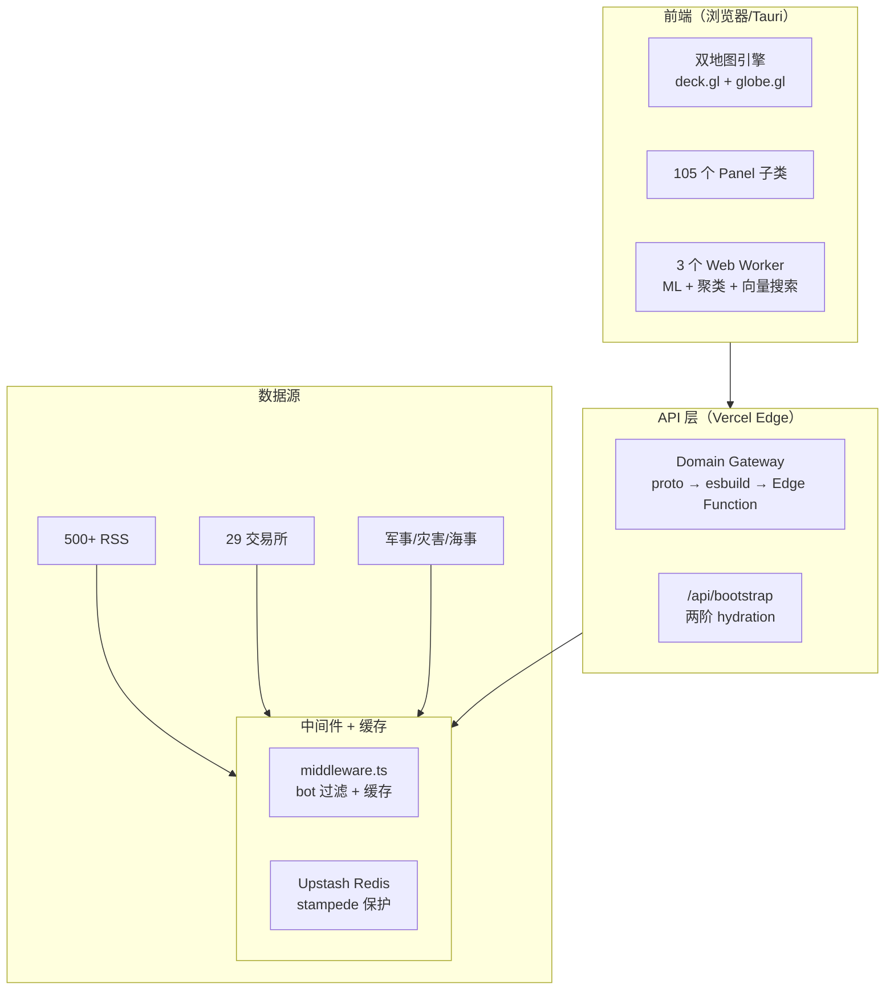

# World Monitor 源码阅读（一）：从 500+ 新闻源到实时全球情报面板

> 基于 [koala73/worldmonitor](https://github.com/koala73/worldmonitor)，AGPL v3，TypeScript 全栈，Tauri 桌面端。

## 一句话说清楚

World Monitor 是一个实时全球情报仪表盘——聚合 500+ 新闻源、65+ 数据 API、56 种地图图层，用 AI 做新闻合成、语义聚类、跨域关联。Web 端 + Tauri 桌面端共享同一套 TypeScript 代码，6 个站点变体从一个仓库构建。

## 八层架构



## App 启动的 8 个阶段

`App.init()` 是一个教科书级的初始化编排：

```typescript
// src/App.ts — 8 步启动流程
async init() {
    await this.initStorage();        // 1. IndexedDB
    await this.initI18n();          // 2. 语言检测
    await this.initMLWorker();      // 3. ONNX 模型预热
    if (isDesktop) await this.waitForSidecar();  // 4. 桌面端 sidecar
    await this.bootstrapStage1();   // 5. 快数据（3s timeout）
    await this.bootstrapStage2();   // 6. 慢数据（5s timeout）
    this.panelLayoutManager.render();  // 7. 渲染
    this.startSmartPollLoop();      // 8. 轮询
}
```

**关键设计：两阶 bootstrap。** 不是一次性全加载。数据分"快"（面板布局、地图基础状态，3 秒超时）和"慢"（历史数据、全文索引，5 秒超时）。慢数据超时不阻塞渲染，后台轮询补上。

### 优秀代码：两阶段 Bootstrap

**源码（src/App.ts，简化）：**

```typescript
async init() {
    const fastResult = await Promise.race([
        fetch("/api/bootstrap?stage=fast"),
        new Promise((_, reject) => setTimeout(reject, 3000)),
    ]).catch(() => null);  // 超时不阻塞

    // 开始渲染（fastResult 必定可用或已降级）
    this.renderLayout();

    const slowResult = await Promise.race([
        fetch("/api/bootstrap?stage=slow"),
        new Promise((_, reject) => setTimeout(reject, 5000)),
    ]).catch(() => null);  // 超时不阻塞，后台轮询补上
}
```

**好在哪：** `Promise.race` + 独立降级。快的和慢的有各自独立的 timeout——快数据超时页面照样渲染，慢数据超时不影响快数据。两阶段各走各的降级路径。

**模式：** Staged Loading 模式。

**骨架代码：**
```typescript
async function stagedLoad<T1, T2>(fast: Promise<T1>, slow: Promise<T2>) {
    const r1 = await Promise.race([fast, timeout(3000)]).catch(() => null);
    const r2 = await Promise.race([slow, timeout(5000)]).catch(() => null);
    return { fast: r1, slow: r2 };
}
```

## 105 个 Panel 的基类设计

不是 React、不是 Lit——是**纯 DOM 操作 + 事件委托**。

```typescript
// src/components/Panel.ts
class Panel {
    protected content: HTMLElement;
    private readonly contentDebounceMs = 150;
    private contentDebounceTimer: ReturnType<typeof setTimeout> | null = null;
    private abortController = new AbortController();

    setContent(html: string) {
        clearTimeout(this.contentDebounceTimer!);
        this.contentDebounceTimer = setTimeout(() => {
            this.content.innerHTML = html;
        }, this.contentDebounceMs);
    }

    on(event: string, selector: string, handler: (e: Event) => void) {
        this.content.addEventListener(event, (e) => {
            if ((e.target as Element).matches(selector)) handler(e);
        }, { signal: this.abortController.signal });
    }

    destroy() {
        this.abortController.abort();  // 一次性取消所有事件
        clearTimeout(this.contentDebounceTimer!);
    }
}
```

`setContent(html)` 用 150ms debounce 防止高频刷新。`on()` 用事件委托 + `AbortController.signal`——销毁时 `abort()` 一把清除所有监听，不需要逐个 `removeEventListener`。

### 优秀代码：AbortController 统一销毁

**好在哪：** 不是 `removeEventListener` 逐个清理——构造时绑定一个 `AbortController`，`destroy()` 时 `abort()` 一把清除。配合 150ms debounce 防止高频 DOM 操作。105 个子类没有内存泄漏。

**模式：** Debounce + AbortController 组合。

**骨架代码：**
```typescript
class Component {
    private debounceTimer: number | null = null;
    private ac = new AbortController();

    update(html: string) {
        clearTimeout(this.debounceTimer!);
        this.debounceTimer = setTimeout(() => { this.el.innerHTML = html; }, 150);
    }
    on(el: HTMLElement, event: string, fn: EventListener) {
        el.addEventListener(event, fn, { signal: this.ac.signal });
    }
    destroy() {
        clearTimeout(this.debounceTimer!);
        this.ac.abort();
    }
}
```

## Variant 系统：一个代码库，6 个站点

```typescript
// src/config/variant.ts
function detectVariant(): Variant {
    const host = location.hostname;
    if (host.includes('tech')) return 'tech';
    if (host.includes('finance')) return 'finance';
    return 'world';
}

// 声明式：每个图层声明自己属于哪些 variant
const MAP_LAYERS = [
    { id: 'military', variants: ['world'] },
    { id: 'stock-exchanges', variants: ['world', 'finance'] },
    { id: 'satellite-imagery', variants: ['world', 'energy'] },
];

const active = MAP_LAYERS.filter(l => l.variants.includes(currentVariant));
```

**好在哪：** 不是 if-else 散落各处。每个功能用 `variants: [...]` 声明适用范围。加新 variant 不改过滤逻辑，只改数据。

## 双地图引擎 + 三个 Web Worker

- **deck.gl + maplibre-gl**：8 种图层类、Supercluster 聚合
- **globe.gl**：3D 地球，htmlElementsData + _kind 标记
- **ML Worker**：ONNX 推理（embedding、sentiment、summarization）
- **Analysis Worker**：Jaccard 聚类 + 跨域关联
- **Vector DB Worker**：IndexedDB 向量存储

下一篇看 AI 合成管线——500 条新闻怎么被聚类、摘要、情感分析、交叉关联。
