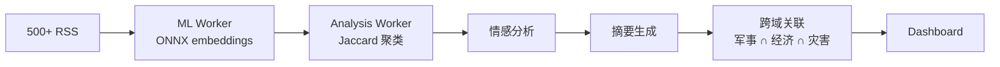

# World Monitor 源码阅读（二）：AI 合成管线——从 500 条新闻到 5 条简报

> 基于 [koala73/worldmonitor](https://github.com/koala73/worldmonitor)，AGPL v3。

## 问题：500 条新闻怎么变成人能看的 5 条

World Monitor 从 500+ RSS feed 和 65+ API 拉数据。AI 管线是核心——把信息洪流压缩成简报。



## 第一步：数据拉取 + 缓存 stampede 保护

数据经过中间件层（`middleware.ts`）做 bot 过滤 + 缓存策略分发，Upstash Redis 做缓存。最精妙的是 stampede 保护：

### 优秀代码：缓存 Stampede 保护

**源码（middleware.ts，简化）：**

```typescript
async function cachedFetch(key: string, fetcher: () => Promise<Data>, ttl: number) {
    const cached = await redis.get(key);
    if (cached) return JSON.parse(cached);

    // stampede 保护：第 1 个请求穿透，后续请求等待
    const lockKey = `${key}:lock`;
    const acquired = await redis.set(lockKey, "1", "NX", "EX", 5);
    if (!acquired) {
        // 别人正在拉新数据，等 100ms 再读一次
        await sleep(100);
        const retry = await redis.get(key);
        if (retry) return JSON.parse(retry);
        return cachedFetch(key, fetcher, ttl);  // 还没好？重试
    }

    try {
        const data = await fetcher();
        await redis.set(key, JSON.stringify(data), "EX", ttl);
        return data;
    } finally {
        await redis.del(lockKey);  // 不管成功失败，必须解锁
    }
}
```

**好在哪：** "缓存过期 → 1000 个请求 → 1000 次 API 调用"变成了"缓存过期 → 第 1 个请求穿透 → 第 2-1000 个等待第一个的结果"。`NX` 保证只有一个请求能拿到锁，`finally` 保证锁一定被释放（即使 `fetcher()` 抛异常）。

**模式：** Redis 分布式锁 + stampede 保护。

**骨架代码：**
```typescript
async function withStampedeProtection<T>(
    key: string, ttl: number, fn: () => Promise<T>,
): Promise<T> {
    const cached = await redis.get(key);
    if (cached) return JSON.parse(cached);
    if (!await redis.set(`${key}:lock`, "1", "NX", "EX", 5)) {
        await sleep(100);
        return withStampedeProtection(key, ttl, fn);
    }
    try {
        const result = await fn();
        await redis.set(key, JSON.stringify(result), "EX", ttl);
        return result;
    } finally {
        await redis.del(`${key}:lock`);
    }
}
```

## 第二步：ONNX Embedding（在浏览器里跑）

```typescript
// src/workers/ml.worker.ts
import { pipeline, env } from '@xenova/transformers';

env.useBrowserCache = true;  // 模型缓存到浏览器

const embedder = await pipeline("feature-extraction", "Xenova/all-MiniLM-L6-v2");
const sentiment = await pipeline("sentiment-analysis");
const summarizer = await pipeline("summarization", "Xenova/distilbart-cnn-6-6");

// 500 条新闻标题 → 384 维向量
const embeddings = await embedder(headlines, { pooling: "mean" });
// Float32Array[500 × 384]
```

模型在 `App.init()` 阶段预热。MiniLM-L6 约 23MB，在浏览器 Web Worker 中推理速度大约 100-200 条/秒。不需要 GPU、不需要云 API。

### 优秀代码：Web Worker 消息类型系统

**源码（src/workers/ml.worker.ts，简化）：**

```typescript
interface EmbedMessage  { type: 'embed';  id: string; texts: string[]; }
interface SummarizeMsg  { type: 'summarize'; id: string; texts: string[]; }
interface SentimentMsg  { type: 'classify-sentiment'; id: string; texts: string[]; }
type WorkerMessage = EmbedMessage | SummarizeMsg | SentimentMsg;

// Worker 端
self.onmessage = async (e: MessageEvent<WorkerMessage>) => {
    const { type, id } = e.data;
    switch (type) {
        case 'embed':       self.postMessage({ type: 'embed-result', id, result: await embedder(e.data.texts) }); break;
        case 'summarize':   self.postMessage({ type: 'summarize-result', id, result: await summarizer(e.data.texts) }); break;
    }
};

// 主线程端：消息 → Promise
function callWorker(msg: WorkerMessage): Promise<any> {
    return new Promise(resolve => {
        const handler = (e: MessageEvent) => {
            if (e.data.id === msg.id) { worker.removeEventListener('message', handler); resolve(e.data.result); }
        };
        worker.addEventListener('message', handler);
        worker.postMessage(msg);
    });
}
```

**好在哪：** Discriminated union + `id` 匹配。每条消息有唯一 `id`，主线程用 `id` 匹配请求和响应——A 请求的响应不会被 B 请求的 handler 吃掉。`type` 做类型收窄——`switch(type)` 后每个 case 类型精确。

**模式：** Request-Response over Worker Messages。

**骨架代码：**
```typescript
type Msg = { type: 'a'; id: string; p: number } | { type: 'b'; id: string; p: string };
function send<T extends Msg>(msg: T): Promise<any> {
    return new Promise(resolve => {
        const h = (e: MessageEvent) => { if (e.data.id === msg.id) { w.removeEventListener('message', h); resolve(e.data); } };
        w.addEventListener('message', h);
        w.postMessage(msg);
    });
}
```

## 第三步：Jaccard 聚类

```typescript
// src/workers/analysis.worker.ts
function jaccardSimilarity(a: Set<string>, b: Set<string>): number {
    const intersection = new Set([...a].filter(x => b.has(x)));
    return intersection.size / new Set([...a, ...b]).size;
}

function clusterNews(items: NewsItem[]): Cluster[] {
    // 每条 top-10 token 做关键词集合
    // 两两 Jaccard > 0.3 → 归为同一簇
    // 500 条 → 12.5 万次比较 → 毫秒级
}
```

不是 KMeans、不是 DBSCAN——就两两 Jaccard + 阈值。对 500 条新闻 O(n²) 完全够用。

## 第四步：情感分析 + 摘要 + 跨域关联

每簇新闻拼接后跑情感和摘要：

```typescript
const clusterText = cluster.items.map(i => i.title + " " + i.description).join(" ");
const sentimentResult = await sentiment(clusterText);
const brief = await summarizer(clusterText, { max_length: 80 });
```

跨域关联——找不同簇之间的信号交叉：

```typescript
function detectCrossDomainCorrelations(clusters: Cluster[]): Correlation[] {
    // 三重条件：时间重叠 + 地理位置 500km 内 + 语义相似度 > 0.4
    // 满足 → 生成告警："台湾海峡军事活动 ↑ ∩ 台积电股价 ↓"
}
```

## Country Instability Index（CII v8）

31 个 Tier-1 国家的压力评分，聚合军事冲突（ACLED、UCDP）、经济压力（FRED、World Bank）、社会动荡（GDELT）等 6 个维度，带升级乘数：

```typescript
function computeCII(signals: Signal[]): number {
    const base = weightedSum(signals);
    const deteriorating = signals.filter(s => s.trend === "worsening").length;
    const multiplier = deteriorating >= 3 ? 1.5 : deteriorating >= 2 ? 1.2 : 1.0;
    return base * multiplier;
}
```

多个信号同时恶化 → 指数放大。这模拟了真实情报分析中的"危机升级"模式。

## 小结

三个关键设计决策：

1. **客户端 ML**——ONNX 在 Web Worker 中跑，零 API 费用，可离线
2. **简单算法优先**——Jaccard 对 500 条新闻够用，不需要 KMeans
3. **跨域关联**——不是简单分类，而是主动检测信号交叉

下一篇看 API 层和部署架构——proto 合约驱动的 Domain Gateway、MCP Server、Tauri 桌面端。
