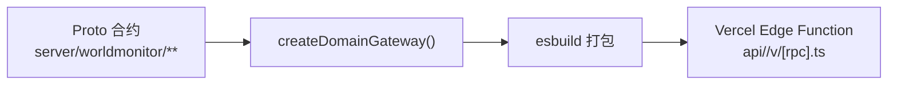

# World Monitor 源码阅读（三）：API 层 + 桌面端 + Promise 队列

> 基于 [koala73/worldmonitor](https://github.com/koala73/worldmonitor)，AGPL v3。

## 一、API 层：proto 合约驱动的 Domain Gateway

World Monitor 的 API 用 proto 文件定义接口合约，自动生成 Edge Function：



- 接口有合约约束——前后端不会对字段名有不同理解
- 每个端点独立打包——一个 API 挂了不影响其他
- proto → SDK 自动生成：npm `worldmonitor`、Python `worldmonitor-sdk`、Ruby Gem、Go SDK

### MCP Server：让 AI Agent 查询实时数据

```typescript
// api/mcp.ts 暴露的 tools
search_news(query, limit)      // 搜索新闻
get_cii(country)               // 查询 CII 指数
list_market_data(exchange)     // 市场数据
correlate_events(topic)        // 跨域关联
```

你可以在 Claude Code 里直接查："台湾海峡现在的局势怎么样？" → MCP → `search_news("Taiwan Strait")` → 返回简报。

## 二、Tauri 桌面端：TypeScript SPA + Rust Shell

```
┌─────────────────────────────────────────┐
│           Tauri Shell (Rust)            │
│  ┌───────────────────────────────────┐  │
│  │    WebView (System)               │  │
│  │  同 Web 端的 SPA（Vite 构建）      │  │
│  └───────────────────────────────────┘  │
│  ┌───────────────────────────────────┐  │
│  │    Node.js Sidecar                │  │
│  │  fetch patch → 重定向到 localhost  │  │
│  └───────────────────────────────────┘  │
└─────────────────────────────────────────┘
```

Web 端和桌面端跑**同一套 SPA 代码**。桌面端加了一个 Node.js sidecar，通过 runtime fetch patch 把 API 请求重定向到本地。离线模式也能用本地缓存。

## 三、优秀代码：Promise 队列防止并发写

Preferences 系统需要从 localStorage/IndexedDB 读-改-写。如果两次 `savePreference` 几乎同时调用，第一次的 `loadAll` 和第二次的 `loadAll` 读到的是同一份数据——后写入的覆盖先写入的。

### 源码

```typescript
// src/services/preferences-content.ts（简化）
class PreferenceStore {
    private writeQueue: Promise<void> = Promise.resolve();

    // 所有写操作排队：后一个等前一个完成
    private enqueueWrite(fn: () => Promise<void>): Promise<void> {
        this.writeQueue = this.writeQueue.then(fn).catch(fn);  // 失败后重试一次
        return this.writeQueue;
    }

    async savePreference(key: string, value: any): Promise<void> {
        return this.enqueueWrite(async () => {
            const current = await this.loadAll();   // 读
            current[key] = value;                    // 改
            await this.persist(current);             // 写
        });
    }
}
```

### 好在哪

**Promise 链做串行化锁。** 不是 `Mutex`（阻塞）、不是过期检测（丢了写）。`this.writeQueue = this.writeQueue.then(fn)` 把每个写操作接到上一个后面——天然排队，不丢操作。`.catch(fn)` 保证即使上次写失败，下次仍可重试——队列不会因为一次失败就永久阻塞。

### 模式

Promise Chain Serialization——无锁的并发写控制。

### 骨架代码

```typescript
class SerialWriter {
    private tail: Promise<void> = Promise.resolve();

    write(fn: () => Promise<void>): Promise<void> {
        this.tail = this.tail.then(fn).catch(fn);
        return this.tail;
    }
}

// 使用
const store = new SerialWriter();
await store.write(async () => { /* 读-改-写 */ });
await store.write(async () => { /* 等上一个完成才执行 */ });
```

## 四、优秀代码：URL 状态双向同步

面板布局、地图位置、选中的图层——刷新页面后需要恢复。URL 和 App 状态需要双向同步。

### 源码

```typescript
// src/utils/urlState.ts（简化）
class URLStateManager {
    private pending = false;
    private syncTimer = 0;

    // 应用状态 → URL（250ms debounce）
    scheduleSync() {
        clearTimeout(this.syncTimer);
        this.syncTimer = setTimeout(() => {
            const params = new URLSearchParams();
            for (const [k, v] of this.state) params.set(k, v);
            history.replaceState(null, '', `?${params}`);
        }, 250);
    }

    // URL → 应用状态（popstate + rAF）
    private onPopState = () => {
        if (this.pending) return;
        this.pending = true;
        requestAnimationFrame(() => {
            this.applyURLToState(new URLSearchParams(location.search));
            this.pending = false);
        });
    };
}
```

### 好在哪

**双向同步而非单向。** `history.replaceState` 不会产生多余的历史条目。`requestAnimationFrame` 包裹 popstate 处理——确保在下一帧渲染前完成状态同步，不会出现"URL 变了但 UI 还在闪"的问题。

### 模式

Bidirectional URL-Application State Sync。

### 骨架代码

```typescript
class URLSync<T> {
    private timer = 0;
    push(data: T) {
        clearTimeout(this.timer);
        this.timer = setTimeout(() => history.replaceState(null, '', `?q=${encode(data)}`), 250);
    }
    pop(handler: (data: T) => void) {
        window.addEventListener('popstate', () => requestAnimationFrame(() => handler(decode(location.search))));
    }
}
```

## 五、和之前源码阅读项目的对比

| | World Monitor | MetaGPT | AI Hedge Fund | nanobot |
|---|---|---|---|---|
| 语言 | **TypeScript** | Python | Python | Python |
| 行数 | 21 万 | 22 万 | 3000 | 5000 |
| 核心模式 | SPA + ML Worker + Tauri | Role-Action 状态机 | LangGraph DAG | AgentLoop + MessageBus |
| AI 在哪里 | **浏览器端 ONNX** | 云端 LLM | 云端 LLM | 云端 LLM |
| 最值得学 | 客户端 ML + 两阶 bootstrap + Promise 队列 | Prompt 工程 | 确定性计算 + LLM 分离 | MessageBus 解耦 |

World Monitor 是唯一把 ML 推理放在客户端的项目——证明了不是所有 AI 都需要调云 API。

## 系列回顾

| 篇 | 内容 |
|---|---|
| 一 | 架构总览：8 阶段启动、双地图引擎、Panel 基类、变体系统 |
| 二 | AI 管线：ONNX embedding → Jaccard 聚类 → 跨域关联 → CII |
| 三 | API 层 + 桌面端 + Promise 队列 + URL 双向同步 |
