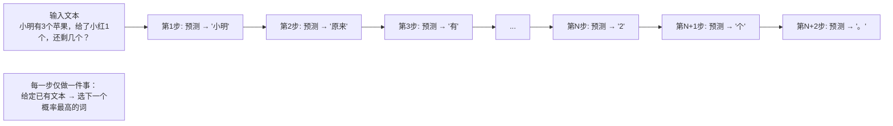

# AI 真的会思考吗？——用最笨的例子理解大模型是怎么「想」出答案的

## 一个最常见的误解

「我问 AI 一个问题，它思考了一下，然后回答了我。」

这句话里有一个巨大的误解：**AI 没有在思考**。它做的事情，和你手机上输入法的「下一个词预测」在原理上完全一样——只是规模大了几千亿倍，效果天差地别。

## 先做一个小实验

打开手机输入法，输入「今天天气真」，看看输入法预测的下一个词是什么。

大概率是「好」「不错」「热」之类。

现在换一句：「法国的首都是」，输入法预测什么？

「巴黎」。

你看出差别了吗？输入法不是「知道」法国首都是巴黎——它只是从海量训练文本中学到了一个统计规律：**「法国的首都是」这个序列后面，出现「巴黎」的概率远高于其他词**。

大语言模型做的事情，和这个输入法预测在数学上完全一致：

```
给定前面的文本 → 计算所有可能的下一个词的分数 → 选分数最高的那个词 → 输出 → 把输出的词加入文本 → 重复
```

## 用最简单的一步来演示

假设你问 AI：**「1 + 1 等于几」**

我们把 AI 的「思考」过程用慢镜头回放：

**第 1 步：** AI 看到输入 `"1 + 1 等于几"`，计算下一个词的概率：

```
"2"      → 概率 92%
"等"     → 概率 3%
"1"      → 概率 1%
"当然"   → 概率 0.5%
...
```

选最高分的「2」。输出 → 现在文本变成了 `"1 + 1 等于几 2"`

**第 2 步：** 看到 `"1 + 1 等于几 2"`，预测下一个词：

```
"。"     → 概率 60%
"，"     → 概率 15%
"因为"   → 概率 8%
...
```

选「因为」。输出 → `"...2 因为"`

**第 3 步：** 看到 `"...2 因为"`，预测 `"1"` → `"+"` → `"1"` → `"="` → `"2"` → `"。"`

最终输出：**「1 + 1 等于几 2，因为 1 + 1 = 2。」**

整个过程 AI 没有做 1 + 1 的数学计算。它只是在每一步选择让整段文字「看起来最像训练数据」的下一个词。只是碰巧，在互联网的文本里，「1 + 1 等于几」这个问句后面跟着的最常见的词就是「2」。

## 那为什么它看起来像在思考？

因为训练数据里充满了人类的思考过程。

互联网上有无数的教材、博客、论坛帖子，里面写着「这个问题可以这样理解……」「首先……其次……最后……」「因此答案是……」。AI 在训练时不是被教会了什么知识——它只是在几十亿个网页上练习「下一个词预测」，反复优化自己的预测准确率。

要准确预测下一个词，它被迫学会了：

- **语法结构**：「我今天吃了」后面大概率是食物，不是汽车
- **常识关联**：「中国的首都是」后面大概率是「北京」
- **推理模式**：「如果我们知道 A，又知道 B，那么」后面大概率跟着「C」
- **回答格式**：问句后面大概率跟着答案，问题描述后面大概率跟着解决步骤

**不是 AI 在思考，是它模仿了训练数据中人类的思考过程。** 这就像一个学生不是真的理解了数学，而是做了几十万道题后记住了所有题型的答案模式。

## 用下一个词预测理解「推理」

换个稍复杂的例子：**「小明有 3 个苹果，给了小红 1 个，还剩几个？」**

AI 的输出过程：

```text
Step 1:  输入「小明有 3 个苹果...」→ 预测下一个：「小明」→ 输出「小明」
Step 2:  输入「...小明」→ 预测「原来」→ 输出「原来」
Step 3:  输入「...原来」→ 预测「有」→ 输出「有」
Step 4:  输入「...有」→ 预测「3」→ 输出「3」
...
Step N:  ...「所以」→ 预测「还剩」→ 输出「还剩」
Step N+1: ...「还剩」→ 预测「2」→ 输出「2」
Step N+2: ...「2」→ 预测「个」→ 输出「个」
```

每一步都是独立的概率计算。AI 没有在心里画一个「3 - 1 = 2」的算式——它只是预测：在当前这段文本的上下文里，下一个最合理的词是什么。

之所以能输出「2」，是因为在训练数据里，类似「有 3 个……给了 1 个……还剩」这种句式后面，跟的数字几乎总是「2」。



## Chain of Thought 为什么有效？

你可能会问：既然 AI 不思考，为什么让它「一步一步地想」（Chain of Thought）反而答案更准了？

原因很简单：**把推理过程写出来，相当于帮 AI 把搜索空间从「任意可能答案」缩小到了「顺着推理链最自然的答案」**。

不写推理过程：
```
「小明有3个苹果，给了小红1个，还剩几个？答案：」
         ↑ 这里可能的词太多：2、3、4、1、几个、苹果...
```

写了推理过程：
```
「小明有3个苹果，给了小红1个。3个减去1个等于」
         ↑ 这里几乎只有一个合理的选择：2
```

不是 AI「想得更深了」——是前面的推理文字把概率分布收窄到了正确答案附近。

## 总结：三句话版本

1. **AI 不思考，它是下一个词预测器**——每一步只是选当前最合理的下一个词
2. **它看起来像思考，是因为训练数据里充满了人类的思考**——它学会了模仿那些模式
3. **Chain of Thought 有效，不是因为它在思考，而是因为推理文字把概率通道收窄了**

所以 AI 的回答不是「想出来的」，是「猜出来的」——只不过猜得太准了，看起来很像思考。理解了这一点，你就能理解它的所有优点（流畅、博学、可以引导）和所有缺点（幻觉、不一致、逻辑断裂）的根源。
