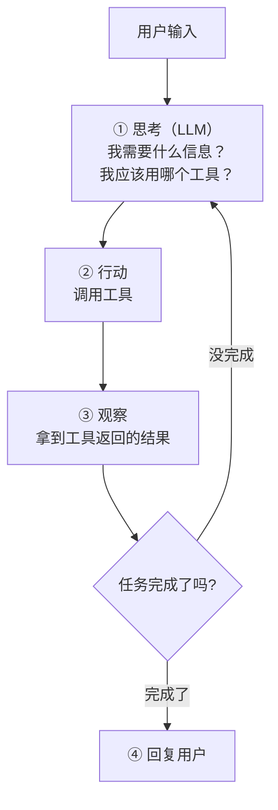
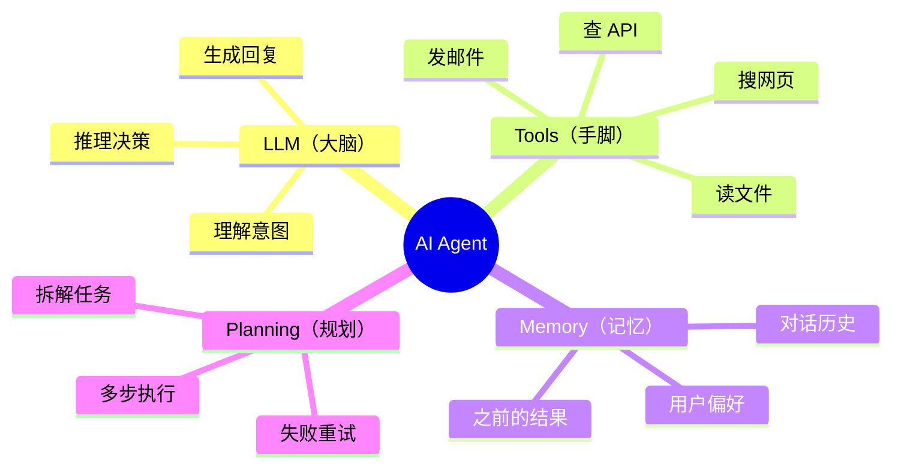
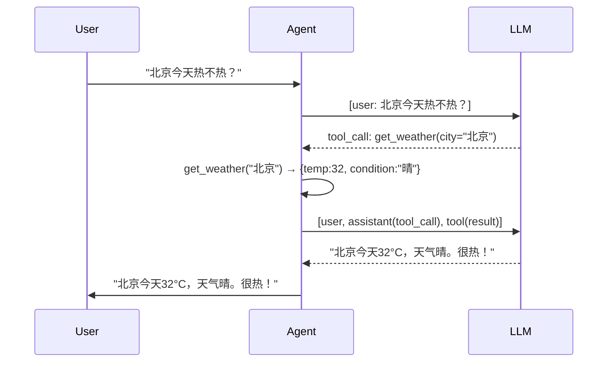

# 第 1 篇：什么是 AI Agent — 从 LLM 到 Agent 的进化

> 基于 OpenAI API 和 Python 3.12，2026 年 6 月。

## 你用过 LLM，但没用过 Agent

打开 ChatGPT，输入一个问题，它回复一段文字——这是 LLM。LLM 是大脑，但只有大脑是不够的。

想象你对一个有大脑但没有手脚的人说："帮我查一下北京今天的温度，如果超过 30 度就给我推荐附近三公里内的游泳馆。"

有大脑的人会想：我需要先知道温度，我不知道今天的温度，得查一下。但**他没有手**——不能打开浏览器、不能调用天气 API、不能搜索地图。所以他只能回复："抱歉，我无法获取实时信息。"

**Agent 就是给 LLM 装上手脚。** LLM 还是那个大脑，但当它说"我需要查温度"时，它真的可以调用一个天气工具去查；当它说"我需要搜索游泳馆"时，它真的可以调地图 API 去搜。

## Agent 的核心循环



这个循环叫 **Agentic Loop**——Agent 不是一次调用就完了，**它会反复调用 LLM，每次拿到新的观察结果后重新思考下一步**。

用 Python 表达这个循环就是：

```python
while not task_complete:
    response = llm.chat(messages, tools)   # ① 思考
    if response.has_tool_call():
        result = execute_tool(response)      # ② 行动
        messages.append(result)              # ③ 观察 → 喂回 LLM
    else:
        return response.content              # ④ 完成，回复用户
```

## Agent 的四个组件

每个 Agent，不管多复杂，都由四样东西组成：



### LLM — 大脑

LLM 负责理解用户想干什么，决定用什么工具，把工具的结果组织成人类能读的回复。它不执行任何动作——只做语言理解和生成。

### Tools — 手脚

工具是 Agent 和外部世界的接口。天气 API、数据库查询、文件读写、发邮件——任何 LLM 自己做不到的事情，都通过工具完成。

常见工具类型：

| 类型 | 示例 |
|------|------|
| API 调用 | 查天气、查股价、发 Slack |
| 数据查询 | SQL 查数据库、向量检索 |
| 文件操作 | 读文件、写文件、图片识别 |
| 代码执行 | 计算器、Python 沙箱 |

### Memory — 记忆

LLM 每次请求是无状态的——它不记得上一轮聊了什么。Agent 需要自己维护记忆。

| 记忆类型 | 存什么 | 怎么实现 |
|----------|--------|----------|
| 短期记忆 | 这一轮的对话 | messages 数组 |
| 长期记忆 | 用户偏好、历史事实 | 向量数据库、知识图谱 |
| 工作记忆 | 当前任务的状态 | 程序变量 |

### Planning — 规划

简单任务 LLM 一次调用就搞定了。复杂任务——比如"分析这个代码仓库的安全性"——需要 Agent 自己拆成子任务：先扫描依赖漏洞、再检查敏感信息、最后生成报告。

规划就是 Agent 把大任务拆成小任务，排好顺序，逐个执行。这是目前 Agent 研究最活跃的方向。

## 一个最简 Agent：15 行代码

废话少说，直接看代码。这是一个"可以查天气"的 Agent，只用了 Python 标准库 + `openai` 包：

```python
import json
from openai import OpenAI

client = OpenAI(api_key="sk-...")

def get_weather(city: str) -> dict:
    """模拟天气查询——真实场景替换为 OpenWeatherMap API 调用"""
    weather_data = {
        "北京": {"temp": 32, "condition": "晴"},
        "上海": {"temp": 28, "condition": "多云有雨"},
        "深圳": {"temp": 35, "condition": "雷阵雨"},
    }
    return weather_data.get(city, {"temp": 25, "condition": "未知"})

tools = [
    {
        "type": "function",
        "function": {
            "name": "get_weather",
            "description": "查询指定城市的实时天气。参数 city 必须是城市中文名。",
            "parameters": {
                "type": "object",
                "properties": {
                    "city": {
                        "type": "string",
                        "description": "城市名称，例如：北京、上海、深圳"
                    }
                },
                "required": ["city"]
            }
        }
    }
]

def run_agent(user_query: str):
    messages = [{"role": "user", "content": user_query}]

    for _ in range(5):  # 最多 5 轮——防止死循环
        response = client.chat.completions.create(
            model="gpt-4o",
            messages=messages,
            tools=tools,
            tool_choice="auto"
        )
        msg = response.choices[0].message

        if msg.tool_calls:  # LLM 想调工具
            messages.append(msg)  # 把 LLM 的 tool_call 请求放进历史
            for tc in msg.tool_calls:
                func_name = tc.function.name
                args = json.loads(tc.function.arguments)
                if func_name == "get_weather":
                    result = get_weather(**args)
                else:
                    result = {"error": f"未知工具: {func_name}"}
                # 把工具执行结果放进历史
                messages.append({
                    "role": "tool",
                    "tool_call_id": tc.id,
                    "content": json.dumps(result, ensure_ascii=False)
                })
        else:  # LLM 直接回复了
            return msg.content

    return "Agent 执行超时"

print(run_agent("北京今天热不热？"))
```

### 执行过程追踪

让我们看 Agent 到底做了什么。当用户问"北京今天热不热？"：

**步骤 1 — 用户输入**

```json
// messages = [
//   {"role": "user", "content": "北京今天热不热？"}
// ]
```

Agent 把这条消息发给 LLM。

**步骤 2 — LLM 的第一次回复（请求调用工具）**

LLM 不会直接回答——它意识到"我不知道今天北京的天气，我需要调用 `get_weather`"：

```json
// LLM 返回
{
  "role": "assistant",
  "content": null,
  "tool_calls": [
    {
      "id": "call_abc123",
      "type": "function",
      "function": {
        "name": "get_weather",
        "arguments": "{\"city\":\"北京\"}"
      }
    }
  ]
}
```

关键点：`content` 是 `null`——LLM 没有生成文字回复，而是返回了一个 tool_call。它不是"决定"调用，是函数调用格式**迫使**它这样输出。

**步骤 3 — Agent 执行工具**

```python
result = get_weather(city="北京")
# → {"temp": 32, "condition": "晴"}
```

Agent 把这结果追加到消息列表：

```json
// messages 现在有 3 条
[
  {"role": "user", "content": "北京今天热不热？"},
  {"role": "assistant", "content": null, "tool_calls": [...]},
  {"role": "tool", "tool_call_id": "call_abc123", "content": "{\"temp\": 32, \"condition\": \"晴\"}"}
]
```

**步骤 4 — 第二次调用 LLM**

把更新后的 messages 再次发给 LLM。这次 LLM 看到了天气数据，不需要再调工具了：

```json
// LLM 返回
{
  "role": "assistant",
  "content": "北京今天气温 32°C，天气晴朗。很热！建议注意防暑降温，避免在中午时段外出。"
}
```

**步骤 5 — 返回最终答案**

`msg.tool_calls` 是空的——循环退出，返回 `msg.content` 给用户。

### 完整的消息流



一共调了两次 LLM。第一次调用来"决定用什么工具"，第二次调用来"根据工具结果生成回答"。

## 一个更复杂的例子

同样的 Agent，问一个需要多步推理的问题：

```python
print(run_agent("北京和深圳哪个城市现在更热？"))
```

执行追踪：

**第 1 轮** — LLM 意识到需要两个城市的温度，返回 **两个** tool_call：
```json
{
  "tool_calls": [
    {"function": {"name": "get_weather", "arguments": "{\"city\":\"北京\"}"}},
    {"function": {"name": "get_weather", "arguments": "{\"city\":\"深圳\"}"}}
  ]
}
```

Agent 依次执行两次 `get_weather`，得到：
- 北京：32°C，晴
- 深圳：35°C，雷阵雨

**第 2 轮** — LLM 比较两个结果：
```
深圳现在更热，气温达到 35°C（北京是 32°C），而且深圳还是雷阵雨天气，体感可能更加闷热。
```

注意：LLM 在**第 1 轮中同时请求了两个工具调用**——OpenAI 的 API 支持一次返回多个 tool_call，你的 Agent 代码需要挨个执行并把结果都传回去。

## 这个 Agent 还缺什么

15 行代码的 Agent 能工作了，但它很脆弱：

| 缺的能力 | 后果 | 哪个组件 | 哪篇文章解决 |
|----------|------|----------|------------|
| 错误处理 | 工具执行失败 Agent 直接崩 | Tools | 第 3 篇 |
| 参数控制 | 不知道什么时候该用 high/low temperature | LLM | 第 2 篇 |
| 对话历史 | 每次问都像第一次聊天 | Memory | 第 4 篇 |
| 多步骤规划 | 复杂任务不会拆解 | Planning | 第 5 篇 |
| 工具选择策略 | 工具多了可能选错 | LLM + Tools | 第 3 篇 |

每一篇往上加一个能力，最后一篇把这些能力串成一个完整的 Agent 系统。

## 小结

Agent 的本质不是新技术——**是一个循环调用 LLM 的程序**：

```python
while 任务未完成:
    LLM 思考 → 选择工具 → 执行工具 → 把结果喂回 LLM
```

LLM 提供"理解 + 决策"的能力，Agent 代码提供"记忆 + 循环 + 执行工具"的框架。下一篇从 LLM API 开始：怎么看 request/response、怎么选参数、怎么处理错误。这些都是 Agent 的地基。
