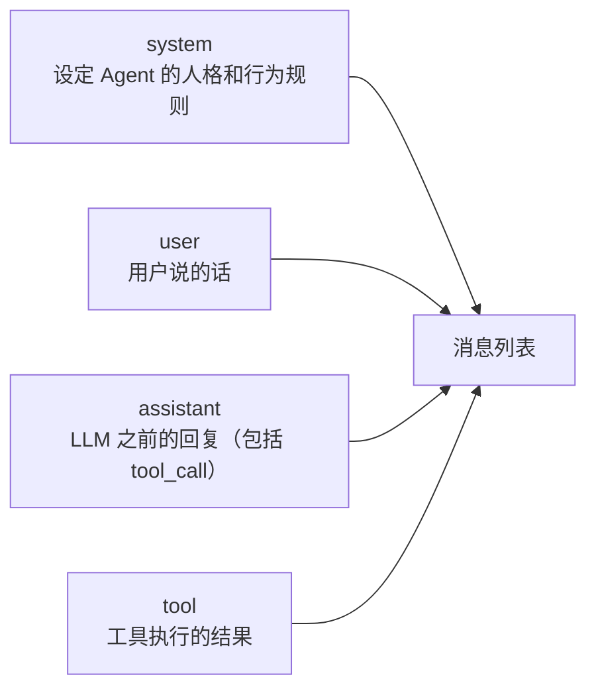

# 第 2 篇：LLM API 完全指南 — 从 curl 到系统化调用

> 基于 OpenAI Python SDK 1.x + API，Python 3.12，2026 年 6 月。

## 给 LLM 发消息这件事

Agent 的核心循环里，每一次"思考"都是一次 API 调用。Agent 的能力上限首先被 LLM API 的上限决定。这篇文章把 `/chat/completions` 的所有参数掰开看——不是为了写文档翻译，是为了知道在 Agent 场景下每个参数应该怎么选、调错了会有什么后果。

## 最小化调用

### 用 curl

```bash
curl https://api.openai.com/v1/chat/completions \
  -H "Content-Type: application/json" \
  -H "Authorization: Bearer $OPENAI_API_KEY" \
  -d '{
    "model": "gpt-4o",
    "messages": [{"role": "user", "content": "用一句话解释什么是 Agent"}]
  }' 2>/dev/null | python3 -m json.tool
```

完整的 response：

```json
{
  "id": "chatcmpl-9xK7YqN2vR3tW6zA1bCdEfGhIjKlM",
  "object": "chat.completion",
  "created": 1718000000,
  "model": "gpt-4o-2024-05-13",
  "choices": [
    {
      "index": 0,
      "message": {
        "role": "assistant",
        "content": "AI Agent 是让大语言模型不只是回答问题，而是能调用工具、规划步骤、自主完成任务的程序框架。"
      },
      "logprobs": null,
      "finish_reason": "stop"
    }
  ],
  "usage": {
    "prompt_tokens": 18,
    "completion_tokens": 42,
    "total_tokens": 60
  },
  "system_fingerprint": "fp_abc123def456"
}
```

### 用 Python SDK

```python
from openai import OpenAI

client = OpenAI()  # 自动读 OPENAI_API_KEY 环境变量

response = client.chat.completions.create(
    model="gpt-4o",
    messages=[{"role": "user", "content": "用一句话解释什么是 Agent"}]
)

print(response.choices[0].message.content)
# → AI Agent 是让大语言模型不只是回答问题，而是能调用工具...

print(f"用了 {response.usage.total_tokens} tokens")
# → 用了 60 tokens
```

### response 的每个字段做什么

| 字段 | 说明 | Agent 场景下需要注意什么 |
|------|------|------------------------|
| `id` | 本次请求唯一 ID | 出问题时提工单用 |
| `choices[0].message` | LLM 的回复 | `content` 可能是 null（当 LLM 要调 tool 时） |
| `choices[0].finish_reason` | 为什么停了 | `"stop"`（正常结束）、`"tool_calls"`（要调工具）、`"length"`（被 max_tokens 截断，危险！） |
| `usage.prompt_tokens` | 你传的 message 用了多少 token | 监控成本，超长 history 会在这里体现 |
| `usage.completion_tokens` | LLM 回复用了多少 token | `max_tokens` 设太小的话回复会被截断 |
| `usage.total_tokens` | 这次请求的总 token | **按这个计费** |

**最容易踩的坑是 `finish_reason: "length"`**：你把 `max_tokens` 设成了 200，而 LLM 想回复 300 个 token——回复在第 200 个 token 处被截断。在 Agent 场景中这尤其危险：LLM 想输出 `{"city": "北`，你的代码 `json.loads()` 解析一个半截的 JSON——直接崩。

## 三种 message 角色



### system prompt — 设定人格

```python
messages = [
    {
        "role": "system",
        "content": (
            "你是一个股票分析助手。回答规则：\n"
            "1. 先查股价再分析，不要凭记忆\n"
            "2. 永远标注数据来源\n"
            "3. 不构成投资建议——每次分析结尾必须加这句话"
        )
    },
    {"role": "user", "content": "分析一下茅台"}
]
```

system prompt 是整个对话的**第一条消息**。LLM 把它当成行为准则——后面的对话可能很长，但 system prompt 的影响始终贯穿全程。

Agent 的 system prompt 怎么写？几个原则：
- **说它是什么**："你是一个 xxx 助手"——限制它的知识范围
- **说它有什么工具**：虽然 Function Calling 有专门的 tools 参数，但 system prompt 里也提一句，帮 LLM 理解什么时候用哪个
- **说它的行为边界**："如果你不确定，说不知道"——防止 LLM 瞎猜

### user — 用户输入

最直接，就是用户说的话。但 Agent 的 user message 不一定来自真人——Agent 循环中，工具执行结果的**自然语言包装**也可以以 user 身份放入历史（不同框架策略不同，OpenAI 推荐用 tool 角色）。

### assistant — LLM 的历史回复

每次 LLM 的回复都要存进 messages 数组，包括：
- 正常的文本回复：`{"role": "assistant", "content": "今天北京 32°C..."}`
- 想调工具的回复：`{"role": "assistant", "content": null, "tool_calls": [...]}`

**不存历史回复 = LLM 不记得自己说过什么。** 这就是第 4 篇要深入讲的记忆系统。

### tool — 工具执行结果

```json
{
  "role": "tool",
  "tool_call_id": "call_abc123",
  "content": "{\"temp\": 32, \"condition\": \"晴\"}"
}
```

`tool_call_id` 必须和 `assistant.tool_calls[].id` 匹配——LLM 靠这个 ID 知道"这个结果是哪个请求的回应"。

## 核心参数：在 Agent 场景下怎么选

一个完整的、带参数的 API 调用：

```python
response = client.chat.completions.create(
    model="gpt-4o",
    messages=messages,
    temperature=0,          # Agent 要确定性
    max_tokens=1024,        # 给工具调用和回复足够的空间
    top_p=1,
    frequency_penalty=0,
    presence_penalty=0,
    tools=tools,            # Function Calling 工具定义
    tool_choice="auto",     # LLM 自己决定调不调工具
    seed=42                 # 可复现（调试时很重要）
)
```

### `temperature` — 创造性的温度计

范围 0-2，默认 1。

| temperature | 行为 | 适用于 Agent 的什么场景 |
|-------------|------|------------------------|
| 0 | 确定性最高，同样输入几乎同样输出 | **工具选择、数据提取、结构化输出**——Agent 的主体决策 |
| 0.3-0.7 | 有变化但不离谱 | 生成回复、分析报告 |
| 0.8-1.2 | 更随机、更有创造力 | 头脑风暴、创意生成 |
| 1.5+ | 可能混乱 | 几乎不用 |

Agent 的核心逻辑（选择哪个工具、提取参数）应该用 **temperature=0**。生成给用户的文本回复可以高一点。

实验数据，同样的问题问三次：

```python
# temperature=0 —— 三次输出完全一致
"""
1. 调用 get_weather(city="北京")
2. 等待结果
3. 根据温度给出建议
"""

# temperature=1.2 —— 三次输出各不相同
"""
好的用户，我把获取天气分成几个部分哈：
首先呢我去查查北京的温度（马上回来）
然后呢如果有需要我再...
"""
"""
没问题，这个任务可以按以下步骤处理：
第一步：获取北京的天气数据
第二步：分析温度
第三步：...
"""
"""
可以可以！让我帮您分步搞：
① 先调get_weather拿数据
② 然后看温度
③ 最后告诉您
"""
```

对于 Agent 的工具选择环节，**temperature=0 是底线**。你不会希望 Agent 在一次完美的工具调用和一次闲聊之间随机选择。

### `max_tokens` — 回复长度的天花板

**这是 Agent 最容易翻车的地方。**

`max_tokens` 限制的是 LLM **回复**的长度（completion_tokens），不是你传的消息长度（prompt_tokens）。

```python
# max_tokens=50 —— LLM 想生成一个完整的 tool_call JSON 但被截断
# finish_reason="length"
"""
{"role": "assistant", "tool_calls": [{"function": {"name": "get_we
"""
# ↑ JSON 不完整 → json.loads() → 💥

# max_tokens=4096 —— 足够任何 tool_call + 文本回复
# finish_reason="stop"
```

Agent 场景建议值：

| 场景 | 推荐 max_tokens |
|------|----------------|
| 只需选工具（只生成 tool_call JSON） | 512 |
| 需要选工具 + 生成简短回复 | 1024 |
| 需要生成分析报告、代码审查 | 4096 |
| streaming 场景 | 留足空间，反正用户看到的是流式的 |

**规则：宁可设大，别设小。** 大了不会多花钱——`usage.completion_tokens` 是按实际生成的 token 数收费，不是按 `max_tokens`。设小了的代价是回复被截断、Agent 崩溃。

### `top_p` — 词汇筛选的备选方案

范围 0-1。另一种控制随机性的方式：LLM 只从"概率之和达到 top_p"的候选词中抽样。

- `top_p=0.1`：只从概率最高的 10% 词汇中选——极保守
- `top_p=1`：考虑所有候选词——不限制

**通常不和 temperature 同时调整。** 要么调 temperature，要么调 top_p，二选一。Agent 场景下用 temperature 就够了。

### `seed` — 复现 LLM 的输出

```python
response = client.chat.completions.create(
    model="gpt-4o",
    messages=messages,
    temperature=0,
    seed=42
)
```

设了 `seed` 后，相同的 `messages` + `temperature` + `seed` 会产出相同的输出。这对 Agent 调试极其有用——你可以重复执行同一个 Agent 运行，LLM 的行为完全一致，排除"随机性导致的行为差异"。

## 流式输出（Streaming）

Agent 的文本回复默认是一次性返回的——LLM 写完整个回复，API 才把结果给你。如果回复很长（代码审查的几百行输出），用户要等好几秒。

Streaming 让 LLM 边生成边返回：

```python
stream = client.chat.completions.create(
    model="gpt-4o",
    messages=messages,
    stream=True
)

full_content = ""
for chunk in stream:
    if chunk.choices[0].delta.content:
        text = chunk.choices[0].delta.content
        print(text, end="", flush=True)  # 逐词打印
        full_content += text
```

每个 chunk 长这样：

```json
{
  "choices": [{
    "delta": {"content": "北"},
    "index": 0,
    "finish_reason": null
  }]
}
// 下一个 chunk
{"choices": [{"delta": {"content": "京"}, "index": 0, "finish_reason": null}]}
// 最后一个 chunk
{"choices": [{"delta": {}, "index": 0, "finish_reason": "stop"}]}
```

**Agent 场景下 streaming 的问题**：`tool_calls` 在 streaming 模式下也是逐片返回的——你的代码需要把碎片拼接成完整的 tool_call JSON，然后再执行。大多数 Agent 框架的处理方式是：**非 streaming 方式获取 tool_call，streaming 方式展示文本回复**。

## 实战：一个健壮的 API 调用封装

把上面的知识串成一个生产可用的封装类：

```python
import time
from openai import OpenAI, APIError, RateLimitError, APIConnectionError

class LLMClient:
    """带重试、超时、错误处理的 LLM API 封装。

    输入：messages 列表 + 可选 tools
    输出：解析好的 (content, tool_calls, finish_reason) 三元组
    """

    def __init__(self, model="gpt-4o", max_retries=3, base_delay=1.0):
        self.client = OpenAI()
        self.model = model
        self.max_retries = max_retries
        self.base_delay = base_delay

    def chat(self, messages, tools=None, temperature=0, max_tokens=2048):
        """核心方法：发请求 → 处理错误 → 返回结果。

        返回: {
            "content": str | None,           # 文本回复（tool_call 时为 None）
            "tool_calls": list | None,        # 工具调用列表
            "finish_reason": str,             # stop / tool_calls / length
            "usage": {"prompt": int, "completion": int, "total": int}
        }
        """
        last_error = None

        for attempt in range(self.max_retries + 1):
            try:
                response = self.client.chat.completions.create(
                    model=self.model,
                    messages=messages,
                    tools=tools,
                    tool_choice="auto" if tools else None,
                    temperature=temperature,
                    max_tokens=max_tokens,
                    seed=42,
                )
                choice = response.choices[0]
                msg = choice.message

                return {
                    "content": msg.content,
                    "tool_calls": msg.tool_calls,
                    "finish_reason": choice.finish_reason,
                    "usage": {
                        "prompt": response.usage.prompt_tokens,
                        "completion": response.usage.completion_tokens,
                        "total": response.usage.total_tokens,
                    }
                }

            except RateLimitError as e:
                # 429 — API 限流，指数退避重试
                last_error = e
                if attempt < self.max_retries:
                    delay = self.base_delay * (2 ** attempt)
                    print(f"[LLM] 限流，{delay:.0f}s 后重试 (尝试 {attempt+1}/{self.max_retries})")
                    time.sleep(delay)

            except APIConnectionError as e:
                # 网络问题，短暂等待重试
                last_error = e
                if attempt < self.max_retries:
                    print(f"[LLM] 连接失败，1s 后重试: {e}")
                    time.sleep(1)

            except APIError as e:
                # 其他 API 错误（400 参数错误、500 服务端错误等）
                if e.status_code and 400 <= e.status_code < 500:
                    raise  # 客户端错误不重试
                last_error = e
                if attempt < self.max_retries:
                    time.sleep(self.base_delay)

        raise last_error
```

使用示例：

```python
llm = LLMClient(model="gpt-4o")

# 调用 1：纯对话
result = llm.chat(
    messages=[
        {"role": "system", "content": "回复要简洁，不超过 30 字"},
        {"role": "user", "content": "什么是函数？"}
    ]
)
print(result["content"])
# → "函数是一段可重复使用、完成特定任务的代码块。"
print(f"用了 {result['usage']['total']} tokens")
# → 用了 55 tokens

# 调用 2：带工具
result = llm.chat(
    messages=[{"role": "user", "content": "北京天气怎么样？"}],
    tools=[weather_tool],
    temperature=0
)
if result["tool_calls"]:
    print(f"LLM 想调用: {result['tool_calls'][0].function.name}")
    # → LLM 想调用: get_weather
    print(f"参数: {result['tool_calls'][0].function.arguments}")
    # → 参数: {"city":"北京"}
```

### 错误处理对照表

| 错误类型 | HTTP 状态码 | 含义 | Agent 的对策 |
|----------|-----------|------|-------------|
| `RateLimitError` | 429 | 请求太频繁，被限流 | 指数退避重试，最多 3 次 |
| `APIConnectionError` | — | 网络不通 | 短暂等待重试 |
| `BadRequestError` | 400 | 参数错误（如 model 名写错） | **不重试**——抛出，修代码 |
| `AuthenticationError` | 401 | API Key 无效 | **不重试**——抛出，检查 key |
| `InternalServerError` | 500 | OpenAI 服务端问题 | 重试，间隔 1s |
| `APITimeoutError` | 408 | 请求超时 | 重试，增加超时时间 |

**重试的核心原则**：4xx 不重试（你的问题），5xx 和网络错误可以重试（服务端的问题）。

## 一个真实请求的完整 trace

最后，拿一个带 tool 的请求串一遍——从拼装 messages 到拿到最终结果：

```python
# === 准备 ===
llm = LLMClient()

messages = [
    {"role": "system", "content": "你是天气助手。温度 >= 35 时提醒注意防暑。"},
    {"role": "user", "content": "深圳现在热不热？"}
]

# === 第 1 次请求 ===
result1 = llm.chat(messages, tools=[weather_tool], temperature=0)
print(f"finish_reason: {result1['finish_reason']}")   # → tool_calls
print(f"tool_calls: {len(result1['tool_calls'])}")     # → 1
# tool_call: get_weather(city="深圳")
print(f"tokens: prompt={result1['usage']['prompt']}, "
      f"completion={result1['usage']['completion']}")
# → tokens: prompt=92, completion=18

# === 执行工具 ===
args = json.loads(result1['tool_calls'][0].function.arguments)
# → {"city": "深圳"}
tool_result = get_weather(**args)
# → {"temp": 35, "condition": "雷阵雨"}

# === 拼装消息 ===
messages.append({
    "role": "assistant",
    "content": None,
    "tool_calls": result1['tool_calls']
})
messages.append({
    "role": "tool",
    "tool_call_id": result1['tool_calls'][0].id,
    "content": json.dumps(tool_result, ensure_ascii=False)
})

# === 第 2 次请求 ===
result2 = llm.chat(messages, tools=[weather_tool], temperature=0)
print(f"finish_reason: {result2['finish_reason']}")   # → stop
print(f"content: {result2['content']}")
# → "深圳现在 35°C，雷阵雨天气。温度达到了高温标准，请注意防暑降温，
#    尽量避免在中午时段外出。雷阵雨天气要注意躲避雷电。"
print(f"tokens: total={result2['usage']['total']}")    # → total=178
```

**总花费**：第 1 次 92+18=110 tokens + 第 2 次 148+30=178 tokens = **288 tokens**（约 ¥0.004，用 gpt-4o 的价格）。

## 小结

Agent 的质量首先被这五个 API 参数决定：

| 参数 | Agent 场景推荐 | 为什么 |
|------|---------------|--------|
| `temperature` | 0 | 工具选择和参数提取必须确定 |
| `max_tokens` | 2048+ | 宁可浪费不要截断 |
| `seed` | 固定值 | 调式时可复现 |
| `tool_choice` | `"auto"` | LLM 自己判断要不要调工具 |
| `messages` | 始终包含 system prompt | 行为约束贯穿全程 |

下一篇：**Function Calling 深入**——写 schema 的技巧、常见翻车场景、多工具协同的完整实现。
