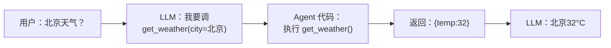

# 第 3 篇：Function Calling — 让 Agent 拥有手脚

> 基于 OpenAI API + Python 3.12，2026 年 6 月。

## LLM 不会执行函数——你才是执行的人

这句话值得在开头就说清楚：**Function Calling 这个名字有误导性。LLM 从来不会真正调用函数。** 它只是在回复里说"我想调这个函数，参数是这个"。你的 Agent 代码收到这个回复后，自己去调函数，把结果传回去。



这篇把 Function Calling 的完整链路拆开——从 schema 怎么写到多工具协同。

## 定义工具 schema — LLM 理解你的工具的第一道门槛

一个函数定义由三部分组成：

```python
weather_tool = {
    "type": "function",
    "function": {
        "name": "get_weather",
        "description": "获取指定城市的实时天气信息，包括温度、天气状况、湿度。支持中国主要城市。",
        "parameters": {
            "type": "object",
            "properties": {
                "city": {
                    "type": "string",
                    "description": "城市中文名称，例如：北京、上海、深圳、杭州"
                },
                "unit": {
                    "type": "string",
                    "enum": ["celsius", "fahrenheit"],
                    "description": "温度单位。celsius=摄氏度，fahrenheit=华氏度。默认 celsius。"
                }
            },
            "required": ["city"]
        }
    }
}
```

### 每个字段的作用

| 字段 | 作用 | 写好与写差的区别 |
|------|------|-----------------|
| `name` | LLM 用它来"点名"调哪个函数 | `get_weather` ✅ / `f1` ❌ —— LLM 不知道 f1 是什么 |
| `description` | 告诉 LLM 这个工具是干什么的 | "获取指定城市的实时天气信息" ✅ / "天气" ❌ ——太模糊 |
| `parameters.type` | 必须是 `"object"` | 固定的，改不了 |
| `parameters.properties` | 每个参数的名称、类型、描述 | 描述越具体，LLM 填的参数越准 |
| `parameters.required` | 哪些参数必须传 | `["city"]` —— 告诉 LLM "city 必须填" |

### Schema 写太模糊 → LLM 猜错

两个 schema 对比，同样的用户输入"查下天气"：

```python
# 差的 schema —— LLM 不知道要什么参数
bad_schema = {
    "name": "weather",
    "description": "天气",
    "parameters": {
        "type": "object",
        "properties": {
            "location": {"type": "string", "description": "地点"}
        }
    }
}
# LLM 回复：weather(location="??")  # 不确定，可能不调

# 好的 schema —— LLM 知道要什么
good_schema = {
    "name": "get_weather",
    "description": "获取指定城市的实时天气信息，包括温度、天气状况、湿度。支持中国主要城市。",
    "parameters": {
        "type": "object",
        "properties": {
            "city": {
                "type": "string",
                "description": "城市中文名称，例如：北京、上海、深圳、杭州"
            }
        },
        "required": ["city"]
    }
}
# LLM 回复：get_weather(city="北京")  # 准确匹配
```

### description 写好的原则

1. **描述这个函数做了什么**，而不是它的名字—— LLM 已经看到名字了
2. **描述每个参数代表什么**，加上示例值——这是 LLM 准确填参的关键
3. **描述返回值格式**（可以用自然语言）——帮 LLM 理解拿到结果后怎么用
4. **说清楚限制**：如果只支持中国城市，写上去——LLM 会据此判断能不能用

## 完整的 tool use 循环

```python
import json
from openai import OpenAI

client = OpenAI()

# === 工具注册表 ===
def search_web(query: str) -> dict:
    """模拟网页搜索——返回标题和摘要"""
    results = {
        "今天天气": [
            {"title": "北京今日晴 32°C", "snippet": "北京市气象台发布..."},
            {"title": "全国高温预警", "snippet": "华北地区持续高温..."},
        ],
        "茅台股价": [
            {"title": "贵州茅台(600519) 1680.50元 -2.3%", "snippet": "今日开盘1685..."},
        ]
    }
    matches = []
    for keyword, items in results.items():
        if keyword in query:
            matches = items
    return {"query": query, "count": len(matches), "results": matches}

def calculate(expression: str) -> dict:
    """安全计算数学表达式"""
    allowed = set("0123456789+-*/.() ")
    if not all(c in allowed for c in expression):
        return {"error": "表达式包含不允许的字符"}
    try:
        return {"expression": expression, "result": eval(expression)}
    except Exception as e:
        return {"error": str(e)}

# === schema 定义 ===
tools = [
    {
        "type": "function",
        "function": {
            "name": "search_web",
            "description": "搜索网页，返回相关结果的标题和摘要。适合查询实时信息、新闻、事实等。",
            "parameters": {
                "type": "object",
                "properties": {
                    "query": {
                        "type": "string",
                        "description": "搜索关键词。越具体越好，例如：'2026年6月北京天气' 而不是 '天气'"
                    }
                },
                "required": ["query"]
            }
        }
    },
    {
        "type": "function",
        "function": {
            "name": "calculate",
            "description": "执行数学计算。支持加减乘除和括号。不支持函数（sin/cos等）。",
            "parameters": {
                "type": "object",
                "properties": {
                    "expression": {
                        "type": "string",
                        "description": "数学表达式，例如：'(100 + 200) * 0.15'"
                    }
                },
                "required": ["expression"]
            }
        }
    }
]

# === 工具调度表 ===
TOOL_MAP = {
    "search_web": search_web,
    "calculate": calculate,
}

# === Agent 核心循环 ===
def run_agent(user_query: str, max_rounds=10):
    messages = [
        {"role": "system", "content": (
            "你是实用助手。规则：\n"
            "1. 需要实时信息时用 search_web\n"
            "2. 需要计算时用 calculate\n"
            "3. 不确定时直接告诉用户\n"
            "4. 回复简洁，不超过100字"
        )},
        {"role": "user", "content": user_query}
    ]
    total_tokens = 0

    for round_num in range(1, max_rounds + 1):
        response = client.chat.completions.create(
            model="gpt-4o",
            messages=messages,
            tools=tools,
            tool_choice="auto",
            temperature=0,
            seed=42
        )
        choice = response.choices[0]
        msg = choice.message
        total_tokens += response.usage.total_tokens

        if msg.tool_calls:
            print(f"\n--- 第 {round_num} 轮：LLM 要调工具 ---")
            messages.append(msg)

            for tc in msg.tool_calls:
                func = TOOL_MAP.get(tc.function.name)
                args = json.loads(tc.function.arguments)
                print(f"  → {tc.function.name}({json.dumps(args, ensure_ascii=False)})")

                if func:
                    result = func(**args)
                else:
                    result = {"error": f"未知工具: {tc.function.name}"}

                print(f"  ← 返回: {json.dumps(result, ensure_ascii=False)[:200]}")

                messages.append({
                    "role": "tool",
                    "tool_call_id": tc.id,
                    "content": json.dumps(result, ensure_ascii=False)
                })
        else:
            print(f"\n--- 第 {round_num} 轮：LLM 回复用户 ---")
            print(f"Tokense: {total_tokens}")
            return msg.content

    return "超过最大轮数，任务未完成"
```

### 运行示例 1：简单搜索

```python
print(run_agent("今天北京天气怎么样"))
```

```
--- 第 1 轮：LLM 要调工具 ---
  → search_web({"query": "2026年6月北京天气"})

--- 第 2 轮：LLM 回复用户 ---
今搜到两条北京天气信息：北京今日晴，32°C；全国高温预警显示华北持续高温。
建议关注当地气象台最新预报。
Tokens: 342
```

### 运行示例 2：搜索 + 计算

```python
print(run_agent("茅台今天跌了多少？如果我买100股要多少钱"))
```

```
--- 第 1 轮：LLM 要调工具 ---
  → search_web({"query": "茅台今日股价"})

  ← 返回: {"query": "茅台今日股价", "count": 1, "results": [...]}

--- 第 2 轮：LLM 要调工具 ---
  → calculate({"expression": "1680.50 * 100"})

  ← 返回: {"expression": "1680.50 * 100", "result": 168050.0}

--- 第 3 轮：LLM 回复用户 ---
茅台今日股价1680.50元，下跌2.3%。买100股大约需要168,050元。
请注意这是按当前股价的估算，实际交易还有手续费。
Tokens: 586
```

注意第 2 轮：LLM 先搜索拿到了股价，然后**自己决定**需要计算 `1680.50 × 100`，于是再次请求调用 `calculate` 工具。这就是 Agent 的核心能力——**根据上一步的结果，自主决定下一步做什么**。

## 多工具协同：LLM 怎么选工具

当你注册了 5 个、10 个工具时，LLM 会逐个评估"这个工具适不适合当前问题"。

### 工具选择模拟

用户问："北京天气怎么样？"

```json
// LLM 内部评估（概念性的）：
[
  {"tool": "search_web",     "match": "高：能搜实时天气信息"},
  {"tool": "calculate",      "match": "低：问题不需要计算"},
  {"tool": "send_email",     "match": "无：用户没说要发邮件"},
  {"tool": "query_database", "match": "低：用户要的是实时天气，不是历史数据"},
  {"tool": "read_file",      "match": "无：没有文件要读"}
]
// → 选择 search_web
```

### 一次调用、多个工具

LLM 可以在一轮中请求**并行调用**多个不相关的工具：

用户问："北京和深圳天气分别怎么样？"

```json
// LLM 返回
{
  "tool_calls": [
    {"id": "call_1", "function": {"name": "search_web", "arguments": "{\"query\":\"北京天气\"}"}},
    {"id": "call_2", "function": {"name": "search_web", "arguments": "{\"query\":\"深圳天气\"}"}}
  ]
}
```

两个 search_web 调用**互不依赖**——可以并行执行：

```python
import concurrent.futures

with concurrent.futures.ThreadPoolExecutor() as executor:
    futures = {
        executor.submit(TOOL_MAP[tc.function.name], **json.loads(tc.function.arguments)): tc
        for tc in msg.tool_calls
    }
    for future in concurrent.futures.as_completed(futures):
        tc = futures[future]
        result = future.result()
        messages.append({
            "role": "tool",
            "tool_call_id": tc.id,
            "content": json.dumps(result, ensure_ascii=False)
        })
```

Agent 代码需要处理**多个 tool_call 结果同时返回**，把它们都追加到 messages，然后统一发给 LLM。

### 工具多了 LLM 可能选错

工具定义超过 10 个时，LLM 偶尔会选错。几个策略：

| 策略 | 做法 | 效果 |
|------|------|------|
| **分组** | 把工具分组，每一轮只暴露相关的工具子集 | 减少选择范围 |
| **description 关键词** | 在 description 里写清楚适用和不适用场景 | 帮 LLM 排除 |
| **system prompt 引导** | 明确说"优先用 A，A 找不到再用 B" | 给选择排序 |
| **工具选择 Agent** | 专门用一个 LLM 调用来决定用哪些工具 | 两阶段：选工具 → 调工具 |

## 常见翻车场景与修复

### 翻车 1：LLM 捏造参数

```
用户："帮我查一下天气"
LLM：search_web(query="")    # 参数是空字符串
```

**修复**：在 schema 里设 `"minLength": 1`，或者在代码里检查参数非空，空参数不执行，返回错误提示让 LLM 重试。

### 翻车 2：LLM 不调工具，自己编答案

```
用户："茅台现在多少钱？"
LLM："根据我的知识，茅台大约在1600-1700元..."
```

**修复**：system prompt 加一句"你必须通过工具获取实时数据，不要凭记忆或训练数据回答。如果不确定，先调用对应工具。"

### 翻车 3：工具返回超长结果，LLM 忽略关键信息

```
search_web(query="茅台") → 100 条搜索结果（50000 字符）
LLM 回复只引用了前 3 条，忽略了最重要的第 7 条
```

**修复**：
- 工具端截断：只返回前 10 条
- Agent 端过滤：用关键词再过滤一遍结果
- 分成两步：先搜索拿到列表，再让 LLM 选一条深度阅读

### 翻车 4：死循环

```
LLM 第 1 轮：search_web → 结果不理想
LLM 第 2 轮：search_web → 换个词搜索
LLM 第 3 轮：search_web → 再换
...
```

**修复**：`max_rounds` 硬限制 + 如果连续 3 轮调用同一个工具，强制让 LLM 回复用户。

## 小结

Function Calling 不是魔法——是 LLM 输出 JSON 而不是文本，Agent 代码执行这个 JSON 对应的函数。三个关键点：

1. **Schema 的 description 决定了 LLM 能不能选对工具**——每个参数加示例值、说清楚限制
2. **LLM 可以一发请求多个工具**——你的代码需要支持并行执行
3. **工具执行失败是正常的**——Agent 代码要处理错误，把错误信息喂回 LLM 让它调整

下一篇：**Agent 的记忆系统**——短期记忆的 token 预算管理、长期记忆的向量检索。这篇的工具和循环是基础，下篇给 Agent 加上"不忘记"的能力。
