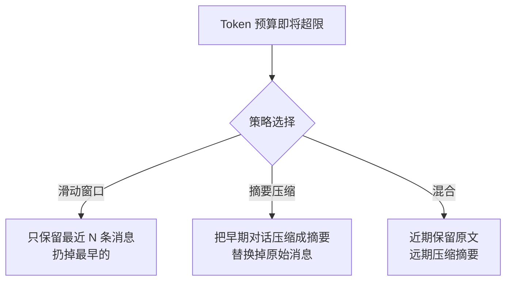
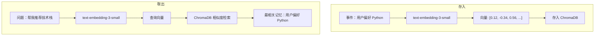
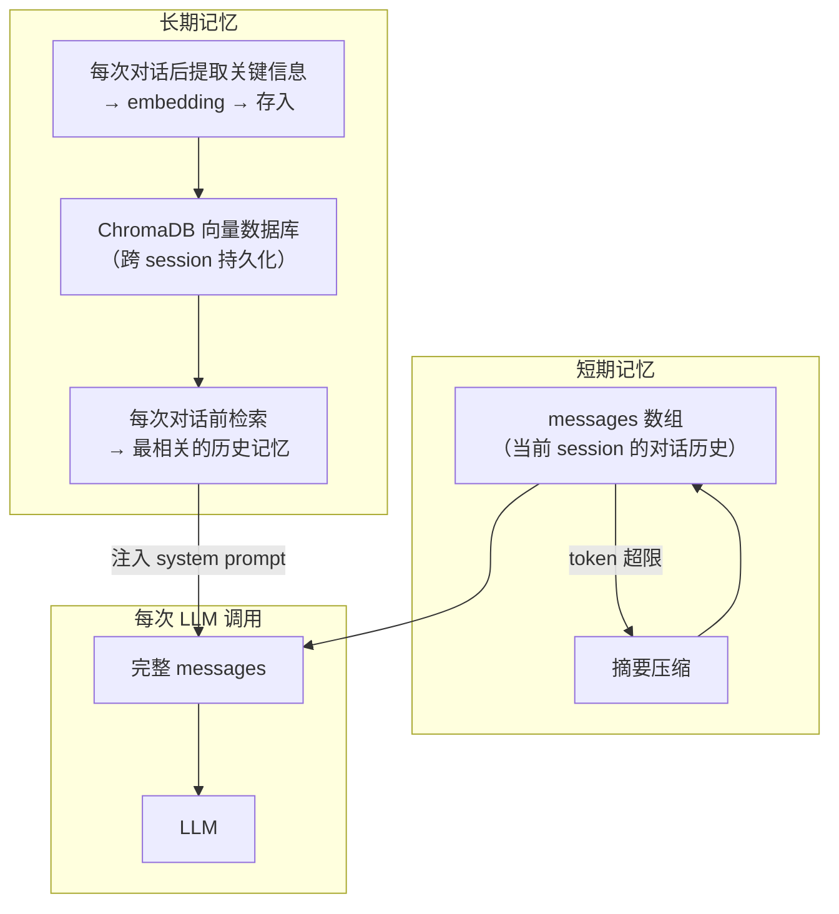

# 第 4 篇：Agent 的记忆系统 — 短期记忆与长期记忆

> 基于 OpenAI API + tiktoken + ChromaDB，Python 3.12，2026 年 6 月。

## LLM 为什么"失忆"

每次调 LLM API，你传一个 `messages` 数组。这组 messages **就是 LLM 看到的全部**——你没有传进去的东西，LLM 绝对不会记得。

```python
# 第 1 次调用
messages = [{"role": "user", "content": "我叫张三"}]
response = client.chat.completions.create(model="gpt-4o", messages=messages)
# LLM: "你好张三！"

# 第 2 次调用——没传历史
messages = [{"role": "user", "content": "我叫什么？"}]
response = client.chat.completions.create(model="gpt-4o", messages=messages)
# LLM: "我不清楚你的名字。"
```

**Agent 的记忆就是 messages 数组**。存多少条、怎么存、存不下的时候怎么取舍——这就是记忆系统要解决的问题。

## 短期记忆：把历史对话全塞进 messages

最直接的做法：每次回答后，把消息存下来，下次调用时附上。

```python
# 每次对话后保存
history = [
    {"role": "user", "content": "我叫张三"},
    {"role": "assistant", "content": "你好张三！有什么我可以帮助你的？"},
]

# 下次对话时附上
history.append({"role": "user", "content": "我在北京"})
history.append({"role": "assistant", "content": "北京是个不错的城市！"})

# 第三次对话
history.append({"role": "user", "content": "我叫什么？我在哪个城市？"})
response = client.chat.completions.create(
    model="gpt-4o",
    messages=history
)
# LLM: "你叫张三，你在北京。"
```

很简单，但有一个致命问题：**messages 越来越长**。

### Token 预算的算术

LLM 的 context window（上下文窗口）限制了 **prompt + completion 的总 token 数**：

| 模型 | Context Window |
|------|---------------|
| gpt-4o | 128,000 tokens |
| gpt-4o-mini | 128,000 tokens |
| gpt-3.5-turbo | 16,385 tokens |

看起来很大，但 Agent 的 context 消耗很快。一个典型 Agent session：

```
system prompt:        200 tokens
第 1 轮对话:          150 tokens
第 1 次 tool_call:    100 tokens
第 1 次 tool result:  300 tokens
第 2 轮对话:          200 tokens
第 2 次 tool_call:    100 tokens
第 2 次 tool result:  800 tokens  ← 搜索结果特别长！
第 3 轮对话:          250 tokens
...
第 10 轮:             累计已超过 8000 tokens
```

工具返回内容常常是 token 大户——一次网页搜索可能返回几千字的摘要，几次下来就吃掉上万个 token。

### 用 tiktoken 精确计算

```python
import tiktoken

encoder = tiktoken.encoding_for_model("gpt-4o")

def count_tokens(messages: list) -> int:
    """计算 messages 数组的总 token 数。

    注意：这只是近似值。真实的 token 计数还包含每条消息的
    role 标记等格式化开销（每条消息约 3-4 tokens 额外开销）。
    """
    total = 0
    for msg in messages:
        content = msg.get("content", "") or ""
        total += len(encoder.encode(content))
        # tool_calls 的 JSON 也占 token
        if msg.get("tool_calls"):
            total += len(encoder.encode(str(msg["tool_calls"])))
    return total

# 实际使用：确保不超出 context window
MAX_CONTEXT = 120000  # 留 8000 作为 buffer 给回复

messages = [{"role": "system", "content": "你是实用助手..."}]
# ... 对话进行中 ...
tokens = count_tokens(messages)
print(f"当前: {tokens}/{MAX_CONTEXT} tokens ({tokens/MAX_CONTEXT*100:.1f}%)")

if tokens > MAX_CONTEXT * 0.9:
    print("⚠️ Token 预算紧张，考虑压缩历史")
```

### 三种策略：Token 太多怎么办



#### 策略一：滑动窗口截断

```python
def trim_history(messages, max_messages=20):
    """只保留最近的 max_messages 条 + system prompt"""
    system_msgs = [m for m in messages if m["role"] == "system"]
    other_msgs = [m for m in messages if m["role"] != "system"]
    return system_msgs + other_msgs[-max_messages:]
```

简单粗暴。问题是：早期的关键信息（用户在第 1 轮说的名字）会被扔掉。

#### 策略二：摘要压缩

```python
def summarize_history(messages, summary_trigger_tokens=10000):
    """当 token 超过阈值时，把最老的对话替换成一段摘要"""
    if count_tokens(messages) < summary_trigger_tokens:
        return messages

    # 找分割点：前 1/3 的消息做摘要
    split = len(messages) // 3
    old_messages = messages[:split]
    recent = messages[split:]

    # 用 LLM 生成摘要
    summary_prompt = [
        {"role": "system", "content": (
            "将以下对话历史压缩成一段简洁的摘要（不超过 200 字）。"
            "保留关键信息：用户的名字、偏好、之前的任务、重要的决策。"
        )},
        {"role": "user", "content": json.dumps([
            {"role": m["role"], "content": m.get("content", "")[:500]}
            for m in old_messages
            if m["role"] in ("user", "assistant")
        ], ensure_ascii=False)}
    ]

    summary_response = client.chat.completions.create(
        model="gpt-4o-mini",  # 用便宜的模型做摘要
        messages=summary_prompt,
        temperature=0,
        max_tokens=300
    )
    summary = summary_response.choices[0].message.content

    # 用摘要替换旧消息
    compressed = [
        {"role": "system", "content": f"[对话历史摘要] {summary}"}
    ] + recent

    print(f"  压缩: {len(old_messages)} 条消息 → 1 条摘要 (用了 {summary_response.usage.total_tokens} tokens)")
    return compressed
```

这个方法的关键：**用便宜的模型（gpt-4o-mini）做摘要，保留昂贵模型（gpt-4o）的上下文给当前任务**。

## 长期记忆：跨 session 的持久化

滑动窗口和摘要解决了**一个 session 内**的 token 预算。但如果用户关了窗口，明天再来——Agent 完全不记得昨天聊过什么。这需要长期记忆。

长期记忆的核心是**向量检索**：



### Embedding — 把文字变成数字

Embedding 是一个函数：`f("一段文字") → [0.12, -0.34, 0.56, 0.02, ...]`（一个固定长度的浮点数数组）。

语义相近的文字，向量也相近：

```python
from openai import OpenAI
import numpy as np

client = OpenAI()

def embed(text: str) -> list[float]:
    """用 OpenAI 的 embedding 模型把文字变成向量"""
    response = client.embeddings.create(
        model="text-embedding-3-small",
        input=text
    )
    return response.data[0].embedding

# 三个句子的向量
v1 = embed("我喜欢用 Python 写自动化脚本")
v2 = embed("Python 是我最常用的编程语言")
v3 = embed("今天天气很好适合出去玩")

# 余弦相似度
def cosine_sim(a, b):
    return np.dot(a, b) / (np.linalg.norm(a) * np.linalg.norm(b))

print(f"Python相关: {cosine_sim(v1, v2):.4f}")  # → 0.8234（高——语义相近）
print(f"Python vs 天气: {cosine_sim(v1, v3):.4f}")  # → 0.1542（低——语义无关）
```

`text-embedding-3-small` 产出的向量是 **1536 维**的。前 10 维长这样：

```
[0.0123, -0.0456, 0.0789, 0.0234, -0.0567, 0.0345, -0.0890, 0.0012, 0.0678, -0.0432, ...]
```

### ChromaDB — 存储和检索向量

```bash
pip install chromadb
```

```python
import chromadb
from chromadb.utils import embedding_functions

# 初始化——数据存在本地磁盘
chroma_client = chromadb.PersistentClient(path="./agent_memory")
collection = chroma_client.get_or_create_collection(
    name="user_memories",
    embedding_function=embedding_functions.OpenAIEmbeddingFunction(
        api_key=os.environ["OPENAI_API_KEY"],
        model_name="text-embedding-3-small"
    )
)

# 存入记忆
def remember(user_id: str, content: str, metadata: dict = None):
    """存入一条记忆"""
    memory_id = f"{user_id}_{int(time.time())}_{hash(content) % 10000}"
    collection.add(
        ids=[memory_id],
        documents=[content],
        metadatas=[metadata or {}]
    )
    print(f"  已记住: {content[:100]}...")

# 检索相关记忆
def recall(user_id: str, query: str, n_results=5) -> list[str]:
    """根据当前问题，检索最相关的历史记忆"""
    results = collection.query(
        query_texts=[query],
        n_results=n_results,
        where={"user_id": user_id}  # 只查这个用户的记忆
    )
    return results["documents"][0] if results["documents"][0] else []
```

### 完整的长记忆 Agent

```python
import time, os

class MemoryAgent:
    """带长期记忆的 Agent。每次对话前先检索相关历史，
    对话结束后把重要信息存入记忆。"""

    def __init__(self, user_id):
        self.user_id = user_id
        self.client = OpenAI()
        self.collection = chromadb.PersistentClient(
            path="./agent_memory"
        ).get_or_create_collection(
            name="user_memories",
            embedding_function=embedding_functions.OpenAIEmbeddingFunction(
                api_key=os.environ["OPENAI_API_KEY"],
                model_name="text-embedding-3-small"
            )
        )

    def chat(self, user_message: str) -> str:
        # 1. 检索相关历史记忆
        memories = self._recall(user_message)
        memory_context = "\n".join(f"- {m}" for m in memories) if memories else "（无相关历史记忆）"

        # 2. 把记忆注入 system prompt
        system_prompt = f"""你是个人助手。你对用户的了解基于以下历史记忆：

{memory_context}

基于以上记忆为用户提供个性化服务。如果记忆为空或与当前问题无关，正常回答即可。"""

        messages = [
            {"role": "system", "content": system_prompt},
            {"role": "user", "content": user_message}
        ]

        response = self.client.chat.completions.create(
            model="gpt-4o",
            messages=messages,
            temperature=0.3
        )
        reply = response.choices[0].message.content

        # 3. 提取这次对话中的重要信息，存入记忆
        self._extract_and_store(user_message, reply)

        return reply

    def _recall(self, query: str) -> list[str]:
        result = self.collection.query(
            query_texts=[query],
            n_results=3,
            where={"user_id": self.user_id}
        )
        return result["documents"][0] if result["documents"][0] else []

    def _extract_and_store(self, user_msg: str, assistant_reply: str):
        """用 LLM 判断这次对话中是否有值得记住的信息"""
        extraction_prompt = [
            {"role": "system", "content": (
                "分析以下对话，提取值得长期记住的用户信息（偏好、事实、决策、计划等）。"
                "每条信息单独一行，以 '记忆：' 开头。如果没有值得记住的信息，回复 '无'。"
                "示例：\n"
                "记忆：用户的名字是张三\n"
                "记忆：用户偏好 Python 开发，不喜欢 Java\n"
                "记忆：用户计划下周去北京出差"
            )},
            {"role": "user", "content": f"用户：{user_msg}\n助手：{assistant_reply}"}
        ]

        response = self.client.chat.completions.create(
            model="gpt-4o-mini",
            messages=extraction_prompt,
            temperature=0,
            max_tokens=300
        )
        text = response.choices[0].message.content

        for line in text.split("\n"):
            if line.startswith("记忆："):
                content = line.replace("记忆：", "").strip()
                self.collection.add(
                    ids=[f"{self.user_id}_{int(time.time())}_{hash(content) % 100000}"],
                    documents=[content],
                    metadatas=[{"user_id": self.user_id}]
                )
                print(f"  🧠 存入记忆: {content}")
```

### 使用示例

```python
agent = MemoryAgent(user_id="user_001")

# 第 1 天
print(agent.chat("我叫张三，是后端工程师，主要用 Python 和 Go"))
# LLM: 你好张三！了解了，你是 Python 和 Go 的后端工程师。
# 🧠 存入记忆: 用户叫张三
# 🧠 存入记忆: 用户是后端工程师，主要用 Python 和 Go

print(agent.chat("我想学一门新语言，有什么推荐？"))
# 检索到的记忆:
#   - 用户是后端工程师，主要用 Python 和 Go
#   - 用户叫张三
# LLM: 张三，基于你的 Python 和 Go 背景，我推荐 Rust——...
# 🧠 存入记忆: 用户在考虑学习新编程语言

# 第 2 天（新的 session，Agent 从零开始但记忆还在）
agent2 = MemoryAgent(user_id="user_001")
print(agent2.chat("帮我推荐一个适合我的项目框架"))
# 检索到的记忆:
#   - 用户是后端工程师，主要用 Python 和 Go
#   - 用户在考虑学习新编程语言
#   - 用户叫张三
# LLM: 张三，考虑到你熟悉 Python 和 Go，推荐 FastAPI（Python）或 Gin（Go）...
```

**关键点**：第二天是全新的 session，Agent 没有第一天的 messages。但它通过向量检索拿到了"张三用 Python 和 Go"，恢复了个性化上下文。

## 短期 + 长期记忆的完整架构



## 小结

Agent 的记忆 = messages 数组 + 向量数据库。两个维度的管理：

| | 短期记忆 | 长期记忆 |
|------|----------|----------|
| 存储 | messages 数组 | ChromaDB |
| 生命周期 | 当前 session | 永久 |
| 容量限制 | Context window (128k tokens) | 几乎无限 |
| 管理策略 | 滑动窗口 / 摘要压缩 | embedding + 相似度检索 |
| 典型操作 | count_tokens() → 超限 → summarize_history() | embed() → collection.add() → collection.query() |

**用便宜的模型做摘要（gpt-4o-mini），用便宜的模型做 embedding（text-embedding-3-small），把昂贵的 context window 留给最终决策（gpt-4o）**——这是 Agent 记忆系统成本优化的核心原则。

下一篇：**Agent 的推理模式**——Chain of Thought 和 ReAct。记忆让 Agent 不忘记，推理让 Agent 会思考。
