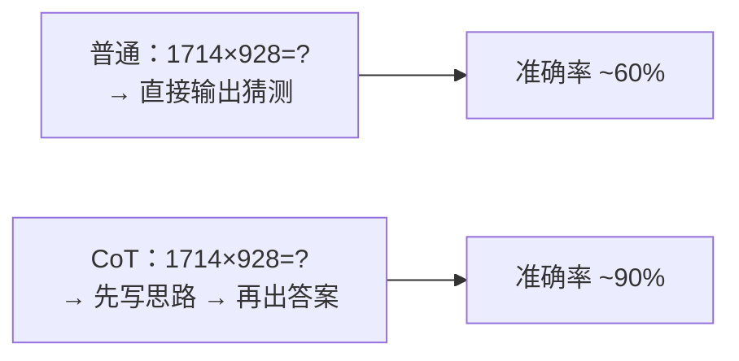
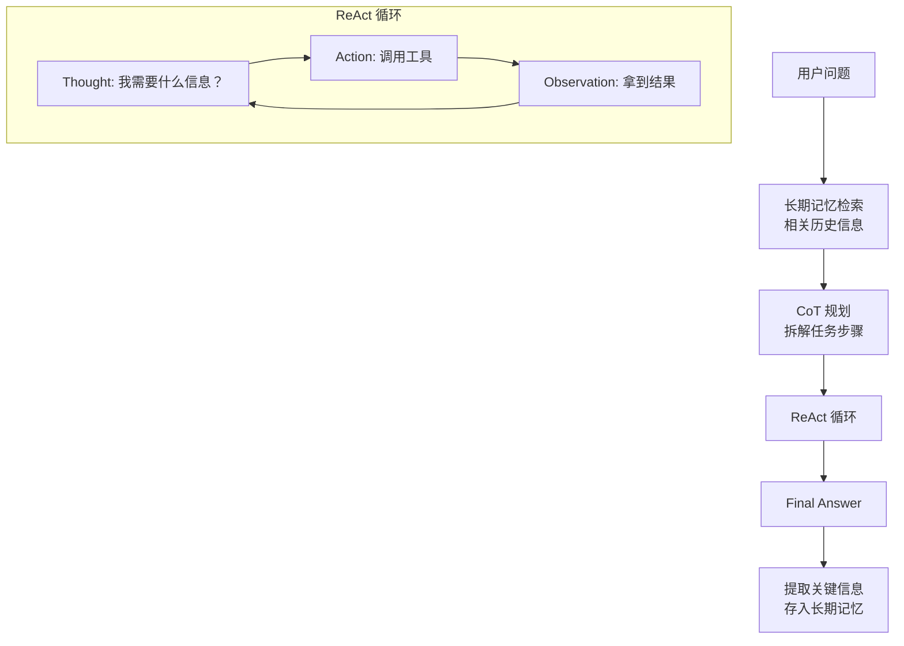

# 第 5 篇：Agent 的推理模式 — Chain of Thought 与 ReAct

> 基于 OpenAI API + Python 3.12，2026 年 6 月。

## 不是所有问题都能一次答对

前几篇的 Agent 有一个隐含假设：LLM 一次调用就能给出正确答案。但对于需要多步推理的问题——"这个代码仓库最严重的安全漏洞是什么"——一次调用远远不够。

这篇文章讲两种让 Agent 在给答案之前先"想一想"的方法：**Chain of Thought**（思维链）和 **ReAct**（推理 + 行动）。

## Chain of Thought — 先写草稿再交卷

CoT 的原理很简单：让 LLM 在给答案之前先输出思考过程。就好像考试时老师说的「先写解题步骤，再写答案」。

### 零样本 CoT

不需要示例——在 prompt 里加一句话就行：

```python
# 普通 prompt
response = client.chat.completions.create(
    model="gpt-4o",
    messages=[{"role": "user", "content": "1714 × 928 = ?"}]
)
# → "1714 × 928 = 1,590,592"  ← 可能是对的，也可能不是

# CoT prompt —— 就多了 8 个字
response = client.chat.completions.create(
    model="gpt-4o",
    messages=[{"role": "user", "content": "1714 × 928 = ? 让我们一步步思考。"}]
)
# → "让我一步步计算：
#    1714 × 928 = 1714 × (900 + 28)
#    = 1714 × 900 + 1714 × 28
#    = 1,542,600 + 47,992
#    = 1,590,592
#    答案是 1,590,592"
```

仅仅加了"让我们一步步思考"，LLM 的准确率就从大约 60% 提升到了 90% 以上（在数学推理基准上）。

### 原理

LLM 是逐 token 生成文本的。当它先输出"让我一步步计算"，它就在前面铺好了步骤格式，后续输出的每个 token 都会受到这个格式的约束——它**被迫**一步步来，而不是直接跳到答案。



### Few-shot CoT

零样本 CoT 在复杂任务上不够——给 LLM 看几个"好的思考过程"的例子，它学得更快：

```python
def few_shot_cot(question: str) -> str:
    system_prompt = """你是数学解题助手。回答每个问题时，按以下格式输出：

步骤1: 理解问题——用自己的话复述
步骤2: 列出已知条件
步骤3: 逐步计算
步骤4: 给出最终答案

示例：
问题：商店有 120 个苹果，卖了 45 个，又进货 80 个，现在有多少？
步骤1: 需要计算：初始数量 - 卖出 + 进货 = 最终数量
步骤2: 初始=120，卖出=45，进货=80
步骤3: 120 - 45 = 75，75 + 80 = 155
步骤4: 现在有 155 个苹果"""

    response = client.chat.completions.create(
        model="gpt-4o",
        messages=[
            {"role": "system", "content": system_prompt},
            {"role": "user", "content": question}
        ],
        temperature=0
    )
    return response.choices[0].message.content
```

### CoT 在 Agent 里怎么用

Agent 的 system prompt 里注入 CoT 指令：

```python
system_prompt = """你是代码审查 Agent。分析每个 PR 时，按以下步骤思考：

1. 识别变更的文件类型（前端/后端/配置/数据库迁移）
2. 检查是否有明显的安全问题（注入、密钥泄露、不安全的依赖）
3. 检查是否有逻辑错误（边界条件、空值处理、并发问题）
4. 生成审查意见

在最终的回复中，简要说明你的推理过程。"""

# 在 Agent 循环中，每轮 LLM 调用都用这个 system prompt
messages = [
    {"role": "system", "content": system_prompt},
    *history,
    {"role": "user", "content": pr_diff}
]
```

## ReAct — 边想边做

CoT 解决了"先想再答"。但 Agent 的问题是：光想不够，需要边想边做——查资料、调工具、看结果、再想下一步。

**ReAct = Reasoning + Acting**。论文的标题就是它的定义：让 LLM 交替输出"思考"和"行动"。

### ReAct 的循环结构

```
Thought: 我需要知道北京的天气，先调 get_weather
Action: get_weather(city="北京")
Observation: {"temp": 32, "condition": "晴"}

Thought: 北京 32°C，很热。用户还问了深圳，需要比较
Action: get_weather(city="深圳")
Observation: {"temp": 35, "condition": "雷阵雨"}

Thought: 深圳 35°C > 北京 32°C，还有雷阵雨。可以给用户完整回答
Answer: 深圳(35°C)比北京(32°C)更热，而且有雷阵雨，体感更闷热
```

### 手写 ReAct Agent

前面几篇的 Agent 其实已经接近 ReAct 了——Function Calling 就是 Action，工具返回结果就是 Observation。但真正的 ReAct 把思考过程也显式化了：

```python
def react_agent(user_query: str, max_steps=10):
    messages = [
        {"role": "system", "content": """你是 ReAct Agent。使用以下格式规划你的行动：

Thought: (分析当前情况，决定下一步做什么)
Action: (选择一个工具并指定参数)
... (此格式重复，直到任务完成)

可用工具：
- search(query: str) → 搜索结果列表
- calculate(expression: str) → 数值计算结果

当你已经收集到足够信息时，用以下格式给出最终回答：
Final Answer: (基于收集到的信息，回答用户的问题)"""},
        {"role": "user", "content": user_query}
    ]

    history = []

    for step in range(1, max_steps + 1):
        print(f"\n{'='*60}")
        print(f"Step {step}")
        print(f"{'='*60}")

        response = client.chat.completions.create(
            model="gpt-4o",
            messages=messages,
            temperature=0
        )
        text = response.choices[0].message.content
        print(text)

        history.append({"step": step, "output": text})

        # 检查是否到了最终回答
        if "Final Answer:" in text:
            answer = text.split("Final Answer:")[1].strip()
            return {"answer": answer, "steps": history, "total_steps": step}

        # 解析 Action
        if "Action:" in text:
            action_line = [l for l in text.split("\n") if "Action:" in l][0]
            action_str = action_line.split("Action:")[1].strip()

            # 执行工具
            if action_str.startswith("search("):
                query = action_str[len("search("):-1].strip('"').strip("'")
                result = search_web(query)
            elif action_str.startswith("calculate("):
                expr = action_str[len("calculate("):-1].strip('"').strip("'")
                result = calculate(expr)
            else:
                result = {"error": f"未知动作: {action_str}"}

            observation = json.dumps(result, ensure_ascii=False)
            print(f"Observation: {observation[:300]}")

            messages.append({"role": "assistant", "content": text})
            messages.append({"role": "user", "content": f"Observation: {observation}"})

    return {"answer": "超过最大步骤数", "steps": history, "total_steps": max_steps}
```

### 执行示例

```python
result = react_agent("茅台今天收盘价是多少？100股要多少钱？")
```

```
============================================================
Step 1
============================================================
Thought: 用户想知道茅台今天的收盘价和100股的总价。
我需要先搜索茅台今天的股价。
Action: search("茅台 今日 收盘价 2026-06-10")
Observation: {"query": "茅台 今日 收盘价 2026-06-10", "count": 1,
  "results": [{"title": "贵州茅台(600519) 1680.50元 -2.3%", ...}]}

============================================================
Step 2
============================================================
Thought: 拿到了茅台今日股价 1680.50 元。现在需要计算100股的总价。
Action: calculate("1680.50 * 100")
Observation: {"expression": "1680.50 * 100", "result": 168050.0}

============================================================
Step 3
============================================================
Thought: 我已拿到股价(1680.50元)和100股总价(168,050元)。
可以给用户完整回答了。

Final Answer: 贵州茅台今日收盘价1680.50元，下跌2.3%。
如果要购买100股，大约需要168,050元（未计算交易费用）。
注意：股票交易还有佣金、印花税等费用，实际支出会略高于此金额。
```

### ReAct 和 Function Calling 的关系

| | ReAct | Function Calling |
|------|-------|-----------------|
| 实现方式 | Prompt 工程——自然语言描述"Thought/Action/Observation" | API 特性——`tools` 参数 + `tool_calls` 响应 |
| 优势 | 不依赖 API 特性，任何 LLM 都能用；思考过程可见 | 结构化输出，解析可靠，一次可返回多工具调用 |
| 劣势 | 需手动解析文本中的 Action（格式不稳定） | 需要 API 支持，思考过程不显式化 |

**最佳实践：用 Function Calling 实现 ReAct**。工具调用用 API 的 `tools` 参数（可靠），但 system prompt 里要求 LLM 在每次 tool_call 前用 `content` 输出思考（让 trace 可读）。OpenAI 在 2024 年后支持 `tool_calls` + `content` 同时返回，完美融合了两者。

## CoT + ReAct + Memory = 完整 Agent 的推理栈



## CoT 的局限性

CoT 不是万能药：

1. **简单的知识问答不需要 CoT**。"法国的首都是哪里？"——加"一步步思考"只会浪费 token。
2. **CoT 可能放大错误**。如果 LLM 的第一步推理就错了，后面所有步骤都跟着错。
3. **CoT 消耗更多 token**。长思考链可能增加 3-5 倍的 token 消耗。

**何时用 CoT**：

| 任务类型 | 是否需要 CoT |
|----------|------------|
| 数学计算、逻辑推理 | ✅ 必须 |
| 代码审查、安全分析 | ✅ 推荐 |
| 多步信息检索（先搜A再根据A的结果搜B） | ✅ 推荐 |
| 简单翻译、摘要 | ❌ 不需要 |
| 事实性问答 | ❌ 不需要 |

## 小结

CoT 和 ReAct 都是**让 LLM 在给出答案前多走几步**。区别在于：

- **CoT** 是"先想再说"——适合单次回答就能搞定的推理任务
- **ReAct** 是"边想边做边看"——适合需要多轮工具调用的复杂任务

Agent 的完整推理栈：**长期记忆给上下文 → CoT 做任务拆解 → ReAct 执行多步行动 → 提取结果存入长期记忆**。

下一篇也是最后一篇：**构建完整的 Agent 系统**——把前 5 篇的能力全部整合，写一个代码审查 Agent。
