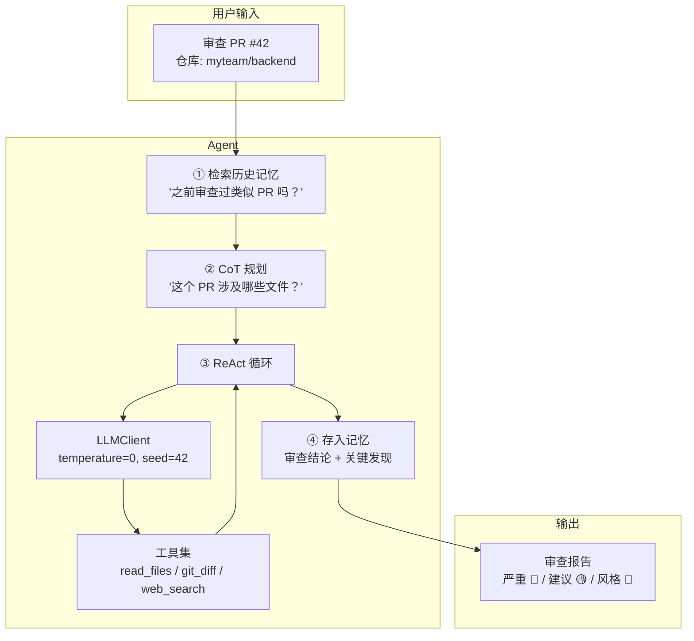

# 第 6 篇：构建完整的 Agent 系统 — 代码审查实战

> 基于前 5 篇全部知识，Python 3.12，2026 年 6 月。

## 前 5 篇串起来

| 篇 | 能力 | 本篇怎么用 |
|----|------|-----------|
| ① Agent 概念 | 感知→思考→行动→观察 循环 | 程序主循环 |
| ② LLM API | 参数选择、错误处理、重试 | `LLMClient` 封装类 |
| ③ Function Calling | 工具定义、执行、多工具协同 | 读文件、读 Git diff、写报告的 tools |
| ④ 记忆 | 短期 token 管理 + 长期向量存储 | 记住之前的审查风格和结论 |
| ⑤ 推理 | CoT 规划 + ReAct 执行 | 分析 diff 时的逐步推理 |

这篇把它们全装进一个代码审查 Agent。

## 系统设计

### 做什么

用户给 Agent 一个 GitHub PR 编号，Agent 自动：
1. 拉取 PR 的 diff 内容
2. 分析变更的文件，识别潜在问题
3. 给出分级审查意见（严重 / 建议 / 风格）
4. 记住本次审查的结论，下次审查同类代码时参考

### 架构



## 完整代码

### 1. 配置和依赖

```python
# agent_config.py
import os
from dataclasses import dataclass, field

@dataclass
class AgentConfig:
    model: str = "gpt-4o"
    cheap_model: str = "gpt-4o-mini"          # 摘要、记忆提取用便宜的
    embedding_model: str = "text-embedding-3-small"
    max_rounds: int = 10
    max_tokens_per_call: int = 4096
    temperature: int = 0
    seed: int = 42
    memory_db_path: str = "./agent_memory"
    log_dir: str = "./agent_logs"

config = AgentConfig()
```

### 2. LLM 调用封装（源自第 2 篇）

```python
# llm_client.py
import time, json
from openai import OpenAI, RateLimitError, APIError, APIConnectionError

class LLMClient:
    def __init__(self, config):
        self.client = OpenAI()
        self.model = config.model
        self.cheap_model = config.cheap_model
        self.max_retries = 3

    def chat(self, messages, tools=None, temperature=None, cheap=False):
        """核心调用方法"""
        model = self.cheap_model if cheap else self.model
        temp = 0 if temperature is None else temperature

        for attempt in range(self.max_retries + 1):
            try:
                response = self.client.chat.completions.create(
                    model=model,
                    messages=messages,
                    tools=tools,
                    tool_choice="auto" if tools else None,
                    temperature=temp,
                    max_tokens=4096,
                    seed=42,
                )
                choice = response.choices[0]
                return {
                    "content": choice.message.content,
                    "tool_calls": choice.message.tool_calls,
                    "finish_reason": choice.finish_reason,
                    "usage": {
                        "prompt": response.usage.prompt_tokens,
                        "completion": response.usage.completion_tokens,
                        "total": response.usage.total_tokens
                    }
                }
            except (RateLimitError, APIConnectionError) as e:
                if attempt < self.max_retries:
                    time.sleep(2 ** attempt)
            except APIError as e:
                if e.status_code and 400 <= e.status_code < 500:
                    raise
                if attempt < self.max_retries:
                    time.sleep(1)
        raise RuntimeError("LLM call failed after retries")

    def embed(self, text: str) -> list[float]:
        r = self.client.embeddings.create(model="text-embedding-3-small", input=text)
        return r.data[0].embedding
```

### 3. 记忆系统（源自第 4 篇）

```python
# memory.py
import chromadb, time, hashlib
from chromadb.utils import embedding_functions

class AgentMemory:
    def __init__(self, config):
        self.client = chromadb.PersistentClient(path=config.memory_db_path)
        self.collection = self.client.get_or_create_collection(
            name="review_memories",
            embedding_function=embedding_functions.OpenAIEmbeddingFunction(
                api_key=os.environ["OPENAI_API_KEY"],
                model_name="text-embedding-3-small"
            )
        )

    def recall_similar(self, query: str, n=3) -> list[str]:
        """检索相似的历史审查记忆"""
        results = self.collection.query(query_texts=[query], n_results=n)
        docs = results["documents"][0] if results["documents"][0] else []
        return docs

    def store(self, content: str, metadata: dict = None):
        """存储一条审查记忆"""
        mem_id = hashlib.md5(content.encode()).hexdigest()[:12]
        self.collection.add(
            ids=[f"{int(time.time())}_{mem_id}"],
            documents=[content],
            metadatas=[metadata or {}]
        )
```

### 4. 工具集（源自第 3 篇）

```python
# tools.py
import subprocess, json, os

def git_diff(repo_path: str, pr_number: int) -> dict:
    """拉取 GitHub PR 的 diff 内容。

    实际使用中需要用 gh CLI 或 GitHub API。
    这里用 gh CLI 演示（需安装 gh 并登录）。
    """
    try:
        result = subprocess.run(
            ["gh", "pr", "diff", str(pr_number), "--repo", repo_path],
            capture_output=True, text=True, timeout=30
        )
        if result.returncode != 0:
            return {"error": result.stderr.strip()}

        diff_text = result.stdout
        files_changed = [l for l in diff_text.split("\n") if l.startswith("diff --git")]
        additions = [l for l in diff_text.split("\n") if l.startswith("+") and not l.startswith("+++")]
        deletions = [l for l in diff_text.split("\n") if l.startswith("-") and not l.startswith("---")]

        return {
            "pr_number": pr_number,
            "repo": repo_path,
            "files_changed": len(files_changed),
            "additions": len(additions),
            "deletions": len(deletions),
            "diff": diff_text[:8000]  # 截断，控制 token 消耗
        }
    except Exception as e:
        return {"error": str(e)}

def read_file(repo_path: str, file_path: str, max_lines: int = 200) -> dict:
    """读取仓库中的文件内容"""
    full_path = os.path.join(repo_path, file_path)
    try:
        with open(full_path, "r") as f:
            lines = f.readlines()
        return {
            "file": file_path,
            "total_lines": len(lines),
            "content": "".join(lines[:max_lines]),
            "truncated": len(lines) > max_lines
        }
    except Exception as e:
        return {"error": str(e)}

# schema 定义（给 LLM 看）
TOOLS_SCHEMA = [
    {
        "type": "function",
        "function": {
            "name": "git_diff",
            "description": "获取 GitHub Pull Request 的 diff 内容。参数 repo_path 格式: owner/repo。",
            "parameters": {
                "type": "object",
                "properties": {
                    "repo_path": {"type": "string", "description": "仓库路径，如: myteam/backend"},
                    "pr_number": {"type": "integer", "description": "PR 编号"}
                },
                "required": ["repo_path", "pr_number"]
            }
        }
    },
    {
        "type": "function",
        "function": {
            "name": "read_file",
            "description": "读取仓库中指定文件的完整内容。当 diff 中显示文件被修改时，用来查看上下文。",
            "parameters": {
                "type": "object",
                "properties": {
                    "repo_path": {"type": "string", "description": "本地仓库路径"},
                    "file_path": {"type": "string", "description": "相对于仓库根目录的文件路径"}
                },
                "required": ["repo_path", "file_path"]
            }
        }
    }
]

TOOL_MAP = {"git_diff": git_diff, "read_file": read_file}
```

### 5. Agent 主程序

```python
# agent.py
import json, time, os
from datetime import datetime

class CodeReviewAgent:
    def __init__(self, config):
        self.config = config
        self.llm = LLMClient(config)
        self.memory = AgentMemory(config)
        self.total_tokens = 0

    def review_pr(self, repo_path: str, pr_number: int) -> dict:
        """审查一个 PR——完整的 Agent 运行流程"""
        start_time = time.time()
        print(f"\n{'='*60}")
        print(f"审查 PR #{pr_number} in {repo_path}")
        print(f"{'='*60}")

        # ① 检索相关历史记忆
        recall_query = f"PR #{pr_number} code review {repo_path}"
        memories = self.memory.recall_similar(recall_query)
        memory_text = "\n".join(f"- {m}" for m in memories) if memories else "（首次审查，无历史参考）"
        print(f"📚 检索到 {len(memories)} 条相关记忆")

        # ② 构建 system prompt（含 CoT 指令 + 历史记忆）
        system_prompt = f"""你是高级代码审查 Agent。使用以下流程审查 PR：

## 审查流程

步骤1: 理解变更——这个 PR 改了什么？涉及哪些模块？
步骤2: 安全检查——SQL 注入？密钥泄露？SSRF？权限绕过？
步骤3: 逻辑检查——边界条件？空值处理？并发问题？事务边界？
步骤4: 风格检查——命名？函数过长？重复代码？
步骤5: 生成报告——按严重程度分级，给出具体行号和修复建议

## 报告格式

🔴 严重(必须修复):
- [文件:行号] 问题描述 → 修复建议

🟡 建议(推荐修复):
- [文件:行号] 问题描述 → 修复建议

🔵 风格(可选优化):
- [文件:行号] 问题描述 → 修复建议

## 历史审查参考

{memory_text}

## 规则

- 必须先用 git_diff 工具获取 diff，再分析
- 如果 diff 太简略，用 read_file 查看完整文件上下文
- 不确定时标注'需人工确认'"""

        messages = [{"role": "system", "content": system_prompt}]
        status = messages  # 给 LLM 发 user message 开始工作

        # ③ ReAct 循环
        steps_log = []
        for round_num in range(1, self.config.max_rounds + 1):
            messages.append({
                "role": "user",
                "content": f"请审查 PR #{pr_number} in {repo_path}。从拉取 diff 开始。"
            }) if round_num == 1 else None

            if round_num != 1:
                pass  # messages 已在上轮 append 了 tool result

            result = self.llm.chat(messages, tools=TOOLS_SCHEMA)
            self.total_tokens += result["usage"]["total"]
            msg_content = result["content"]
            tool_calls = result["tool_calls"]

            step_info = {
                "round": round_num,
                "content": msg_content[:300] if msg_content else None,
                "tool_calls": [],
                "tokens": result["usage"]["total"]
            }

            if tool_calls:
                # LLM 想调工具
                print(f"\n🔧 第 {round_num} 轮 — 调工具:")
                messages.append({
                    "role": "assistant",
                    "content": msg_content,
                    "tool_calls": tool_calls
                })

                for tc in tool_calls:
                    func = TOOL_MAP.get(tc.function.name)
                    args = json.loads(tc.function.arguments)
                    print(f"   → {tc.function.name}({json.dumps(args, ensure_ascii=False)[:100]})")

                    tool_result = func(**args) if func else {"error": f"未知工具: {tc.function.name}"}
                    print(f"   ← 返回: {str(tool_result)[:200]}")

                    step_info["tool_calls"].append({
                        "name": tc.function.name,
                        "args": args,
                        "result_summary": str(tool_result)[:200]
                    })

                    messages.append({
                        "role": "tool",
                        "tool_call_id": tc.id,
                        "content": json.dumps(tool_result, ensure_ascii=False)
                    })
            else:
                # 最终回复
                print(f"\n✅ 第 {round_num} 轮 — 审查完成")
                final_report = msg_content
                steps_log.append(step_info)
                break

            steps_log.append(step_info)

        elapsed = time.time() - start_time

        # ④ 存储关键发现到长期记忆
        important = self._extract_key_findings(final_report)
        for finding in important:
            self.memory.store(finding, {
                "repo": repo_path,
                "pr_number": str(pr_number),
                "date": datetime.now().isoformat()
            })

        return {
            "pr_number": pr_number,
            "repo": repo_path,
            "report": final_report,
            "steps": steps_log,
            "total_tokens": self.total_tokens,
            "elapsed_seconds": elapsed,
            "memories_used": len(memories),
            "findings_stored": len(important)
        }

    def _extract_key_findings(self, report: str) -> list[str]:
        """用便宜模型从审报中提取关键发现，存入长期记忆"""
        response = self.llm.chat(
            messages=[
                {"role": "system", "content": (
                    "从审查报告中提取关键发现，每条一行，以'发现：'开头。"
                    "每一条应该是独立的、可以供未来相似审查参考的结论。"
                    "如果报告中没有发现任何问题，回复'无'。"
                )},
                {"role": "user", "content": report}
            ],
            cheap=True
        )
        findings = []
        for line in response["content"].split("\n"):
            if line.startswith("发现："):
                findings.append(line.replace("发现：", "").strip())
        return findings
```

### 6. 运行入口

```python
# run.py
import sys, json
from agent_config import config
from agent import CodeReviewAgent

if __name__ == "__main__":
    repo = sys.argv[1] if len(sys.argv) > 1 else "myteam/backend"
    pr = int(sys.argv[2]) if len(sys.argv) > 2 else 42

    agent = CodeReviewAgent(config)
    result = agent.review_pr(repo, pr)

    print(f"\n{'='*60}")
    print(f"审查结果")
    print(f"{'='*60}")
    print(f"耗时: {result['elapsed_seconds']:.1f}s")
    print(f"总 Token: {result['total_tokens']}")
    print(f"检索记忆: {result['memories_used']} 条")
    print(f"存储发现: {result['findings_stored']} 条")
    print(f"{'='*60}")
    print(result["report"])
```

### 运行示例

```bash
python run.py myteam/api-server 128
```

```
============================================================
审查 PR #128 in myteam/api-server
============================================================
📚 检索到 2 条相关记忆

🔧 第 1 轮 — 调工具:
   → git_diff({"repo_path": "myteam/api-server", "pr_number": 128})
   ← 返回: {"files_changed": 3, "additions": 45, "deletions": 12, ...}

🔧 第 2 轮 — 调工具:
   → read_file({"repo_path": "myteam/api-server", "file_path": "routes/users.py"})
   ← 返回: {"file": "routes/users.py", "total_lines": 342, ...}

✅ 第 3 轮 — 审查完成

============================================================
审查结果
============================================================
耗时: 8.3s
总 Token: 3245
检索记忆: 2 条
存储发现: 3 条
============================================================

## PR #128 审查报告

### 🔴 严重(必须修复):

- [routes/users.py:142] SQL 拼接——直接使用 f-string 拼接 SQL 查询。
  user_id 来自 URL 参数，可被 SQL 注入攻击。
  → 修复: 使用参数化查询 `cursor.execute("SELECT * FROM users WHERE id=?", (user_id,))`

- [routes/users.py:156] 密码明文存入日志——logger.info(f"创建用户: {user_data}")
  包含了 password 字段。
  → 修复: 在日志输出前脱敏处理 `{**user_data, 'password': '***'}`

### 🟡 建议(推荐修复):

- [routes/users.py:89] GET /users 缺少分页——如果用户表有10万条记录，这个
  接口会返回全部数据。历史审查记录显示上周 #125 也出现了同样问题。
  → 修复: 添加 `LIMIT ? OFFSET ?` 并支持 `?page=1&size=20` 参数

- [models/user.py:23] email 字段缺少唯一索引——并发情况下可能创建重复邮箱的
  用户
  → 修复: 添加 UNIQUE 约束

### 🔵 风格(可选优化):

- [routes/users.py:34-67] create_user 函数超过 30 行，包含了参数校验、数据库
  写入、邮件发送三个职责。
  → 修复: 拆分为 validate_user_input()、insert_user()、send_welcome_email()
```

## Agent vs 框架

写完了一个完整的 Agent 之后，回头看 LangChain、CrewAI、AutoGen 这些框架——它们本质上做了同样的事：

| 框架 | 核心贡献 | 什么时候用 |
|------|---------|-----------|
| **LangChain** | 标准化的 Chain/Agent/Tool 抽象 + 大量预制工具 | 不想重复造轮子，需要快速接入各种 LLM 和数据源 |
| **CrewAI** | 多 Agent 角色定义 + 任务分配 | 需要多个 Agent 扮演不同角色协作 |
| **AutoGen** | 多 Agent 对话 + 人在回路（human-in-the-loop） | 复杂工作流需要人工审批节点 |
| **手写** | 完全透明、高度可控、零依赖 | 需要精调行为、理解每一行在做什么 |

**手写 Agent 不是反框架——是理解框架的必经之路。** 你写过一个 Agent 之后，再去看 LangChain 的源码，不会被 AgentExecutor、Chain、Tool、Memory 这些概念吓到——因为你知道它们的本质就是：循环 + messages 数组 + 工具调用 + 记忆检索。

## 系列总结

六篇文章，从零到一建了一个完整的 Agent 系统：

```
第 1 篇: 概念与最简 Agent (15 行)
  ↓
第 2 篇: LLM API 封装 (参数、错误处理、重试)
  ↓
第 3 篇: Function Calling (工具定义、执行、多工具协同)
  ↓
第 4 篇: 记忆系统 (短期 token 管理 + 长期向量存储)
  ↓
第 5 篇: 推理模式 (CoT + ReAct)
  ↓
第 6 篇: 完整系统 (代码审查 Agent)
```

每一篇增加的都不是"知识点"——是可运行的代码能力。Agent 不是什么黑科技，它是一个 while 循环里反复调用 LLM API 的程序。

**理解了这个，你就不再是 Agent 的用户——你是 Agent 的建造者。**
