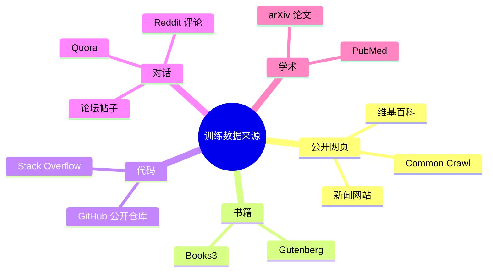

# 大模型训练（一）：数据——把整个互联网倒进锅里

> 训练数据就是模型的「食谱」。吃什么长什么——喂 Reddit 它会抬杠，喂论文它会学术腔。

## 数据从哪里来

GPT-4 的训练数据大约 13 万亿个词。13 万亿什么概念？一个人以每分钟 200 词的速度阅读，不眠不休，读完这些数据需要 12 万年。

这些数据来自：



其中最大头是 Common Crawl——一个每月爬取全网的公开数据集。但这些原始网页质量参差不齐，直接喂给模型等于让小孩在垃圾场里学语言。

## 核心比喻：做饭

把训练数据想象成做饭。

**你不可能把一整头活牛直接端上桌。** 你需要宰杀、去骨、切块、调味、烹饪。训练数据同理——从互联网爬下来的原始文本，要经过一套完整的处理流水线变成模型能「消化」的格式。

## 数据处理的四道工序

### 1. 去重：去掉重复的

互联网上大量内容是互相转载的。同一篇新闻可能出现在 500 个网站。如果不去重，模型会把这 500 份当成 500 个独立样本——它会对重复内容过于自信，对原创内容反而忽略。

```
原始网页 100TB → 去重后约 30TB（去掉 70%）
```

用 MinHash 这类算法找相似文章，保留质量最高的那一版。

### 2. 过滤：扔掉有毒的

这一步要扔掉：
- **色情暴力内容**——用分类器自动检测
- **垃圾内容**——只有广告和 SEO 关键字的页面
- **太短的句子**——「好的」「哈哈」「是的」对模型学习没帮助
- **机器生成的内容**——如果训练数据里有大量 AI 写的文本，模型会越训越蠢

### 3. 质量筛选：只留好食材

用一个小模型或规则系统给每篇文章打分：

```
高分 → 写作规范、信息密度高、逻辑清晰
低分 → 错别字多、结构松散、事实矛盾
```

GPT-4 的做法：先用规则过滤掉垃圾，再用分类器给剩余的打分，只保留高分的——质量比数量重要。

### 4. 配比：食谱要均衡

如果全部用英文网页训练，模型的中文能力会很差。全部用代码训练，它不会聊天。需要手动调比例：

```
典型配比（近似）：
├── 网页文本    ~60%
├── 书籍        ~15%
├── 代码        ~10%
├── 学术论文    ~5%
├── 对话        ~5%
└── 百科/其他   ~5%
```


## 分词器：把文本切成「词汇」

数据准备好了，但模型不能直接读文字——它只认识数字。分词器（Tokenizer）把文本转成数字序列。

```text
原始文本： "大模型是如何训练的"

分词结果： ["大", "模型", "是", "如何", "训练", "的"]
转成数字： [16880, 1408, 322, 1051, 10751, 1257]
```

这个数字序列就是模型真正的「食物」。每一行训练数据进来，都是被切成几千到几万个数字的序列。

常用的分词算法是 BPE（Byte Pair Encoding）——从字符开始，反复合并出现频率最高的相邻符号对。这样做的好处是常见词用一个数字表示（如 "the" = [1234]），罕见词拆成子词（如 "cromulent" → ["crom", "ulent"]）。

## 小结

| 步骤 | 做什么 | 比喻 |
|------|--------|------|
| 数据收集 | 爬取互联网 | 买菜 |
| 去重 | 去掉重复内容 | 挑出烂叶子 |
| 过滤 | 扔掉有毒低质 | 扔掉变质食材 |
| 质量筛选 | 保留高分文章 | 只留好部位 |
| 配比 | 按比例混合 | 配菜谱 |
| 分词 | 转成数字序列 | 切好下锅 |

数据准备好了，下一篇讲模型怎么从这些数据里「学」到语言规律——核心只有一件事：做几十亿道完形填空。

---

**下一篇：** [（二）预训练：做几十亿道完形填空](02-pretraining.md)
