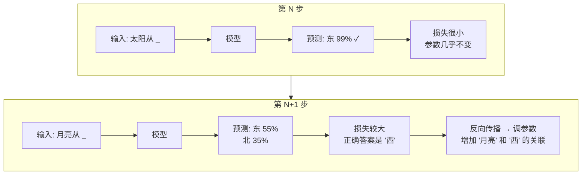
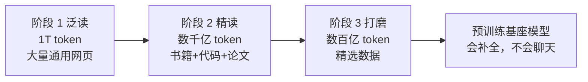

# 大模型训练（二）：预训练——做几十亿道完形填空

> 把整段文字挖掉一个词让模型猜。猜错了调参数。几十亿遍之后，模型学会了语言的统计规律。这就是预训练的全部秘密。

## 核心比喻：超级完形填空

把你上小学时做过的完形填空题乘以 10,000,000,000 倍，就是预训练。

```text
原文：  "太阳从 ＿ 边升起"
选项：  东 / 西 / 南 / 北

模型猜：东（概率 99.8%）

原文：  "伦敦是 ＿ 的首都"
选项：  英国 / 法国 / 德国 / 意大利

模型猜：英国（概率 97.3%）
```

模型不是被「教」了地理知识。它只是从几十亿段文字中统计出了「'伦敦是'后面跟'英国'的概率远高于其他词」。这种从数据中提炼统计规律的能力，是预训练的本质。

## 技术细节：它在猜什么

预训练用的是**因果语言建模**（Causal Language Modeling）——通俗讲就是「根据上文预测下一个词」：

```text
输入：  "法国的首都是"
模型预测  →  巴黎  (概率 99.2%)
           伦敦  (概率 0.01%)
           柏林  (概率 0.005%)
           ...

输入：  "法国的首都是巴黎。法国的首都是巴黎。德国的首都是"
模型预测  →  柏林  (概率大幅上升)
```

训练过程每步只做三件事：

```
1. 喂入一段文本（前端挖掉最后一个词）
2. 模型猜最后一个词的概率分布
3. 如果猜错了，反向调整参数让它下次猜得更准
```



## 三个阶段：从千亿到万亿的渐进式训练

预训练不是一次性把全部数据灌进去。实际训练分阶段，每个阶段用更高比例的高质量数据：

### 阶段一：大批量（batch size 大，学习率 中）

用 80% 的粗质量数据。这阶段像小孩「泛读」——大量接触各种语言现象，培养语感。模型学到的是最底层的统计规律：语法、拼写、基本常识。

```
数据量：~1 万亿 token
时间：几个星期（几百到几千张 GPU）
状态：模型开始能生成通顺的句子，但内容错误很多
```

### 阶段二：高质量（batch size 中，学习率 小）

用 15% 的高质量数据。这阶段像「精读」——学习逻辑推理、专业知识、代码能力。模型开始理解复杂关系和推理链。

```
数据量：~数千亿 token
时间：几天到几周
状态：模型不仅能说通顺，还能做出一定程度的推理
```

### 阶段三：精细（学习率 极小）

用最后的 5% 精心筛选的数据——教科书、论文、对话样例。这阶段温度更低，目标是把模型收束到安全有用的行为模式。

```
数据量：~数百亿 token
时间：几天
状态：模型的回答风格和安全性在这阶段被固化
```



## 需要多少算力

GPT-4 级别的模型，预训练需要：

- **几千张 H100 GPU**（每张约 3 万美元）
- **连续跑 3-6 个月**
- **电费约 1000 万美元**（以美国电价估算）
- **总成本：1-2 亿美元**（包括硬件折旧）

这个成本是预训练之所以叫「预训练」的原因——它太贵了，所以有人先训好一个「基座模型」，你用它的基础上做后续工作。绝大多数 AI 公司不会自己预训练——他们在开源基座模型（如 Llama、Qwen）上做微调。

## 预训练结束时的模型状态

预训练结束时，模型不是「聊天机器人」。它是一个**超级补全机**：

```text
用户：  "请帮我写一封请假邮件"

预训练模型（未经微调）:
"请帮我写一封请假邮件给人事部门。尊敬的领导：您好！我是市场部的张三..."
（它会继续补全你开始写的文本——因为它被训练成补全机，不是回答机）
```

它能补全得流畅自然，但它不会回答——它不知道「用户问了问题，我应该回应」。这个「对话能力」是下一篇微调要解决的问题。

## 小结

| 概念 | 一句话 |
|------|--------|
| 预训练做什么 | 几十亿道完形填空——挖掉最后一个词猜 |
| 怎么知道对错 | 对比正确答案，猜错就调参数 |
| 三阶段 | 泛读（大量）→ 精读（高质量）→ 打磨（安全） |
| 训练产物 | 基座模型——会补全，不会聊天 |
| 成本 | 1-2 亿美元，几千张 GPU 跑几个月 |

---

**上一篇：** [（一）数据：把整个互联网倒进锅里](01-data.md)
**下一篇：** [（三）微调：从接话机变成会聊天的人](03-finetuning.md)
