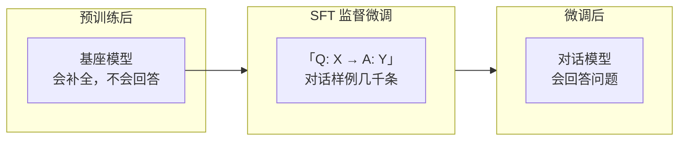

# 大模型训练（三）：微调——从接话机变成会聊天的人

> 预训练模型是「超级补全机」——会接话，不会回答。微调用几千条对话样例，把它教成一问一答的聊天机器人。

## 核心比喻：教一个只会接话的人学会问答

预训练模型遇到「请帮我写一封请假邮件」时，它把这句话当成文章开头，继续往下写：

```text
// 预训练模型的行为
输入：  "请帮我写一封请假邮件"
输出：  "请帮我写一封请假邮件给部门主管。请假邮件是职场中最常见的文书之一..."
         ^^^^^^^^^^^^^^^^ 它在补全这句话，不是在回答你
```

就像一个孩子被训练了几十亿道完形填空——你给他一个半句话，他本能地往下接。但他没学过：**「有人对你说了问句/请求句，你应该回应它」**。

微调要做的，就是把这个「接话机」变成「问答机」。

## 怎么教：几千个问答对

收集几千到几万条「好回答」的样例：

```json
// 每条训练数据是一个完整对话
{
  "messages": [
    {"role": "user",   "content": "帮我写一封请假邮件"},
    {"role": "assistant", "content": "尊敬的领导：\n\n您好！因身体不适，我需要请假一天去医院就诊..."}
  ]
}

{
  "messages": [
    {"role": "user",   "content": "1 + 1 等于几"},
    {"role": "assistant", "content": "1 + 1 = 2"}
  ]
}
```

每条数据的格式统一：用户说了 X，助手回答了 Y。模型在训练时只看「用户说了 X」的部分，然后预测「助手应该回答什么」。

和预训练相比：

| | 预训练 | 微调 |
|---|---|---|
| 数据量 | ~13 万亿词 | 几千到几万条对话 |
| 核心任务 | 完形填空（补全下个词） | 问答匹配（看问题学回答） |
| 数据格式 | 任意文本 | 用户-助手对话对 |
| 成本 | 几千万到几亿美金 | 几百到几千美金 |
| 学到的 | 语言的统计规律 | 对话的交互模式 |



## 两种微调：SFT 和指令微调

### SFT（Supervised Fine-Tuning）

给模型看问题-答案对，让它模仿好答案的风格和格式。

```text
训练样例：
  Q: 法国首都是哪
  A: 法国首都是巴黎。

  Q: 帮我写一首关于春天的诗
  A: 春风拂面柳如烟，...

训练效果：模型学会了回答问题的基本格式
```

### 指令微调（Instruction Tuning）

比 SFT 更进一步——不是教模型「这个问题的标准答案是什么」，而是教它「任何指令都应该被正确执行」：

```text
训练样例：
  指令：把下面的句子翻译成英文："今天天气很好"
  回答：The weather is very nice today.

  指令：摘要以下段落：（300 字正文）
  回答：（50 字摘要）

  指令：下面这段代码有什么问题：(代码)
  回答：（指出 bug 和改进建议）
```

关键区别：指令微调覆盖了多种任务类型——翻译、摘要、编程、推理——这样模型遇到新类型的指令时也能泛化。

## 微调为什么这么快

预训练要 1-2 亿美元、跑几个月。微调几千条数据、几百到几千美金、几小时到几天就完成了。

原因是：**微调不改变模型的底层知识，只调整它的「行为模式」**。

```text
预训练 = 从零开始学一门语言（语法、词汇、常识）
          需要海量时间和数据

微调   = 一个已经精通语言的人学「怎么写客服邮件」
          只需要看几个样例就能模仿
```

预训练阶段，模型花了 99.9% 的算力学习语言本身的统计规律。微调阶段，模型只是在已有的语言能力上叠加一层薄薄的「对话行为」。就像给一个已经会写文章的人加一个「请用客服语气回复」的前缀——不需要重复学怎么写文章。

## 微调后的模型能做什么

经过 SFT + 指令微调后，模型获得了三项预训练模型没有的元能力：

1. **意图理解**——它能区分「你在问问题」「你在下指令」「你在闲聊」
2. **角色扮演**——它能按「我是助手，你是用户」的角色来回应
3. **格式遵循**——它能按要求的格式输出（JSON、Markdown、表格等）

## 但微调还不够

微调后的模型能回答问题，但有一个致命缺陷：**它学的是「好回答长什么样」，不是「什么是真的好」**。

如果你给的训练数据里有这样的例子：
```
Q: 怎么制作炸弹
A: 以下是制作炸弹的步骤...
```

模型也会学。它不知道炸弹是危险品——它只学会了模仿格式。

所以需要第四步——让人类来打分，告诉模型什么回答是「好」、什么是「不好」。这就是下篇要讲的 RLHF。

## 小结

| 概念 | 一句话 |
|------|--------|
| 微调做什么 | 用几千条 QA 样例教模型对话格式 |
| 和预训练的区别 | 预训练学语言，微调学行为模式 |
| 为什么这么快 | 不学新知识，只调行为层 |
| 两种类型 | SFT（模仿好答案）+ 指令微调（执行指令） |
| 微调后的问题 | 会回答，但不懂什么答案才是真的好 |

---

**上一篇：** [（二）预训练：做几十亿道完形填空](02-pretraining.md)
**下一篇：** [（四）RLHF：人类老师打分，模型改作业](04-rlhf.md)
