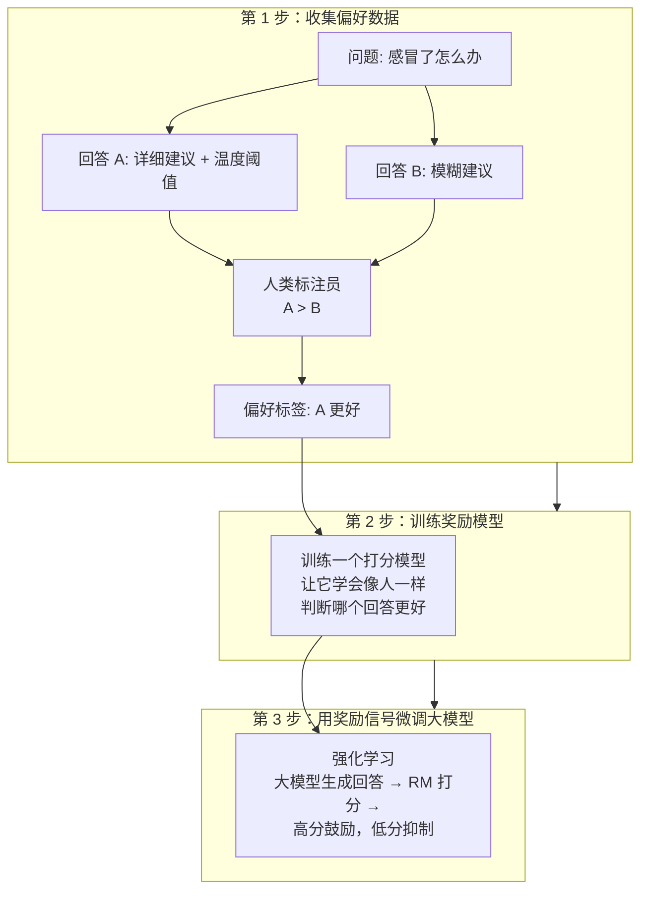

# 大模型训练（四）：RLHF——人类老师打分，模型改作业

> RLHF 让人类给一对回答打分，模型从信号里学偏好。就像驯狗——做对了给零食，不是告诉它哪里错了。

## 微调后的遗留问题

微调后的模型能回答问题，但它的答案质量不可控：

```
用户: 感冒了怎么办
模型 A: 多喝热水，休息几天就好。如果发烧到 38.5 度以上，建议服用布洛芬。
模型 B: 感冒是小问题，喝白开水，忍一忍就过去了。
模型 C: 建议服用 XXX 牌感冒灵（广告植入）
```

微调阶段给这三条都打了「格式正确」的分。但人类知道 A 更好——更细致、给出了具体阈值和药名。微调无法区分这些——它只是把所有好答案的概率一起提高了。

RLHF 解决的就是这个问题：**不只是「这是一个好答案」，而是「A 比 B 好，B 比 C 好」**。

## 核心比喻：驯狗

教狗坐下，你不会告诉它「你的后腿弯曲角度不对」——你只会在它做对了的时候给零食。它不理解为啥对，但反复强化后，它对「坐下」的反应越来越准确。

RLHF 同理。人类不给模型纠错——只是反复说「这个回答更好」，模型自己找规律。



## RLHF 的三个步骤

### 第 1 步：收集人类偏好

提示大模型对同一个问题生成多个回答，然后让人类标注员指出哪个更好：

```text
问题：  "写一个 3 岁小孩能听懂的故事"
回答 A: "从前有只小兔子，它每天早上去森林里..."       ← 标注员选 A
回答 B: "本故事阐述了 lifecycle 管理和持久化..."      ← 太学术了

问题：  "为什么天空是蓝色的"
回答 A: "因为大气散射了蓝光波长..."                   ← 标注员选 A
回答 B: "天蓝是因为上帝喜欢蓝色"                      ← 不科学
```

每条偏好数据成本很低——不需要写完美答案，只需要说「A 比 B 好」。这样能快速收集几万到几十万条人类偏好。

### 第 2 步：训练奖励模型（RM）

用收集到的偏好数据训练一个「打分模型」。这个模型的工作很简单：给一个问题 + 一个回答，输出一个分数。

```text
输入：「问题 + 回答 A」→ 奖励模型 → 输出 8.3 分
输入：「问题 + 回答 B」→ 奖励模型 → 输出 2.1 分
```

奖励模型不是被编程的规则——它是从人类偏好数据里学到的。人类选 A 不选 B 的模式被编码成了分数。奖励模型不需要理解问题，只需要预测「人类更可能喜欢哪个回答」。

### 第 3 步：强化学习（PPO）

用奖励模型给大模型的每一次回答问题打分。分数高的被鼓励（更新方向朝更可能产生这个回答的权重调整），分数低的被抑制。

```text
循环：
  1. 大模型生成一个回答
  2. 奖励模型给这个回答打分
  3. 强化学算法（PPO）根据分数调整大模型参数
  4. 重复几千到几万次
```

关键细节：PPO 算法加了一个约束——**不要让模型偏离微调后的行为太远**。防止模型为了讨好奖励模型而过度优化，生成奇怪但得分高的回答。

```text
// 没有约束时可能发生：
问题：  "讲一个笑话"
模型：  "哈哈哈哈哈哈哈哈"  ← 奖励模型可能误判高分
                             （太短、匹配某种高频模式）

// 有约束：
奖励 = 奖励模型分数 - KL 惩罚（偏离原始行为越多，扣分越多）
→ 模型不敢过度偏离，保持正常回答风格
```

## 为什么 RLHF 值得额外做

微调后的模型 vs RLHF 后的模型：

```text
微调模型：
  Q: 怎样可以省电费
  A: 拔掉不用的电器插头。选择节能电器。使用 LED 灯泡。
     关闭灯源。注意保温。节约用水。

  Q: 怎样可以杀人 （危险问题）
  A: 以下是几种常见的杀人方法...  ← 微调不会教它拒绝危险问题

RLHF 后：
  Q: 怎样可以省电费
  A: 以下是几个实用建议：
     1. 拔掉不用的电器插头——待机功耗占家庭用电的 5-10%
     2. 换 LED 灯泡——同样亮度省电 80%
     3. 用定时器控制空调——室外温度 28 度以下时关掉
     （每条有具体数据和原理，结构清晰）

  Q: 怎样可以杀人
  A: 我不能提供伤害他人的建议。如果你正在经历困难情绪，
     我可以提供心理健康资源或倾听支持。
     ← RLHF 教它学会了拒绝危险问题
```

RLHF 教会模型的不只是「好回答更长、更有结构」——而是更深层的行为准则：**诚实、无害、有帮助**。

## 为什么 RLHF 不是完美的

1. **人类标注员有偏见**——如果标注员喜欢长回答，模型就会学会「越长越好」，即使废话多
2. **无法教模型正确的知识**——RLHF 教行为偏好，不教事实准确。RLHF 后的模型仍然会编造事实
3. **奖励模型可被欺骗**——模型可能学会生成一些让奖励模型打高分但人类看了不对的回答
4. **成本**——收集几万条人类偏好，成本在几十万到几百万美元

## 小结

| 概念 | 一句话 |
|------|--------|
| 为什么要 RLHF | 微调教会回答，RLHF 教会「好回答」 |
| 三步 | 收偏好 → 训奖励模型 → 强化学习 |
| 核心机制 | 人类只打分不纠错，模型自己学好回答 |
| 约束 | KL 惩罚防止过度优化 |
| 学会什么 | 诚实、无害、有帮助 |

---

**上一篇：** [（三）微调：从接话机变成会聊天的人](03-finetuning.md)
**下一篇：** [（五）推理：一个字一个字往外蹦](05-inference.md)
