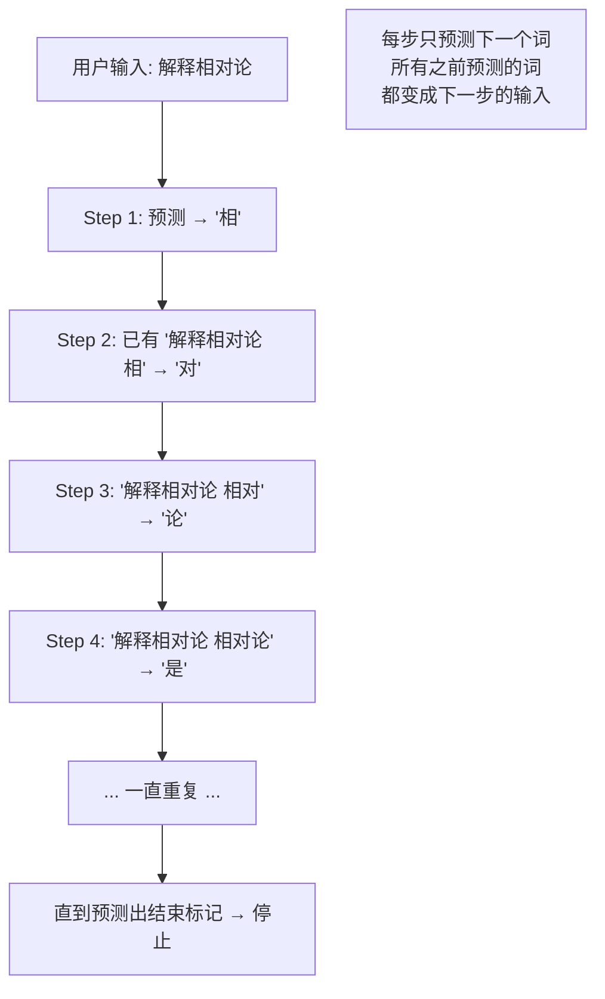

# 大模型训练（五）：推理——一个字一个字往外蹦

> 训练完了，推理时做的事情和预训练一模一样——一个字一个字预测。不同的是多了温度参数，让你可以调它的「敢不敢胡说」。

## 推理和训练用的是同一个算法

训练和推理的核心算法完全一样：

```text
// 训练的每一步：
输入「法国的首都是」→ 预测「巴黎」(0.992) → 对比正确答案 → 调参数

// 推理的每一步：
输入「法国的首都是」→ 预测「巴黎」(0.992) → 输出「巴黎」→ 继续
```

唯一的区别：训练时「猜错要改」，推理时「猜对就输出，继续猜下一个」。

## 自回归生成（Autoregressive Generation）

推理的正式名称叫自回归生成——输出一个词，立刻把它当成输入喂回去，再输出下一个。如此循环。



为什么叫「自回归」——因为自己的输出变成下一位的输入（回归到自己）。这是 LLM 推理最根本的特性——它没有一个隐藏的「思考」过程，就是循环调用同一个预测函数。

## 温度：控制「敢不敢胡说」

预测下一个词时，模型输出的不是单个选择，而是一个概率分布：

```text
输入: "太阳从  边升起"

模型原始输出（概率）:
  东: 99.8%
  西: 0.05%
  南: 0.03%
  北: 0.02%
  其他...: 0.1%
```

温度（temperature）调整这个概率分布的「锋利度」：

```text
温度 = 0（贪婪解码）:
  每次选概率最高的词 → 确定性输出 → 每次都一样
  适用：代码生成、翻译、数学

温度 = 0.7:
  降低概率差距 → 可能选第二、第三候选 → 输出略有变化
  适用：通用对话

温度 = 1.0:
  概率分布不变 → 输出多样性高
  适用：创意写作、头脑风暴

温度 = 2.0:
  概率分布拉平 → 所有选择几乎等概率 → 胡说八道
  适用：几乎无用
```

数学原理：`温度在 softmax 运算前被用作除数`——温度 > 1 让所有选项的分数更接近，低分选项有了被选中的机会。温度 < 1 拉大分数差距，高分选项压倒性胜出。

```text
温度 = 0:  "太阳从东边升起"           ← 永远是这个
温度 = 0.7: "太阳从东边升起" / "太阳从东边悄悄地升起来了"
温度 = 1.5: "太阳从东边升起，像一只巨大的橙色气球..."
                                       ← 加了诗意，但可能跑偏
```

## KV Cache：为什么不是每次都从头算

如果每一步都重新计算整个上下文，100个词的输出要跑 100 次完整推理，耗费巨大。KV Cache 优化了这个过程。

```text
// 没有 KV Cache
Step 1:  处理「解释相对论」                        → 预测「相」
Step 2:  重新处理「解释相对论 相」                  → 预测「对」
Step 3:  重新处理「解释相对论 相对」                → 预测「论」
// 每一步都从头算——前面的计算全部浪费

// 有 KV Cache
Step 1:  处理「解释相对论」→ 保存注意力矩阵 → 预测「相」
Step 2:  只处理新词「相」，复用前面保存的中间结果 → 预测「对」
Step 3:  只处理新词「对」，复用保存的结果         → 预测「论」
// 每步只算新词，速度从 O(n²) 降到 O(n)
```

KV Cache 让每一步推理只计算新增的一个词，时间复杂度从二次降到线性。这就是为什么即使上下文有几万个词，AI 也能几乎即时响应。

## 上下文窗口：模型的「瞬时记忆」

推理时模型只能看到当前窗口内的内容：

```text
上下文窗口 = 4096 tokens（大概 3000 字）
训练时没有超出这个窗口的数据 → 模型无法处理更长输入

上下文窗口 = 128K tokens（GPT-4 Turbo）
可以输入整本书，一次性理解完整内容
```

上下文窗口决定了模型能「记住多长」的对话。窗口外的内容，模型完全「忘了」。这也是为什么长对话越到后面模型表现越差——前面的对话细节被切掉了。

注意：这个「记忆」和模型的知识是两回事。知识来自训练时的参数，推理时的上下文是对话中的「临时工作记忆」。

## 停止条件

模型怎么知道该停了？训练数据里包含一个特殊的**结束标记**（EOS token）：

```text
Step 47: 输入「... 以上就是我对这个问题的回答。 」→ 预测 EOS
                                    ↑ 模型学会了在这个位置输出结束标记
```

或者达到最大长度限制时强制停止——防止模型无限生成。

## 为什么幻觉在推理时不可避免

现在你应该能理解为什么 LLM 会产生幻觉了：

1. **推理时模型的唯一目标是「让文本最像训练数据」**，不是「输出事实」
2. **每一步预测只看前面已经生成的文本**——如果前面有一处错误，后面的预测会基于错误继续发展
3. **模型没有查证机制**——它不能暂停推理去 Google 验证。它只能继续预测下一个合理的词

```text
用户: "独角兽最爱吃什么？"

模型不是先判断「独角兽不存在」，而是：
  在训练数据中找「独角兽爱吃」后面常见什么词
  → 「彩虹」在童话里经常和独角兽一起出现
  → 输出「独角兽最喜欢吃彩虹棉花糖」

一个完全流畅、语法完美、但事实为假的答案。
```

幻觉不是 bug——是自回归生成机制的必然产物。一个只关心「下一个词是否合理」的系统，不会有「真实性检查」模块。

## 小结

| 概念 | 一句话 |
|------|--------|
| 自回归 | 输出变输入，循环预测下一个词 |
| 温度 | 控制选词有多「大胆」，从死板到胡扯 |
| KV Cache | 只算新词不复算老问题，原理上从 O(n²) 降到 O(n) |
| 上下文窗口 | 模型的瞬时记忆 |
| 幻觉 | 自回归机制的必然产物——它追求文本合理，不追求事实准确 |

---

**上一篇：** [（四）RLHF：人类老师打分，模型改作业](04-rlhf.md)
