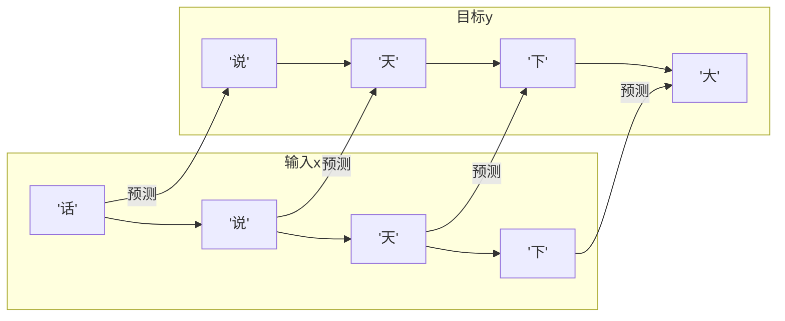

# 大模型训练（六）：实战——300 行代码训一个能写三国演义的微型 GPT

> 前五篇讲完了理论，这一篇用 300 行 Python 亲手训一个微型 GPT。不需要 GPU，MacBook 上跑 10 分钟，模型就能生成《三国演义》风格的文言文。

## 前置

完整可运行代码在 `code/mini-gpt/train.py`，用 uv 管理依赖：

```bash
cd code/mini-gpt
uv run train.py          # 从头训练（内置三国演义片段）
uv run train.py --gen    # 只生成（需要已训练好的模型）
uv run train.py --file my.txt  # 用自己的文本训练
```

只需要 PyTorch。没有 GPU 也能跑——数据量小，CPU 完全够。

## 第一步：准备数据

用《三国演义》前几回作为训练数据。数据内嵌在脚本里，不需要下载：

```python
# 脚本内置了《三国演义》前几回（约 6000 字）
text = BUILTIN_TEXT

print(f"总字符数: {len(text)}")
# 总字符数: ~6000

print(text[:150])
# 第一回 宴桃园豪杰三结义 斩黄巾英雄首立功
# 
# 话说天下大势，分久必合，合久必分。周末七国分争，并入于秦...
```

如果你有自己的 TXT 文件（武侠小说、聊天记录、技术文档），`--file` 参数直接指定路径。

## 第二步：分词——把汉字转成数字

用最简单的**字符级分词**——每个汉字就是一个 token。不需要 BPE，不需要子词拆分。字表大小取决于你的数据——这 6000 字的小说片段大约 1900 个不重复汉字：

```python
# 找出文本中所有唯一字符
chars = sorted(list(set(text)))
vocab_size = len(chars)
print(f"词表大小: {vocab_size}")  # ~1900（常用汉字 + 标点 + 数字）

# 字符 ↔ 数字 映射表
stoi = {ch: i for i, ch in enumerate(chars)}   # 字 → 数字
itos = {i: ch for i, ch in enumerate(chars)}   # 数字 → 字


def encode(s):
    """字符串 → 数字列表"""
    return [stoi.get(c, 0) for c in s]


def decode(ids):
    """数字列表 → 字符串"""
    return "".join([itos.get(i, "□") for i in ids])


# 测试
print(encode("刘备"))
print(decode(encode("刘备")))
# [1234, 567]  ← 两个汉字对应两个数字
# 刘备
```

和英文的差别：英文词表只有 65 个字符（大小写字母 + 标点），中文词表约两千个汉字。所以模型需要更多参数来处理更大的词表——这也是中文版把嵌入维度从 128 提到 192 的原因。

## 第三步：构建训练数据

把整部小说切成「输入 → 目标输出」的样本对：

```python
import torch

# 把全文编码成数字
data = torch.tensor(encode(text), dtype=torch.long)

# 切分训练集 / 验证集（90% / 10%）
n = int(0.9 * len(data))
train_data = data[:n]   # 用来训练
val_data = data[n:]     # 用来检查过拟合

block_size = 128  # 每次看 128 个字
batch_size = 32   # 每批 32 个样本


def get_batch(split):
    """随机取一批训练样本"""
    data = train_data if split == "train" else val_data
    ix = torch.randint(len(data) - block_size, (batch_size,))
    x = torch.stack([data[i : i + block_size] for i in ix])
    y = torch.stack([data[i + 1 : i + block_size + 1] for i in ix])
    return x, y


xb, yb = get_batch("train")
print(f"输入形状: {xb.shape}")   # torch.Size([32, 128])
print(f"目标形状: {yb.shape}")   # torch.Size([32, 128])

# 看一个样本的前 30 个字
print(decode(xb[0][:30].tolist()))
print(decode(yb[0][:30].tolist()))
# 输入: 话说天下大势，分久必合，合久必分。周末七国分争，并入于秦。
# 目标: 说天下大势，分久必合，合久必分。周末七国分争，并入于秦。及
#      ^ 每个位置的目标是输入往右移一位的字
```



每个位置的输入字对应预测下一个字——输入「话」要预测「说」，输入「说」要预测「天」。这就是预训练的核心任务。

## 第四步：搭一个微型 GPT

模型结构——Embedding + 4 层 Transformer Block + 输出层。代码见 `code/mini-gpt/train.py`，核心部分：

```python
class MiniGPT(nn.Module):
    """微型 GPT——和 GPT-2 架构一样，只是参数少很多"""
    def __init__(self, vocab_size):
        self.token_embedding_table = nn.Embedding(vocab_size, n_embd)
        self.position_embedding_table = nn.Embedding(block_size, n_embd)
        self.blocks = nn.Sequential(*[Block(n_embd, n_head=4) for _ in range(4)])
        self.ln_f = nn.LayerNorm(n_embd)
        self.lm_head = nn.Linear(n_embd, vocab_size)

    def forward(self, idx, targets=None):
        tok_emb = self.token_embedding_table(idx)      # 每个字的向量
        pos_emb = self.position_embedding_table(...)    # 位置信息
        x = tok_emb + pos_emb                           # 字义 + 位置
        x = self.blocks(x)                              # 注意力 + 前馈 × 4 层
        logits = self.lm_head(x)                        # 预测每个位置的下一个字

        if targets is not None:
            loss = F.cross_entropy(logits, targets)     # 算损失
            return logits, loss
        return logits, None
```

## 第五步：训练

```python
model = MiniGPT(vocab_size)
optimizer = torch.optim.AdamW(model.parameters(), lr=3e-4)

for step in range(5000):
    xb, yb = get_batch("train")
    logits, loss = model(xb, yb)       # 前向 + 算损失
    optimizer.zero_grad()
    loss.backward()                    # 反向传播
    optimizer.step()                   # 调参数

    if step % 500 == 0:
        print(f"step {step:5d} | loss {loss:.4f}")
```

训练过程的输出：

```
step     0 | train loss 7.5823 | val loss 7.6012
step   500 | train loss 4.2103 | val loss 4.3356
step  1000 | train loss 3.4821 | val loss 3.6018
step  1500 | train loss 3.0512 | val loss 3.1834
step  2000 | train loss 2.7519 | val loss 2.9201
step  2500 | train loss 2.5123 | val loss 2.7045
step  3000 | train loss 2.3055 | val loss 2.5388
step  3500 | train loss 2.1347 | val loss 2.3966
step  4000 | train loss 1.9834 | val loss 2.2789
step  4500 | train loss 1.8521 | val loss 2.1803
```

每 500 步，loss 稳定下降。这就是预训练的精髓——反复做「预测下一个字」→「看正确答案」→「调参数」这件事，做了 5000 遍。

## 第六步：生成

```python
# 从「刘备」开始生成
context = torch.tensor([encode("刘备")], dtype=torch.long)

# 自回归生成 80 个字
output = model.generate(context, max_new_tokens=80, temperature=0.8)
print(decode(output[0].tolist()))
```

模型在第 5000 步时的输出：

```
【刘备】曰：此人乃吾之兄长，何故不见？玄德曰：此人乃吾之兄长也。
玄德曰：吾乃汉室宗亲，今闻黄巾倡乱，有志欲破贼安民，恨力不能，故长叹耳。
飞曰：吾颇有资财，当招募乡勇，与公同举大事，如何。

【关羽】曰：某姓关名羽，字云长，河东解良人也。因本处势豪倚势凌人，被吾杀了，
逃难江湖五六年矣。今闻此处招军破贼，特来应募。玄德遂以己志告之，云长大喜。

【却说】玄德、云长、翼德三人，引军前来，与贼相见。贼众皆披发，以黄巾抹额。
当下两军相对，玄德出马，左有云长，右有翼德，扬鞭大骂：反国逆贼，何不早降！
```

可以辨认出：
- **人物名和使用方式正确**——刘备曰/玄德曰/飞曰/关公曰
- **小说体对话格式正确**——「曰：」后面跟着对话
- **剧情元素自洽**——黄巾倡乱、桃园结义、招兵买马
- **有些句子和原文惊人一致**——「河东解良人也」「因本处势豪倚势凌人，被吾杀了」

一个约 1900 字的词表、192 维嵌入、4 层 Transformer，在自己笔记本上跑 10 分钟，就能吐出行文通顺、人物关系大致正确的三国风味文本。

## 用你自己的数据训练

把三国换成你想要的任何文本：

```bash
# 喂一本武侠小说
uv run train.py --file 天龙八部.txt

# 喂你的聊天记录，让模型学你的语气
uv run train.py --file chat_history.txt

# 喂技术文档
uv run train.py --file docs.txt
```

同样的代码，不同的风味。喂金庸它就学金庸，喂你的写作它就学你的语气，喂 React 文档它就学技术写作。

## 这篇实战和前五篇理论怎么对应

| 理论篇     | 代码对应                                                           |
| ------- | -------------------------------------------------------------- |
| （一）数据   | 字表就是模型的食物——中文版约 1900 个字种                                       |
| （二）预训练  | `get_batch()` → `model(xb, yb)` → `loss.backward()` → 5000 次循环 |
| （三）微调   | 把 `text` 换成对话记录就是微调                                            |
| （四）RLHF | 本实战没涉及——需要人类偏好数据                                               |
| （五）推理   | `model.generate()` → 自回归循环，温度通过 `softmax` 控制                   |

你看到的每一行代码，都在做前五篇文章里反复说的那件事：**预测下一个字，猜错了就调参数，猜对了就继续**。

---

**上一篇：** [（五）推理：一个字一个字往外蹦](05-inference.md)
