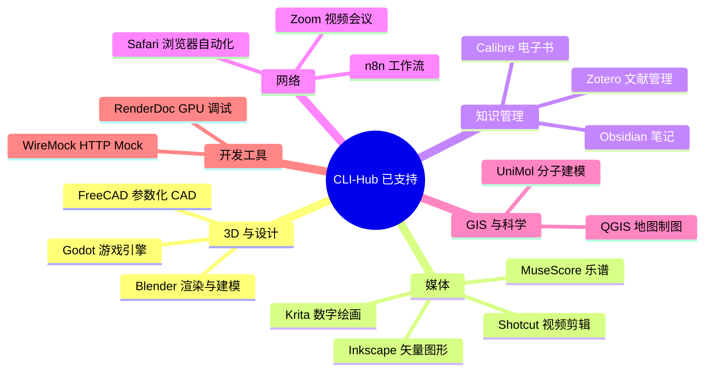

# CLI-Anything：让任何软件都能被 AI Agent 操控

想象一个场景：你的 AI 编程助手想帮你剪一段视频。问题是——Premiere Pro 没有 API，DaVinci Resolve 只认 GUI 操作。Agent 能看到代码库，但看不到软件界面。这就是 CLI-Anything 要解决的问题。

**CLI-Anything 给任何软件生成一个命令行接口**。Blender 有了 CLI 就能被 Agent 调用渲染，Obsidian 有了 CLI 就能被 Agent 搜索笔记，Zoom 有了 CLI 就能被 Agent 下载录像。本质上就是把 GUI 软件变成程序可调用的服务。

核心哲学一句话：**CLI 是人类和 AI Agent 之间的通用接口**——结构化、可组合、`--help` 自说明、JSON 输出可解析。

## 两条路径

CLI-Anything 提供了两条互不依赖的使用路线：

| 想做什么 | 怎么做 |
|----------|--------|
| 直接用现成的 | `pip install cli-anything-hub` → `cli-hub install blender` |
| 给新软件写 CLI | 安装插件 → 7 阶段自动生成管线 |

### 路径一：CLI-Hub

社区已经给 18+ 款软件写好了 CLI 包装，注册在 [CLI-Hub](https://hkuds.github.io/CLI-Anything/) 上：

```bash
pip install cli-anything-hub

cli-hub search blender      # 搜索
cli-hub install blender     # 安装
cli-hub list                # 查看已安装
cli-hub update blender      # 升级
cli-hub uninstall blender   # 卸载
```

目前已支持的软件覆盖了相当广的领域：



### 路径二：7 阶段自动生成管线

如果要给一个新软件写 CLI 包装，安装 CLI-Anything 插件后，Agent 会走一条完整的自动化管线：

1. 理解软件的功能和 API
2. 设计命令结构
3. 生成 Click CLI 代码
4. 编写 SKILL.md 让 Agent 能发现这个 CLI
5. 写测试（单元 + E2E）
6. 生成文档
7. 发布到 CLI-Hub

全程 Agent 驱动。人只需要审核和确认。

## 为什么 Agent 需要 CLI

Claude Code 每天通过 CLI 执行成千上万个工作流——`git`、`npm`、`curl`、`python`。这些工具的一个共同点是：**它们都有 CLI**。

Agent 处理 CLI 输出的能力是确定的——结构化文本、JSON、退出码。但 Agent 无法理解 GUI 界面的像素布局。CLI-Anything 做的事就是把 GUI 软件也变成这种可被 Agent 消费的格式。

每条 CLI 都强制输出两种格式：

```bash
# 人类可读
blender render --file scene.blend --output render.png

# Agent 可解析
blender render --file scene.blend --output render.png --format json
# {"status": "success", "output": "render.png", "time": 12.3}
```

`--help` 是另一个 Agent 视角的关键设计。Agent 不需要事先知道所有命令——它可以先 `blender --help` 自己发现有哪些子命令和参数。这种自描述性让 Agent 在面对新工具时不再抓瞎。

## 不只是生成——社区持续维护

CLI-Anything 不是一次性代码生成工具。每条 CLI 都有完整的测试覆盖（项目总共 2,269+ 测试），社区贡献者持续维护，CLI-Hub 有版本管理和升级机制。

最近一个月合并的更新包括：Rekordbox DJ 软件、3MF 3D 打印格式、MiniMax AI API、UEAtelier Unreal 编辑器扩展、Obsidian 搜索修复、Zoom 录像下载等。新软件的 CLI 每天都在加。

## 和同类项目的差异

| | CLI-Anything | gstack | Spec-Kit |
|------|------|------|------|
| 解决的问题 | Agent 操控 GUI 软件 | Agent 编程工作流 | 规范生成代码 |
| 使用方式 | CLI-Hub 安装 | Claude Code skills | Claude Code 命令 |
| 输出 | CLI 可执行命令 | 审查/测试/发布 | 规范文档 + 代码 |
| 面向对象 | 任何软件 | 开发者工作 | 项目开发 |

gstack 和 Spec-Kit 服务的是开发流程本身。CLI-Anything 服务的是 Agent 和外部软件的交互——让 Agent 能调用 Blender 渲染 3D 模型，能操作 Obsidian 管理笔记，能控制 Safari 浏览网页。

这是 Agent 时代的接口层问题，CLI-Anything 给出了一套可复用的答案。

> 仓库：[https://github.com/HKUDS/CLI-Anything](https://github.com/HKUDS/CLI-Anything)
> CLI-Hub：[https://hkuds.github.io/CLI-Anything/](https://hkuds.github.io/CLI-Anything/)
