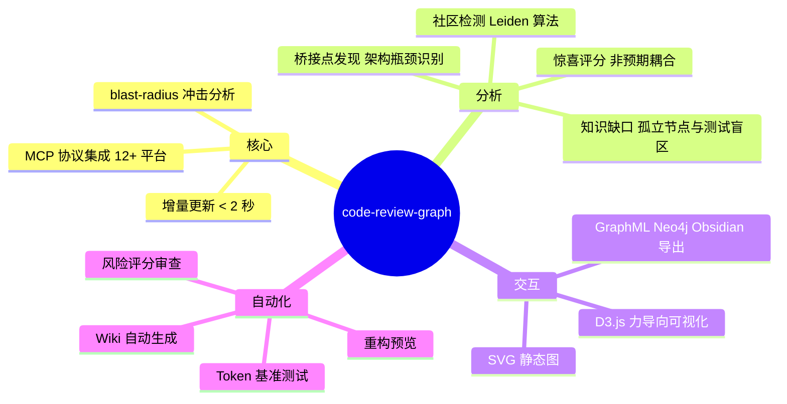

# code-review-graph：AI 代码审查不应该重读整个仓库

AI 编程助手每次审查 PR 时，默认行为是「把整个代码库读一遍」。一个 Next.js monorepo 有 27,732 个文件，但一次 PR 改动真正相关的可能只有 ~15 个。剩下 27,717 个文件的读取全是浪费。

`code-review-graph` 用 Tree-sitter 把代码库解析成一张图，变更发生时追踪影响面，只把真正相关的文件喂给 AI。基准测试：**平均 8.2 倍 token 减少，100% 召回率。**

## 三步安装

```bash
pip install code-review-graph
code-review-graph install        # 自动检测 AI 工具并配置 MCP
code-review-graph build          # 解析代码库
```

`install` 命令自动检测你机器上的 AI 工具——Claude Code、Cursor、Codex、Copilot、Gemini CLI、Zed 等 12+ 平台——为每个工具写入正确的 MCP 配置。

之后在 AI 助手中说一句就能触发：

```
Build the code review graph for this project
```

## Blast-radius 是核心

当你改了 `login()` 函数，什么受影响？直接看可能改了几个文件，但间接影响是：

- 所有调用了 `login()` 的地方
- 所有依赖 `login()` 返回值的下游函数
- 所有测试里 mock 了 `login()` 的用例
- 所有继承了这个类的子类

这就是 blast-radius（冲击半径）。`code-review-graph` 在图上走边，自动追踪调用者、被调用者、依赖方、测试覆盖，把最小审查集算出来。AI 只读这些文件，其余的全部跳过。

基准数据验证了精度：

| 项目 | Token 减少 | 召回率 |
|------|:---:|:---:|
| fastapi | 8.1x | 100% |
| flask | 9.1x | 100% |
| gin | 16.4x | 100% |
| httpx | 6.9x | 100% |
| nextjs | 8.0x | 100% |

**召回率 100%**——blast-radius 从不漏掉真正受影响的文件。精确率 0.38 意味着有误报（保守策略多标了一些文件），但「漏掉一个依赖变更」的成本远大于「多读了几个文件」。这个设计和安全审计一样——宁可过度报告不可遗漏。

## 增量更新：< 2 秒

建图很快（500 文件 ~10 秒），但真正重要的设计是增量机制。每次 git commit 或文件保存：

```
git commit → hook 触发 → SHA-256 diff 变更文件 → 找依赖 → 只重解析变化的部分
```

一个 2,900 文件的仓库重新索引只要不到 2 秒，因为绝大多数文件 SHA-256 没变，直接跳过。这和增量编译是一个原理——只重编改过的 translation unit。

## 不只是代码审查

图上能做的事远不止 blast-radius：



**社区检测**把代码库拆成逻辑模块，**桥接点发现**标记架构瓶颈，**惊喜评分**找出跨模块的非预期耦合。这些都是人工 code review 容易漏掉的结构性问题。

## 和 CodeGraph 的区别

两个项目都用 Tree-sitter + MCP，都做代码图谱。核心差异在定位：

| | code-review-graph | CodeGraph |
|------|------|------|
| 主要场景 | PR 审查 | 代码库探索 |
| 安装 | pip install | npx / npm |
| 语言 | Python | Node.js |
| 核心指标 | Blast-radius 精度 | 探索效率提升 |
| 社区分析 | 社区检测 + 桥接 | 无 |
| 可视化 | D3.js 交互图 | 无 |
| 导出 | Neo4j/GraphML/Obsidian | 无 |

CodeGraph 更好用于日常开发中的探索和搜索。code-review-graph 更好用于 PR 审查时的精准影响分析。两个可以共存——CodeGraph 做日常探索，code-review-graph 做代码审查。

> 仓库：[https://github.com/tirth8205/code-review-graph](https://github.com/tirth8205/code-review-graph)
