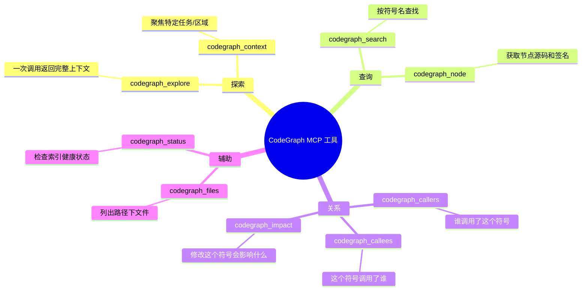

# CodeGraph：让 AI 编程助手不再 grep 全仓

AI 编程助手探索代码库的方式很原始：grep 搜字符串、glob 找文件、Read 打开看。每次工具调用都在消耗 token，大项目里可能 50 次调用才找到关键代码。

CodeGraph 把这个问题翻了个面：用 tree-sitter 把代码库预先解析成一张图——符号、调用关系、路由映射全在里面。AI 助手不再是 grep 盲搜，而是在图上精确遍历。

效果数据：6 个真实项目的基准测试，平均 **92% 更少工具调用，71% 更快**。一个 Java 项目只用 1 次 `codegraph_explore` 调用就回答了原本需要 26 次 grep/find/Read 的问题。

## 它做了什么

Claude Code 探索代码库时，Explore 代理的工作流是这样：

```
grep 搜关键词 → grep 搜另一个 → find 找文件 → Read 打开看 → grep 再搜 → ...
```

每一次操作都是一次 MCP 工具调用，每一次调用都消耗上下文窗口。大型项目里代理可能在发现阶段就耗掉一大半 token，真正分析代码的 token 反而不多。

CodeGraph 换成：

```
codegraph_explore "这个问题的上下文" → 一次返回所有相关源码
```

tree-sitter 做 AST 解析，SQLite FTS5 做全文索引，文件监听器（FSEvents/inotify）保持索引实时更新。查询时在图上游走——顺着调用边找到 caller/callee，沿着 import 边找到依赖。

## 安装

```bash
npx @colbymchenry/codegraph
```

交互式安装程序会自动检测你机器上的 AI 工具（Claude Code、Cursor、Codex、OpenCode），配置 MCP 服务器。30 秒搞定。

进项目目录初始化索引：

```bash
cd your-project
codegraph init -i
```

索引时间取决于项目大小。VS Code 的 4002 个 TypeScript 文件约 4 分钟。之后文件监听器会保持增量更新，改了代码索引自动跟上。

## 九个 MCP 工具

初始化后，AI 助手就多了这些工具：



`codegraph_explore` 是最重的工具——一次返回入口点、相关符号和源码片段。适合复杂问题，但 token 消耗大。`codegraph_context` 更轻量，适合聚焦查询。

几个使用原则：

- 查符号名用 `codegraph_search`，不要 grep
- 查调用关系用 `codegraph_callers/callees`，不要在文件里人肉翻
- 改代码前用 `codegraph_impact` 看影响面
- 探索陌生模块用 `codegraph_explore`，处理大型结果时考虑用子代理

## 实际效果

Swift 网络库 Alamofire 的基准测试很有说服力。问题是：「从 `Session.request()` 到 `URLSession.dataTask()`，请求是怎么流下去的？」

**不用 CodeGraph**：32 次工具调用，1 分 39 秒。代理先 grep 找 `Session`，再 grep 找 `request`，翻十几个文件，最后才拼出调用链。

**用 CodeGraph**：3 次工具调用，22 秒。`codegraph_explore` 在图上游走，深度 3 的遍历一口咬住了完整的 9 步调用链——从 `Session.request()` 一路到 `URLSession.dataTask()`。

最大的测试是 Swift 编译器——25874 个文件、272898 个节点。CodeGraph 用了不到 4 分钟建索引，之后代理用 6 次 explore、35 秒、零文件读取回答了一个跨模块的诊断问题。

## 100% 本地

数据不出机器。没有 API key，没有外部服务，就是一个 SQLite 数据库。tree-sitter 的解析结果、符号关系、源码片段全存本地。隐私敏感的项目直接用。

> 仓库：[https://github.com/colbymchenry/codegraph](https://github.com/colbymchenry/codegraph)
