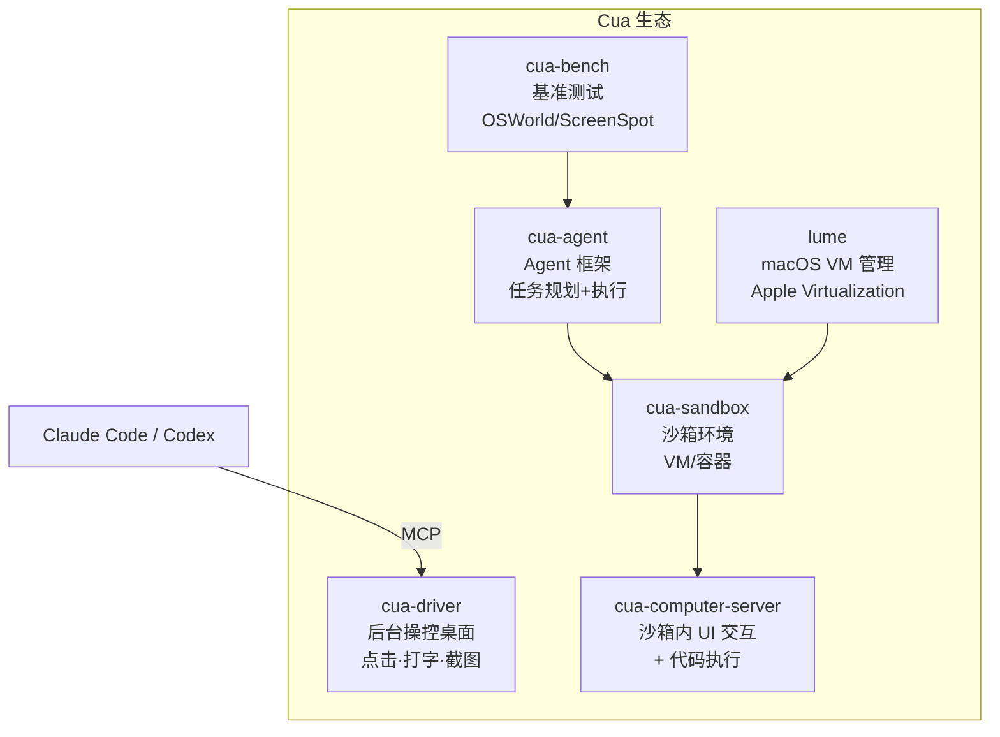

# Cua：给 AI Agent 装上一双能操作电脑的手

> 你让 Claude Code 修一个前端 bug。它能读代码、改代码——但没法打开浏览器看看修好了没。Cua 做的事情就是：给 Agent 一个真实的桌面环境，让它能点击、打字、截图验证——AI 不只是写代码，而是真正「用电脑」。

## 是什么

[Cua](https://github.com/trycua/cua)（Computer-Use Agent）是一套开源基础设施，用于构建能操控真实桌面的 AI Agent。GitHub 12,500+ stars。

```text
传统 AI Agent = 读文件 + 写文件 + 跑命令
Cua 加持的 Agent = 上面的 + 打开 App + 点击按钮 + 输入文字 + 截图验证
```

核心定位：

- **不是又一个 coding agent**——它是给 Claude Code、Codex 等 Agent 装上「手」和「眼睛」
- **后台运行**——Agent 操控桌面不抢光标，不影响你正常用电脑
- **跨平台**——macOS、Windows、Linux 同一套 API
- **MCP 协议**——直接接入 Claude Code、Cursor、Codex 等

## 六大组件



### cua-driver——后台操控桌面

最核心的组件。Agent 可以：

```bash
# 安装
/bin/bash -c "$(curl -fsSL https://raw.githubusercontent.com/trycua/cua/main/libs/cua-driver/scripts/install.sh)"

# 接入 Claude Code 作为 MCP Server
claude mcp add --transport stdio cua-driver -- cua-driver mcp
```

接入后，Claude Code 获得的能力：

- **截图**——看到桌面现在长什么样
- **点击**——`orca click --element @e3` 风格的元素定位
- **输入文字**——模拟键盘输入
- **滚动**——翻页
- **打开应用**——启动任意 App
- **全后台**——不抢光标，你继续工作

### cua-sandbox——Agent 就绪的沙箱

```python
from cua import Sandbox, Image

# 创建一个 Linux 桌面沙箱
sandbox = Sandbox(image=Image.UBUNTU_DESKTOP)

# Agent 在沙箱里操作——打开浏览器、访问网页、截图
screenshot = sandbox.screenshot()
result = sandbox.click(x=100, y=200)
```

支持 macOS、Linux、Windows 三种系统镜像，云端或本地运行。

### cua-agent——Agent 框架

```bash
pip install "cua-agent[all]"
```

任务规划 + 执行的完整 Agent 框架，内置 liteLLM 集成，支持 OpenAI、Anthropic、Groq、DeepSeek、Ollama 等。

### cua-bench——基准测试

评估 Computer-Use Agent 的标准基准：

- **OSWorld**——真实操作系统的任务（打开文件、安装软件、配置网络）
- **ScreenSpot**——UI 元素定位准确度
- **Windows Arena**——Windows 专属任务

### lume——macOS 虚拟化

基于 Apple Virtualization.framework 的 macOS VM 管理，在 Apple Silicon 上原生运行 macOS 虚拟机。

## 和 Orca Design Mode 的区别

| | Cua | Orca Design Mode |
|---|---|---|
| 范围 | **整个桌面**——任何 App | 浏览器窗口——Web 页面 |
| 操控方式 | 后台 Agent 自动化 | 你手动点击 → 截图发给 Agent |
| 沙箱 | ✅ 完整 VM/容器隔离 | ❌ |
| 适用场景 | 端到端自动化测试、Agent 训练 | 前端 UI 调试 |
| 安装 | pip + 安装脚本 | Orca 桌面应用内建 |

Cua 是「让 Agent 自己操控电脑」，Orca Design Mode 是「你点 UI，Agent 帮你改代码」——方向不同，但可以互补。

## 怎么用

### 场景 1：让 Claude Code 操纵桌面

```bash
# 1. 安装 driver
/bin/bash -c "$(curl -fsSL https://raw.githubusercontent.com/trycua/cua/main/libs/cua-driver/scripts/install.sh)"

# 2. 接入 Claude Code
claude mcp add --transport stdio cua-driver -- cua-driver mcp

# 3. 告诉 Claude Code
claude "打开 Safari，访问 localhost:3000，检查首页渲染是否正常，截图发给我"
```

Claude 会真的打开 Safari、输入网址、截图——不需要你手动操作。

### 场景 2：在沙箱里训练 GUI Agent

```python
from cua import Sandbox, Image

sandbox = Sandbox(image=Image.UBUNTU_DESKTOP)

# Agent 的任务：在桌面沙箱里完成「打开 Firefox → 搜索天气 → 截图」
task = "Open Firefox, search for weather in Beijing, take a screenshot"

# Agent 自己一步步操作
sandbox.launch_app("Firefox")
sandbox.click(x=500, y=100)  # 点击地址栏
sandbox.type_text("weather Beijing")
sandbox.press_key("Enter")
result = sandbox.screenshot()
```

### 场景 3：跑基准测试

```bash
pip install "cua-bench[all]"
python -m cua_bench.run --benchmark osworld --model claude-sonnet-4-6
```

## 适用场景

**适合用 Cua**：

- Agent 需要跨多个桌面 App 执行任务
- 端到端 GUI 自动化测试——不只是测 API，是测完整的用户操作流
- 训练 Computer-Use Agent——沙箱环境 + 基准测试
- 给 coding agent 加上「预览并验证前端修改」的能力

**不需要 Cua**：

- 只需要操控浏览器的 Web 页面——Orca Design Mode 或 Playwright 更轻
- 纯后端开发——你的 Agent 不需要 GUI

## 小结

Cua 解决的是 AI Agent 的「最后一公里」——Agent 能写代码，但写完代码之后的事情（打开浏览器验证、发 Slack 通知、操作 Excel 导出报表）一直要靠人来做。Cua 让 Agent 能自己完成这些。

核心能力三个词：**看桌面**（截图）、**操作桌面**（点击、打字）、**跑在沙箱里**（安全隔离）。

---

**相关阅读：**
- [Orca：为并行 AI Agent 设计的下一代 IDE](orca-guide.md)
- [Claude Code 完全指南](../claude-code/index.md)
