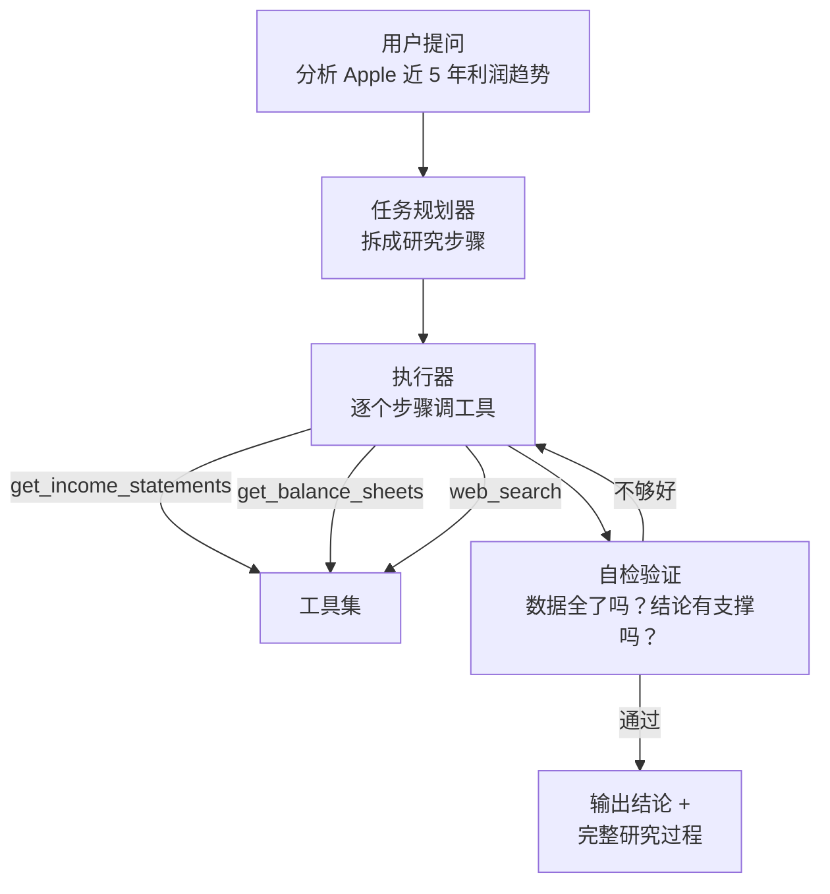

# Dexter：像 Claude Code 一样做金融研究的 AI Agent

> 你问它「分析一下 Apple 的利润趋势」，它不只是调用一个 API 返回数据——它先规划研究步骤，然后逐个执行，完成一步检查一步，直到得出有数据支撑的结论。而且它会把每一步都记下来，方便你回查。

## 是什么

[Dexter](https://github.com/virattt/dexter) 是一个自治的金融研究 Agent。它的设计哲学直接对标 Claude Code——**不是聊天机器人，是能自主规划和执行的 Agent**。

```text
Claude Code = 读代码 → 规划任务 → 执行 → 验证 → 迭代
Dexter      = 读问题 → 规划研究 → 调数据 → 自检 → 迭代
```

核心能力：

- **任务规划**：把「分析 Apple 利润趋势」拆成 5 个具体步骤，不是直接调一个 API
- **自治执行**：自动选择正确的工具拉数据，不需要你告诉它每一步怎么做
- **自检验证**：做完一步检查一步——数据全了吗？逻辑对吗？需要补充什么？
- **实时金融数据**：利润表、资产负债表、现金流量表，通过 financialdatasets.ai 获取
- **安全护栏**：内建循环检测和步数上限，防止 Agent 陷入死循环

## 架构



和 ChatGPT 的关键区别：ChatGPT 你问一句它答一句，答案对不对你不知道它怎么得出来的。Dexter 把研究过程摊开了——每一步用了什么工具、拿到了什么数据、怎么从数据推到结论，全部可追溯。

## 怎么跑

技术栈很简单——Bun（JavaScript 运行时，类比 Node.js 但更快）+ OpenAI API：

```bash
git clone https://github.com/virattt/dexter.git
cd dexter
bun install

# 配置 API key
cp env.example .env
# 编辑 .env：OPENAI_API_KEY + FINANCIAL_DATASETS_API_KEY

bun start
```

支持多模型切换——OpenAI、Anthropic、Google、xAI、OpenRouter，甚至本地的 Ollama。哪个便宜/快用哪个。

## 怎么验证自己做得对不对

Dexter 内置了一套评估系统——用 LLM-as-judge 方法给自己的答案打分：

```bash
# 对所有测试题跑评估
bun run src/evals/run.ts

# 随机抽 10 题跑
bun run src/evals/run.ts --sample 10
```

评估流程：预设一组标准金融问题（有参考答案）→ Dexter 跑一遍 → 另一个 LLM 当裁判，逐题打分。跑完出实时统计。

这不是「我觉得它挺准的」——是**可量化**的。每次改提示词或加工具后重跑一遍，看准确率是升是降。

## 每一步都记下来

Dexter 把每次研究的每一步都存成 JSONL 日志：

```text
.dexter/scratchpad/
├── 2026-01-30-111400_9a8f10723f79.jsonl   ← 分析 Apple 利润
├── 2026-01-30-143022_a1b2c3d4e5f6.jsonl   ← 对比 MSFT vs GOOGL
```

每条日志记录：

```json
// 原始问题
{"type": "init", "query": "分析 Apple 最近 5 年的毛利率趋势"}

// 思考过程
{"type": "thinking", "content": "需要先拉利润表...毛利 = 收入 - 成本..."}

// 工具调用
{"type": "tool_result",
 "toolName": "get_income_statements",
 "args": {"ticker": "AAPL", "period": "annual", "limit": 5},
 "llmSummary": "获取了 5 年 Apple 利润表，收入从 274B 到 394B"}
```

这意味着什么：你可以**回查 Agent 的每一步推理过程**——它不是黑箱。它从哪调了什么数据、怎么解读的、得出什么结论——全部可审计。这和 gstack 的 compound engineering 哲学一致：每一次产出都留下可复用的记录。

## WhatsApp 集成

Dexter 还支持 WhatsApp 网关——绑定了手机号后，在 WhatsApp 里给自己发消息就能触发研究：

```bash
bun run gateway:login   # 扫码绑定 WhatsApp
bun run gateway         # 启动网关
```

然后给自己发「帮我分析一下 TSLA 最近一季的利润率变化」，Dexter 在后台跑完研究，把结论发回来。

## 限制

1. **数据源依赖**——用的是 financialdatasets.ai，覆盖面有限。没有万得、彭博级别的专业终端数据
2. **不能下单**——纯研究工具，不接交易接口。这其实是对的——研究和执行不应该混
3. **模型成本**——每次研究要跑多轮 LLM 调用，token 消耗不小
4. **没有多 Agent 协作**——和 Anthropic Financial Services 那套多 Agent 体系相比，Dexter 是单 Agent 架构

## 和 Anthropic Financial Services 对比

| | Dexter | Anthropic Financial Services |
|---|---|---|
| 定位 | 个人 AI 研究助手 | 机构级 Agent 工具包 |
| 架构 | 单 Agent（Bun/TS） | 多 Agent 插件系统（Markdown） |
| 数据 | financialdatasets.ai | FactSet/CapIQ/Bloomberg 等 11 个 |
| 部署 | 本地命令行 | Cowork / Managed Agents API |
| 适用 | 个人学习、快速研究 | 投行/PE/研究部门的专业工作流 |
| 许可 | MIT | Apache 2.0 |

两个项目代表了 AI + 金融的两条路：Dexter 是「一个人 + AI 做研究」，Anthropic FS 是「一个机构用 AI 管工作流」。

## 小结

Dexter 的价值不在它多强大——它的代码量不大，数据源也不多。价值在于**它的设计思路是对的**：

1. **自治而非对话**——不是聊天机器人，是自己规划、执行、验证的 Agent
2. **可追溯**——每一步推理和工具调用都记下来，不是黑箱
3. **可评估**——内建 eval 系统，每次改动后量化验证效果
4. **接地气**——只用 OpenAI API + 免费金融数据源，个人开发者跑得起来

如果你在琢磨「怎么让 AI 帮自己做金融研究」，Dexter 的架构比任何论文都更好懂——因为它是跑得起来的代码。
