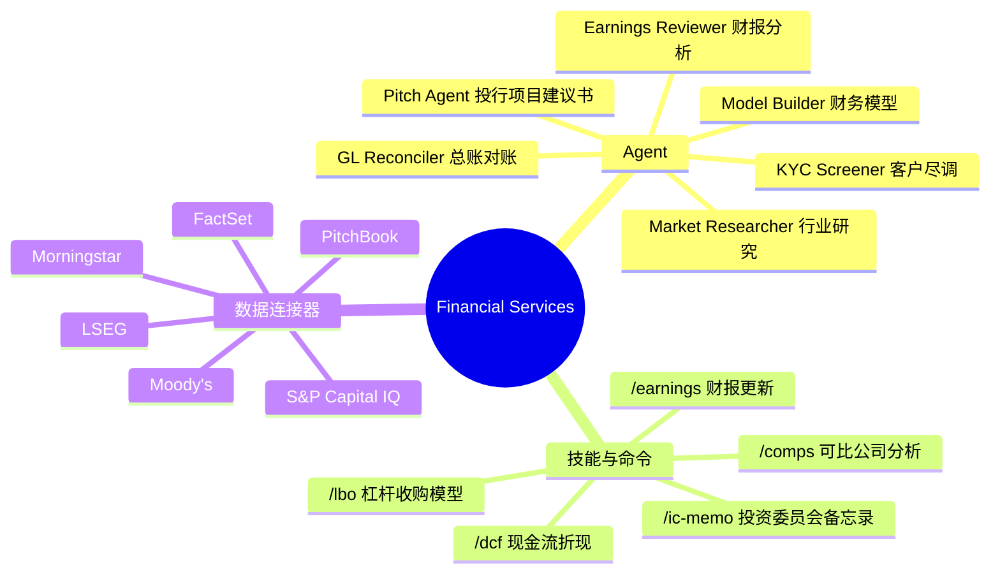

# Anthropic Financial Services：Claude 的金融行业 Agent 工具包

> 为什么每个金融团队都在造自己的 AI 工具？Anthropic 开源的这套金融 Agent 和技能包，把投行、研究、PE、财富管理的工作流做成了即装即用的插件。

## 这是什么东西

[anthropics/financial-services](https://github.com/anthropics/financial-services) 是 Anthropic 官方开源的金融行业 AI 工具包。一句话概括：**把投行分析师、研究员、PE 投资经理的日常工作流变成了 Claude 的 Agent 和技能**。

不是「AI 帮你写邮件」级别的泛用工具——是「AI 跑完整套可比公司分析、填模型、出 PPT、写 IC memo」的专业工作流。

核心能力分三块：



## 十个即装即用的 Agent

每个 Agent 是自包含的——装了就包含它需要的所有技能。不需要先装基础设施。

| Agent | 场景 | 一句话 |
|-------|------|--------|
| **Pitch Agent** | 投行承揽 | 可比公司 + 先例交易 + LBO → 出整套 pitch deck |
| **Meeting Prep Agent** | 客户会议 | 每次客户会前自动生成准备材料包 |
| **Market Researcher** | 行业研究 | 给定赛道 → 行业全景 + 竞争格局 + 对标 + 标的清单 |
| **Earnings Reviewer** | 财报分析 | 听财报电话会 + 读公告 → 更新财务模型 → 出点评笔记 |
| **Model Builder** | 财务建模 | DCF、LBO、三表联动，直接在 Excel 里操作 |
| **Valuation Reviewer** | PE 估值 | 接收 GP 报送材料 → 跑估值模板 → 出 LP 报告 |
| **GL Reconciler** | 基金运营 | 找总账差异 → 追根因 → 提交签批 |
| **Month-End Closer** | 月末结账 | 计提、滚调、差异分析 |
| **Statement Auditor** | LP 报告 | 审计投资者报告，发出前最终检查 |
| **KYC Screener** | 开户尽调 | 解析开户文件 → 跑规则引擎 → 标记遗漏项 |

这些 Agent 可以在 **Claude Cowork**（协作工作台）里用，也可以部署到 **Claude Managed Agents API**——同一个系统提示词，同一套技能，你选在哪运行。

## 工作流是怎么定义的

一个 Agent 就是一堆 Markdown + JSON 文件：

```
pitch-agent/
├── agents/pitch-agent.md    ← 系统提示词：这个 Agent 是谁、怎么做事
└── skills/                  ← 它会用的技能
    ├── comps-analysis.md    ← /comps 的实现
    ├── dcf-model.md         ← /dcf 的实现
    ├── pitch-deck.md        ← 出 PPT 的逻辑
    └── ...
```

零构建——全是 Markdown 文件。改系统提示词就是改一个 `.md` 文件，改技能就是改另一个 `.md` 文件。这和你们的内部 SOP 文档本质上是一种东西——只是格式对 LLM 友好。

## 技能全景：投行/研究/PE 的区别

按业务线分了 9 个垂直插件。先装 `financial-analysis` 核心插件（含所有数据连接器 + 公共建模技能），再按需加垂直插件。

### 投行（Investment Banking）

```text
技能：公司概览、pitch deck 填充、CIM 撰写、teaser、买家清单、
      并购模型（增厚/稀释）、流程函、交易追踪

命令：/one-pager  /cim  /teaser  /buyer-list  /merger-model  /deal-tracker
```

### 股票研究（Equity Research）

```text
技能：财报分析、首次覆盖报告、模型更新、晨会笔记、行业概览、
      投资论点追踪、催化剂日历、标的筛选

命令：/earnings  /earnings-preview  /initiate  /morning-note
      /sector  /thesis  /catalysts  /screen
```

### PE/私募股权（Private Equity）

```text
技能：标的搜寻、交易初筛、尽调清单、管理层会议准备、
      单体经济分析、IRR/MOIC 敏感性、IC memo、投后监控

命令：/source  /screen-deal  /dd-checklist  /dd-prep
      /unit-economics  /returns  /ic-memo  /portfolio
```

### 财富管理（Wealth Management）

```text
技能：客户回顾、财务规划（退休/教育/遗产）、组合再平衡、
      客户报告、投资建议、税务亏损收割

命令：/client-review  /financial-plan  /rebalance
      /client-report  /proposal  /tlh
```

## 十一个数据连接器

所有 Agent 共享同一套 MCP 数据连接器——集中配置在 `financial-analysis` 插件里：

| 数据源 | 提供什么 |
|--------|---------|
| FactSet | 基本面、一致预期、估值倍数 |
| S&P Capital IQ | 财务数据、公司档案、行业分类 |
| Morningstar | 基金数据、ESG 评分 |
| Moody's | 信用评级、债券数据 |
| LSEG（路透） | 利率曲线、外汇、商品 |
| PitchBook | PE/VC 交易数据、估值 |
| Daloopa | 标准化财务报表 |
| Aiera | 实时财报会议转录 |
| MT Newswires | 实时新闻标题 |
| Chronograph | PE 组合监控 |
| Box / Egnyte | 文档管理 |

这些需要各自的服务订阅——MCP 只是连接协议，不提供数据本身。

## 给团队用怎么落地

官方给的落地路径不是「装了就完美适配」——是「装完再按你公司的做法改」：

1. **换数据连接器**——把 `.mcp.json` 指向你自己的数据源
2. **加公司背景**——把你的术语、流程、格式标准写进技能文件
3. **教 PPT 模板**——`/ppt-template` 命令让 AI 学会你的品牌化 PPT 版式
4. **调 Agent 范围**——改 `agents/<slug>.md` 来匹配你团队的实际分工
5. **加自己的**——有新的工作流就复制结构、加新 Agent

相当务实——不是「用我们的 AI 替代你的工作流」，是「把我们的 AI 接入你的工作流」。

## 安全设计：每一份输出都要人签字

文档里有一条加粗的声明值得全文引用：

> 本仓库中的任何内容都不构成投资、法律、税务或会计建议。这些 Agent 起草的是分析师工作产品——模型、备忘录、研究笔记、对账——供合格专业人士审阅。它们不做投资建议，不执行交易，不承担风险，不过账，不审批开户；所有输出都暂存等待人类签字。

翻译：**AI 产出的东西永远是草稿，最终决策永远是人在做**。这个态度比「AI 能替代分析师」诚实得多——它说的是「AI 能帮分析师省掉 80% 的机械工作，但签字的还是人」。

## 技术细节

这些技能和 Agent 定义为 Claude Code 插件。安装：

```bash
# 添加市场
claude plugin marketplace add anthropics/financial-services

# 核心技能 + 数据连接器（需要先装）
claude plugin install financial-analysis@claude-for-financial-services

# 按需安装 Agent
claude plugin install pitch-agent@claude-for-financial-services
claude plugin install gl-reconciler@claude-for-financial-services
claude plugin install market-researcher@claude-for-financial-services

# 或按业务线装全套
claude plugin install investment-banking@claude-for-financial-services
claude plugin install equity-research@claude-for-financial-services
```

装完后 Agent 出现在 Cowork 分发界面，技能在相关场景自动激活，斜杠命令在会话中可用（`/comps`、`/dcf`、`/earnings` 等）。

## 小结

这个项目和 gstack、Spec-Kit 本质上是同一类东西——**不是让 AI 变得更聪明，是让 AI 变得更有纪律**。区别在于这个是垂直行业的——不是通用编程工具，而是金融行业的工作流模板。

它的价值不在 AI 能力本身，在于 **Anthropic 把金融行业的每个细分工作流都梳理了一遍，做成了可复用的 Markdown 文件**。即使你不用 Claude，把里面的技能描述和系统提示词读一遍，也能理解一个专业金融 Agent 应该怎么做。
