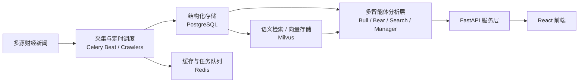

# FinnewsHunter：一个基于 AgenticX 的多智能体金融新闻分析平台

做投资研究的人，最缺的往往不是新闻，而是**把新闻变成判断的能力**。

每天的财经信息量已经大到离谱：宏观消息、公司公告、行业快讯、海外市场异动、政策口径、舆情变化，全都在同时发生。真正麻烦的不是“看不到”，而是：

- 信息源太多，手工盯盘效率太低
- 同一条消息到底利多还是利空，常常没人能立刻讲清楚
- 你能抓到新闻，不代表你能把它沉淀成结构化、可追踪的研究结论

`FinnewsHunter` 想解决的，就是这段断层。

它不是一个单纯抓财经快讯的爬虫项目，而是一个**基于 AgenticX 的多智能体金融新闻分析平台**：把新闻采集、去重存储、向量检索、多角色分析和结果展示串成了一条完整链路。

换句话说，它关注的不是“把新闻拉下来”，而是“把新闻变成可用情报”。

## 它在解决什么问题

很多人做金融信息处理，第一步都能想到：先把新闻抓下来。

但现实很快会告诉你，抓取只是最容易的部分。

真正难的是后面这几件事：

### 1. 如何从多源资讯里筛出有价值的内容

财经新闻天然噪声很大。即使你接入了多个新闻源，也不代表每条内容都值得花时间看。

### 2. 如何让分析不只停留在“总结”

很多系统会做摘要，但摘要不等于判断。投资场景更关心的是：

- 这条消息影响谁
- 方向偏多还是偏空
- 是情绪扰动，还是基本面信号
- 是否值得进一步跟踪

### 3. 如何把一次性分析变成持续可用的研究资产

如果每次都是“看完就算”，那系统只是个更复杂的信息流工具。真正有价值的是，分析结果能沉淀下来，可以查询、比较、批量处理、继续扩展。

`FinnewsHunter` 的做法，是把这三件事放进一条工程流水线里统一处理。

## 它不只是新闻聚合，而是一条分析闭环

从定位上看，`FinnewsHunter` 更像一个金融研究工作台，而不是一个传统新闻阅读器。

它的系统价值主要体现在三个层面：

- **采集层**：定时从多个财经信息源抓新闻
- **分析层**：用多智能体协作方式，从不同视角解读新闻
- **展示层**：把结果通过前端和 API 暴露出来，供人继续筛选和查看

这意味着它不是“爬虫 + 大模型”的简单拼接，而是在尝试把**采集、存储、检索、分析、展示**变成一套完整系统。

## 整体架构一眼看懂

从技术栈看，这个项目很典型地体现了“LLM 应用不是只接个 API”这件事。

它的主结构大致可以理解成下面这几层：

对应到 README 里能看到的技术选型，大致是：

- `FastAPI`：承接服务接口
- `Celery + Celery Beat`：负责异步任务和定时抓取
- `PostgreSQL`：保存新闻和分析结果
- `Redis`：缓存与任务队列
- `Milvus`：向量存储与语义检索能力
- `React + TypeScript + Shadcn UI`：搭建前端界面

这套组合的意义在于，它已经不是“脚本式 demo”了，而是有明显的服务分层意识。

## 一条新闻是怎样被处理的

理解这个项目，最好的方式不是先看目录，而是先顺着一条新闻走完。

一个简化后的处理链路大致是这样：

1. `Celery Beat` 按分钟调度抓取多个财经源
2. 新闻进入系统后，先写入 `PostgreSQL`
3. 系统做去重、时间过滤和基础清洗
4. 异步生成向量或建立可用于语义检索的索引，写入 `Milvus`
5. 多个 Agent 开始从不同角度分析这条新闻
6. 最终结论由上层角色汇总后，通过前端或 API 展示出来

这条链路里最值得注意的是：**它不是“一次生成一个摘要”就结束，而是允许多角色协作。**

这也是它和很多普通“新闻 + LLM”项目最不一样的地方。

## 多智能体设计为什么值得看

`FinnewsHunter` 最有辨识度的部分，就是它把分析任务拆给了多个不同角色。

README 里点名提到了四个角色：

- `BullResearcher`
- `BearResearcher`
- `SearchAnalyst`
- `InvestmentManager`

这个拆分非常有意思，因为它不是按“功能模块”分，而是按“认知视角”分。

### BullResearcher

负责从偏多的角度理解新闻。

它更像是那个会问“这件事会不会带来风险偏好提升、盈利改善、估值修复机会”的研究员。

### BearResearcher

负责从偏空或风险角度做反向判断。

它的价值不是唱反调，而是防止系统只看见利好叙事，看不见估值、政策、宏观和执行层面的风险。

### SearchAnalyst

负责补充检索与背景信息。

很多新闻本身信息量很少，真正关键的是这条消息和历史事件、行业背景、公司上下文怎么连起来。这个角色的存在，是为了避免分析只停留在新闻文本表面。

### InvestmentManager

这是汇总层角色。

它不是简单把前面几个 Agent 的回答拼起来，而是承担“最后怎么形成判断”的职责：

- 哪些观点更有说服力
- 多空观点分别站得住几分
- 最后应该给出什么样的研究结论

这套设计最值得借鉴的点在于：**它把“多视角分析”显式建模了。**

很多单 Agent 系统并不是不能输出多空观点，而是它们默认这些权衡都在一个大 prompt 里悄悄完成。`FinnewsHunter` 把这件事拆成可见角色之后，整个系统的可解释性会更强。

## 技术栈为什么这样搭

从工程角度看，这个项目的技术栈选择很合理，几乎每一层都对应一个明确职责。

### FastAPI

适合作为后端服务壳层。

在这种“前端要读数据、任务又很多、还要挂分析接口”的项目里，FastAPI 足够轻，也足够清晰。

### Celery + Celery Beat

这是整个系统能跑起来的关键。

金融新闻处理不是用户点击一下才触发，而是**系统自己要持续抓、持续分析**。这天然适合用：

- `Celery Beat` 做定时调度
- `Celery Worker` 做异步任务执行

如果没有这一层，这个项目就会退化成“手动点一下，分析一条”的 demo。

### PostgreSQL

所有结构化新闻、分析记录、批量分析结果，最终都需要一个稳定持久层。

在这个场景里，`PostgreSQL` 的角色就是系统状态的基座。

### Redis

作为缓存和任务队列中枢，它让抓取、分析、前端访问这些路径不用直接互相阻塞。

### Milvus

这不是“为了酷而上向量库”。

对于新闻系统来说，向量存储真正的意义在于：

- 相似新闻聚类
- 语义级检索
- 把一次新闻分析放进更长的上下文里理解

也就是说，Milvus 让这个项目有机会从“新闻处理系统”进一步演化成“新闻知识系统”。

### React + TypeScript + Shadcn UI

这套前端栈很适合快速搭建数据筛选、列表浏览、分析结果展示这类界面。对这种管理台/研究台型产品来说，工程效率和可维护性比炫技更重要。

## 本地启动路径不算短，但很符合真实系统

这种项目不可能像一个单文件 Python 脚本那样 `python main.py` 就完事。

README 里给出的启动链路大致是：

1. 安装 AgenticX
2. 安装后端依赖
3. 复制并配置 `.env`
4. 用 `docker compose -f deploy/docker-compose.dev.yml` 启动 PostgreSQL、Redis、Milvus
5. 执行 `python init_db.py`
6. 启动 `uvicorn`
7. 启动 `celery-worker`
8. 启动 `celery-beat`
9. 启动前端 `npm run dev`

默认入口：

- 前端：`http://localhost:3000`
- 后端文档：`http://localhost:8000/docs`

这条路径看起来步骤多，但它其实恰好说明了系统边界：

- 数据存储不是内嵌的
- 调度系统不是附带的
- 分析任务不是同步阻塞的
- 前后端不是糊在一块的

也就是说，它不是为了“让 demo 快速跑起来”而牺牲结构，而是更接近一个长期可扩展的工程骨架。

## 使用前要知道的限制

这类项目如果只讲亮点，不讲限制，很容易把读者带偏。

`FinnewsHunter` 至少有几个现实边界，需要提前说清楚。

### 1. 没有 LLM key，核心链路就跑不起来

这不是一个“只靠爬虫就有价值”的系统。它的核心价值在分析层，所以至少要配置一个可用的大模型 API Key，系统才有真正意义。

### 2. Milvus 启动慢，不代表系统坏了

向量数据库的冷启动和就绪时间，经常会让人误以为服务挂了。对第一次本地部署的人来说，这个认知落差非常常见。

### 3. 清空数据后，效果不会立刻恢复

如果你重置数据，系统需要重新积累抓取结果。README 里也提到，往往要等待几分钟，才能重新看到比较像样的新闻数据和分析结果。

### 4. 一些能力还在路线图阶段

像 WebSocket 推送、执行轨迹可视化、知识图谱、自演化机制这类东西，并不是已经完整落地的成熟能力。看这个项目时，最好把它理解成“有明确方向、已经搭起骨架、但还在持续演进”的系统。

## 它最适合谁参考

我觉得这篇项目最适合三类人看。

### 1. 想做金融研究助手的人

如果你在想“能不能把新闻、观点、分析、结论整成一条自动化链路”，它很值得参考。

### 2. 想看多智能体怎么落地的人

很多多 Agent 案例只停留在对话层。`FinnewsHunter` 比较有价值的一点，是它把多智能体放进了真实的数据流和任务系统里。

### 3. 想搭“采集 + 检索 + 分析 + 展示”闭环的人

即使你不做金融，这个项目的工程结构也有借鉴意义。换个领域，很多思路仍然成立。

## 最后一句

如果把它当成“又一个接了大模型的爬虫项目”，你会低估它。

`FinnewsHunter` 真正值得看的地方，不是某个模型本身有多强，而是它把**定时采集、结构化存储、向量检索、多角色研判和结果展示**组织成了一条能跑起来的工程链路。

在 AI 应用越来越多、但真正能落地成系统的项目还不算多的今天，这种项目比单个 prompt 技巧更有参考价值。

> 仓库：`https://github.com/DemonDamon/FinnewsHunter`
