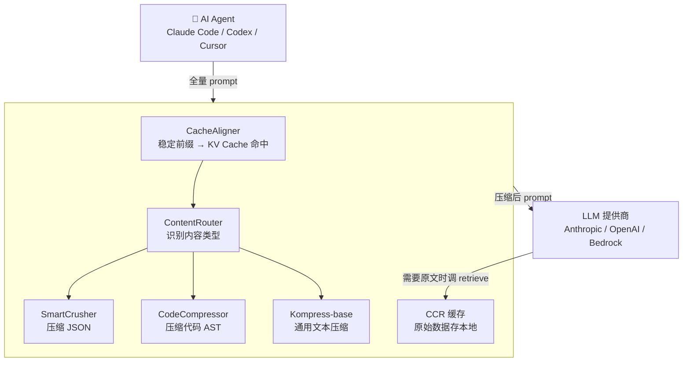

# Headroom：Netflix 工程师写了一个工具，把你发给 LLM 的 token 砍掉 90%

> 一个 Netflix 高级工程师收到 $287 的 Claude API 账单后怒了——他发现 76% 的 token 花在了传输机器日志、嵌套 JSON、重复代码上，而不是他真正想问的问题。于是他写了一个工具，把这些噪音压缩掉。

## 是什么

[Headroom](https://github.com/chopratejas/headroom) 是一个 LLM 上下文压缩层（Apache 2.0，39,000+ stars），作者 Tejas Chopra（Netflix 高级工程师）。它夹在你的 AI Agent 和 LLM 提供商之间，把发出去的 token 压缩 60-95%，但不影响回答质量。

```text
没有 Headroom 时：
  Agent → 全量 prompt（含大量冗余） → LLM → 回答 → 💸💸💸

有 Headroom 时：
  Agent → Headroom 压缩 → 精简 prompt → LLM → 回答
            ↑
      原始数据缓存在本地，按需取回
```

核心定位：

- **不是另一个 LLM**——它不生成内容，它只把输入「脱水」
- **透明层**——对 Agent 和 LLM 都是透明的，不改代码
- **可逆**——压缩后的内容如果 LLM 需要原文，可以取回（CCR 机制）
- **本地运行**——数据不出你的机器

## 一个 $287 账单引发的项目

作者用 Claude Sonnet 跑一个个人项目，收到 $287 账单后分析了一下 token 消费：

```text
100% token 消费：
  ├── 76% 机器生成的内容（JSON 日志、堆栈跟踪、依赖列表……）
  ├── 12% 重复的对话历史
  └── 12% 真正有价值的用户指令
```

痛点是：这些噪音是你必须发给 LLM 的上下文——它需要日志来排查问题、需要 JSON 来理解 API 响应——但不必原样发送。Headroom 做的事情就是：**保留语义，删掉冗余**。

## 怎么用

### 方式 1：Wrap Agent（最简单）

```bash
# macOS 上用苹果芯片可能需要指定编译器
CC=/usr/bin/clang CXX=/usr/bin/clang++ pip install "headroom-ai[all]"
headroom wrap claude        # Claude Code 自动走压缩
headroom wrap codex         # Codex 也一样
headroom wrap cursor        # Cursor
```

### 方式 2：Proxy（不改任何代码）

```bash
headroom proxy --port 8787
# 然后把 API endpoint 指向 http://localhost:8787
```

### 方式 3：Library（嵌入代码）

```python
from headroom import compress

compressed, retrieval_id = compress(messages)
response = llm.chat(compressed)
```

### 方式 4：MCP Server

```json
{
  "mcpServers": {
    "headroom": { "command": "headroom", "args": ["mcp"] }
  }
}
```

Agent 获得 `headroom_compress`、`headroom_retrieve`、`headroom_stats` 三个工具。

## 工作原理



四个关键组件：

- **CacheAligner**——把每次请求的前缀对齐，让 LLM 提供商的 KV Cache 能命中（省的不是你的 token，是服务端的计算）
- **ContentRouter**——识别内容类型（JSON？代码？纯文本？），路由到对应的压缩器
- **SmartCrusher / CodeCompressor / Kompress-base**——三个压缩器，各司其职
- **CCR（Cached Compressed Retrieval）**——压缩后的原文缓存在本地（Redis/SQLite），LLM 需要时可以通过 `headroom_retrieve` 取回

## 压缩效果

真实 Agent 工作负载下的数据：

| 场景 | 压缩前 | 压缩后 | 省了 |
|---|---|---|---|
| 代码搜索（100 条结果） | 17,765 tokens | 1,408 tokens | **92%** |
| SRE 事故排查 | 65,694 tokens | 5,118 tokens | **92%** |
| GitHub Issue 分类 | 54,174 tokens | 14,761 tokens | **73%** |
| 代码库探索 | 78,502 tokens | 41,254 tokens | **47%** |

**准确率不会降**——在 GSM8K（数学）、TruthfulQA（事实）、SQuAD v2（问答）、BFCL（工具调用）四个基准上，压缩后的准确率与原始输入持平甚至略高。

## 不止压缩输入——连输出也省

大部分压缩工具只管输入 token。Headroom 还能管输出：

```bash
export HEADROOM_OUTPUT_SHAPER=1
headroom proxy --port 8787
```

- **Verbosity steering**——在 system prompt 末尾加一句「请简洁回答，不要复述上下文」
- **Effort routing**——检测到当前 turn 只是 Agent 读了个文件回来继续干活时，自动降低 LLM 的 thinking effort；新问题和报错保持完整思考

Opus 类模型的输出 token 价格是输入的 5 倍——省输出的 ROI 更高。

## headroom learn：从失败中学习

一个很特别的功能：

```bash
headroom learn
```

它会分析失败会话（Agent 说「我做不到」或出错的情况），提取根因，然后**直接写进 CLAUDE.md 或 AGENTS.md** 作为经验教训。

```text
比如：Agent 因为 token 不够而没读完整个文件
↓ headroom learn 发现这个模式
↓ 自动在 CLAUDE.md 里加一条：
  "读大文件时用 headroom_retrieve 分批取，不要一次全读"
```

这是 Headroom 最「Agent Native」的部分——不是被动压缩，而是主动改进 Agent 的行为。

## 跨 Agent 共享记忆

```text
Claude Code 压缩过的文件 → 存进共享 memory
Codex 后来要读同一个文件 → 直接命中缓存，不重复压缩
```

跨 Claude Code、Codex、Gemini 等 Agent 的共享去重。

## 和 RTK 的区别

| | Headroom | RTK |
|---|---|---|
| 压缩位置 | Prompt 内容层面 | CLI 命令层面 |
| 原理 | 语义压缩 + 内容路由 | 命令输出过滤 |
| 压缩对象 | AI Agent 发给 LLM 的所有内容 | 终端命令的输出 |
| 省什么 | Token（API 费用） | Token（LLM 上下文） |
| 集成方式 | Library / Proxy / Wrap / MCP | Shell 代理 |

两者可以叠加——RTK 过滤命令输出，Headroom 再把剩余的内容压缩一次。

## 适用场景

**适合用**：

- 经常给 Agent 扔大段日志、JSON、代码库让它分析
- API 账单太高，想降成本但不换模型
- 跑 RAG 工作流——检索到的 chunk 有一半是冗余的
- 多 Agent 协作——共享 memory 减少重复压缩

**可以不用**：

- 只做简单对话——压缩的开销比省的 token 还大
- 已经在用缓存（Anthropic Prompt Caching）且命中率高

## 小结

Headroom 的思路很直接：**LLM 不需要看原文，它只需要懂内容**。日志不用全发——告诉它「有 5 个 ERROR，根因是 OOM」就够了。JSON 不用全发——发结构摘要就够了。

$287 → 开源 → 省了几十万刀 → 39K stars。最性感的部分不是技术，是动机——工程师看到账单的第一反应是写代码解决，而不是少用点。

---

**相关阅读：**
- [RTK (Rust Token Killer)：CLI 代理省 Token](rtk-guide.md)
- [Orca：为并行 AI Agent 设计的下一代 IDE](orca-guide.md)
