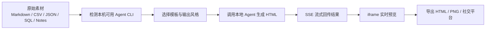

# HTML-Anything：让 AI 直接产出可发布的单文件 HTML

想象一个场景：你已经让 Claude Code 或 Codex 帮你写好了内容草稿，甚至已经有 Markdown、表格、JSON、SQL 查询结果了。但下一步怎么把这些原始材料变成一个**真的能发给别人看**的成品页面？

大多数工具在这里断掉了。

- Markdown 编辑器负责写内容
- 设计工具负责排版
- 截图工具负责导出图片
- 社交平台或文档平台再负责最终发布

`html-anything` 想做的，是把这几段割裂的流程重新接起来。

它的定位很直接：**一个本地优先的 AI HTML 编辑器，复用你已经登录的 Agent CLI，把原始输入直接生成可发布的单文件 HTML。**

项目首页有两句很值得记住的话：

- `The agentic HTML editor`
- `Markdown is the draft. HTML is what humans read.`

这两句话几乎把它的价值说透了：Markdown 只是草稿格式，人真正消费的是最终的页面成品。

## 它不是 Markdown 编辑器，而是一条成品生产线

很多人第一次看到 `html-anything`，会以为它只是“又一个把 Markdown 渲染成网页的工具”。

不是。

它和普通 Markdown 编辑器、静态站点生成器最大的区别在于：**它把 Agent、模板、流式预览、导出能力收口成了一条完整的交付链路。**

你给它的不是“已经写好的网页”，而是原始素材：

- Markdown
- CSV / TSV
- JSON
- SQL
- plain text
- Excel
- raw notes

然后它做的事情不是“按固定模板渲染”，而是调用本地 Agent CLI，把这些素材加工成一份真正可交付的 HTML 成品。

这就是它和传统静态站点工具的分界线。

静态站点工具的假设是：你已经知道页面怎么组织，只需要一个构建器。

`html-anything` 的假设是：**你手里只有原始内容和想法，但你希望 AI 帮你把它直接变成最终页面。**

## 一条完整工作流长什么样

它的工作流其实非常清楚：



可以拆成 5 步看：

1. 浏览器先调用 `GET /api/agents`，扫描你本机 `PATH` 里已经可用的 Agent CLI
2. 你选择一个 agent，再选一个模板或输出 surface
3. 前端通过 `POST /api/convert` 发起转换
4. 后端拉起本地 agent 进程，按 JSON 行流持续接收输出
5. 前端把流式返回的 HTML 增量实时塞进 iframe `srcdoc` 预览，最后再导出

这件事的关键不在“能不能生成 HTML”，而在于**生成过程是可见的、可调的、可落地的**。

不是等 30 秒后给你一个黑盒结果，而是边生成边预览。对做视觉内容、宣传页、知识卡片、演示页的人来说，这种反馈速度非常重要。

## 为什么“单文件 HTML”这个设计很关键

这是我觉得这个项目最值得写的一点。

`html-anything` 强调的是 **publishable single-file HTML**。这意味着最终产物尽可能是一个可以直接交付、分享、归档、托管的独立文件。

这背后有几个很现实的好处：

### 1. 交付简单

你不用再解释：

- “这个页面还依赖一个 CSS 文件”
- “这个资源目录你也要一起带上”
- “本地打开路径不对就会挂”

单文件 HTML 的交付方式最接近 PDF，但比 PDF 更灵活——它保留了浏览器的表现力。

### 2. 非开发者也容易接收

如果你发给同事、客户、运营、内容团队一个完整目录，他们往往不知道怎么打开。

但一个 `.html` 文件就很好理解：双击、浏览器打开、直接看。

### 3. 更适合 Agent 时代的“中间成品”

很多时候你不是在做一个长期维护的网站，而是在做：

- 一页提案
- 一篇排版好的文章
- 一张社交媒体卡片
- 一页活动宣传
- 一段视频分镜帧

这些东西不需要复杂的构建系统，但需要比纯 Markdown 更强的视觉表达。单文件 HTML 正好处在这个中间层。

## 为什么它强调本地优先

这也是 `html-anything` 和很多 Web SaaS 工具很不一样的地方。

它不是先把内容上传到一个云端编辑器，再由平台帮你生成页面；它的思路是：**尽量复用你本机已经登录好的 Agent CLI。**

README 里列出的已适配 CLI 有 8 个：

- Claude Code
- OpenAI Codex
- Cursor Agent
- Gemini CLI
- GitHub Copilot CLI
- OpenCode
- Qwen Coder
- Aider

启动时会扫描 `PATH`，并额外覆盖一些常见安装路径，比如：

- `~/.local/bin`
- `~/.bun/bin`
- `/opt/homebrew/bin`
- `~/.npm-global/bin`

这意味着什么？

意味着你不用为这个工具重新配置一套 API key 或新账户体系。只要本机 agent CLI 已经能工作，它就能接上去。

这个设计非常符合本地 Agent 工作流的现实：**今天很多开发者最稳定、最熟悉、权限最完整的 AI 入口，不是网页聊天框，而是本地 CLI。**

`html-anything` 没有绕过这个现实，而是顺着它设计。

## 安装和启动方式很直接

项目本身的启动很清晰：

```bash
git clone https://github.com/nexu-io/html-anything
cd html-anything
pnpm install
pnpm -F @html-anything/next dev
```

然后打开：

```text
http://localhost:3000
```

README 里还给了几条开发常用命令：

```bash
pnpm exec tsx scripts/guard.ts
pnpm -F @html-anything/next typecheck
pnpm -F @html-anything/next test
pnpm -F @html-anything/next build
pnpm -F @html-anything/e2e typecheck
pnpm -F @html-anything/e2e test
```

从这些命令也能看出它不是一个随手拼出来的 demo，而是一个已经具备开发、测试、构建路径的工程化项目。

## 它的亮点不只是“能生成”，而是模板和输出面够丰富

项目 README 里提到两个数字：

- `75 skill templates`
- `9 output surfaces`

这两个数字很重要。

因为很多 AI 工具的问题不是“不会生成”，而是“生成的东西没有明确交付目标”。

模板和输出面，本质上是在给生成过程加约束：

- 这是做演示文稿，还是做文章长页
- 这是做海报，还是做社交卡片
- 这是给微信发，还是给 X、知乎、PNG、HTML 导出

README 里点名展示了几类很有代表性的模板：

- `deck-guizang-editorial`：杂志感 e-ink 风格演示文稿
- `deck-swiss-international`：瑞士国际主义风格排版 deck
- `doc-kami-parchment`：纸张质感的长文档
- `magazine-poster`：海报式单页
- `video-hyperframes`：面向视频分镜的帧脚本
- `frame-glitch-title`：故障风标题帧

这说明它不是只盯着“博客页面”一个方向，而是在尝试把 HTML 作为一种更通用的交付介质：

- 文档
- 演示页
- 社交图片
- 品牌视觉卡片
- 视频分镜帧

这个视角其实很新：**HTML 不只是网页，也可以是视觉内容的母格式。**

## 导出链路也做得很现实

一个工具好不好，不只看生成，还要看最后怎么出去。

`html-anything` 已经打通了几类非常现实的导出目标：

- WeChat
- X / Weibo / Xiaohongshu
- Zhihu
- `.html`
- `.png`

这里最有意思的是，它不是停留在“你自己复制一下吧”这种程度，而是针对不同平台做了不同处理：

- WeChat 方向会做 CSS inline，方便粘贴
- X / Weibo / Xiaohongshu 方向会生成 2x PNG
- Zhihu 方向对公式相关节点做占位处理

这说明它考虑的不是“理论上能导出”，而是“导出之后能不能真的发”。

很多工具死在最后一步：能生成，但发不出去；或发出去之后平台样式全坏了。

`html-anything` 至少已经在认真解决这个问题。

## 这个项目最适合什么场景

如果你问我它最适合谁，我觉得不是“所有写网页的人”。

它最适合的是这几类人：

### 1. 已经在用本地 Agent CLI 的开发者

你已经有 Claude Code、Codex、Gemini CLI 这一类工具，想把 AI 从“帮我写内容”进一步推进到“帮我交付成品”，那这个工具很顺。

### 2. 做内部分享、方案页、提案页的人

这类页面通常不是长期网站，不值得上一个完整前端项目，但又需要比 Markdown 更强的视觉表达。

### 3. 内容生产者

比如：

- 技术文章封面页
- 社交媒体卡片
- 海报
- 长图
- 可视化知识页

很多内容其实最难的不是写，而是最后的包装交付。

### 4. 想把结构化数据快速变成“能看”的页面的人

CSV、JSON、SQL 结果本来就是冷数据。`html-anything` 的价值之一，是让这些数据更快变成对人可读的交付物。

## 它的局限也要讲清楚

这个项目现在最该带着清醒预期去看。

README 里对状态的描述是：`Early but real.`

这个评价很诚实。

已经比较稳定的部分包括：

- Agent detection
- Skill registry + picker
- SSE streaming render
- Sandboxed iframe preview
- WeChat / X / Zhihu / `.html` / `.png` export
- CSV / Excel / JSON / SQL auto-detect

但同时也明确写了还在推进或计划中的能力：

- Multi-template compare preview
- Hyperframes 到 `.mp4` 的 handoff
- Browser extension
- History / version diff / IndexedDB archive
- Skill marketplace
- 更多导出目标

这说明它已经不是概念，但也还远没到“产品形态完全定型”的阶段。

换句话说：**它值得关注，也值得尝试，但不应该被误解成一个已经把所有边角都磨平的成熟平台。**

## 还有一个不能跳过的话题：安全边界

因为它会通过 `/api/convert` 拉起你本机的 Agent CLI，这个工具天然不是一个“随便开放给陌生人访问”的服务。

README 里明确提到：

- 目标场景是单机单用户、本地侧使用
- `/api/*` 请求受 Host allowlist 限制，用来防 DNS rebinding
- 如果要放宽 host 限制，需要依赖可信反向代理

这点非常重要。

很多“本地优先”工具之所以成立，就是因为它默认信任的是**你自己的机器、你自己的账号、你自己的 CLI 会话**。一旦把这个边界打破，问题性质就完全变了。

所以这类工具的正确打开方式，不是“赶紧公网部署”，而是把它看成个人工作台的一部分。

## 它为什么值得写进 Agent 工作流里

如果只从功能列表看，`html-anything` 可能只是“又一个 AI 生成前端的工具”。

但如果把它放到 Agent 工作流里看，它就很有意思。

今天越来越多开发者的真实工作流已经变成这样：

- 用 Agent 理解资料
- 用 Agent 整理结构
- 用 Agent 生成初稿
- 但最后成品交付，仍然靠人工在几个工具里来回倒腾

`html-anything` 试图补上的，正是最后这一段断层。

它不只是让 AI 帮你“写”，而是让 AI 更进一步参与“交付”。

这也是我觉得它最有潜力的地方：**把 Agent 从内容协作者，往成品生产者推了一步。**

## 最后一句

如果你已经习惯让 Claude Code、Codex 这类工具帮你生成内容，那 `html-anything` 提供的是下一层能力：**不是停在草稿，而是直接走向页面成品。**

这不一定会替代你现有的写作、设计、发布工具，但它很可能会改变你把“原始素材”变成“可交付结果”的那一段路径。

> 仓库：`https://github.com/nexu-io/html-anything`
