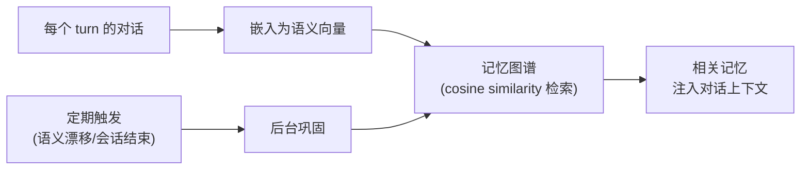
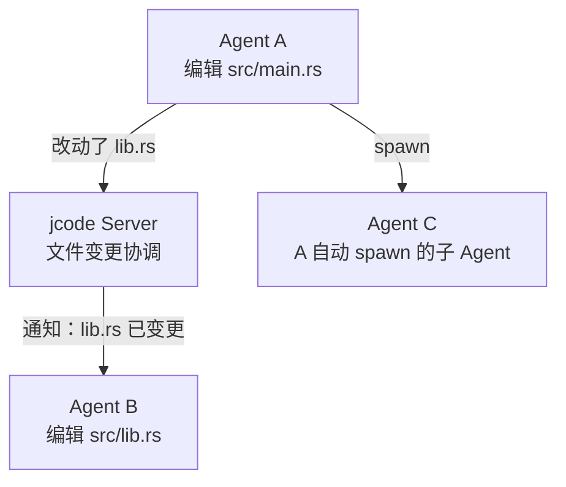

# jcode：Rust 写的终端 AI 编程助手，把性能和 Agent 协作做到极致

> 基于 [jcode](https://github.com/1jehuang/jcode)，MIT 协议，Rust 实现。

## 一句话说清楚

jcode 是一个 Rust 写的 TUI 编程 Agent。它像一个终端里的 Cursor——嵌入在 PTY 中、直接操作文件、连接 LLM。但它的区别不在于"又一个 AI 编程工具"，在于做了三个 Claude Code 没做的事：**Agent 语义记忆**、**多 Agent 协作（Swarm）**、**自修改代码**。

## 性能：用 Rust 重写的终端 Agent

```
内存占用对比（单 session）：
jcode:    27-167 MB
pi:       ~140 MB
Claude Code: ~386 MB

首 token 延迟（TTFT）：
jcode:      ~49 ms
Claude Code: ~3513 ms（72x 慢）
```

jcode 的 TUI 不是 Electron 套壳，也不是 ncurses——是**自研的 PTY 终端 Handterm**，支持平滑滚动和负空间利用（info widget 可以"借用"未使用的屏幕边角）。Mermaid 图表用了一个自研的 Rust 渲染库，声称比典型实现快 1800 倍。

这些性能数字对日常使用的影响不是"快了一点点"——是从"切过去等 3 秒"变成"按完就出结果"。延迟降低到 50ms 以内之后，你的大脑不会中断思考流。

## Agent Memory：不是"历史记录"，是语义记忆

大多数 AI 编程工具的记忆 = 对话历史。jcode 的做法不同：



每个 turn 的对话被嵌入为向量，存入记忆图谱。下一次对话时，用 cosine similarity 找到相关历史记忆，自动注入上下文。不是"最近 20 条消息"，而是"最相关的 5 条记忆"。

还有一个 side-agent 可以验证记忆相关性——防止不相关的记忆污染上下文。

## Swarm Mode：多个 Agent 同时改同一个仓库



Swarm 模式的核心：当 Agent A 编辑了一个 Agent B 正在打开的文件，Server 通知 B "文件已变更"——B 可以检查冲突、重新读取、或者继续工作。Agent 还可以**自动 spawn 子 Agent**作为 worker。

这不是并行执行同一个 prompt——是**多个 Agent 在同一个仓库里协同工作**，有冲突检测、有变更通知、有 spawn 机制。

## Self-Development：Agent 可以改自己的源码

jcode 可以修改自己的源代码、重新编译、reload、然后继续工作。

```
你: "jcode，你的 Mermaid 渲染器在处理大图时有点慢，优化一下"
jcode: 改源码 → cargo build → 重启自己 → "好了，现在快 2x"
```

这个能力意味着 jcode 的**进化速度可以比传统开源项目更快**——不依赖人类贡献者来修 bug 和优化。README 里说"建议用前沿模型（Claude、GPT-5 等）来做这件事"。

## Session Resume：接盘其他工具的会话

"Claude Code 崩了？你可以从 jcode 恢复会话，接着之前的地方继续。"

这个功能解决了一个真实的痛点：AI 编程工具的会话是封闭的、不可迁移的。jcode 可以从其他 harness 的会话文件中恢复上下文，用户不需要从头描述问题。

## 跨 Provider 支持

原生支持 Claude、OpenAI、GitHub Copilot、Gemini、Azure、阿里云、Fireworks。OpenAI-compatible endpoint 覆盖 OpenRouter、DeepSeek、vLLM、Ollama、LM Studio 等。OAuth 流程支持无头 SSH 会话。

Skills 系统：Skills 被嵌入为语义向量，在匹配时自动注入——不会把所有 skills 一次性塞进上下文。

## 和 Claude Code 的定位差异

| | Claude Code | jcode |
|---|---|---|
| 语言 | TypeScript | **Rust** |
| 内存（单 session） | ~386 MB | **27-167 MB** |
| TUI | React 渲染 | **自研 PTY 终端** |
| 多 Agent | Subagent（单主控） | **Swarm（多 Agent 对等协作）** |
| 记忆 | 会话历史 + /compact | **语义向量图谱 + 自动巩固** |
| 自修改 | ❌ | ✅ 改源码 → 编译 → 重启 |
| 会话跨工具恢复 | ❌ | ✅ 从其他 harness 恢复 |
| Mermaid 渲染 | 外部库 | **自研 Rust 库（1800x 更快）** |
| 浏览器自动化 | ❌ 需外部工具 | 内置 Firefox 控制 |

jcode 在"交互体验的极致性能"和"Agent 协作的深度"上压得比 Claude Code 更深。但 Claude Code 的优势在于生态（Skills、Hooks、MCP、社区工作流）——jcode 作为较新的工具，生态还需要时间积累。

## 怎么开始

```bash
curl -fsSL https://jcode.sh/install | bash
# 或
brew install jcode
# 或
cargo install jcode
```

启动后选择一个 provider、配好 API key，直接开始对话。它的 TUI 学习成本很低——如果你用过 tmux + vim，界面操作是直觉式的。

## 小结

jcode 值得关注的三个方向：

1. **Agent 记忆的语义化**——不是存储对话文本，是嵌入向量 + 相似性检索。这对长周期项目（你可能和同一个 Agent 合作好几天）是关键能力。
2. **Swarm 多 Agent 协同**——同一个仓库里多个 Agent 同时工作、冲突检测、变更通知——这是 AI 编程工具在"多人协作"方向上的前沿探索。
3. **Rust 极致性能**——49ms 的首 token 延迟和 27MB 的内存基线，让你可以把它当成一个"常驻后台的编程伙伴"而不是"需要临时打开的工具"。
