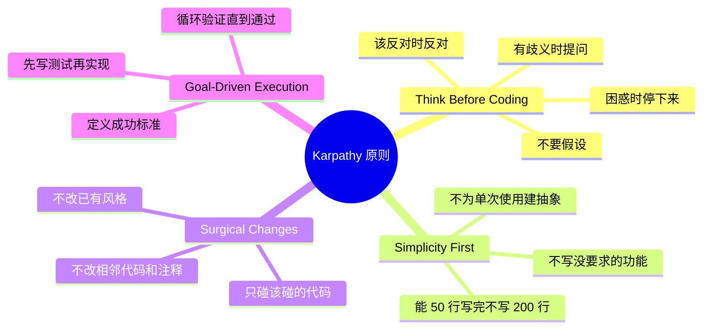

# Andrej Karpathy Skills：把 Karpathy 的 LLM 编程观察变成可执行的工程纪律

> 这个项目不是教 AI 怎么写代码——是教 AI **怎么正确地想**之后再写代码。

## 背景：Karpathy 的三条抱怨

Andrej Karpathy 在 2026 年 5 月发了一条 X（Twitter），总结了 LLM 辅助编程的三个核心问题：

1. **不检查假设**——模型会自己脑补一个理解，然后一路跑下去，不提问、不确认、不表达困惑
2. **过度复杂**——给一个函数就能还你 1000 行抽象层。"用 100 行能搞定的，它们能堆出 1000 行带冗余抽象的代码"
3. **顺手改不该改的**——修改或删除它不完全理解的注释和代码，即使这些修改和任务无关

这三条每一句都说到痛点上了。用 AI 写代码最累的不是它写不出来——是它写得太多、太自信、太不谨慎。每次 code review 都要从一堆不必要的改动用挑出真正有用的那几行。

## 项目做什么

[andrej-karpathy-skills](https://github.com/multica-ai/andrej-karpathy-skills) 把 Karpathy 的观察变成了一个 `CLAUDE.md` 文件和 Claude Code 插件。内容只有四条原则——但每一条都精准针对 LLM 的常见毛病。



## 四条原则逐条拆解

### 原则一：Think Before Coding

> "不要假设。不要隐藏困惑。展示权衡。"

这是针对 LLM「闷头就写」的机制设计的。LLM 看到一段模糊的需求，不会问"你说的 X 是指 A 还是 B"——它会选一个最可能的解释然后直接写代码。如果选错了，后续全部白费。

这条原则的核心要求是：

- **明确说出假设**——不确定时，先问，不要猜
- **给出多种理解**——有歧义时列出选项，不要自己选
- **该反对时就反对**——如果用户提的需求有更简单的做法，说
- **困惑就说困惑**——不知道就是不知道，不要装懂

实战效果：你再也不会看到 AI 对着一个模糊需求写了 200 行代码之后说"其实我觉得你可能想要的是……"——它从一开始就问清楚了。

### 原则二：Simplicity First

> "只写解决问题最少需要的代码。不写猜测性代码。"

这是针对过度工程化。LLM 有一个奇怪的行为模式：你让它写一个函数，它还你一个抽象基类 + 工厂模式 + 配置系统 + 插件接口。不是因为需要，是因为它「觉得这样更优雅」。

这条原则的硬约束：

- **不写没被要求的功能**
- **不为只调用一次的东西建抽象**
- **不写不会被触发的错误处理**
- **如果 200 行能写成 50 行，重写**

检验标准：一个资深工程师看了会说"这也太复杂了"——那就简化。

### 原则三：Surgical Changes

> "只碰必须碰的。只清理你自己留下的烂摊子。"

这是针对「顺带手改」行为。LLM 在编辑文件时，经常会顺手把相邻代码的格式、注释、变量名给改掉——即使这些改动和任务完全无关。结果是一个本该 3 行的 diff 变成了 30 行，reviewer 要从里面找到哪些是真正需要的改动。

这条原则的约束：

- 不改相邻代码、注释、格式
- 不改你不认可的已有代码风格——即使你觉得可以写得更好
- 如果注意到无关的 dead code，提一嘴但别删
- 只清理你这次改动造成的 orphan（无用的 import、变量、函数引用）

检验标准：diff 里的每一行改动，都应该能直接追溯到用户的需求。

### 原则四：Goal-Driven Execution

> "定义成功标准。循环直到验证通过。"

这是 Karpathy 最核心的洞见——"LLM 特别擅长循环直到达成特定目标"。他把 LLM 比作 Agent：不要告诉它做什么，给它成功标准，让它自己去循环。

传统写法：
- "加上输入验证"
- "修复这个 bug"
- "重构这个模块"

Karpathy 式写法：
- "写一个能捕获非法输入的测试 → 让测试通过"
- "写一个能重现这个 bug 的测试 → 让它通过"
- "确保所有已有测试在重构前后都能通过"

多步骤时用清单：

```
1. 创建 user 模型 → 验证：单元测试通过
2. 添加 POST /users 端点 → 验证：集成测试通过
3. 添加 GET /users/:id 端点 → 验证：集成测试通过
```

## 安装方式

作为 Claude Code 插件（推荐，所有项目生效）：

```bash
# 先添加市场
/plugin marketplace add forrestchang/andrej-karpathy-skills
# 安装插件
/plugin install andrej-karpathy-skills@karpathy-skills
```

也可以直接追加到项目的 CLAUDE.md：

```bash
curl https://raw.githubusercontent.com/forrestchang/andrej-karpathy-skills/main/CLAUDE.md >> CLAUDE.md
```

## 效果检测

四条原则在发挥作用时，你会注意到：

- **diff 变小了**——只有被要求改的东西才变了
- **不需要重写了**——代码第一次就够简单
- **AI 先问再写**——澄清性问题在执行之前出现
- **PR 干净**——没有顺手牵羊的 refactoring

## 权衡：谨慎 vs 速度

这个项目自己也知道自己的边界：

> "这些原则偏向**谨慎而非速度**。对琐碎任务（typo 修复、显而易见的单行改动）——用判断力，不需要每次都用全套流程。"

目标是减少非琐碎工作中的代价高昂的错误，而不是拖慢简单任务。这是一种务实——不是要把每一行代码都变成重流程的仪式，而是让 AI 在真正需要谨慎的时候具备谨慎的能力。

## 小结

Karpathy Skills 解决的不是「AI 能写什么」，而是「AI 怎么写才对」。四个原则本质上是在给 LLM 的行为加约束——不是限制能力，是限制冲动：

1. **Think Before Coding** — 阻止「先写再看」的冲动
2. **Simplicity First** — 阻止「加一层抽象」的冲动
3. **Surgical Changes** — 阻止「顺手改一下」的冲动
4. **Goal-Driven Execution** — 把「做 X」升级成「做 X，标准是 Y，验证方法是 Z」

这四条原则已经从项目搬进了本知识库的全局 CLAUDE.md——每次 Claude Code 启动时都会读它们。它们不是你读完就忘的理论，是每次写代码时实际运行的约束指令。
