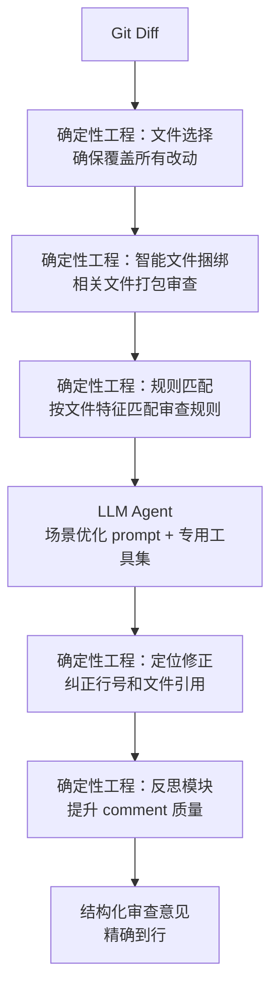

# Open Code Review：阿里内部用了两年的 AI 代码审查工具，现在开源了

> 你用 Claude Code 做代码审查——它有时候跳过关键文件，有时候指出的问题行号对不上，有时候comment质量忽高忽低。阿里内部也遇到了一模一样的问题，所以他们写了一个专用工具，两年识别了数百万个缺陷，现在开源了。

## 是什么

[Open Code Review](https://github.com/alibaba/open-code-review)（OCR）是阿里巴巴开源的 AI 代码审查 CLI 工具（Apache-2.0，6,500+ stars）。不是另一个通用 Agent 的 prompt 包装——它是**专门为代码审查设计的混合架构**。

```text
Claude Code + prompt = 通用 Agent，什么都能干，但审查不够专
Open Code Review      = 确定性工程管线 + LLM Agent，只为审查设计
```

核心定位：

- **确定性管线保底**——文件选择、规则匹配、定位修正这些不能出错的事情，用工程代码而非 LLM 保证
- **Agent 做动态判断**——prompt 和工具集为审查场景深度优化，token 消耗只有通用 Agent 的 1/9
- **阿里生产验证**——内部服务数万开发者两年，识别数百万缺陷后孵化开源

## 为什么通用 Agent 做不好代码审查

Claude Code 加上 code-review prompt 看起来很强大，但实际审查时有三个痛点：

```text
痛点 1：覆盖面不完整
  大改动集时，Agent 会挑着看——跳过无聊的文件
  → 你的关键改动可能被漏掉

痛点 2：位置漂移
  报告问题行号对不上，文件引用指错地方
  → 你得自己翻代码找真正的位置

痛点 3：质量不稳定
  换个 prompt、换个模型温度，review 结果差别很大
  → 纯语言驱动缺乏硬约束
```

根因：**prompt 是软的**。当审查质量全依赖语言模型的行为时，一致性就不可能保证。

## 核心设计：确定性工程 × LLM Agent



四个确定性工程模块保证了基础质量：

- **文件选择**——确保每个改动文件都被审查，Agent 不能「跳过」
- **智能捆绑**——把相关文件打包（如 `message_en.properties` + `message_zh.properties`），每个包独立审查，自然支持并发
- **规则匹配**——用模板引擎而非 prompt 把审查规则注入 context，稳定可预测
- **定位修正 + 反思**——独立模块修正 AI 指错的行号，提升 comment 质量

Agent 负责动态判断的部分：场景优化的 prompt + 从生产数据中提炼的专用工具集。

## 怎么用

```bash
# 安装
npm install -g @alibaba-group/open-code-review

# 三种模式
ocr review                          # 审查当前工作区改动
ocr review --from main --to feature  # 分支对比
ocr review --commit abc123           # 单个 commit

# 全文件扫描（审计不熟悉的代码库）
ocr scan
```

配置 LLM 后端（OpenAI / Anthropic API 兼容）：

```bash
export OCR_MODEL="claude-sonnet-4-6"
export OCR_API_KEY="sk-..."
ocr review
```

## 基准数据：用同一模型，效果更好

基于 50 个开源仓库、200 个真实 PR、10 种语言、80+ 高级工程师标注的 1,505 个问题：

| 指标 | 通用 Agent | Open Code Review |
|---|---|---|
| **Precision（查出来的问题有多少是真的）** | 低 | **显著更高** |
| **F1** | 低 | **显著更高** |
| Recall（真实问题找到多少个） | 高 | 较低（有意取舍） |
| **Token 消耗** | 1x | **~1/9 x** |
| **审查速度** | 慢 | **更快** |

**精度比覆盖面重要**——宁可少报几个问题，也不要 50% 的错误报告把人逼疯。通用 Agent 的 Recall 更高是因为它什么都报——包括大量误报。

## 支持的语言

Java、TypeScript、Go、Python、Kotlin、Rust、C++、C 等 10+ 种语言，内置规则覆盖 NPE、线程安全、XSS、SQL 注入等常见缺陷。

## 和 code-review-graph 的区别

| | Open Code Review | code-review-graph |
|---|---|---|
| 定位 | 完整的审查引擎 | 代码图谱辅助 |
| 架构 | 确定性工程 + Agent | 知识图谱 |
| 专精度 | 只为审查设计 | 通用代码理解 |
| 行号精确度 | 高（有定位修正模块） | 依赖 Agent |
| 生产验证 | 阿里内部两年数百万缺陷 | 个人项目 |
| 安装 | npm / 二进制 | pip |

两者可以配合——code-review-graph 提供代码结构上下文，OCR 负责审查执行。

## 适用场景

**适合用 Open Code Review**：

- 团队 CI 流水线中自动审查 PR
- 需要稳定、可复现的审查质量——不是「今天心情好查得细」
- 大改动集——文件捆绑 + 并发审查不会漏文件
- 预算敏感——token 消耗只有通用 Agent 的 1/9

**适合用通用 Agent**：

- 交互式一对一的代码讨论——不是自动化流水线
- 需要审查之外的灵活交互

## 小结

Open Code Review 最核心的设计哲学：**不要用 prompt 解决所有问题**。

用代码保证文件不遗漏、行号不漂移，用 Agent 做深度语义分析。把确定性的事情交给工程，把不确定性的事情留给 LLM——这是一个在阿里生产环境跑了两年验证过的架构决策。

---

**相关阅读：**
- [code-review-graph：AI 代码审查不应该重读整个仓库](code-review-graph-guide.md)
- [Claude Code 完全指南](../claude-code/index.md)
