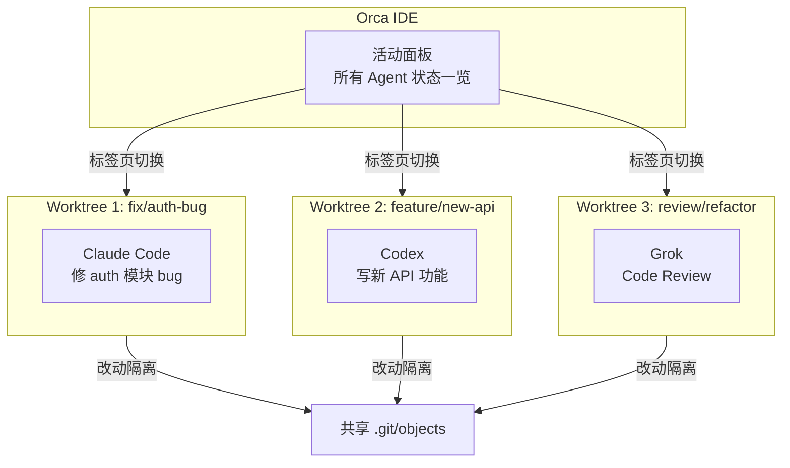

# Orca：为并行 AI Agent 设计的下一代 IDE

> 你同时跑了 Claude Code 修 bug、Codex 写新功能、Grok 做 code review——三个 Agent 并行工作，互不干扰，各自的改动独立在各自的 Git worktree 里。一个窗口，全部掌控。

## 是什么

[Orca](https://github.com/stablyai/orca) 是 Stably AI 开源的桌面 IDE（MIT 协议），专为**同时运行多个 AI 编程 Agent** 设计。macOS、Windows、Linux 都能跑，最新版本 v1.4.48（2026 年 6 月），GitHub 4700+ stars。

```text
传统 IDE = 你 + 一个 AI 助手
Orca     = 你 + 多个 AI Agent 同时干活，各自有独立的工作区
```

核心定位：

- **不是另一个 AI 代码补全工具**——它是 Agent 编排器
- **不需要登录**——带上你自己的 Agent 订阅（Claude Code、Codex、Grok 等）
- **Worktree 原生**——每个 Agent 跑在自己的 Git worktree 里，互不污染
- **开源免费**——MIT 协议，代码全在 GitHub 上

## 它解决什么问题

跑一个 AI Agent 时还好。跑多个的时候，问题就来了：

```text
问题 1：工作区冲突
你让 Claude Code 修 auth 模块的 bug，同时让 Codex 重构 database 层。
两个 Agent 都在改文件——冲突、覆盖、stash 来 stash 去。

问题 2：上下文管理混乱
三个 Agent，三个任务，三个分支。
你得不停 git stash → git checkout → 看进度 → 再切回来。
脑子里的上下文全乱了。

问题 3：结果对比困难
哪个 Agent 的方案更好？你得手动切分支看 diff，效率极低。

问题 4：无法审计
AI 改了什么？为什么改？每一步的决策链路在哪？
没有隔离的工作区，这些信息全混在一起。
```

Orca 的解法一句话：**一个 Agent = 一个 Git worktree = 一个独立标签页**。

## 核心设计：Worktree 作为一等公民

这可能是 Orca 最重要的架构决策——**把 Git worktree 提升为 IDE 的基础抽象**。

### 什么是 Git worktree

Git worktree 让你在同一份仓库上同时打开多个工作目录：

```bash
# 正常只有一个工作目录
~/project/

# worktree 让你同时有多个
~/project/              # 主工作区，在 main 分支
~/project/.worktrees/fix-auth/     # worktree 1，在 fix/auth 分支
~/project/.worktrees/refactor-db/  # worktree 2，在 refactor/db 分支
```

关键特性：**共享 `.git/objects`（对象数据库），但各自有独立的 working directory 和 index**。这意味着：

- 创建 worktree 几乎是瞬间的（不用重新 clone）
- 磁盘开销极小（只存差异文件）
- 每个 worktree 的文件系统和暂存区完全隔离

### Orca 怎么用 worktree



每个 worktree 里跑一个 Agent，它有完整的文件系统访问权——读写文件、执行命令、git 操作——但它的改动只影响自己的 worktree。这就是**文件系统级别的隔离**。

**对比传统方式**：

| 场景 | 传统方式 | Orca 方式 |
|---|---|---|
| 同时跑 3 个 Agent | git stash → 切分支 → 跑 → stash → 切另一个... | 3 个 worktree，各自独立跑 |
| Agent A 改了 `auth.ts` | Agent B 也会看到这个改动 | Agent B 完全不受影响 |
| 对比两个 Agent 的结果 | 手动切分支，脑子记 diff | 两个标签页，并排看 |
| 放弃某个 Agent 的改动 | `git reset --hard`，祈祷没删错 | 删除 worktree，干净利落 |

## 多 Agent 终端

Orca 的终端不是普通的终端——它是**多 Agent 控制台**。

```text
┌─────────────────────────────────────────────────────┐
│ Orca                                               │
│ ┌───────────────┬───────────────┬─────────────────┐│
│ │ Tab: fix-auth │ Tab: new-api │ Tab: review-db   ││
│ │  ● Claude Code│  ● Codex     │  ● Grok          ││
│ │  active       │  waiting     │  finished        ││
│ ├───────────────┴───────────────┴─────────────────┤│
│ │ $ claude "修复 JWT token 刷新逻辑"               ││
│ │                                                 ││
│ │ [Agent] 正在读取 auth/service.ts...              ││
│ │ [Agent] 发现问题：token 过期后没有重试机制        ││
│ │ [Agent] 已修改 auth/service.ts + 添加测试         ││
│ │                                                 ││
│ │ ✓ Agent 完成 | 3 files changed | 查看 diff →     ││
│ └─────────────────────────────────────────────────┘│
└─────────────────────────────────────────────────────┘
```

关键交互：

- **活动面板**：一眼看到所有 Agent 状态——运行中、等待输入、已完成、出错
- **并排对比**：两个 Agent 的结果放一起看，谁的方案更好一目了然
- **拖拽传文件**：把文件拖进 Agent 终端，直接作为上下文
- **通知系统**：Agent 跑完了或需要你介入时弹通知

## 内建源码管理：审查 AI 的改动

这是我觉得最有价值的特性之一。AI Agent 改完代码后，你得审——不是不信任 AI，而是**你得对自己的代码库负责**。

Orca 把审查流程做进了 IDE：

```text
改动文件列表                选中文件的 diff 视图
┌──────────────┐    ┌────────────────────────────┐
│ auth/         │    │ - old token refresh logic │
│  service.ts  M│    │ + new retry mechanism     │
│  middleware.ts│    │                           │
│ tests/        │    │ [行注释] 这里重试次数     │
│  auth.test.ts +   │   应该抽成配置 ← 你的批注   │
└──────────────┘    └────────────────────────────┘
                            │
                            ▼
                    发送反馈给 Agent
                    "重试次数抽成配置"
```

- **行级注释**：在 diff 的具体行上写批注
- **反馈回路**：批注直接发回给 Agent，让它修正
- **提交前审阅**：改完了直接在 IDE 里 commit，不用切到终端或 GitHub

## GitHub 集成

每个 worktree 可以关联 GitHub PR、Issue、Actions Check：

```text
Worktree: fix/auth-bug
  ├── 关联 Issue: #42 "JWT token refresh fails"
  ├── 关联 PR: #43 "Fix JWT token refresh with retry"
  ├── CI 状态: ✅ Actions checks passed
  └── Agent: Claude Code (已完成)
```

这让 AI 生成代码的**可追溯性**达到生产级别——哪个 Issue 驱动的、哪个 Agent 写的、CI 过没过，全链可查。

## SSH Worktree：远程算力，本地体验

一个很务实的特性。你本地是 MacBook，但有一台带 GPU 的服务器。你可以：

```text
本地 Orca IDE
  │
  ├── Worktree A (本地) ← 轻量任务
  ├── Worktree B (SSH → GPU 服务器) ← 需要本地大模型推理
  └── Worktree C (SSH → 安全环境) ← 内网代码不能出公司
```

- Agent 在远程机器上跑，输出、diff、commit 回传到本地 IDE
- 统一的控制视图——远程和本地的 Agent 在同一个面板里管理
- SSH 密钥管理，最小权限原则

## Orca CLI：让 Agent 控制 IDE

Orca 内置了一个 CLI 工具（随桌面应用一起安装，命令行下直接 `orca`），**让 AI Agent 可以编程式控制 IDE 本身**。

### 启用

桌面应用安装后，在 `Settings → Experimental → CLI` 里注册即可使用：

```bash
# 验证安装
command -v orca
orca status --json
```

Agent 也可以通过 skill 安装：

```bash
npx skills add https://github.com/stablyai/orca --skill orca-cli
```

### Worktree 管理

```bash
# 列出所有 worktree
orca worktree ps --json

# 创建新 worktree（关联 GitHub issue）
orca worktree create --repo id:<repoId> --name my-task --issue 123 --json

# 查看当前 worktree
orca worktree current --json

# 设置 worktree 属性（标记进度）
orca worktree set --worktree active --comment "已定位到 bug 根因" --json

# 删除 worktree
orca worktree rm --worktree id:<id> --force --json
```

### 终端控制

```bash
# 列出所有终端
orca terminal list --json

# 读取终端输出
orca terminal read --json

# 向 Agent 发送指令（模拟键盘输入 + 回车）
orca terminal send --text "继续修剩下的 lint 错误" --enter --json

# 等待 Agent 空闲（TUI 渲染完）
orca terminal wait --for tui-idle --timeout-ms 30000 --json

# 在新 worktree 里创建终端并运行命令
orca terminal create --worktree path:/projects/app --command "npm test" --json

# 分屏——垂直分割，跑 dev server
orca terminal split --direction vertical --command "npm run dev" --json
```

### 文件操作

```bash
# 在当前 worktree 打开文件
orca file open src/App.tsx

# 打开 staged diff
orca file diff src/App.tsx --staged

# 打开所有改动文件（unstaged + staged）
orca file open-changed --mode both

# 指定 worktree
orca file open src/App.tsx --worktree id:<worktreeId>
```

### 浏览器自动化

Orca 内建 Chromium，CLI 可以操控它做端到端测试或截图：

```bash
# 导航到页面
orca goto --url https://example.com --json

# 截取页面快照（返回元素引用 @e1, @e3 ...）
orca snapshot --json

# 点击元素
orca click --element @e3 --json

# 在输入框填内容
orca fill --element @e1 --value "user@example.com" --json

# 截图
orca screenshot --json

# 切换设备模拟（响应式检查）
orca set device --name "iPhone 12" --json
orca screenshot --json
```

### 移动端模拟器

```bash
# 列出可用模拟器
orca emulator list --json

# 连接模拟器
orca emulator attach "iPhone 16 Pro" --json

# 点击坐标（归一化 0-1）
orca emulator tap 0.5 0.7 --json

# 输入文字
orca emulator type "hello" --json

# 手势（滑动）
orca emulator gesture '[{"type":"begin","x":0.5,"y":0.8},{"type":"move","x":0.5,"y":0.4},{"type":"end","x":0.5,"y":0.2}]' --json

# 旋转屏幕
orca emulator rotate landscape_left --json

# 关闭模拟器
orca emulator kill --json
```

### 定时自动化

```bash
orca automations list --json
orca automations create --cron "0 9 * * 1-5" --prompt "跑一遍全量测试并总结结果"
orca automations run <id> --json
orca automations rm <id>
```

### 浏览器 Profile 管理

不同 profile 隔离 cookies、localStorage 和登录态——方便 Agent 用不同身份测试：

```bash
orca tab profile list --json
orca tab profile create --name "test-user"
orca tab profile set --name "admin"
orca tab profile clone --name "admin" --new-name "admin-copy"
```

### 闭环

```text
你 → Orca IDE → 启动 Agent → Agent 通过 CLI 操控 IDE → 反馈给你
     ↑_______________________________________________|
```

Agent 不再只是一个被动执行命令的工具——它可以**管理自己的工作环境**、操控浏览器、截图对比 UI、甚至操作移动端模拟器。这让完全自动化的端到端开发 + 测试流程成为可能。

完整 CLI 参考：https://www.onorca.dev/docs/cli/reference

## 设计模式：内建浏览器 + 点击即上下文

Orca 为每个 worktree 提供了内建浏览器，用于预览 Web 应用：

```text
┌──────────────────────────────────────────┐
│ 内建浏览器: http://localhost:3000         │
│ ┌────────────────────────────────────────┐│
│ │                                        ││
│ │   [登录按钮]  ← 你点击这个按钮          ││
│ │   自动截图 + 坐标 → 发给 Agent 作上下文  ││
│ │                                        ││
│ └────────────────────────────────────────┘│
└──────────────────────────────────────────┘
```

点一下页面上的 UI 元素，截图和坐标自动发到 Agent 聊天里作为上下文。这对前端调试非常实用——你不用描述「那个蓝色按钮」，直接点它就行。

## 适用场景

**适合用 Orca**：

- 同时跑多个 AI Agent 做不同任务
- 需要对比多个 Agent/模型的输出质量
- 团队需要标准化 AI 辅助开发的流程
- 需要审计 AI 生成代码的完整链路
- 在远程 GPU 服务器上跑本地模型辅助开发

**不适合用 Orca**：

- 只是一个 AI 代码补全——IDE 插件就够了（Copilot、Cline 等）
- 只用一个 Agent，不涉及多 Agent 编排
- 纯云端模型、没有 CLI 工具的 Agent

## 小结

Orca 解决的不是「AI 怎么写代码」的问题，而是**「你同时用好几个 AI，怎么管得过来」**的问题。

核心设计选择很明确：

- **Git worktree 作为隔离原语**——简单、通用、零学习成本、Git 原生
- **Agent 作为一等公民**——不只是聊天面板里的一个对话框，而是有独立工作区的执行单元
- **IDE 作为编排层**——不是替代终端，是把多个终端 + 多个 Agent + 多个工作区编排在一个可管理的界面里

它不重新发明 AI 编程——它做的是让**工程团队以可控、可审计的方式放大 AI 编程的规模**。

---

**相关阅读：**
- [Claude Code 完全指南](../claude-code/index.md)
- [CodeGraph：代码知识图谱工具](codegraph-guide.md)
- [Spec-Kit：规范驱动开发](spec-kit-guide.md)
