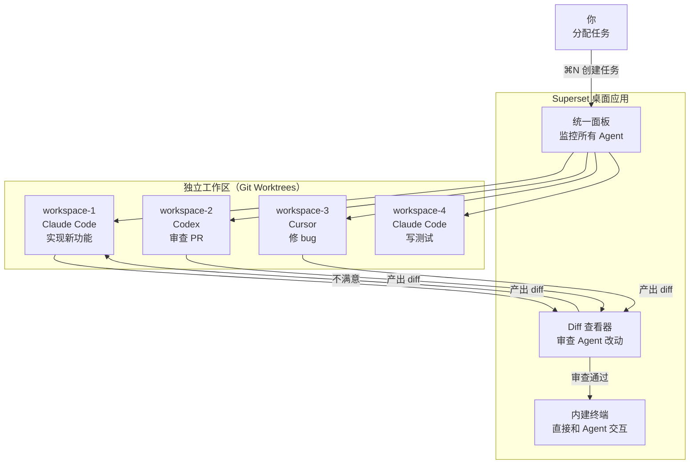

# Superset：AI Agent 的并行调度操作系统

> 你同时给 Claude Code 下了一个需求，让 Codex 审查另一个 PR，再让 Cursor 改一个 bug——三个 Agent 在各自的 git worktree 里并行跑，互不干扰。你在同一个窗口里切换、监控、审查它们的产出。这不是未来，这是 Superset 的日常。

## 是什么

[Superset](https://github.com/superset-sh/superset) 是一个 **AI 编程 Agent 的桌面调度平台**。它把自己定位为「The Code Editor for AI Agents」——不是给人用的代码编辑器，是给 AI Agent 用的。

```text
VS Code / JetBrains = 人写代码的编辑器
Superset           = AI Agent 写代码的调度器
```

核心能力：

- **并行执行**：同时跑 10+ 个 CLI Agent（Claude Code、Codex、Cursor……），每个在自己的 git worktree 里
- **工作区隔离**：每个任务独立分支 + 独立工作目录，Agent 之间不会互相踩文件
- **统一监控**：一个面板看所有 Agent 的状态，完成、报错、需要你介入——一目了然
- **内建审查**：内置 diff 查看器，不用切到终端或 IDE 就能审查 Agent 的改动
- **一键交接**：审查完觉得没问题，一键在 IDE 或终端打开这个工作区，继续人工作业
- **预设脚本**：工作区创建/销毁时自动跑设置脚本——装依赖、复制环境变量、初始化数据库

支持的 Agent 几乎覆盖了市面上所有 CLI 编程助手：

| Agent | 说明 |
|:------|:-----|
| Claude Code | Anthropic 的 CLI Agent，全面支持 |
| OpenAI Codex CLI | OpenAI 的 CLI Agent，全面支持 |
| Cursor Agent | Cursor 编辑器内置 Agent，全面支持 |
| Gemini CLI | Google 的 CLI Agent，全面支持 |
| GitHub Copilot | GitHub Copilot CLI，全面支持 |
| Amp Code / Droid / Mastra Code / OpenCode / Pi | 全部支持 |
| 任意 CLI Agent | 只要能在终端里跑，就能在 Superset 上跑 |

## 架构

Superset 的架构核心是一个简单的想法——**用 git worktree 做沙箱**：



关键设计决策：

**为什么是 git worktree 而不是容器或 VM？**

- 零开销启动——`git worktree add` 比 Docker 容器快一个数量级
- 原生文件系统——Agent 直接读写文件，不需要 volume 映射或文件同步
- 分支级隔离——每个工作区在独立分支上工作，main 分支不受影响
- 不需要额外的镜像、网络配置、资源限制

**为什么是 Electron 桌面应用而不是 Web 应用？**

Agent 跑在你的本机终端里。Web 应用没法管本机的 git worktree、终端进程、文件系统。Electron 可以直接调 Node.js API 做这些事——创建 worktree、spawn 终端进程、监听文件变更。

## 安装

macOS 桌面应用，下载即用：

```bash
# 从 GitHub Releases 下载最新版
# https://github.com/superset-sh/superset/releases/latest

# 前置依赖
brew install bun gh jq caddy
caddy trust    # Caddy 用于本地开发服务器
```

源码跑开发环境：

```bash
git clone https://github.com/superset-sh/superset.git
cd superset
./.superset/setup.local.sh    # 启动本地 Docker Postgres + 初始化
bun run dev                    # 启动所有开发服务器
```

技术栈：**Electron + React + TailwindCSS v4 + Bun + Turborepo**。数据库层用 Drizzle ORM + Neon PostgreSQL，API 层用 tRPC。代码质量用 Biome（格式 + lint 一把梭）。

## 核心机制：工作区预设

Superset 的真正威力不在「并行跑 Agent」，而在**每次创建任务时的自动化环境准备**：

```json
// .superset/config.json
{
  "setup": ["./.superset/setup.sh"],
  "teardown": ["./.superset/teardown.sh"],
  "run": ["bun dev"]
}
```

创建新工作区时，`setup.sh` 自动执行——复制 `.env`、`bun install`、跑数据库迁移。Agent 进来时环境已经就绪，不需要手把手教它配环境。删除工作区时 `teardown.sh` 自动清理。

脚本可以访问环境变量：

- `SUPERSET_WORKSPACE_NAME` — 当前工作区名称
- `SUPERSET_ROOT_PATH` — 主仓库路径

这意味着你可以做很 flexible 的事：根据工作区名称切换数据库分支、按任务类型选择不同的依赖安装策略、在 teardown 里自动清理临时资源。

## 实战场景

### 场景一：并行推进多个需求

```text
09:00  你打开 Superset
09:01  ⌘N → "实现用户登录功能" → Claude Code 开始干活
09:01  ⌘N → "修复支付回调的竞态条件" → Cursor 开始干活
09:02  ⌘N → "给 API 加 rate limiting" → Codex 开始干活

      三个 Agent 并行跑，你在面板上看着它们的进度条。
      哪个先完成、哪个卡住了、哪个需要你回答一个问题——都在同一个窗口里。

09:12  登录功能完成，Diff 查看器弹出改动。
      你审查了一遍——auth 中间件写得不错，但 JWT 过期时间设太短了。
      在 Diff 查看器里直接编辑 → 告诉 Agent "JWT 过期改成 7 天" → 继续。

09:25  三个任务全部完成。你打开终端，git merge 每个工作区的分支。
```

### 场景二：多 Agent 多角度审查

```text
一个 PR 要合并了，你想让不同 Agent 从不同角度审查：

⌘N → "审查 PR #42 的安全漏洞" → Claude Code（安全最强）
⌘N → "审查 PR #42 的性能问题" → Codex
⌘N → "审查 PR #42 的代码风格" → Cursor

三个审查并行，5 分钟后三份报告。
你合并关键发现，贴到 PR review 里。
```

### 场景三：gstack + Superset 全流程

这是真正的威力组合。gstack 提供工作流（思考→规划→构建→审查→测试→交付），Superset 提供并行执行环境：

```text
在 Superset 里同时跑：

workspace-1: /office-hours → 探索新想法
workspace-2: /review → 审查上一个 PR
workspace-3: /implement → 实现已规划的功能
workspace-4: /qa → 测试预发布环境
workspace-5: /cso → 安全审计

5 个 Agent，5 个 worktree，同一个窗口。
```

gstack 给你的是一套成熟的工作流命令，Superset 给你的是同时跑多条工作流的能力。两者组合，一个人就是一支完整的工程团队。

## 和 gstack 的关系

很多人问：Superset 和 gstack 是不是竞品？不是——它们是**互补层**：

| | gstack | Superset |
|---|---|---|
| 定位 | AI 编程**工作流**（流程+角色+命令） | AI 编程**调度平台**（并行+隔离+监控） |
| 解决的问题 | Agent 不知道怎么一步步干活 | Agent 干活时互相踩文件 |
| 核心机制 | 23 个角色 × 斜杠命令 | git worktree × 并行 Agent |
| 交付形态 | Claude Code 技能包 | Electron 桌面应用 |
| 适用场景 | 定义「怎么做」 | 管理「同时做多个」 |

简单的类比：**gstack 是你的虚拟团队的角色和流程，Superset 是这些角色同时干活的办公空间**。

还在用 VS Code 一个窗口一个 Agent 地跑？试试 Superset。你会意识到：阻碍你交付速度的不是 Agent 不够聪明，是你没有给它一个能并行的环境。

## 限制

1. **macOS only**——Windows 和 Linux 目前未正式支持。Electron 本身跨平台，问题主要在 PTY 终端和文件系统 API 的平台差异
2. **资源消耗**——同时跑 5 个 Claude Code 实例对 CPU 和内存的压力不小。16GB 内存的机器跑 3-4 个是极限
3. **学习曲线**——工作区预设、setup/teardown 脚本、多 Agent 协调，需要一定的工程思维来配置
4. **License**——Elastic License 2.0（ELv2），源码可见但不是纯开源。个人和小团队免费使用，云服务商不能直接托管
5. **Agent 冲突**——虽然文件系统隔离了，但如果两个 Agent 同时改同一个 API 接口，合并时还是可能有逻辑冲突。这是分布式开发的经典问题，Superset 没有解决（也不应该解决——这是人的决策）

## 小结

Superset 解决了一个 2026 年 AI 编程的瓶颈问题：**Agent 够聪明了，但你一次只能用一个**。

它的设计哲学值得注意：

1. **worktree 而非容器**——轻量、原生、零配置。不引入 Docker 复杂度
2. **编辑器而非平台**——不是 SaaS，是本机应用。你的代码不出机器
3. **调度而非替代**——不重新发明 Agent，只是让现有 Agent 能并行工作
4. **预设而非手动**——环境准备自动化，Agent 进来就能干活

如果你每天和 Claude Code、Codex 或其他 AI Agent 打交道，Superset 可能比任何新模型都更快提升你的交付速度——因为瓶颈不在 IQ，在吞吐。

> 官方仓库：[https://github.com/superset-sh/superset](https://github.com/superset-sh/superset)
> 官网：[https://superset.sh](https://superset.sh)
> 文档：[https://docs.superset.sh](https://docs.superset.sh)
