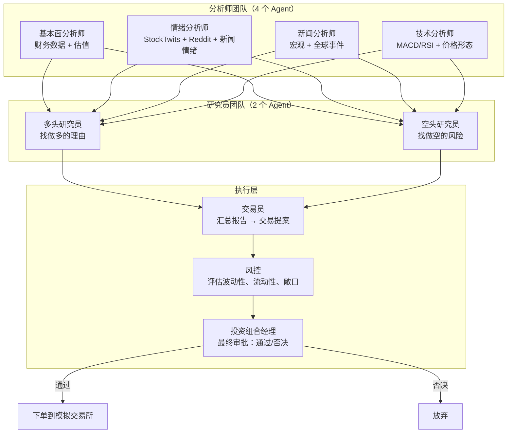

# TradingAgents：用多 Agent 模拟一家交易公司的完整决策链

> 不是「一个 AI 告诉你买什么」——是 8 个专业 AI Agent 各自分析、互相辩论、风控审核、PM 拍板。像一家真正的交易公司一样做决策。

## 一句话理解

[TradingAgents](https://github.com/TauricResearch/TradingAgents) 是一个多 Agent 交易框架，模拟真实交易公司的决策架构。它的核心假设是：**单 agent 做交易决策不够好——你需要分析师、研究员、交易员、风控、PM 组成一条完整的决策链**。

它来自 Tauric Research，有正式的学术论文（arXiv 2412.20138），并且完全开源。

## 一家交易公司的角色，全部由 LLM 扮演



这不是流程图好看——是代码里真实的 Agent 调用链。每一步都是 LLM 调用，每个 Agent 有自己的系统提示词和专注领域。

## 四类分析师：同时看四个维度

### 基本面分析师

读财务报表、算估值倍数、识别内在价值。它会看：
- 收入增长、利润率、ROE
- P/E、P/B、EV/EBITDA 等估值指标
- 现金流健康度、债务水平
- 查找红旗信号（收入确认激进、应收账款异常增长等）

### 情绪分析师

聚合社交媒体情绪——不是看一两条推文，而是批量处理 StockTwits、Reddit 帖子、新闻标题，算出整体的市场情绪偏向。

### 新闻分析师

监控全球新闻和宏观指标——利率变化、地缘政治事件、行业政策。判断这些事件对具体股票的影响方向和程度。

### 技术分析师

用经典技术指标——MACD、RSI、布林带、移动平均线——检测交易信号和价格形态。

四个分析师**同时跑**，各自产出独立的分析报告。不存在「基本面分析师看完了再告诉技术分析师」——并行处理，然后全部交给研究员消化。

## 多头 vs 空头：强制性辩论

研究员团队只有两个人——一个多头，一个空头。这不是偶然的。

```text
多头研究员的系统提示词（简化）：「找出所有支持做多这只股票的理由」

空头研究员的系统提示词（简化）：「找出所有支持做空这只股票的理由」
```

然后他们**辩论**——不是一轮，是多轮（`max_debate_rounds` 控制，默认 2 轮）：

```text
Round 1:
  多头: 从基本面看，收入增长 15%，P/E 低于行业均值 20%
  空头: 但负债率 65%，利息覆盖倍数只有 1.8——杠杆太高了

Round 2:
  多头: 负债率高是因为去年并购。并购标的已开始贡献利润，覆盖率会改善
  空头: 整合风险没有定价进去。去年 40% 的并购标的没有达到预期的协同效应
```

这个辩论机制是 TradingAgents 最聪明的设计——它强制 Agent 审视自己的论点的反面。不是「买买买」——是「我们考虑过做空的理由，结论是这些风险可控，理由如下」。

## 交易员 + 风控 + PM：三道审批

辩论结束后，交易员汇总所有分析报告，形成一个具体的交易提案：

```text
交易员输出示例：

建议：买入 NVDA 500 股 @ 当前市价
理由：
  1. 基本面：营收增长 120%，毛利率 75%，PEG 1.2
  2. 技术面：站上 50 日均线，MACD 金叉
  3. 情绪：Reddit/StockTwits 情绪偏多，但不过热
  4. 空头风险已考虑：估值偏高，但 AI 需求能支撑
仓位：占组合 5%
止损：-8%
```

然后风控审核——评估波动率、流动性、组合整体风险、是否超过单票上限。产出风控报告。

最后到 PM——**PM 有权否决**。如果 PM 认为风险收益比不够好，交易不执行。

```text
PM 输出示例：

审批结果：通过（有条件）
条件：仓位从 5% 降到 3%，止损收紧到 -5%
理由：AI 板块近期波动率上升 30%，降低初始仓位更谨慎
```

这个三道审批的设计不是摆设——它在代码里是真实的三步调用链。每一步都可能中断交易。

## 记忆系统：每次交易的教训都留着

TradingAgents 有两个持久化机制：

### 1. 决策日志（始终开启）

每次跑完，决策记录自动追加到 `~/.tradingagents/memory/trading_memory.md`：

```markdown
## NVDA 2026-01-15

决策：买入，5% 仓位
实际回报（30 天后）：+12.3% vs SPY +3.1%，alpha +9.2%

反思：本次分析正确识别了 AI 需求驱动的营收增长。
空头关于「估值过高」的担忧在市场情绪正面时未被验证。
下次关注：PEG 虽合理但绝对 P/E 仍在历史高位。
```

下次再分析同一只股票时，框架会把过去的决策和反思注入 PM 的系统提示词。这等于**每次交易都在建知识库**。

### 2. 检查点恢复（可选）

用 LangGraph 的 checkpoint 机制——如果分析过程中断了（API 调用失败、网络断开），下次运行可以从断点继续，不用从头重跑 8 个 Agent 的调用链。

## 技术实测：怎么跑

```bash
git clone https://github.com/TauricResearch/TradingAgents.git
cd TradingAgents
pip install .

# 设置 API key
export OPENAI_API_KEY=sk-...

# 启动交互式 CLI
tradingagents
```

CLI 会让你选股票代码、分析日期、LLM 提供商、研究深度。支持全市场（港股、A 股、日股、英股、加密货币）。

Python 调用：

```python
from tradingagents.graph.trading_graph import TradingAgentsGraph
from tradingagents.default_config import DEFAULT_CONFIG

config = DEFAULT_CONFIG.copy()
config["llm_provider"] = "openai"
config["deep_think_llm"] = "gpt-5.5"       # 复杂推理用
config["quick_think_llm"] = "gpt-5.4-mini"  # 简单任务用
config["max_debate_rounds"] = 2              # 辩论轮数

ta = TradingAgentsGraph(debug=True, config=config)
_, decision = ta.propagate("NVDA", "2026-01-15")
print(decision)
```

支持的模型提供商：OpenAI、Anthropic、Google、xAI、DeepSeek、Qwen、GLM、MiniMax、Ollama、Azure、Bedrock。几乎覆盖了所有主流 LLM。

## 和其他交易 Agent 项目对比

| | TradingAgents | AI-Trader | Dexter |
|---|---|---|---|
| 架构 | **多 Agent 决策链** | 单 Agent 平台 | 单 Agent 研究 |
| Agent 数量 | 8 个（分析师×4 + 研究员×2 + 交易员 + 风控 + PM） | 1 个 | 1 个 |
| 决策机制 | 辩论 + 三道审批 | 自主发信号 | 自主规划执行 |
| 输出 | 交易决策（买/卖/持有 + 仓位 + 止损） | 交易信号 | 研究报告 |
| 记忆系统 | 决策日志 + 检查点 | 无 | scratchpad 日志 |
| 学术支撑 | arXiv 论文 | 无 | 无 |
| 支持市场 | 全球（Yahoo Finance 覆盖） | 美股/加密货币 | 美股 |
| 社交化 | 无 | Agent 互相关注、跟单 | 无 |

TradingAgents 是这三个里最「严肃」的——它有正式的学术论文、多 Agent 架构、辩论机制、风控审批。它不是在做一个有趣的 Demo——它是在验证「多 Agent 协作能否产生更好的交易决策」这个学术假设。

## 局限性

1. **成本**——每次分析要跑 8+ 次 LLM 调用，如果模型用 GPT-5.5，一次分析可能消耗几万 tokens
2. **非确定性**——LLM 输出有随机性，同一股票同一天连跑两次可能给出不同结论。论文里承认这一点：这是研究框架，不是生产策略
3. **数据质量**——依赖 Yahoo Finance 的数据，不是彭博/万得级别的专业终端
4. **不连真实券商**——所有交易都在模拟交易所执行，没有实盘接口
5. **仍在学术阶段**——尽管开源且可用，但核心价值是研究多 Agent 决策，不是让你拿它管真钱

## 小结

TradingAgents 这个项目，和 AI-Trader 是两个截然不同的方向：

- **AI-Trader** 在探索「如果 Agent 是交易市场的主体，市场会怎样」——把 Agent 当人
- **TradingAgents** 在探索「如果一家交易公司全部由 Agent 运营，决策质量会不会更高」——把 Agent 当职能角色

前者是平台，后者是决策系统。两者加在一起，已经勾勒出了 Agent-Native Trading 的全部图景：**Agent 自己分析、自己辩论、自己做决策、自己发信号、自己跟单、自己迭代**。人只需要做一件事——决定是否按下「实盘」按钮。
