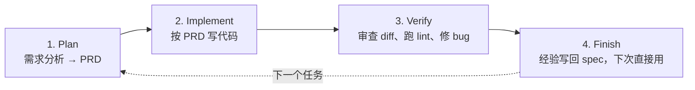

# Trellis：给 AI Agent 装上工程框架，不再每次从零开始

> 你每次打开 Claude Code，都得重新解释一遍项目背景、代码规范、当前任务。Agent 做完事之后，学到的经验也没留下来。Trellis 做的事情就是把规范、任务、记忆都持久化到仓库里——Agent 每次进来都像从未离开过。

## 是什么

[Trellis](https://github.com/mindfold-ai/Trellis) 是一个 AI Agent 的工程框架（npm 包 `@mindfoldhq/trellis`），自称「最好的 Agent harness」。它定义了一套目录结构和工作流，让 AI Agent 在多个会话之间保持上下文。

```text
没有 Trellis：
  你 → 解释项目 → Agent 干活 → 会话结束 → 一切归零

有了 Trellis：
  你 → Agent 自动读 .trellis/ 下的规范 + 任务 + 日志 → 直接干活
  做完 → 学到的经验自动写回 .trellis/spec/
```

核心定位：

- **不是另一个 Agent**——它是 Agent 的工作框架，定义「怎么干活」
- **规范持久化**——代码风格、架构约束写一次，Agent 每次自动读
- **任务为中心**——PRD → 实现 → 审查 → 总结经验，四阶段闭环
- **16+ 平台兼容**——Claude Code 完整支持，Cursor、Codex、Gemini 等也可用

## 四阶段工作流



### Plan——把需求变成 PRD

`trellis-brainstorm` 子 Agent 和你讨论需求，写出 `prd.md`。不是自己瞎猜——它会问清楚边界条件和验收标准。

### Implement——按 PRD 写代码

`trellis-implement` 子 Agent 严格按 PRD 实现。它只能写代码，不能改规范。

### Verify——审查 + 自修复

`trellis-check` 子 Agent 对照 PRD 审查改动，跑 lint → 类型检查 → 测试。发现问题自己修，修完重新审，直到通过。

### Finish——把经验留下来

完成后的 learnings 自动 promote 到 `.trellis/spec/`。下次 Agent 做类似任务，这些经验就是它的「肌肉记忆」。

## 目录结构

```text
项目根目录/
├── .trellis/
│   ├── spec/              # 规范——写一次，自动注入每次会话
│   │   ├── conventions.md  # 代码风格、命名规范
│   │   ├── architecture.md # 架构约束
│   │   └── learnings.md   # 从之前任务中积累的经验
│   ├── tasks/             # 任务——每个任务一个文件夹
│   │   └── add-payment/
│   │       ├── prd.md      # 需求文档
│   │       ├── context.md  # 实现上下文
│   │       └── review.md   # 审查结果
│   └── workspace/         # 日志——会话历史
│       └── journal.md     # 每次会话的记录
```

和 Planning with Files 的 3 文件模式不同——Trellis 按**角色**组织（规范/任务/日志），Planning with Files 按**阶段**组织（计划/发现/进度）。

## 怎么用

```bash
# 安装
npm install -g @mindfoldhq/trellis@latest

# 初始化项目
trellis init -u your-name

# 开始一个任务
trellis brainstorm "添加支付宝支付功能"
trellis implement
trellis check
trellis finish
```

初始化后，`.trellis/` 目录已经建好，Agent 每次启动自动加载 `spec/` 下的规范。

## 子 Agent 分工

Trellis 把工作拆给了 6 个专门化的子 Agent，各有明确的权限边界：

| Agent | 职责 | 能写文件 | 能 git commit |
|---|---|---|---|
| dispatch | 编排阶段、调度其他 Agent | ❌ | 只能调脚本 |
| brainstorm | 评估需求、写 PRD | ✅（tasks/ 下） | ❌ |
| research | 找模式和信息 | ❌（仅 research/） | ❌ |
| implement | 按 PRD 写代码 | ✅ | ❌ |
| check | 审查 + 自修复 | ✅ | ❌ |
| debug | 修 bug | ✅ | ❌ |

只有 dispatch 能碰 git，其他 Agent 只能改文件。这不是限制——这是安全边界。

## 和 Planning with Files 的区别

| | Trellis | Planning with Files |
|---|---|---|
| 定位 | Agent 工程框架 | Agent 工作记忆 |
| 核心抽象 | 规范 + 任务 + 日志 | 计划 + 发现 + 进度 |
| 工作流 | Plan→Implement→Verify→Finish | 自由流程 |
| 子 Agent | 6 个专职 Agent | 无 |
| 平台 | Claude Code 完整 + 15+ 其他 | 60+ Agent |
| 适合 | 团队规范化的 Agent 工作流 | 个人长任务的上下文持久化 |

两者互补——Trellis 管「怎么组织工作」，Planning with Files 管「怎么记住上下文」。

## 适用场景

**适合用 Trellis**：

- 团队需要统一的 Agent 工作规范——不是每个开发者各写各的 prompt
- 重复性任务——每次 Agent 启动都能复用之前的经验
- 想要严格的多阶段审查流程

**可以不用**：

- 单次简单任务——框架的开销大于收益
- 已经有一套自己的 CLAUDE.md + task_plan 工作流

## 小结

Trellis 解决的问题很明确：**AI Agent 每次启动都是白纸一张**。它通过持久化规范、任务和日志，让 Agent 有「上次干活的经验」。本质上是把软件工程的实践（需求文档、代码审查、经验总结）搬到了 AI Agent 的协作流程里。

---

**相关阅读：**
- [Planning with Files：给 AI Agent 装上"外存"](planning-with-files-guide.md)
- [Open Code Review：阿里内部 AI 代码审查工具](open-code-review-guide.md)
- [Claude Code 完全指南](../claude-code/index.md)
