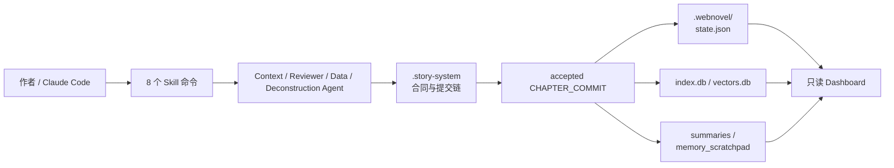

# Webnovel Writer：让 AI 写到第 200 章还记得第一章的设定

> 长篇网文最大的敌人不是文笔，是遗忘。写到 80 章时忘了 30 章埋的伏笔，200 章时角色的战力体系已经前后矛盾。Webnovel Writer 是跑在 Claude Code 上的一个插件——它用一套 Story System 把「边写边记、边写边查」变成了自动流程。

## 一句话定位

这不是一个「输入 prompt 输出一章」的生成器。这是一个**长篇连载的一致性系统**——每写一章，自动提炼事实、更新状态、存入检索索引，下一章动笔前先查「之前发生了什么」。



## 为什么需要它

长篇创作写到第几十章以后，人会遇到的问题 AI 也会遇到：

- 角色动机漂移——忘了当初为什么做这个决定
- 战力、时间线、地点互相打架——修炼体系写到后面和前面矛盾
- 伏笔有登记吗？推进了吗？回收了吗？——埋了但忘了
- 爽点节奏怎么样——前面多少章没出爽点了？

传统做法是作者自己写设定文档 + 手动维护大纲 + 反复翻前面的章节。这个插件把这件事自动化了——**写前先查、写后登记、自动审查一致性**。

## 核心工作流

### 写一章经历了什么

`/webnovel-write` 不是把 prompt 丢给模型跑一次——它是一个 9 步流水线：

```
1. 预检项目健康状态（文件完整性、Story System 就绪）
2. 刷新本章 runtime contract（当前卷、当前章、时间线位置）
3. context-agent 生成写作任务书（本章要推进什么伏笔、完成什么事件）
4. 根据任务书起草正文
5. reviewer 做多维审查，blocking issue 触发阻断
6. 润色、排版、Anti-AI 终检
7. data-agent 提取本章新产生的事实
8. 生成 CHAPTER_COMMIT，驱动 state/index/summary/memory/vector 五路投影
9. 执行章节级备份
```

关键设计：**「怎么写」和「写了什么」分开**。文笔和节奏可以放开发挥，但发生过的事实必须登记、过审、存档，不能含糊。

### 八条 Skill 命令

| 命令 | 作用 |
|------|------|
| `/webnovel-init` | 分阶段问答，搭骨、设定集、总纲和初始状态 |
| `/webnovel-plan` | 基于总纲拆卷、拆章、补时间线 |
| `/webnovel-write` | 一条龙写完一章 |
| `/webnovel-review` | 从爽点、一致性、节奏、OOC 等维度审查 |
| `/webnovel-query` | 查询角色、伏笔、节奏和实体关系 |
| `/webnovel-learn` | 把好用的写法存入项目长期记忆 |
| `/webnovel-dashboard` | 启动只读可视化面板 |
| `/webnovel-doctor` | 阶段感知体检——目录、文件、DB、RAG、依赖 |

## Story System——整套系统的核心

v6.0.0 引入的 Story System 是理解这个项目的关键。它借鉴了版本控制的思想：

- **`.story-system/`**：唯一的事实源头。动笔前的「合同」和写完后的「提交」都在这里
- **`CHAPTER_COMMIT`**：一章写完后的提交记录。新事实从这入账，通过 accepted 后才被接受
- **五路投影**：从主链派生出来的只读视图——`state.json`（状态）、`index.db`（索引）、`summaries/`（摘要）、`memory_scratchpad.json`（长期记忆）、vectors.db（向量检索）
- **`projection_log.jsonl`**：投影执行日志——用来定位哪一路没同步

这个设计让「写了什么」有明确的生命周期：提交 → 接受 → 投影到五路索引 → 可检索。不是写完就丢给 LLM 的上下文窗口——窗口会满，索引不会。

```
作者写一章
    → 生成 CHAPTER_COMMIT（记录本章事实）
    → 五路投影更新
    → 下一章前查 state + index + memory
    → 新章延续旧章的设定和伏笔
    → 循环
```

## 快速上手

```bash
# 1. 安装插件（Claude Code Marketplace）
claude plugin marketplace add lingfengQAQ/webnovel-writer --scope user
claude plugin install webnovel-writer@webnovel-writer-marketplace --scope user

# 2. 安装 Python 依赖
python -m pip install -r https://raw.githubusercontent.com/lingfengQAQ/webnovel-writer/HEAD/requirements.txt

# 3. 初始化一本书——在 Claude Code 中输入
/webnovel-init

# 4. 开始写
/webnovel-plan 1      # 规划第 1 卷
/webnovel-write 1     # 写第 1 章
```

初始化后生成的书项目目录：

```
project-root/
├── .story-system/        # 合同、章节提交和事件审计
├── .webnovel/            # 状态、索引、摘要、备份、长期记忆
├── 正文/                  # 章节正文
├── 大纲/                  # 总纲、卷纲、时间线、章纲
├── 设定集/                # 世界观、角色、力量体系设定
└── 审查报告/              # 章节审查报告
```

## RAG——写完的东西怎么检索

每章写完后提取的事实不是存在某个 txt 里等人翻——它们被写入 SQLite 索引和向量数据库：

```bash
# .env 配置（在书项目根目录）
EMBED_BASE_URL=https://api-inference.modelscope.cn/v1
EMBED_MODEL=Qwen/Qwen3-Embedding-8B
EMBED_API_KEY=your_embed_api_key

RERANK_BASE_URL=https://api.jina.ai/v1
RERANK_MODEL=jina-reranker-v3
RERANK_API_KEY=your_rerank_api_key
```

没配 Embedding API Key 也能用——系统自动退回 BM25 关键词检索。语义召回会弱一些，但基础的关键词匹配还在。Embedding 和 Rerank 都可以换成任何兼容 OpenAI 格式的接口。

## 内置 37 个题材模板

不是只能写玄幻——内置了 37 个中文网文题材模板，覆盖主流网文类型：

| 类型 | 题材 |
|------|------|
| 玄幻修仙 | 修仙、系统流、高武、西幻、无限流、末世、科幻 |
| 都市现代 | 都市异能、都市日常、都市脑洞、现实、电竞、直播文 |
| 言情 | 古言、宫斗宅斗、青春甜宠、豪门总裁、狗血言情、替身文、种田 |
| 特殊题材 | 规则怪谈、悬疑脑洞、悬疑灵异、历史古代、抗战谍战、知乎短篇、克苏鲁 |

`/webnovel-init` 时会让你选题材，也支持把几个题材揉在一起写。

## 追读力系统

这是一个有意思的设计——不只是「写出来」，还要「写得让人想追」。v5.3 引入的追读力系统覆盖四个维度：

- **Hook**：每章开头的钩子有没有吸引力
- **Cool-point**：爽点密度和力度
- **微兑现**：小伏笔有没有在 3-5 章内回收
- **债务追踪**：开了几条线（感情、修炼、势力），每条线进度到哪了

审查报告里会包含追读力评分和改善建议。Dashboard 上也能看到每章的追读力趋势图。

## Dashboard——只读可视化

```bash
/webnovel-dashboard
# 打开浏览器 → http://localhost:XXXX
```

Dashboard 是只读的——只能看，不能改。展示内容：

- 项目状态（当前卷、当前章、完成度）
- 实体关系图（角色-地点-势力-道具的关系网）
- 章节内容和审查报告
- 伏笔追踪（登记-推进-回收 三态）
- 追读力趋势图（Hook / Cool-point / 微兑现 / 债务 四曲线）

前端是预打包的静态文件，跟着插件一起发版，本地不需要 `npm build`。

## 运维——doctor 和 preflight

项目出问题时，两条命令定个位：

```bash
# 预检——一次性检查所有前置条件
python webnovel.py --project-root "." preflight

# 体检——分阶段诊断，给出影响评估和修复建议
python webnovel.py --project-root "." doctor --format text
```

重点关注的几个指标：
- `story_runtime.mainline_ready` 是否为 true
- `.story-system/commits/chapter_XXX.commit.json` 是否存在且 accepted
- `projection_status` 五路是否全是 `done` 或 `skipped`
- `index.db`、`summaries/`、`memory_scratchpad.json` 是否正常生成

## 值得关注的设计决策

**为什么用提交链而不是全局 prompt？**

LLM 的上下文窗口是有限的——128K tokens 也装不下 200 章。把所有历史内容塞进 prompt 不是方案。Webnovel Writer 的做法是：写前查（RAG 检索相关内容）、写后存（提炼事实写入索引）、写时审（一致性检查），让上下文窗口只装载本章需要的信息。

**为什么用 Agent 流水线而不是一个 prompt？**

写一章需要的不是一个强大的 prompt，而是多个角色的协作——context agent 管上下文、reviewer 管质量、data agent 管事实提炼。分工明确比一个大而全的 prompt 更可控。

**为什么 Dashboard 是只读？**

防止 AI 在查看状态时意外修改数据。「看」和「改」分开——查询命令和写作命令分别走不同的 code path，状态系统的写入只发生在 write 和 commit 环节。

自己这周刚写完容器化系列和 OOP 系列，再看这个项目的设计——把「长篇写作的一致性维护」拆成提交链 + 投影 + 检索的流水线，设计和工程上都值得一读。
