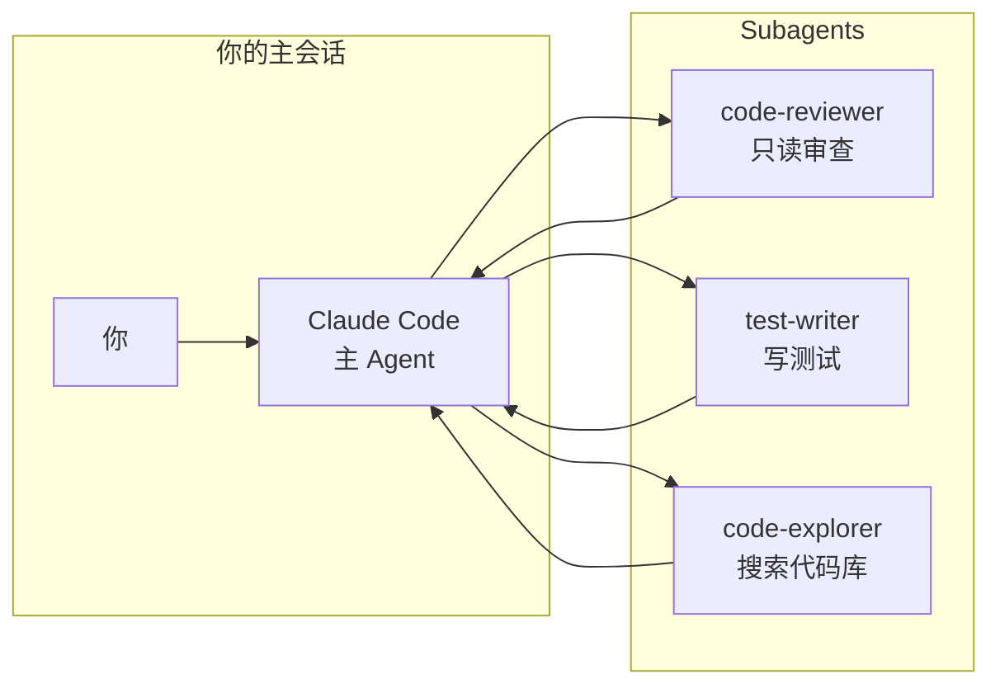
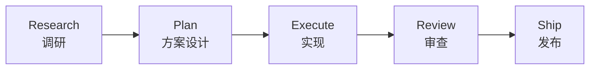

# Claude Code 最佳实践：从 vibe coding 到 agentic engineering

> 基于 [shanraisshan/claude-code-best-practice](https://github.com/shanraisshan/claude-code-best-practice) 仓库整理，结合个人实践经验。

## 你在哪个阶段

大部分 Claude Code 用户的成长路径是这样的：

```
vibe coding → 学会 /plan → 写 CLAUDE.md → 拆分 subagent → 编排 workflow
    ↑               ↑              ↑               ↑              ↑
   "帮我写个"     "先想清楚"     "记住项目规则"   "分工协作"     "流水线化"
```

每往右一步，你的"拍脑袋"[1m] 比例就降低一点，产出质量就稳定一点。

这篇文章不翻文档——文档你自己会看。我从社区最佳实践中提炼**最影响效率的 5 个决策**，每个都对应一个具体的操作习惯。

## 1. 上下文管理：300k token 之后 Claude 开始"变傻"

Claude Code 的上下文窗口很大，但**有效推理质量**在约 300k-400k tokens 后开始明显下降。不是 API 报错——是你的复杂任务会出"诡异 bug"，而且越修越多。

**核心原则：会话永远不要占满窗口。**

```
你当前上下文使用量         你的状态
─────────────────────    ──────────────
< 40% 窗口                 安心干活，质量最佳
40% - 60%                 正常，但开始注意
60% - 80%                 该 /compact 了
> 80%                     Claude 已经在硬撑，你也是
```

### 五个保持上下文干净的习惯

**① 手动 /compact 优于自动压缩**

自动压缩是通用算法——它扔掉了它认为不重要的东西。但只有你知道什么最重要。手动 `/compact` 时可以带一句提示告诉 Claude 保留什么：

```
/compact 保留数据模型设计和 PRD 内容，其他可以丢掉
```

**② rewind > correct**

当 Claude 一个 turn 跑偏了，不要在那个跑偏的结果上继续纠错。`Esc` + `Esc` 回退到跑偏前的检查点，重新开始。纠错比回退消耗更多 token，而且 Claude 会尝试"修补"而不是"重做"。

**③ 新任务 = 新会话**

不要在一个会话里塞三个不相关的任务。Claude 会把前两个任务的上下文当成第三个任务的"隐含背景"，引出奇怪的假设。

**④ subagent 隔离脏活**

需要搜索代码库、读大量文件、做探索性分析？开一个 subagent。探索过程的"噪音"不会污染你的主会话上下文。

```markdown
<!-- .claude/agents/explore.md -->
---
name: explore
description: 只读探索，不修改任何文件
tools: Read, Grep, Glob, Bash, WebSearch
---
你是代码探索助手。只搜索和阅读，不编辑。
```

**⑤ CLAUDE.md 控制在 200 行以内**

CLAUDE.md 是每次会话都加载的——太长的话，前面规则会被后面的淹没。如果规则真的很多，拆分到 `.claude/rules/` 里，用 YAML frontmatter 做按需加载：

```markdown
<!-- .claude/rules/react-patterns.md -->
---
description: React 组件编写规范
globs: "**/*.tsx,**/*.jsx"
---
# React 规范
- 用函数组件，不用 class
- 一个文件只导出一个组件
```

`globs` 字段让这条规则只在匹配文件时才加载——写 Python 时不会把 React 规则也塞进上下文。

## 2. Plan Mode：每次开始前的 5 秒投资

这不是"要不要用"的问题，是"什么时候不用"的问题。

**一定要 plan 的场景：**
- 涉及 3 个以上文件的改动
- 新功能、新模块
- 你还没想清楚怎么做

**不需要 plan 的场景：**
- 单行修复、typo
- 你已经完全想好了，只需要 Claude 执行

社区数据：用 `/plan` 写的代码，返工率大约只有直接让 Claude 写的 1/3。因为 plan 阶段 Claude 会主动发现你的需求矛盾——"你说要做 A，但你现有的 B 结构不支持 A"。

## 3. Subagent：不要让一个人干所有活

Claude Code 最强的能力不是"一个超级聪明的 AI"，而是**你可以派多个 AI 同时干不同的事**。



三个最实用的 subagent 类型：

| Subagent | 职责 | 工具权限 |
|---|---|---|
| `code-reviewer` | 审查当前 diff，找 bug | Read, Grep, Bash |
| `code-explorer` | 搜索代码库，理解架构 | Read, Grep, Glob |
| `test-writer` | 为变更写测试 | Read, Write, Bash |

关键设计原则：**subagent 的权限应该是它完成任务所需的最小集合。** 不需要写文件的 subagent 就别给 Write 权限。

## 4. Skills：把经验固化为可复用能力

Skill 是你写给 Claude 的"标准操作流程"——把一个领域的最佳实践固化为 `SKILL.md`。

社区里最实用的 skills（按使用频率）：

| Skill | 做什么 | 来源 |
|---|---|---|
| `code-review` | 审查当前变更，返回分级问题列表 | anthropics/skills |
| `simplify` | 检查变更中的过度设计、重复代码 | compound-engineering |
| `security-review` | 检查安全漏洞 | anthropics/skills |
| `design-review` | 从设计角度审查 UI 变更 | compound-engineering |
| `frontend-design` | 生成前端 UI 代码 | compound-engineering |

### 怎么用别人写的 skill

```bash
# 用 Skill 工具直接调用
/review         # → 触发代码审查
/security-review  # → 触发安全审查
```

### 什么时候自己写 skill

当你发现自己对 Claude 说了三次同样的话——把它写成 skill。比如：

- "每次生成 Python 代码，用 ruff 格式化，type hint 不能省略"
- "commit message 格式：`type(scope): description`"
- "API 响应的错误信息必须是中文"

这些不是项目规则（不该放 CLAUDE.md），而是**操作流程**（该放 skill）。

## 5. 五种 Workflow 模式

社区里最成熟的 workflow 都遵循同一个弧线：



不用每个任务都跑满五步。一个 typo 修复直接从 Execute 开始，一个协议设计可能要跑完整弧线。

### 最常用的 workflow 速查

| Workflow | 适用场景 | 核心链路 |
|---|---|---|
| Superpowers | 通用开发辅助 | 14 个 skills，零配置 |
| Spec Kit | 需要先出规范的项目 | Command → 规范生成 → 实现 |
| Get Shit Done | 快速交付，迭代优先 | Agent 分工 → 并发执行 |
| BMAD METHOD | 复杂系统，模块化 | Agent teams + 42 skills |

对于个人项目，从 **Superpowers** 开始就够了。它的 14 个 skills 覆盖了日常开发的 80% 场景，不需要自己写任何配置。

## 你可以从今天开始改的三个习惯

1. **每 30 分钟看一眼 token 用量**（右侧状态栏），接近 60% 就 `/compact 保留关键设计决策`
2. **涉及 3 个以上文件，先 `/plan` 再动手**——你会惊讶 Claude 能发现多少你自己没想到的坑
3. **把 CLAUDE.md 里超过两次重复说的规则**移到 `.claude/rules/` 里，加 `globs` 条件加载

这些不是"最佳实践"——是你明天就能感受到差别的小改变。
