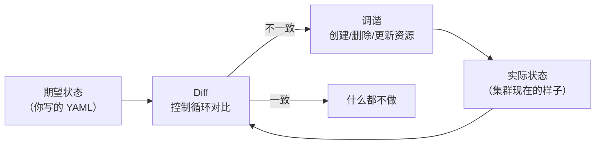
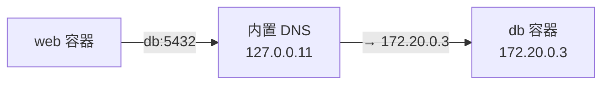
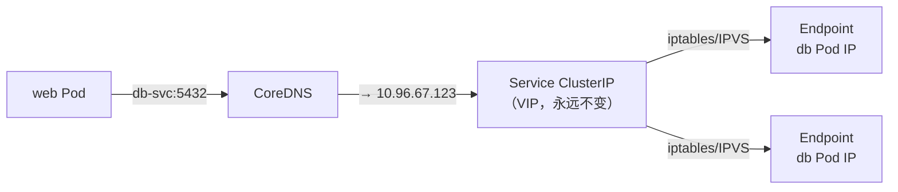

# 从 Compose 到 K8s 的思维切换

> 前三篇我们分别深入了 Docker、Compose、K8s。现在把它们放在一起对比——不是为了分出谁更好，而是弄清楚：什么时候该选哪个？以及从 Compose 切换到 K8s 时，思维方式需要发生什么根本变化？

## 不是你死我活——是不同问题域的工具

最常见的误区是把 K8s 当成「更强大的 Compose」。不是的。

```
Compose 解决的问题       K8s 解决的问题
─────────────────      ─────────────────
单机上多容器怎么协作      多台机器上容器怎么分布
依赖之间怎么有序启动      服务之间怎么发现和负载均衡
开发环境怎么一键拉起      生产环境怎么自愈和滚动更新
```

**Compose 解决的是开发体验问题。K8s 解决的是生产可靠性问题。** 如果你只有一个 VPS 跑个人项目，K8s 不会让事情更好——它只会让事情更复杂。如果你有一个需要三个 9 可用性的生产集群，Compose 做不到。

这不是「K8s 比 Compose 强」的关系，而是**不同规模的问题需要不同复杂度的工具**。

## 思维模式：过程式 vs 声明式

这是最根本的区别，比任何 YAML 字段的差异都重要。

### Compose：过程式思维

Compose 的 YAML 定义的是**你要运行什么服务**。启动时它按依赖顺序逐个创建容器：

```yaml
services:
  db:
    image: postgres:16-alpine
  web:
    depends_on:
      - db        # 明确告诉 Compose：先起 db，再起 web
```

你的心智模型是**时间线**——先 A，后 B，再 C。这是对 `docker run` 的平替升级：以前手动敲三条命令，现在一个文件搞定。内核仍然是「我来告诉你按什么顺序做什么」。

### K8s：声明式思维

K8s 的 YAML 定义的是**集群最终应该长什么样**。你不指定顺序，你指定期望状态：

```yaml
spec:
  replicas: 2     # 告诉 K8s：我要 2 个副本。怎么搞到的？你看着办。
```

你的心智模型变成了**状态声明**——我要什么结果，中间过程不关心。控制循环持续对账，发现偏差就自动修正：



这就是为什么 K8s 里 `depends_on` 不存在——**声明式模型不要你管顺序**。你声明了 Service 和 Deployment 应该存在，K8s 自己决定什么时候该创建什么。如果 web Pod 先起来了但 db 还没好，web 的健康检查会报错，K8s 会不断重启它直到 db 能连上——不优雅，但最终会自愈。

（现实中 K8s 确实没有 Compose 式的 `depends_on: condition: service_healthy`，启动顺序依赖通常靠 init containers 或应用层面的重试来解决。）

### 一句话总结

| | Compose | Kubernetes |
|---|---|---|
| 你给什么 | 执行计划（先起这个，再起那个） | 期望状态（我要 3 个 web） |
| 系统做什么 | 按依赖顺序启动容器 | 持续对比 + 自动调谐 |
| 容器挂了 | 不会自动重启（除非配 restart） | 自动补到期望副本数 |
| 你改了配置 | `docker compose up -d` 重新创建 | `kubectl apply`，控制器自动滚动更新 |

## 网络：看起来像，实际上多了一层

两边的使用体验都是「服务名即 DNS」。但实现路径完全不同。

### Compose 网络



- DNS 解析直接返回**容器的 IP**
- 所有容器在同一个 bridge 网络上，二层可达
- 简单直接——容器名 → 容器 IP，一步到位

### K8s 网络



- DNS 解析返回的是**Service 的虚拟 IP**（不是 Pod IP）
- 请求到达 VIP 后，由 iptables/IPVS 规则 DNAT 到某个 Pod IP
- **多了一层 Service**——这一层是 Pod 可以随意重建的代价

这多出来的一层，赋予了 Compose 没有的能力：

| 能力 | Compose | K8s |
|------|---------|-----|
| 服务发现 | 容器名 → 容器 IP (DNS) | Service 名 → ClusterIP → Pod IP |
| 负载均衡 | 无（DNS round-robin 靠客户端） | Service 内置：iptables/IPVS 随机分发 |
| Pod 重建后 IP 变了 | 不适用（容器 IP 通常固定） | 自动更新 Endpoints，客户端无感知 |
| 跨节点通信 | 做不到（单机） | Service 自动跨节点转发 |

## 配置管理：.env vs ConfigMap/Secret

Compose 的配置链条：

```
Shell 环境变量
  ├── .env 文件（自动加载）
  ├── env_file（手动指定）
  └── environment: 段
      优先级从低到高
```

K8s 的配置链条：

```
ConfigMap（明文配置）
  ├── 通过 env.valueFrom.configMapKeyRef 注入为环境变量
  └── 通过 volume 挂载为文件
Secret（敏感数据）
  ├── 通过 env.valueFrom.secretKeyRef 注入为环境变量
  └── 通过 volume 挂载为文件
```

关键区别：

**Compose 用文件边界隔离敏感信息**：
```bash
# .env（不入 Git）
POSTGRES_PASSWORD=dev-secret-123
```
```yaml
# compose.yaml（入 Git）
environment:
  - POSTGRES_PASSWORD=${POSTGRES_PASSWORD}
```

**K8s 用资源类型隔离敏感信息**：
```yaml
# Secret（base64 编码，可配 RBAC 控制谁有权读）
apiVersion: v1
kind: Secret
metadata:
  name: db-secret
data:
  password: ZGV2LXNlY3JldC0xMjM=    # echo -n 'dev-secret-123' | base64
---
# Deployment 里引用
env:
  - name: DB_PASSWORD
    valueFrom:
      secretKeyRef:
        name: db-secret
        key: password
```

Compose 的 `.env` 是文件权限保护；K8s 的 Secret 可以做 RBAC 控制（谁有权 `kubectl get secret`）、可以对接外部密钥管理系统（如 Vault）、可以自动轮换。对于团队协作场景，K8s 的配置管理更结构化——ConfigMap 可以做版本管理、Secret 可以做访问审计。

## 什么时候用什么

这是这个系列最核心的决策框架：

### 用 Docker 就够了（不需要 Compose）

- 只跑一个容器
- 不需要容器间通信
- 比如：本地跑个 Redis 做缓存、跑个 nginx 看静态文件

### 用 Compose

```
✅ 所有容器跑在同一台机器上
✅ 服务数量 2-10 个
✅ 你接受重启时的几秒不可用
✅ 团队小（1-5 人），没有专人管基础设施
✅ 你需要一键启动整个开发环境
```

**个人项目、内部工具、开发/测试环境、小型生产（单机 VPS）——Compose 够用且好用。**

### 上 K8s

```
✅ 需要跨多台机器调度容器
✅ 需要自动伸缩（根据负载增减副本）
✅ 需要零停机部署（滚动更新）
✅ 需要自愈（Pod 挂了自动补）
✅ 有专人维护集群（或用托管 K8s）
✅ 团队规模 5+，需要标准化部署流程
```

**业务应用的生产环境、需要 SLA 的服务、需要灰度/蓝绿部署的场景——K8s 是标准答案。**

### 灰色地带：K3s 和 Nomad

如果你正好卡在中间——不是单机但也不是大集群——有两个轻量级选项：

- **[K3s](https://k3s.io/)**：Rancher 做的轻量 K8s，砍掉了云厂商相关的功能，二进制 100MB，能在树莓派上跑。适合边缘计算、小规模生产环境。
- **[Nomad](https://www.nomadproject.io/)**：HashiCorp 的调度器，比 K8s 简单很多——一个二进制管容器 + 非容器工作负载。如果你觉得 K8s 太重但 Compose 不够，Nomad 是个值得一看的选项。

## 最后的建议：不要提前优化

这个系列写到这里，最重要的建议不是技术细节，而是心态：

1. **从 Docker 开始**——把应用容器化，这是基础，后面所有东西的基石
2. **服务多了上 Compose**——这是自然的下一步，你会在需要它的时候感知到（手动敲命令烦了）
3. **只有当你真切感受到 Compose 的痛点时，再考虑 K8s**——别因为「大厂都用 K8s」就上 K8s

> 什么时候 Compose 的痛点变得真切？——第一次凌晨被报警叫醒，因为唯一那台机器挂了。第一次流量高峰时手动 `docker compose up -d --scale` 但机器资源不够。第一次上线时用户投诉 502。
>
> 在那之前，把精力花在写好代码上。

## 下一步

K8s 的问题解决了，但 K8s YAML 的碎片化问题还没解决——一个应用散落在十几个文件里，多环境管理靠复制粘贴。Helm 就是来解决这个的：把 K8s 资源打包、模板化、版本化。

→ 下一篇：[Helm：Kubernetes 的包管理器](helm.md)
