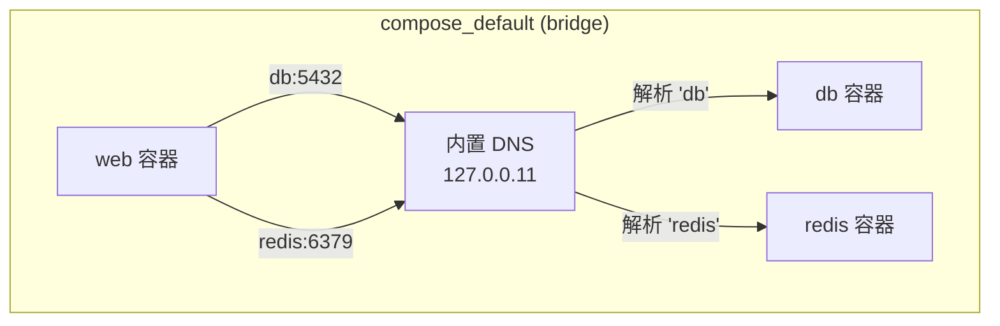
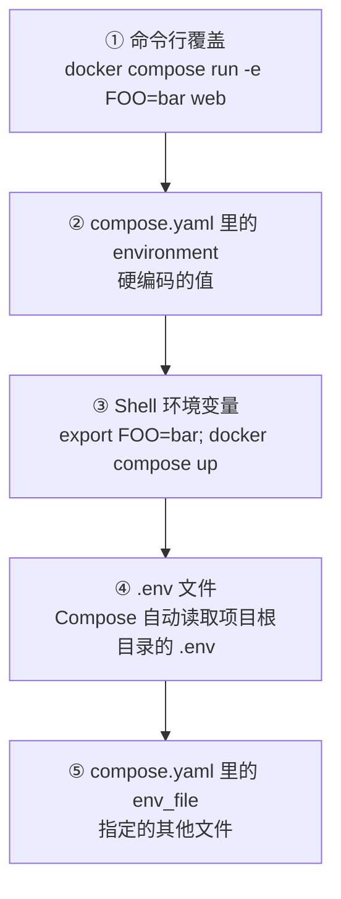

# Docker Compose：从单容器到多容器协作

> 上一篇搞清楚了单个容器怎么跑。但真实应用从来不是一个容器的事——web 要连数据库、要接缓存、要挂后台任务。本篇从手动编排的痛点出发，讲清楚 Compose 的设计意图和核心机制。

## 痛点：手动管理多容器的地狱

上一篇我们跑了一个 Flask API：

```bash
docker run -d --name myapp -p 8080:5000 -e APP_ENV=production myapp:latest
```

现在加上 PostgreSQL：

```bash
# 先建网络
docker network create mynet

# 启数据库
docker run -d --name db \
  --network mynet \
  -e POSTGRES_PASSWORD=secret \
  -v pgdata:/var/lib/postgresql/data \
  postgres:16

# 启应用
docker run -d --name web \
  --network mynet \
  -p 8080:5000 \
  -e DATABASE_URL=postgresql://postgres:secret@db:5432/mydb \
  myapp:latest
```

再加 Redis：

```bash
docker run -d --name redis --network mynet redis:7-alpine
```

再加一个后台 worker...每加一个服务就要多记一条长长的命令。更麻烦的是：

- **启动顺序**——数据库必须先于 web 启动，不然 Flask 连不上
- **环境变量散落**——每个容器的配置散在各自的命令里，没法统一管理
- **清理残局**——`docker stop web db redis && docker rm web db redis && docker network rm mynet`

Docker Compose 就是来解决这个问题的——**把多容器的运行配置写进一个文件，一条命令管理整个栈**。

## Compose 是什么

一句话：Compose 是 Docker 官方的多容器编排工具。你定义一个声明式的 YAML 文件，描述有哪些服务、用哪个镜像、端口怎么映射、网络怎么连，然后 `docker compose up` 一键启动整个栈。

它不是另一个工具——**现在它就是 Docker 的一部分**（`docker compose`，不是旧的 `docker-compose`）。CLI 内置，不需要额外安装。

## 第一份 compose.yaml

把上面的手动命令翻译成 Compose：

```yaml
# compose.yaml
services:
  web:
    build: .
    ports:
      - "8080:5000"
    environment:
      - APP_ENV=production
      - DATABASE_URL=postgresql://postgres:${POSTGRES_PASSWORD}@db:5432/mydb
    depends_on:
      - db
      - redis

  db:
    image: postgres:16
    environment:
      - POSTGRES_PASSWORD=${POSTGRES_PASSWORD}
    volumes:
      - pgdata:/var/lib/postgresql/data

  redis:
    image: redis:7-alpine

volumes:
  pgdata:
```

然后：

```bash
# 启动整个栈
$ docker compose up -d

# 看状态
$ docker compose ps
NAME                STATUS              PORTS
compose-db-1        running             5432/tcp
compose-redis-1     running             6379/tcp
compose-web-1       running             0.0.0.0:8080->5000/tcp

# 看日志
$ docker compose logs -f web

# 全部停止并清理
$ docker compose down
```

和手敲四条 `docker run` 相比，这套流程的区别在哪？我们来逐一拆解。

## 网络：服务名就是 DNS

Compose 默认创建一个网络，把文件里所有 service 接进去。和上一篇我们手动 `docker network create mynet` 是一个原理——但 Compose 自动做了，而且**服务名就是 DNS 名**。



在 `web` 容器里：

```bash
$ docker compose exec web sh

# 直接用服务名连接
/ # ping db
PING db (172.20.0.3) 56(84) bytes of data.
64 bytes from db.compose_default (172.20.0.3): icmp_seq=1 ttl=64 time=0.15 ms

/ # redis-cli -h redis ping
PONG
```

连接字符串直接用 `db:5432`、`redis:6379`——不需要记 IP，不需要 `--link`。这就是 Compose 默认网络给你做掉的事情。

## 卷挂载：三种方式的选择

```yaml
services:
  web:
    volumes:
      # ① 命名卷——Docker 管理，存在 /var/lib/docker/volumes/ 下
      - uploads:/app/uploads

      # ② bind mount——宿主路径直接映射
      - ./src:/app/src

      # ③ tmpfs——内存文件系统，容器停了就消失
      - type: tmpfs
        target: /app/cache

  db:
    volumes:
      # 命名卷，数据库文件持久化
      - pgdata:/var/lib/postgresql/data

volumes:
  uploads:
  pgdata:
```

选型决策：

| 场景 | 用哪种 | 原因 |
|------|--------|------|
| 数据库文件 | 命名卷 | 持久、Docker 管理、不污染宿主文件系统 |
| 开发时的源码 | bind mount | 改代码实时生效，不需要重建 |
| 临时缓存 | tmpfs | 快、容器停了自动清理 |

> ⚠️ 命名卷在 `docker compose down` 时**不会删除**——这是故意的，防止误删数据。要一并删除卷用 `docker compose down -v`。

## 环境变量：优先级链

Compose 里环境变量可以从多个来源来，它们的优先级从高到低：



实际项目里的典型做法：

**`.env`**（不提交到 Git）：
```
POSTGRES_PASSWORD=dev-secret-123
REDIS_PASSWORD=dev-secret-456
```

**`compose.yaml`**（提交到 Git）：
```yaml
services:
  db:
    environment:
      - POSTGRES_PASSWORD=${POSTGRES_PASSWORD}   # 引用 .env 里的值
```

`.env` 放密码和密钥，`compose.yaml` 放结构——敏感信息和配置结构分离。

可以验证 Compose 解析后的结果：

```bash
$ docker compose config
services:
  db:
    environment:
      POSTGRES_PASSWORD: dev-secret-123
    image: postgres:16
    ...
```

## depends_on 的正确打开方式

`depends_on` 是 Compose 里最容易理解错的一个配置。

### 它做了什么

```yaml
services:
  web:
    depends_on:
      - db
```

**只做了一件事**：控制启动顺序——`db` 先起来，`web` 后起来。没了。

### 它没做什么

**它不等 db 准备好接受连接。** PostgreSQL 的启动过程是：

1. 容器启动 → 2. 初始化文件系统 → 3. 启动 postgres 进程 → 4. 开始监听 5432 → 5. **接受连接**

`depends_on` 只在第 1 步之后就让 web 启动了。但此时 db 可能还在第 3 步初始化，web 连接过去直接失败。

### 解决办法：healthcheck + condition

```yaml
services:
  db:
    image: postgres:16
    healthcheck:
      test: ["CMD-SHELL", "pg_isready -U postgres"]
      interval: 5s
      timeout: 5s
      retries: 5
      # pg_isready 返回 0 表示 PostgreSQL 可以接受连接了

  web:
    depends_on:
      db:
        condition: service_healthy    # 等 db 的健康检查通过才启动
```

加了 `condition: service_healthy` 之后，Compose 会：

1. 启动 db 容器
2. 每 5 秒跑一次 `pg_isready`
3. 连续成功后标记为 healthy
4. **此时才启动 web**

这才是真正的「等数据库 ready」。

```bash
$ docker compose up -d
[+] Running 2/4
 ⠿ Network compose_default   Created
 ⠿ Container compose-db-1     Started (health: starting)
 ⠹ Container compose-web-1    Waiting (dependent: service_healthy)
 ⠿ Container compose-redis-1  Started
```

## 实战：Web + DB + Redis 三服务栈

把上面的知识串成一个真实可跑的项目。

### 项目结构

```
app/
├── app.py
├── requirements.txt
├── .dockerignore
├── compose.yaml
└── .env
```

### app.py

```python
import os
import redis
import psycopg2
from flask import Flask, jsonify

app = Flask(__name__)

def get_db():
    """每次都建新连接——生产环境应该用连接池，这里简化"""
    return psycopg2.connect(os.environ["DATABASE_URL"])

def get_redis():
    return redis.Redis(
        host=os.environ.get("REDIS_HOST", "redis"),
        port=6379,
        decode_responses=True
    )

@app.route("/")
def index():
    return jsonify({"status": "ok"})

@app.route("/health/db")
def health_db():
    try:
        conn = get_db()
        cur = conn.cursor()
        cur.execute("SELECT 1")
        cur.close()
        conn.close()
        return jsonify({"db": "ok"})
    except Exception as e:
        return jsonify({"db": "error", "detail": str(e)}), 500

@app.route("/health/redis")
def health_redis():
    try:
        r = get_redis()
        r.ping()
        return jsonify({"redis": "ok"})
    except Exception as e:
        return jsonify({"redis": "error", "detail": str(e)}), 500

@app.route("/counter")
def counter():
    r = get_redis()
    count = r.incr("page_views")
    return jsonify({"page_views": count})

if __name__ == "__main__":
    app.run(host="0.0.0.0", port=5000, debug=True)
```

### requirements.txt

```
flask==3.1.0
gunicorn==23.0.0
psycopg2-binary==2.9.10
redis==5.2.1
```

### compose.yaml

```yaml
services:
  web:
    build: .
    ports:
      - "8080:5000"
    environment:
      - DATABASE_URL=postgresql://postgres:${POSTGRES_PASSWORD}@db:5432/mydb
      - REDIS_HOST=redis
    depends_on:
      db:
        condition: service_healthy
      redis:
        condition: service_healthy
    # 开发模式：挂载源码 + Flask debug reload
    # volumes:
    #   - .:/app

  db:
    image: postgres:16-alpine
    environment:
      - POSTGRES_PASSWORD=${POSTGRES_PASSWORD}
      - POSTGRES_DB=mydb
    volumes:
      - pgdata:/var/lib/postgresql/data
    healthcheck:
      test: ["CMD-SHELL", "pg_isready -U postgres -d mydb"]
      interval: 3s
      timeout: 3s
      retries: 5

  redis:
    image: redis:7-alpine
    healthcheck:
      test: ["CMD", "redis-cli", "ping"]
      interval: 3s
      timeout: 3s
      retries: 5
    volumes:
      - redisdata:/data

volumes:
  pgdata:
  redisdata:
```

### .env

```
POSTGRES_PASSWORD=please-change-me-in-production
```

### 跑起来

```bash
# 启动
$ docker compose up -d

# 观察 healthcheck 的演变
$ docker compose ps
NAME                STATUS
compose-db-1        healthy
compose-redis-1     healthy
compose-web-1       running

# 验证
$ curl http://localhost:8080/
{"status":"ok"}

$ curl http://localhost:8080/health/db
{"db":"ok"}

$ curl http://localhost:8080/health/redis
{"redis":"ok"}

$ curl http://localhost:8080/counter
{"page_views":1}

$ curl http://localhost:8080/counter
{"page_views":2}

# 模拟故障——停掉 redis
$ docker compose stop redis

$ curl http://localhost:8080/counter
{"page_views":999}   # Redis 挂了，但之前的计数器值还在内存里（当然重启后会丢）

# 恢复
$ docker compose start redis
```

### 一个有趣的细节：数据去哪了

```bash
# 查看卷
$ docker volume ls | grep compose
local     compose_pgdata
local     compose_redisdata

# 停了容器后卷还在
$ docker compose down

$ docker volume ls | grep compose
local     compose_pgdata      # 数据还在
local     compose_redisdata   # 数据还在

# 再次启动，数据全在
$ docker compose up -d
$ curl http://localhost:8080/counter
{"page_views":3}   # Redis 的 AOF 持久化确保了重启后数据还在
```

这就是卷的作用——容器可以随意销毁重建，数据独立于容器的生命周期。

## 常用命令速查

```bash
# ---------- 生命周期 ----------
docker compose up -d                   # 启动所有服务（后台）
docker compose up -d --build           # 重新构建镜像再启动
docker compose down                    # 停止并删除容器、网络
docker compose down -v                 # 顺便删除卷（谨慎！）
docker compose restart web             # 重启单个服务

# ---------- 查看状态 ----------
docker compose ps                      # 所有服务状态
docker compose logs -f                 # 所有日志实时输出
docker compose logs -f web db          # 只看指定服务的日志
docker compose top                     # 每个容器里跑了什么进程

# ---------- 调试 ----------
docker compose exec web bash           # 进 web 容器
docker compose run --rm web pytest     # 临时跑个命令（用完自动删除容器）
docker compose config                  # 查看解析后的完整配置

# ---------- 伸缩 ----------
docker compose up -d --scale worker=3  # 启动 3 个 worker 实例
```

## Compose 的边界

Compose 的设计前提是**单机**。它假设所有容器跑在同一台机器上，共享同一个 Docker daemon。

这意味着：
- 不能跨多台机器部署容器——那是 K8s 的领域
- 没有自动故障转移——容器挂了 Compose 不会自动重启（除非配了 `restart: always`，但那也只是同一台机器上重启）
- 负载均衡需要自己搞——比如在 web 前面放个 nginx，手动配 upstream

理解了 Compose 能做什么、不能做什么，也就理解了为什么需要 Kubernetes。

## 下一步

Compose 解决了单机上多容器的协作问题。但当代应用要跨多台机器、要自动伸缩、要零停机部署时，就需要一个集群级别的编排系统了。

→ 下一篇：[Kubernetes 入门：当「单机」不够用的时候](kubernetes-intro.md)
