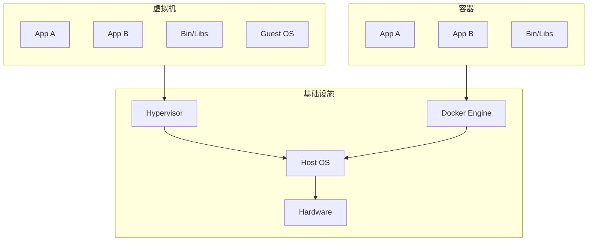
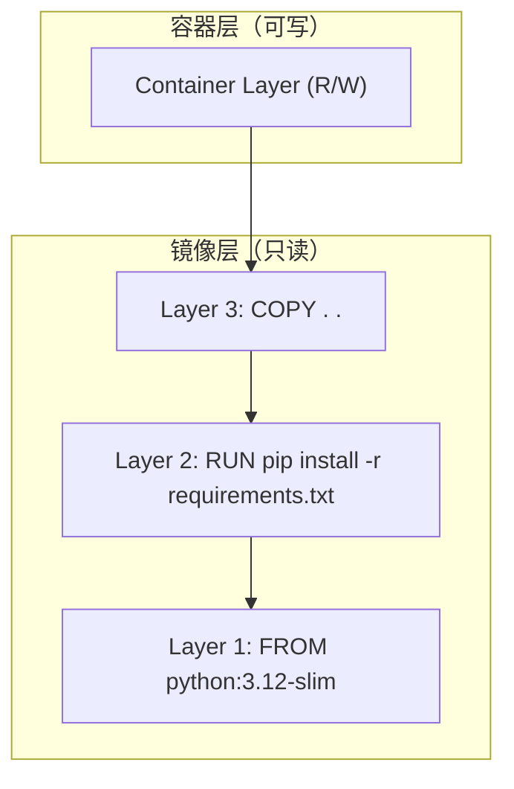
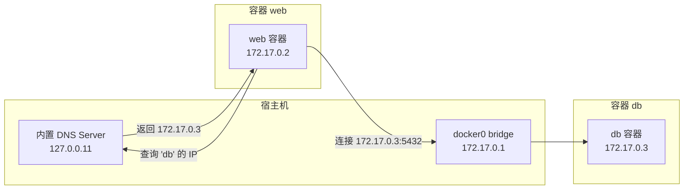

# Docker 核心：不止是「跑个容器」

> 容器不是轻量级虚拟机，镜像不是压缩包，Dockerfile 不是命令清单。这篇文章从底层机制出发，讲清楚 Docker 真正在做什么，以及为什么要这样设计。

## 为什么还要学 Docker？

因为在任何一个超过一个人的项目里，你迟早会听到这句话：

**「我机器上能跑啊。」**

问题不出在代码，出在环境——Python 版本不一样、系统库缺了、配置文件路径不同。Docker 解决的从来不是「怎么跑一个进程」，而是**让环境跟着代码走**。你在 macOS 上写的应用，同事在 Windows 上拉下来，CI 在 Linux 上构建，跑出来的行为一模一样。

而要做到这一点，需要理解的不只是 `docker run` 的几个参数。

## 容器 ≠ 轻量级虚拟机

这是 Docker 教程里最常见的类比，也是最容易让人理解偏掉的一个。

### 进程视角：到底多了几个操作系统？

在宿主机上跑三个容器，打开 `ps aux`，你会看到三个容器里的进程——和宿主机自身的进程**混在一起**。它们只是被 Linux 内核标记了「属于不同的命名空间」，除此之外就是普通的宿主进程。



**虚拟机的隔离靠的是 Hypervisor 模拟出一整套硬件**，每个 VM 运行自己完整的操作系统内核。容器没有自己的内核——所有容器**共享同一个宿主内核**。所以在一个 Linux 宿主机上跑 Windows 容器是不可能的（反过来也不行），但对虚拟机来说这没有任何问题。

### 隔离：Linux Namespace

Namespace 是 Linux 内核的一个机制，让进程看到不同的「世界」：

| Namespace | 隔离什么 | 效果 |
|-----------|----------|------|
| PID | 进程 ID | 容器里的进程 ID 从 1 开始，看不到宿主其他进程 |
| NET | 网络栈 | 每个容器有独立的网卡、IP、端口空间 |
| MNT | 挂载点 | 容器看到自己的文件系统根目录 |
| UTS | 主机名 | 容器可以有独立 hostname |
| IPC | 进程间通信 | 容器间的共享内存、信号量隔离开 |
| USER | 用户 ID | 容器内的 root 可以映射成宿主的普通用户 |

你可以直接验证：

```bash
# 在宿主机上查看某个容器里进程的「真实 PID」
docker inspect <container_id> | jq '.[0].State.Pid'

# 用宿主 PID 看这个进程所在的 namespace
ls -la /proc/<pid>/ns/
```

输出里每个 `ns` 文件的 inode 编号，就是进程所属的那个命名空间。同一个容器里的进程，这些编号相同——它们活在同一个「世界」。

### 资源限制：cgroups

Namespace 管「能看到什么」，cgroups 管「能用多少」。

```bash
# 查看某个容器被限制的资源
cat /sys/fs/cgroup/system.slice/docker-<container_id>.scope/memory.max
```

Docker 的 `--memory`、`--cpus` 参数，最终就是在操作这些 cgroup 文件。当你设置 `--memory=512m` 时，Docker 往对应的 `memory.max` 文件写一个数字，内核 OOM Killer 就会在这个容器超过限制时杀掉它的进程——不是整个宿主机 OOM，只是这个容器。

## 镜像：分层文件系统的精妙设计

镜像不是你 `docker save` 出来的那个 tar 包那么简单。它的核心机制是**联合文件系统**（UnionFS），最常用的实现是 Overlay2。

### 一层一层叠起来的根文件系统



每一层是一个目录，Overlay2 把它们「叠」在一起。从容器内部看，这就是一个完整的文件系统。但实际上：

- **读文件**：从最上层往下逐层查找，找到就用
- **写文件**：如果要写的文件在只读层，先**复制到容器层**再改（写时复制）
- **删文件**：在容器层创建一个「白名单」标记，告诉 union 文件系统这个文件「已删除」

用 `docker image inspect` 可以看到层的真实面目：

```bash
$ docker image inspect python:3.12-slim | jq '.[0].RootFS.Layers'
[
  "sha256:abc123...",
  "sha256:def456...",
  "sha256:ghi789..."
]
```

每个 sha256 对应 `/var/lib/docker/overlay2/` 下的一个目录，里面就是那一层的文件。

### 写时复制的代价

理解了分层机制，就能理解很多「反直觉」的行为：

**为什么删一个大文件不会让镜像变小？**
因为镜像层是只读的。你在容器层「删除」一个文件，只是在容器层标记了删除——文件数据仍然存在于镜像层中，镜像大小没有变化。要真正瘦身，需要在 Dockerfile 的同一层里删除，或者用多阶段构建。

**为什么 `apt install` 会让镜像变大很多？**
安装包的过程产生了临时文件（APT 缓存、源码包），它们和图中的 Layer 2 同在一层。要清理它们，必须**在同一层**做完：

```dockerfile
# 错误：临时文件留在层里了
RUN apt-get update
RUN apt-get install -y curl
RUN rm -rf /var/lib/apt/lists/*

# 正确：安装和清理在同一个 RUN 里
RUN apt-get update && \
    apt-get install -y curl && \
    rm -rf /var/lib/apt/lists/*
```

前者的每一行 RUN 创建一层，`rm -rf` 虽然在新层里删除了文件，但下面那层里文件还在——镜像大小没有减少，只是上层的白名单遮住了它们。

### 层与缓存：Dockerfile 的顺序为什么重要

Docker 构建时会逐层缓存。如果某一层没变，Docker 直接复用缓存，不会重新执行。所以 Dockerfile 的顺序策略是：**变得最少的最先写**。

```dockerfile
FROM python:3.12-slim         # ① 基础镜像——很少变

WORKDIR /app                   # ② 工作目录设置——几乎不变

COPY requirements.txt .        # ③ 依赖声明——偶尔变
RUN pip install --no-cache-dir -r requirements.txt   # ④ 安装依赖——跟③一起变

COPY . .                       # ⑤ 源代码——经常变，放最后
```

如果你把 `COPY . .` 放在前面，那每次改一行代码，③④⑤ 全部缓存失效，都得重新跑。pip install 花 30 秒，每次改代码等 30 秒——这就叫没有缓存策略。

把依赖文件和安装分开，改代码不影响依赖层的缓存，构建时间从半分钟降到秒级。

## 实战：把一个 Python 应用容器化

现在从头到尾走一遍真实场景：一个 Flask API，从源码到能跑。

### 应用代码

```
app/
├── app.py
├── requirements.txt
└── .dockerignore
```

**app.py**：

```python
from flask import Flask
import os
import socket

app = Flask(__name__)

@app.route("/")
def hello():
    return {
        "message": "Hello from Docker!",
        "hostname": socket.gethostname(),
        "env": os.environ.get("APP_ENV", "development")
    }

if __name__ == "__main__":
    app.run(host="0.0.0.0", port=5000)
```

> `host="0.0.0.0"` 是关键——Flask 默认只监听 127.0.0.1，在容器里这意味着只能从容器内部访问。绑定 0.0.0.0 才能让 Docker 的端口映射把流量转进来。

**requirements.txt**：

```
flask==3.1.0
gunicorn==23.0.0
```

### Dockerfile 逐行拆解

```dockerfile
# ① 基础镜像：选 slim 而不是 alpine，减少兼容性坑
FROM python:3.12-slim

# ② 设置工作目录——后续的 RUN/COPY/CMD 都在这个目录下执行
WORKDIR /app

# ③ 先复制依赖文件（关键：源码还没进来，这层可以被缓存）
COPY requirements.txt .

# ④ 安装依赖——注意 --no-cache-dir，pip 的缓存对镜像来说是垃圾
RUN pip install --no-cache-dir -r requirements.txt

# ⑤ 复制源码——这层经常变，放最后
COPY . .

# ⑥ 声明运行时端口——文档作用，不影响实际网络
EXPOSE 5000

# ⑦ 启动命令——用 exec 形式，避免 shell 成为 PID 1
CMD ["gunicorn", "--bind", "0.0.0.0:5000", "--workers", "2", "app:app"]
```

### 构建与运行

```bash
# 构建镜像
$ docker build -t myapp:latest .

# 查看构建结果
$ docker images myapp
REPOSITORY   TAG       IMAGE ID       CREATED         SIZE
myapp        latest    f3b2c9e1a4d2   2 minutes ago   138MB

# 运行容器
$ docker run -d --name myapp -p 8080:5000 -e APP_ENV=production myapp:latest

# 验证
$ curl http://localhost:8080/
{"env":"production","hostname":"a8c3e1d9f2b4","message":"Hello from Docker!"}
```

### 开发模式：挂载源码热更新

上面的流程适合部署，不适合开发——每次改一行代码就要重新构建镜像。开发时用 bind mount 把源码目录挂进容器：

```bash
docker run -d \
  --name myapp-dev \
  -p 8080:5000 \
  -v $(pwd):/app \           # 把当前目录挂到容器的 /app
  -e FLASK_ENV=development \
  myapp:latest \
  flask run --host=0.0.0.0 --port=5000 --reload
```

改本地代码，容器里的 Flask `--reload` 自动检测到变化并重启——秒级反馈，不用重新构建。

### 看一眼容器里到底有什么

```bash
# 容器里的进程（从宿主机看）
$ docker top myapp
UID    PID    PPID   C   STIME   TTY   TIME       CMD
root   12345  12322  0   10:30   ?     00:00:01   gunicorn --bind 0.0.0.0:5000 --workers 2 app:app
root   12378  12345  0   10:30   ?     00:00:00   gunicorn --bind 0.0.0.0:5000 --workers 2 app:app
root   12379  12345  0   10:30   ?     00:00:00   gunicorn --bind 0.0.0.0:5000 --workers 2 app:app

# 容器里能看到的文件系统——从宿主机角度看是叠起来的层
$ docker exec myapp ls /app
app.py  requirements.txt

# 容器内部进程的视角——PID 1 是 gunicorn
$ docker exec myapp ps aux
USER       PID %CPU %MEM    VSZ   RSS TTY      STAT START   TIME COMMAND
root         1  0.1  1.2 120456 25600 ?        Ss   10:30   0:00 gunicorn: master
root         7  0.0  0.8 123456 17200 ?        S    10:30   0:00 gunicorn: worker
root         8  0.0  0.8 123456 17200 ?        S    10:30   0:00 gunicorn: worker
```

注意容器里看不到宿主机的其他进程——PID namespace 在起作用。

## 网络：bridge 模式到底怎么连的

Docker 默认创建了一个叫 `bridge` 的虚拟网络：

```bash
$ docker network inspect bridge | jq '.[0].IPAM.Config'
[
  {
    "Subnet": "172.17.0.0/16",
    "Gateway": "172.17.0.1"
  }
]
```

每个容器在这个子网里获得一个 IP（`172.17.0.2`、`172.17.0.3`...）。Docker 在宿主机上维护一个内置 DNS server（`127.0.0.11`），容器里配置的 DNS 指向它。



所以两个容器之间可以直接用**容器名**通信：

```bash
# 创建一个自定义网络（默认 bridge 不行，要自定义的才能用 DNS 解析容器名）
$ docker network create mynet

# 在这个网络里启动两个容器
$ docker run -d --name db --network mynet -e POSTGRES_PASSWORD=secret postgres:16
$ docker run -d --name web --network mynet -p 8080:5000 myapp:latest

# web 容器内部可以直接 ping db
$ docker exec web ping db
PING db (172.19.0.2) 56(84) bytes of data.
64 bytes from db.mynet (172.19.0.2): icmp_seq=1 ttl=64 time=0.12 ms
```

> ⚠️ 默认的 `bridge` 网络不支持 DNS 解析容器名——需要手动 `--link`（已废弃）。创建自定义 bridge 网络后才有自动 DNS。这是新手最容易踩的坑之一。

### 端口映射怎么实现的

```bash
$ docker run -d -p 8080:5000 myapp:latest
```

这一行让宿主机的 8080 端口映射到容器的 5000 端口。底层是 iptables DNAT 规则：

```bash
$ sudo iptables -t nat -L DOCKER | grep 8080
DNAT tcp -- anywhere anywhere tcp dpt:8080 to:172.17.0.2:5000
```

外部请求到达宿主 8080 → iptables 把目标地址重写成容器 IP:5000 → 数据包经 docker0 bridge 转发进容器。

## 几个核心原则

### 一个容器一个进程

不是说技术上做不到，而是设计上不应该。容器被设计成可以随时销毁重建——每个容器只跑一个关注点（web server、worker、database），才能独立伸缩、独立重启、独立更新。多个进程塞进一个容器，相当于把单体应用搬到容器里，失去了容器的编排灵活性。

### 镜像是一组不可变层

镜像层一旦构建完成就不可修改——这是镜像可以安全缓存和共享的前提。你的配置、代码更新不应该通过 `docker exec` 进容器改文件（这样重启就丢了），而应该更新 Dockerfile 重新构建。

### 数据用 Volume，不要往容器层写

容器层是临时的——容器删了，写在容器层的数据就没了。需要持久化的数据（数据库文件、日志、上传文件）应该放在 volume 或 bind mount 里。

## 命令行速查

不是大全，只列实战最高频的：

```bash
# ---------- 镜像 ----------
docker images                          # 本地有哪些镜像
docker pull <image>:<tag>              # 拉镜像
docker build -t <name>:<tag> .         # 构建镜像
docker image rm <image>                # 删除镜像
docker image prune                     # 删掉没用的 dangling 镜像

# ---------- 容器 ----------
docker ps                              # 正在运行的容器
docker ps -a                           # 所有容器（包括已停止的）
docker run -d --name <n> -p <h>:<c> <image>  # 后台运行 + 端口映射
docker stop <container>                # 优雅停止（SIGTERM → SIGKILL）
docker rm <container>                  # 删除容器
docker rm -f <container>               # 强制删除（先 kill 再 rm）

# ---------- 调试 ----------
docker logs <container>                # 看日志
docker logs -f <container>             # 实时 tail
docker exec -it <container> bash       # 进容器（最常用的调试命令）
docker inspect <container> | jq '.'    # 看容器/镜像的完整元数据

# ---------- 清理 ----------
docker system prune -a                 # 删掉所有未使用的东西（镜像+容器+网络+缓存）
```

## 下一步

理解了单个容器怎么跑，下一步自然的问题就是：多个容器怎么协作？怎么让它们共享同一个网络、一起启动、互相发现？

→ 下一篇：[Docker Compose：从单容器到多容器协作](docker-compose.md)
