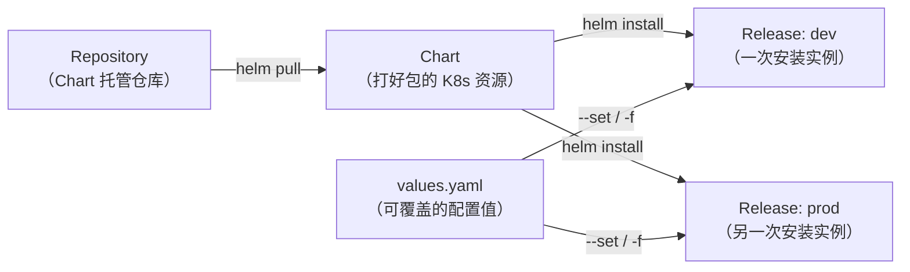

# Helm：Kubernetes 的包管理器

> 前三篇跑通了 Docker → Compose → K8s 的完整链路。但进入 K8s 之后，一个应用散落在十几个 YAML 文件里——怎么管理、怎么模板化、怎么版本控制？这就是 Helm 要解决的问题。

## 痛点：K8s YAML 的碎片化

回顾第三篇，把 web + db + redis 搬到 K8s 上，我们创建了这些文件：

```
web-deploy.yaml
web-svc.yaml
web-config.yaml
db-deploy.yaml
db-svc.yaml
db-pvc.yaml
redis-deploy.yaml
redis-svc.yaml
db-secret        (kubectl create secret 生成的，不在 YAML 里)
```

一个简单的三服务栈就 8 个文件。真实生产应用可能 20+ 个。

问题不只是文件多：

**环境差异**——dev 和 prod 的区别可能只是几个值：

```yaml
# dev 环境
replicas: 1
DB_PASSWORD: dev-secret

# prod 环境
replicas: 3
DB_PASSWORD: prod-secret-rotated-weekly
```

裸 YAML 的做法是复制粘贴整个文件然后手动改差异值——80% 的内容是重复的，而且每次差异散落在不同文件的角落里，改漏一个就是线上事故。

**版本追溯**——`kubectl apply -f` 之后，没人知道上次部署的是什么版本。回滚？重新 apply 旧文件。但旧文件在谁本地？改了哪几行？没人说得清。

这些问题不是 K8s 的 bug——K8s 本身就是声明式的，它只管「给我这个状态」，不管这些状态的 YAML 怎么组织、怎么版本化。**Helm 填补的就是这个空白**。

## Helm 是什么

一句话：Helm 是 K8s 的包管理器。它对 K8s 的作用，相当于 `apt` 对 Debian、`brew` 对 macOS——解决的是**打包、分发、安装、升级、回滚**的问题。

四个核心概念：



**Chart**——打包好的 K8s 资源集合。包含模板、默认值、元信息。类比 `.deb` 包或 `brew formula`。

**Release**——Chart 的一次安装实例。同一个 Chart 可以用不同的 values 安装成多个 Release（如 `myapp-dev`、`myapp-prod`）。

**Repository**——Chart 的托管仓库，类似于 Docker Registry。`https://charts.bitnami.com/bitnami` 就是 Bitnami 维护的 Helm repo。

**Values**——注入 Chart 模板的配置值。values.yaml 提供默认值，`--set` 或 `-f` 覆盖。这是 Chart 模板化的入口。

## 核心机制：模板化

Helm 用 Go 的 `text/template` 做模板引擎。一个裸的 K8s Deployment 大概长这样：

```yaml
# 裸 YAML——值全部写死
apiVersion: apps/v1
kind: Deployment
metadata:
  name: web
spec:
  replicas: 2
  template:
    spec:
      containers:
        - name: web
          image: myapp:latest
```

Helm 化之后：

```yaml
# templates/deployment.yaml——值变成占位符
apiVersion: apps/v1
kind: Deployment
metadata:
  name: {{ .Release.Name }}-web          # Release 名称前缀，避免冲突
  labels:
    app: {{ .Values.appName }}
    release: {{ .Release.Name }}
spec:
  replicas: {{ .Values.web.replicaCount }}
  template:
    spec:
      containers:
        - name: web
          image: "{{ .Values.web.image.repository }}:{{ .Values.web.image.tag }}"
          ports:
            - containerPort: {{ .Values.web.port }}
          env:
            - name: DB_HOST
              value: {{ .Values.db.host }}
            - name: REDIS_HOST
              value: {{ .Values.redis.host }}
```

默认值集中在 `values.yaml`：

```yaml
# values.yaml——所有可配置项集中在同一个文件里
appName: myapp

web:
  replicaCount: 2
  image:
    repository: myapp
    tag: latest
  port: 5000

db:
  host: db-svc
  port: 5432

redis:
  host: redis-svc
  port: 6379
```

环境差异变成了**覆盖不同的 values 文件**：

```yaml
# values-dev.yaml
web:
  replicaCount: 1
  image:
    tag: dev-abc123

# values-prod.yaml
web:
  replicaCount: 3
  image:
    tag: v1.2.0
```

部署命令始终一样，变的只是 values：

```bash
# dev
helm upgrade --install myapp ./myapp -f values-dev.yaml -n dev

# prod
helm upgrade --install myapp ./myapp -f values-prod.yaml -n prod
```

模板化带来的三个关键收益：

1. **DRY**——K8s 资源定义只有一份，差异通过 values 注入
2. **类型安全一部分**——values.yaml 可以定义 schema（Helm 3 支持 JSON Schema 校验 values），环境差异值写错了类型会被拦截
3. **可版本化**——Chart 可以打版本号（带 `version` 字段），每次变更可追溯

## 实战：把第三篇的栈打包成 Helm Chart

### Chart 目录结构

```
myapp/
├── Chart.yaml              # Chart 元信息
├── values.yaml              # 默认配置
├── values-dev.yaml          # 开发环境覆盖
├── values-prod.yaml         # 生产环境覆盖
├── templates/
│   ├── _helpers.tpl          # 模板辅助函数
│   ├── deployment-web.yaml
│   ├── service-web.yaml
│   ├── configmap-web.yaml
│   ├── deployment-db.yaml
│   ├── service-db.yaml
│   ├── pvc-db.yaml
│   ├── secret-db.yaml
│   ├── deployment-redis.yaml
│   └── service-redis.yaml
└── charts/                   # 依赖的子 Chart（本示例为空）
```

### Chart.yaml

```yaml
apiVersion: v2
name: myapp
description: Web + DB + Redis 三服务栈
type: application
version: 0.1.0
appVersion: "1.0.0"
```

### values.yaml（核心）

```yaml
# 全局配置
namespace: default

# Web 服务
web:
  replicaCount: 2
  image:
    repository: myapp
    tag: latest
    pullPolicy: IfNotPresent
  port: 5000
  service:
    type: LoadBalancer
    port: 80

# 数据库
db:
  image:
    repository: postgres
    tag: 16-alpine
  port: 5432
  storage: 1Gi
  database: mydb
  user: postgres
  # 密码不从 values.yaml 取默认值——强制用户在部署时提供
  password: ""

# Redis
redis:
  image:
    repository: redis
    tag: 7-alpine
  port: 6379
```

### templates/_helpers.tpl（可复用的模板片段）

```yaml

{{/*
创建完整的 "app.kubernetes.io/name" 标签
*/}}
{{- define "myapp.labels" -}}
app.kubernetes.io/name: {{ .Values.appName | default "myapp" }}
app.kubernetes.io/instance: {{ .Release.Name }}
app.kubernetes.io/version: {{ .Chart.AppVersion }}
app.kubernetes.io/managed-by: {{ .Release.Service }}
{{- end }}

{{/*
选择器标签——不可变，不能包含 Release 名
*/}}
{{- define "myapp.selectorLabels" -}}
app.kubernetes.io/name: {{ .Values.appName | default "myapp" }}
{{- end }}

```

> `...` 包裹 Go template 语法是为了在本文中正常显示——实际文件里不需要这层包裹。

### templates/deployment-web.yaml

> 下面展示的是核心逻辑。完整的健康检查探针可以参考 `values.yaml` 中增加 `livenessProbe` / `readinessProbe` 配置项。

```yaml
apiVersion: apps/v1
kind: Deployment
metadata:
  name: {{ .Release.Name }}-web
  namespace: {{ .Values.namespace }}
  labels:
    {{- include "myapp.labels" . | nindent 4 }}
spec:
  replicas: {{ .Values.web.replicaCount }}
  selector:
    matchLabels:
      {{- include "myapp.selectorLabels" . | nindent 6 }}
      component: web
  template:
    metadata:
      labels:
        {{- include "myapp.selectorLabels" . | nindent 8 }}
        component: web
    spec:
      containers:
        - name: web
          image: "{{ .Values.web.image.repository }}:{{ .Values.web.image.tag }}"
          imagePullPolicy: {{ .Values.web.image.pullPolicy }}
          ports:
            - containerPort: {{ .Values.web.port }}
          env:
            - name: DB_HOST
              value: {{ .Release.Name }}-db-svc
            - name: DB_PORT
              value: "{{ .Values.db.port }}"
            - name: DB_NAME
              value: {{ .Values.db.database }}
            - name: DB_USER
              value: {{ .Values.db.user }}
            - name: DB_PASSWORD
              valueFrom:
                secretKeyRef:
                  name: {{ .Release.Name }}-db-secret
                  key: password
            - name: REDIS_HOST
              value: {{ .Release.Name }}-redis-svc
```

注意一个关键细节：`{{ .Release.Name }}-db-svc`。同一个 Chart 可以安装多次（dev、staging、prod 各自一份），Release 名作为前缀防止 Service 名字冲突。

### templates/service-web.yaml

```yaml
apiVersion: v1
kind: Service
metadata:
  name: {{ .Release.Name }}-web-svc
  namespace: {{ .Values.namespace }}
  labels:
    {{- include "myapp.labels" . | nindent 4 }}
spec:
  type: {{ .Values.web.service.type }}
  selector:
    {{- include "myapp.selectorLabels" . | nindent 4 }}
    component: web
  ports:
    - port: {{ .Values.web.service.port }}
      targetPort: {{ .Values.web.port }}
```

### templates/secret-db.yaml

```yaml
apiVersion: v1
kind: Secret
metadata:
  name: {{ .Release.Name }}-db-secret
  namespace: {{ .Values.namespace }}
type: Opaque
data:
  password: {{ .Values.db.password | b64enc | quote }}
```

`b64enc` 是 Helm 内置的模板函数——自动把密码编码成 base64。裸 K8s 需要你手动 `echo -n 'password' | base64`，Helm 一行搞定。

### 部署

```bash
# 确认文件在正确的位置
$ tree myapp/
myapp/
├── Chart.yaml
├── values.yaml
├── values-dev.yaml
├── values-prod.yaml
└── templates/
    ├── _helpers.tpl
    ├── configmap-web.yaml
    ├── deployment-db.yaml
    ├── deployment-redis.yaml
    ├── deployment-web.yaml
    ├── pvc-db.yaml
    ├── secret-db.yaml
    ├── service-db.yaml
    ├── service-redis.yaml
    └── service-web.yaml

# 渲染模板看看效果（不实际部署）
$ helm template myapp ./myapp --set db.password=test123 | head -30

# 部署到 dev
$ helm upgrade --install myapp-dev ./myapp \
  -f values-dev.yaml \
  --set db.password=dev-secret \
  --namespace dev \
  --create-namespace

Release "myapp-dev" has been installed.

# 查看 Release
$ helm list -n dev
NAME        NAMESPACE   REVISION   STATUS     CHART         APP VERSION
myapp-dev   dev         1          deployed   myapp-0.1.0   1.0.0

# 部署到 prod
$ helm upgrade --install myapp-prod ./myapp \
  -f values-prod.yaml \
  --set db.password=prod-secret \
  --namespace prod \
  --create-namespace
```

同一个 Chart，两个独立的 Release——dev 和 prod 各自跑在不同的 namespace 里，配置值互不影响。

### 升级与回滚

```bash
# 改了 values.yaml 或模板后
$ helm upgrade myapp-dev ./myapp -f values-dev.yaml -n dev

# 查看 Release 的版本历史
$ helm history myapp-dev -n dev
REVISION   UPDATED                  STATUS        CHART         DESCRIPTION
1          Wed May 28 10:23:45      superseded    myapp-0.1.0   Install complete
2          Wed May 28 11:05:12      deployed      myapp-0.1.0   Upgrade complete

# 回滚到上一个版本
$ helm rollback myapp-dev -n dev

# 回滚到指定版本
$ helm rollback myapp-dev 1 -n dev
```

这才是 Helm 最 killer 的能力——**helm history + helm rollback**。裸 K8s 的 `kubectl rollout undo` 只能回滚 Deployment 的镜像版本，管不了 ConfigMap、Secret、Service 的变更。Helm 把整个 Release 的完整状态作为一次 Revision 记录下来，回滚是整个应用栈的整体动作。

### 条件渲染——某个环境不需要 Redis

```yaml
# values.yaml
redis:
  enabled: true    # 默认启用

# values-dev.yaml
redis:
  enabled: false   # dev 环境不需要 Redis（用内存缓存代替）

# templates/deployment-redis.yaml

{{- if .Values.redis.enabled }}
apiVersion: apps/v1
kind: Deployment
# ... redis Deployment 完整定义 ...
{{- end }}

```

`helm template` 渲染 dev 时，整个 redis Deployment 和 Service 都不会生成——不需要的文件被自动跳过了。这是裸 K8s YAML 做不到的：你没法在 `kubectl apply` 时根据环境跳过某个文件。

## Hosting Chart：推送到 OCI Registry

Helm 3.8+ 支持 OCI 协议，可以直接把 Chart 推送到 Docker Registry：

```bash
# 打包 Chart
$ helm package ./myapp
Successfully packaged chart and saved it to: myapp-0.1.0.tgz

# 推到 GitHub Container Registry（或其他 OCI registry）
$ helm push myapp-0.1.0.tgz oci://ghcr.io/myorg/charts

# 别人拉取并安装
$ helm pull oci://ghcr.io/myorg/charts/myapp --version 0.1.0
$ helm install myapp ./myapp-0.1.0.tgz -f values-prod.yaml
```

不需要自建 Helm Repository 了——用你已有的 Docker Registry 就能分发 Chart。对已经用 Docker 的团队，零额外基础设施成本。

## 什么时候用 Helm

```
裸 K8s YAML 就够了：
  ✅ 应用只有 1-3 个资源
  ✅ 只有一个环境
  ✅ 没有复用/分发的需求
  → 第三篇的 kubectl apply 方式就挺好

用 Helm：
  ✅ 一个应用对应 5+ 个 K8s 资源
  ✅ 多环境（dev / staging / prod）
  ✅ 需要版本化 + 回滚能力
  ✅ 想把应用分享给其他人/其他团队
  → values.yaml 集中管理 + helm rollback 是其核心价值

用 Kustomize（另一个选项）：
  ✅ 偏好"补丁"模式而非模板模式
  ✅ 已经在用 kubectl 内置的 kustomize
  → Kustomize 是 kubectl 内置的，零安装。适合不想引入额外工具的场景
```

Helm 和 Kustomize 不是互斥的——很多团队两者都用：Helm 做打包分发，Kustomize 做环境最后一公里的补丁覆盖。

## 命令行速查

```bash
# ---------- Chart 操作 ----------
helm create mychart                       # 脚手架：生成标准 Chart 目录结构
helm lint ./mychart                       # 检查 Chart 语法和规范
helm template myapp ./mychart             # 渲染模板到 stdout（不部署，调试用）
helm package ./mychart                    # 打包成 .tgz
helm push myapp-0.1.0.tgz oci://...      # 推送到 OCI Registry

# ---------- Release 生命周期 ----------
helm install myapp ./mychart -n prod --create-namespace       # 首次安装
helm upgrade --install myapp ./mychart -n prod                 # 安装或升级（幂等）
helm upgrade myapp ./mychart -f values-prod.yaml -n prod       # 升级
helm rollback myapp -n prod                                    # 回滚到上一版本
helm rollback myapp 3 -n prod                                  # 回滚到指定版本
helm uninstall myapp -n prod                                   # 删除 Release

# ---------- 查看 ----------
helm list -n prod                          # 列出所有 Release
helm history myapp -n prod                 # Release 的版本历史
helm get values myapp -n prod              # 当前生效的 values（合并后的）
helm get manifest myapp -n prod            # 当前生效的 K8s 资源（渲染后）

# ---------- 调试 ----------
helm template myapp ./mychart --debug      # 渲染模板 + 错误信息
helm install myapp ./mychart --dry-run     # 模拟安装（不实际部署）
helm diff upgrade myapp ./mychart -n prod  # 需要 helm-diff 插件——显示变更 diff
```

## 系列收束

五篇文章走完了从「一个容器怎么跑」到「整个应用栈怎么打包分发」的完整链路：

```
Docker          → 容器是什么、镜像怎么分层、单进程模型
Docker Compose  → 多容器在单机上怎么协作、healthcheck 的正确用法
Kubernetes      → 跨机器怎么调度、Pod/Service/Deployment 的核心抽象
Compose → K8s   → 两种思维方式的对比、什么时候该上 K8s
Helm            → K8s 之上：Chart 打包、模板化、版本化、回滚
```

每一层解决的问题都是下一层存在的前提。没有容器就不需要 Compose，没有多容器就不需要 K8s，没有 K8s 的资源碎片化就不需要 Helm。理解这个链条，比背熟任何配置字段都重要。
