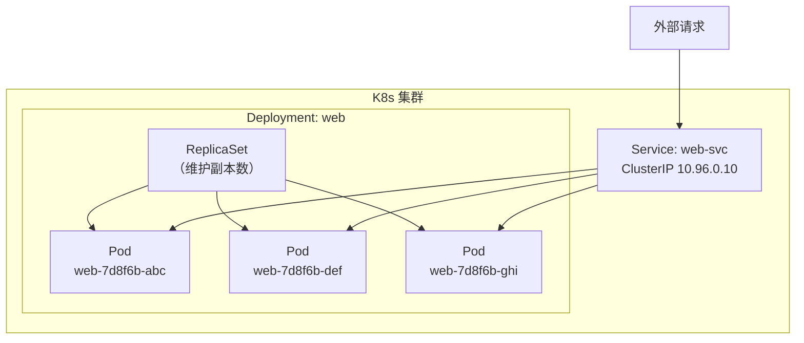
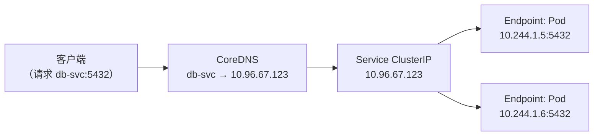

# Kubernetes 入门：当「单机」不够用的时候

> 前两篇我们搞定了单机上的容器化和多服务编排。现在把场景放大——机器挂了怎么办、流量涨了怎么扩、怎么能不停机更新。这就是 Kubernetes 存在的意义。本篇不背 YAML，先理解为什么需要它、它的核心抽象是什么、以及亲手把 Compose 栈搬到 K8s 上。

## 为什么还需要 K8s——Compose 解决不了的三个问题

上一篇我们用 Compose 把 web + db + redis 管得挺好。但它有个前提：**所有容器跑在同一台机器上**。

这个前提在以下三个场景下会直接崩塌：

### 场景一：机器挂了

```
凌晨 3 点，唯一那台服务器宕了。所有服务一起死。
```

Compose 的 `restart: always` 只能在同一台机器上重启——机器都起不来了，restart 救不了你。你需要的是**跨多台机器的部署能力**，一台挂了调度器把工作负载挪到另一台上。

### 场景二：流量涨了需要扩

```
首页上了热门推荐，QPS 从 100 飙到 5000。Compose 能做的：
docker compose up -d --scale web=10
```

但——只有一台机器，CPU 和内存是有限的。10 个 web 容器抢同一台 4 核机器的资源，实际上**越扩越慢**。你需要的是把新实例分布到多台机器上，在集群级别做负载均衡。

### 场景三：不停机更新

```
要上线新版本。Compose 的流程：
docker compose up -d --build
→ 旧容器停止 → 新容器启动 → 中间有 2-5 秒空白
```

用户看到的：刷新一下，502。你需要的是**滚动更新**——一个个换，始终有健康的实例在对外服务。

这三个问题——跨机器调度、集群级伸缩、零停机更新——就是 K8s 的核心价值。它不是「更复杂的 Compose」，它解决的是完全不同的层次的问题。

## 环境准备：用 kind 在 Docker 里跑 K8s

[kind](https://kind.sigs.k8s.io/)（Kubernetes in Docker）是 K8s 官方 SIG 维护的工具，把 K8s 的控制平面和 worker 节点都跑成 Docker 容器。对从 Docker 过来的读者最友好——你已有的 Docker 就是唯一下依赖。

```bash
# 安装 kind（macOS）
$ brew install kind

# 安装 kubectl——和 K8s 对话的 CLI
$ brew install kubectl

# 创建第一个集群——单节点就够了
$ kind create cluster --name mycluster
Creating cluster "mycluster" ...
 ✓ Ensuring node image (kindest/node:v1.32.0) 🖼
 ✓ Preparing nodes 📦
 ✓ Writing configuration 📜
 ✓ Starting control-plane 🕹️
 ✓ Installing CNI 🔌
 ✓ Installing StorageClass 💾
Set kubectl context to "kind-mycluster"

# 验证
$ kubectl cluster-info
Kubernetes control plane is running at https://127.0.0.1:6443
CoreDNS is running at https://127.0.0.1:6443/api/v1/namespaces/kube-system/services/kube-dns:dns/proxy

$ kubectl get nodes
NAME                      STATUS   ROLES           AGE   VERSION
mycluster-control-plane   Ready    control-plane   30s   v1.32.0
```

现在你有一个跑在 Docker 里的 K8s 集群了。`mycluster-control-plane` 这个「节点」其实是一个 Docker 容器：

```bash
$ docker ps --format "table {{.ID}}\t{{.Image}}\t{{.Names}}"
CONTAINER ID   IMAGE                  NAMES
abc123def456   kindest/node:v1.32.0   mycluster-control-plane
```

从 `docker run` 到 Compose 到 kind——你一直在 Docker 之上构建，只是抽象层级在升高。

## 核心抽象：三个角色一张图

K8s 的 YAML 类型有几十种，但理解这三个就理解了大半结构：



**Pod**——最小调度单元，不是「容器的 K8s 叫法」。一个 Pod 可以包含一个或多个容器（通常是 1 个），它们共享网络 namespace 和存储卷。Pod 是临时的——挂了就重建，IP 会变。

**Service**——稳定的网络入口。Pod 的 IP 会变，但 Service 的 ClusterIP 不变。它通过 label 选择器找到匹配的 Pod，把流量转发过去。你的应用代码里连接数据库写 `db-svc:5432`，不管背后的 Pod 重建了多少次，这个地址始终有效。

**Deployment**——声明式副本管理。你告诉它「我要 3 个 web Pod」，它就持续确保正好 3 个在跑。挂了一个？自动补一个。要升级？一个一个滚动着替你换。

### 声明式是什么意思

Compose 是偏过程式的思维——`docker compose up` 是你让 Compose 去执行一个动作。K8s 是声明式的：

```yaml
# 你告诉 K8s「我要这个状态」
spec:
  replicas: 3

# K8s 的控制循环持续做：
# for { 实际副本数 == 期望副本数 ? 什么都不做 : 调成期望值 }
```

你把期望状态提交给 API Server，K8s 的控制器在后台不断对比「实际状态」和「期望状态」，不一致就行动。你不需要告诉它「怎么」做，只需要声明「要什么」。

## 实战：把 Compose 栈翻译成 K8s 资源

回顾上一篇的三服务栈——web + db + redis。现在把它搬到 K8s 上。

### 对比一览

| Compose 概念 | K8s 对应 | 说明 |
|-------------|----------|------|
| service (定义) | Deployment | 管理 Pod 副本 |
| 容器 | Pod 里的容器 | Pod 是容器的「家」 |
| 服务名即 DNS | Service | 类似，但要显式创建 |
| 命名卷 | PersistentVolumeClaim | 类似，但要显式创建 |
| compose.yaml | 一组 YAML 文件 | K8s 一般一个 YAML 一个资源 |

### db：数据库 Deployment + Service + PVC

先创建一个命名空间隔离这个实验：

```bash
$ kubectl create namespace demo
```

**db-deploy.yaml**：

```yaml
apiVersion: apps/v1
kind: Deployment
metadata:
  name: db
  namespace: demo
spec:
  replicas: 1                  # 数据库只能一个副本（共享存储冲突）
  selector:
    matchLabels:
      app: db
  template:                    # Pod 模板
    metadata:
      labels:
        app: db
    spec:
      containers:
        - name: postgres
          image: postgres:16-alpine
          ports:
            - containerPort: 5432
          env:
            - name: POSTGRES_PASSWORD
              valueFrom:       # 从 Secret 读取，不硬编码
                secretKeyRef:
                  name: db-secret
                  key: password
            - name: POSTGRES_DB
              value: mydb
          volumeMounts:
            - name: pgdata
              mountPath: /var/lib/postgresql/data
      volumes:
        - name: pgdata
          persistentVolumeClaim:
            claimName: pgdata-pvc
```

**db-svc.yaml**：

```yaml
apiVersion: v1
kind: Service
metadata:
  name: db-svc
  namespace: demo
spec:
  selector:
    app: db                      # 转发到带 app: db 标签的 Pod
  ports:
    - port: 5432
      targetPort: 5432
  type: ClusterIP                # 集群内部可访问
```

**db-pvc.yaml**：

```yaml
apiVersion: v1
kind: PersistentVolumeClaim
metadata:
  name: pgdata-pvc
  namespace: demo
spec:
  accessModes:
    - ReadWriteOnce              # 只能被一个节点上的一个 Pod 挂载
  resources:
    requests:
      storage: 1Gi
```

创建 Secret（它在 K8s 里用来存敏感数据）：

```bash
$ kubectl create secret generic db-secret \
  --namespace demo \
  --from-literal=password=please-change-me
```

部署：

```bash
$ kubectl apply -f db-pvc.yaml
$ kubectl apply -f db-deploy.yaml
$ kubectl apply -f db-svc.yaml

$ kubectl get all -n demo
NAME                  READY   STATUS    RESTARTS   AGE
pod/db-5c8f7b9d-xyz   1/1     Running   0          30s

NAME             TYPE        CLUSTER-IP     EXTERNAL-IP   PORT(S)    AGE
service/db-svc   ClusterIP   10.96.67.123   <none>        5432/TCP   20s

NAME                  READY   UP-TO-DATE   AVAILABLE   AGE
deployment.apps/db    1/1     1            1           30s
```

### web：应用 Deployment + Service

**web-config.yaml**——非敏感配置放 ConfigMap：

```yaml
apiVersion: v1
kind: ConfigMap
metadata:
  name: web-config
  namespace: demo
data:
  DB_HOST: "db-svc"              # 服务名 = DNS 名
  DB_PORT: "5432"
  DB_NAME: "mydb"
  DB_USER: "postgres"
  REDIS_HOST: "redis-svc"
```

**web-deploy.yaml**：

```yaml
apiVersion: apps/v1
kind: Deployment
metadata:
  name: web
  namespace: demo
spec:
  replicas: 2                    # 两个副本，挂了自动补齐
  selector:
    matchLabels:
      app: web
  template:
    metadata:
      labels:
        app: web
    spec:
      containers:
        - name: web
          image: myapp:latest     # 实际项目里要 push 到 registry
          ports:
            - containerPort: 5000
          env:
            - name: DB_HOST
              valueFrom:
                configMapKeyRef:
                  name: web-config
                  key: DB_HOST
            - name: DB_PORT
              valueFrom:
                configMapKeyRef:
                  name: web-config
                  key: DB_PORT
            - name: DB_NAME
              valueFrom:
                configMapKeyRef:
                  name: web-config
                  key: DB_NAME
            - name: DB_USER
              valueFrom:
                configMapKeyRef:
                  name: web-config
                  key: DB_USER
            - name: DB_PASSWORD
              valueFrom:
                secretKeyRef:
                  name: db-secret
                  key: password
            - name: REDIS_HOST
              valueFrom:
                configMapKeyRef:
                  name: web-config
                  key: REDIS_HOST
          # 启动探针——K8s 版 healthcheck
          startupProbe:
            httpGet:
              path: /
              port: 5000
            failureThreshold: 30
            periodSeconds: 2
          # 存活探针——挂了自动重启
          livenessProbe:
            httpGet:
              path: /
              port: 5000
            periodSeconds: 10
          # 就绪探针——ready 了才接入 Service 流量
          readinessProbe:
            httpGet:
              path: /
              port: 5000
            periodSeconds: 5
```

**web-svc.yaml**：

```yaml
apiVersion: v1
kind: Service
metadata:
  name: web-svc
  namespace: demo
spec:
  selector:
    app: web
  ports:
    - port: 80
      targetPort: 5000
  type: LoadBalancer              # 对外暴露——kind 会映射到 localhost
```

### redis：简版

```yaml
# redis-deploy.yaml
apiVersion: apps/v1
kind: Deployment
metadata:
  name: redis
  namespace: demo
spec:
  replicas: 1
  selector:
    matchLabels:
      app: redis
  template:
    metadata:
      labels:
        app: redis
    spec:
      containers:
        - name: redis
          image: redis:7-alpine
          ports:
            - containerPort: 6379
---
# redis-svc.yaml——黏在一个文件里用 --- 分隔
apiVersion: v1
kind: Service
metadata:
  name: redis-svc
  namespace: demo
spec:
  selector:
    app: redis
  ports:
    - port: 6379
      targetPort: 6379
```

### 全部跑起来

```bash
$ kubectl apply -f web-config.yaml
$ kubectl apply -f web-deploy.yaml
$ kubectl apply -f web-svc.yaml
$ kubectl apply -f redis-deploy.yaml

$ kubectl get pods -n demo -w
NAME                     READY   STATUS    RESTARTS   AGE
db-5c8f7b9d-xyz          1/1     Running   0          2m
redis-7b4f8c6d-abc       1/1     Running   0          30s
web-6d9e8f7b-abc         1/1     Running   0          20s
web-6d9e8f7b-def         1/1     Running   0          18s

$ kubectl get svc -n demo
NAME        TYPE           CLUSTER-IP      EXTERNAL-IP   PORT(S)        AGE
db-svc      ClusterIP      10.96.67.123    <none>        5432/TCP       2m
redis-svc   ClusterIP      10.96.78.45     <none>        6379/TCP       30s
web-svc     LoadBalancer   10.96.90.67     127.0.0.1     80:30080/TCP   20s
```

这里面最关键的信息是：web 容器里配置的 `DB_HOST=db-svc`、`REDIS_HOST=redis-svc`，这些**服务名会被 K8s 内置 DNS 解析成 Service 的 ClusterIP**，然后 Service 把流量转发到对应的 Pod。和 Compose 的「服务名即 DNS」一样的体验，只是底层多了 Service 这个显式抽象。

### 验证：感受一次滚动更新

```bash
# 给 web 换个镜像版本（模拟上线）
$ kubectl set image deployment/web web=myapp:v2 -n demo

# 盯着 Pod 的变化
$ kubectl get pods -n demo -w
NAME                  READY   STATUS        RESTARTS   AGE
web-6d9e8f7b-abc      1/1     Running       0          5m
web-6d9e8f7b-def      1/1     Running       0          5m
web-7e0f9a8c-xyz      0/1     Pending       0          0s    # 新 Pod 启动中
web-7e0f9a8c-xyz      0/1     ContainerCreating   0    1s
web-7e0f9a8c-xyz      1/1     Running             0    5s    # 新 Pod ready
web-6d9e8f7b-def      1/1     Terminating         0    5m    # 关一个旧的
web-7e0f9a8c-uvw      0/1     Pending             0    0s    # 第二个新 Pod
web-7e0f9a8c-uvw      1/1     Running             0    5s
web-6d9e8f7b-abc      1/1     Terminating         0    5m    # 关最后一个旧的
web-7e0f9a8c-xyz      1/1     Running             0    15s
web-7e0f9a8c-uvw      1/1     Running             0    10s
```

整个过程**两个新的替换两个旧的，始终有 Pod 在对外服务**——没有 502，没有停机。

而这一切是怎么触发的？你只改了一个字段 `image: myapp:v2`。Deployment 控制器发现「期望的 Pod 模板」和「实际的 Pod」不一样了，自动开始滚动替换。这就是声明式——你声明你要 v2，K8s 自己去想怎么安全地换成 v2。

## Service 的网络魔法

Service 是 K8s 里最需要理解透的网络抽象。再次强调：**Pod 的 IP 是临时的**——Pod 重建，IP 就变了。Service 解决了这个问题。



1. Pod 创建时带上 label（如 `app: db`）
2. Service 的 `selector: app: db` 找到这个 Pod，把它加入 Endpoints 列表
3. Pod 挂了重建——旧 IP 从 Endpoints 移除，新 IP 加入
4. 客户端始终连接 `db-svc:5432`，对背后 IP 的变化无感知

这比 Compose 多了一层抽象，但也因此具备了 Compose 做不到的能力——Service 可以跨多个节点做负载均衡，而 Compose 的服务名只能解析到同一台机器上的容器。

## 几个核心原则

### Pod 是临时资源

永远不要假设 Pod 会一直活着。Pod 挂了、被驱逐、被缩容——这些都是正常的。应用代码必须能处理「依赖服务暂时不可用」的情况（重试、降级、熔断）。

### 用 label 和 selector 做松耦合

Service 通过 label 找到 Pod，而不是通过 Pod 名字。这意味着一组 Pod 可以随时被替换（升级、扩缩容），Service 自动感知，没有耦合。

### ConfigMap/Secret 分离配置

不要往镜像里写配置，不要往 Deployment YAML 里硬编码密码。ConfigMap 放普通配置，Secret 放敏感数据，运行时注入。

### 声明式，不是过程式

告诉 K8s「我要 2 个副本」「我要挂载这个卷」，不要告诉它「先起这个，再起那个」。让控制器去处理「怎么做」。

## 命令行速查

```bash
# ---------- 查看 ----------
kubectl get pods -n demo                     # 列出 Pod
kubectl get pods -n demo -w                  # 实时 watch
kubectl get svc -n demo                      # 列出 Service
kubectl get deployments -n demo              # 列出 Deployment
kubectl get all -n demo                      # 一切

# ---------- 详情 ----------
kubectl describe pod <pod-name> -n demo      # Pod 详情 + Events
kubectl logs <pod-name> -n demo              # Pod 日志
kubectl logs -f <pod-name> -n demo           # 实时 tail
kubectl logs deployment/web -n demo          # Deployment 级别的日志

# ---------- 调试 ----------
kubectl exec -it <pod-name> -n demo -- sh    # 进容器
kubectl port-forward <pod-name> 5000:5000 -n demo  # 端口转发到本地

# ---------- 操作 ----------
kubectl apply -f <file>.yaml                 # 创建/更新资源
kubectl delete -f <file>.yaml                # 删除资源
kubectl delete pod <pod-name> -n demo        # 删 Pod（Deployment 会自动补）
kubectl scale deployment/web --replicas=5 -n demo  # 扩缩容
kubectl rollout restart deployment/web -n demo     # 重启所有 Pod
kubectl rollout undo deployment/web -n demo        # 回滚上次部署

# ---------- 清理 ----------
kubectl delete namespace demo                # 删整个 namespace，清光一切
kind delete cluster --name mycluster          # 删集群
```

## 下一步

K8s 的核心抽象就这三个（Pod/Service/Deployment），每个都能深入写一整篇。这里的目标是——你读完能理解为什么需要 K8s、能把一个 Compose 栈翻译过去、能看到滚动更新怎么跑。

至于 Compose 和 K8s 什么时候选哪个、ConfigMap 和 Secret 的最佳实践、Ingress 怎么做外部路由——这些放到下一篇的对比和深化里。

→ 下一篇：[从 Compose 到 K8s 的思维切换](compose-to-k8s.md)
