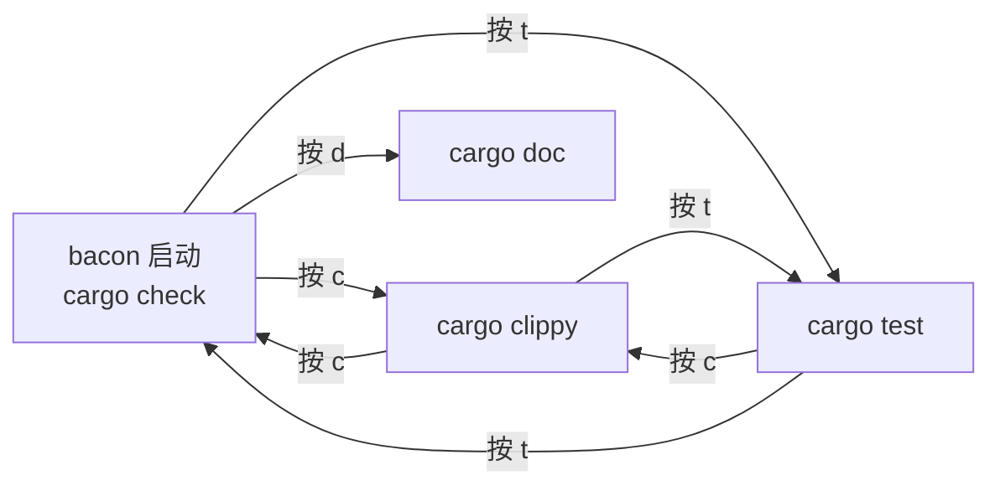

# bacon：Rust 开发者最应该开着不关的终端窗口

> 基于 bacon 最新版本，[github.com/Canop/bacon](https://github.com/Canop/bacon)。

## 你的 Rust 开发循环

```bash
# 改代码
$ cargo check    # 等 3 秒，看有没有编译错误
# 改代码
$ cargo check    # 又等 3 秒
# 改代码
$ cargo clippy   # 等 5 秒，看看 clippy 有没有意见
# 改代码
$ cargo test     # 等 10 秒，看看测试过没过
```

这些 `cargo` 命令你每天跑几十次，每次跑完就忘了结果，下一次改完代码又要跑。它们不该是你**手动重复**的操作——它们应该是**自动持续的反馈**。

bacon 就是这个思路：**打开一个终端窗口，运行 `bacon`，最小化——它一直在后台检查你的代码，编译错误、clippy 警告、测试失败，第一时间告诉你。**

## 一个命令，五个模式

```bash
$ bacon              # 默认：cargo check，编译检查
# 按 c → cargo clippy，lint 检查
# 按 t → cargo test，跑测试
# 按 d → cargo doc，文档检查
# 按 r → 重新运行当前 job
# 按 q → 退出
```

不需要记 `cargo check`、`cargo clippy`、`cargo test`——一个 `bacon` 启动，所有检查模式一键切换。



## 测试失败时，按 f 聚焦单一失败的用例

这是 bacon 最实用的功能——当 `cargo test` 报出 5 个失败，你不想每次跑全部测试，只想反复跑那一个修了一半的：

```
bacon test
# → 显示 5 个测试失败
# 按 f → 自动把 job 限定到那一个失败的测试函数
# 修代码 → 自动重跑 → 只跑那一个
# 按 esc → 回到全部测试
```

不需要手动写 `cargo test test_name -- --nocapture`——bacon 自动帮你找到失败的测试名，自动构建限定命令。

## 自定义 Job：bacon.toml

```bash
$ bacon --init    # 生成 bacon.toml
```

```toml
# bacon.toml
[jobs.check-win]
command = ["cargo", "check", "--target", "x86_64-pc-windows-gnu"]
need_stdout = true

[jobs.bench]
command = ["cargo", "bench"]
need_stdout = true

[jobs.nextest]
command = ["cargo", "nextest", "run"]
need_stdout = true

[jobs.coverage]
command = ["cargo", "tarpaulin", "--out", "Html"]
need_stdout = true
```

然后一键切换：

```bash
$ bacon check-win    # 交叉编译到 Windows
$ bacon bench        # 跑 benchmark
$ bacon nextest      # 用 nextest 跑测试（比 cargo test 快 2-3 倍）
$ bacon coverage     # 跑覆盖率
```

自定义 job 支持的关键配置：

| 字段 | 作用 |
|---|---|
| `command` | 要执行的命令 |
| `need_stdout` | 是否捕获标准输出 |
| `watch` | 监听的文件列表 |
| `ignore` | 忽略的文件模式 |
| `on_change_strategy` | 文件变化时的重新策略 |
| `apply_gitignore` | 是否加载 .gitignore |
| `allowed_lines` | 只显示匹配这些行的输出 |
| `extent` | 传递给下一步的范围（如 `test` 用于 f 键聚焦） |

## 实战：Rust 项目的标准 bacon.toml

```toml
# 默认的 check 和 clippy，bacon 自带
# 下面是你项目可能想加的自定义 job

[jobs.test]
command = ["cargo", "test", "--color", "always"]
need_stdout = true
watch = ["src", "tests", "Cargo.toml"]

[jobs.test-all-features]
command = ["cargo", "test", "--all-features", "--color", "always"]
need_stdout = true

[jobs.clippy-all]
command = ["cargo", "clippy", "--all-targets", "--all-features", "--color", "always"]
need_stdout = true

[jobs.udeps]
command = ["cargo", "udeps"]
need_stdout = true
watch = ["src", "Cargo.toml"]

[jobs.miri]
command = ["cargo", "miri", "test"]
need_stdout = true
```

## 怎么引入到现有项目

```bash
# 1. 安装
$ cargo install --locked bacon

# 2. 到项目根目录
$ cd my-rust-project

# 3. （可选）生成配置文件
$ bacon --init

# 4. 打开一个终端窗口，跑着别关
$ bacon
```

然后就忘了它——让它在后台一直跑着。改完代码、保存、看一眼终端——编译过没过、clippy 有没有警告、测试过不过，一眼就知道。

## 和 cargo-watch 的区别

很多人第一次看到 bacon 会问：「这和 `cargo watch` 有什么不同？」

| | `cargo watch -x check` | `bacon` |
|---|---|---|
| 模式切换 | 需要停止、重新启动、换命令 | 一键切换 |
| 测试聚焦 | ❌ | 按 f 自动限定失败用例 |
| 自定义 job | 命令行传参 | `bacon.toml` 声明式 |
| 输出展示 | 每次跑完清屏重新输出 | TUI 界面，增量更新 |
| 多个 job 并存 | 需要多个终端 | 单终端内切换 |

`cargo watch` 是"监听文件 + 跑命令"的通用框架，bacon 是**专门为 Rust 开发优化**的工具。前者适合"我只想自动跑这个命令"，后者适合"我整个 Rust 开发流程都想自动化"。

## 小结

bacon 解决的是一个特定但高频的问题：**Rust 开发中，编译检查和测试不应该是你手动跑的事情。** 一个终端窗口、一个 `bacon` 命令、最小化——你的反馈循环从"改完 → 切终端 → 手动敲命令 → 等结果"变成了"改完 → 保存 → 余光看到结果"。
