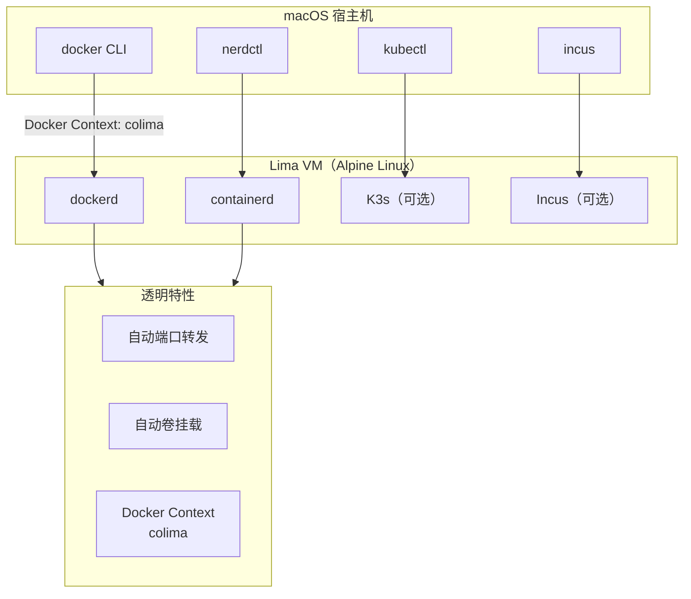

# Colima：macOS 上最轻量的 Docker 替代方案

> Docker Desktop 太重、占资源、还收费？Colima 用 Lima 虚拟机跑容器，一个 `brew install colima` 搞定，命令行干干净净，不装任何 GUI 负担。

## 为什么需要 Colima

Docker Desktop for Mac 在很长一段时间里是 macOS 上跑容器的标准答案。但它有三个让人越来越难忍受的问题：

**重**——Docker Desktop 是一个完整的 Electron 应用，带 GUI、带后台服务、带自动更新，常驻内存 2-4GB。你只是想跑个 `docker run hello-world`，它先吃掉你四分之一的 RAM。

**贵**——2022 年起，Docker Desktop 对大型企业（250+ 员工或年收入 1000 万美元+）开始收费订阅。小团队和个人免费，但限制已经存在。

**慢**——Docker Desktop 的虚拟机经过多层抽象（HyperKit → LinuxKit → containerd → dockerd），每次版本升级都可能引入新的性能退化。

Colima 的答案：**用 Lima 跑一个最小化 Linux VM，在里面装 Docker/Containerd/Incus，通过 Docker Context 无缝对接宿主机的 `docker` CLI**。

```
Docker Desktop:
  macOS → HyperKit VM → LinuxKit → containerd → dockerd → 你的容器
  内存占用: ~2-4GB

Colima:
  macOS → Lima VM (Alpine Linux) → dockerd → 你的容器
  内存占用: ~500MB-1GB
```

## 架构



核心机制：

- **Lima** 负责创建和管理 Linux 虚拟机（默认 Alpine Linux，最小化镜像），处理文件共享（virtio-9p / virtfs）、端口转发、SSH 访问
- **Colima** 在 Lima 之上做容器运行时的安装、配置和生命周期管理
- **Docker Context** 自动创建 `colima` context，`docker` CLI 指向 VM 内的 dockerd，你敲的命令和连本地 Docker 完全一样

## 安装与起步

```bash
# 安装
brew install colima
brew install docker           # Docker CLI，Colima 需要它来和 dockerd 通信
brew install docker-compose   # 可选
brew install kubectl          # 可选，K8s 场景需要

# 启动（默认 Docker 运行时，2 CPU / 2GB 内存 / 100GB 磁盘）
colima start

# 验证
docker run hello-world
docker ps
```

`colima start` 第一次运行时干了什么：

1. 下载 Lima VM 镜像（Alpine Linux，~50MB）
2. 创建虚拟机（默认 QEMU，Apple Silicon 优先用 `vz`）
3. 在 VM 内安装 Docker Engine
4. 创建 `colima` Docker Context 并设为当前
5. 配置端口转发和卷挂载

整个过程 1-2 分钟，之后 `docker` 命令就能用了。

```bash
$ docker context ls
NAME            DESCRIPTION                               DOCKER ENDPOINT
colima *        colima                                    unix:///Users/wei/.colima/default/docker.sock
default         Current DOCKER_HOST based configuration   unix:///var/run/docker.sock
```

注意 `*` 在 `colima` 前面——当前 Docker Context 已经指向了 Colima。你可以随时切回 Docker Desktop（如果有的话）：

```bash
docker context use default    # 切回 Docker Desktop
docker context use colima     # 切回 Colima
```

## 三种运行时

Colima 不绑定 Docker——它支持三种容器运行时，同一个 VM 内可以组合使用。

### Docker（默认）

```bash
colima start
# 等价于 colima start --runtime docker
docker run -d -p 8080:80 nginx
```

Docker 运行时最常用。注意装的是 Docker Engine（`dockerd`），不是 Docker Desktop。CLI 工具（`docker`、`docker-compose`）需要另外 `brew install`。

### Containerd

```bash
colima start --runtime containerd
colima nerdctl install    # 安装 nerdctl 别名到 PATH
nerdctl run hello-world
```

Containerd 比 Docker 更轻——没有 dockerd 这一层，直接调 containerd 的 gRPC API。`nerdctl` 是 containerd 的 CLI，命令和 `docker` 几乎一样。如果你不需要 Docker 的 Swarm/buildx 等附加功能，Containerd 是更干净的选择。

**Kubernetes 搭配 Docker vs Containerd 的区别**：
- Docker 运行时：`docker build` 的镜像自动对 K3s 可用
- Containerd 运行时：需要把镜像推到 `k8s.io` namespace（`nerdctl -n k8s.io pull`）才能被 K3s 拉取

### Incus（v0.7.0+）

```bash
colima start --runtime incus
incus launch images:alpine/edge mycontainer
incus list
```

Incus 是 LXC/LXD 的社区分支，跑的是**系统容器**（system container），不是应用容器。适合需要完整 Linux 环境（init 系统、多进程）的场景。Incus VM 支持仅限 M3 及以上 Apple Silicon。

## Kubernetes

```bash
colima start --kubernetes
kubectl get nodes
# NAME                   STATUS   ROLES         AGE   VERSION
# lima-colima            Ready    control-plane 10s   v1.31.2+k3s1
```

K3s 被嵌入到 VM 中——不需要单独安装或配置。`~/.kube/config` 自动更新，`kubectl` 可以直接用。

```bash
# 跑一个测试 Pod
kubectl run nginx --image=nginx
kubectl expose pod nginx --port=80 --type=LoadBalancer

# K3s 的 LoadBalancer 用 VM 的 IP
curl http://$(colima ip):80
```

对于本地 K8s 开发，这个体验比 minikube 和 kind 更接近真实环境——它用的是真正的 K3s 发行版，不是「Docker 里跑 K8s 控制平面」。

## VM 定制

```bash
# 创建时指定资源
colima start --cpu 4 --memory 8 --disk 120

# 修改现有 VM（需先停止）
colima stop
colima start --cpu 8 --memory 16

# 磁盘可以在线扩容
colima start --disk 200    # 不用 stop，下次 start 时会扩容
```

三种 VM 类型：

| VM 类型 | 标志 | 适用场景 |
|---------|------|---------|
| QEMU（默认） | `--vm-type qemu` | 兼容性最好，支持 x86 模拟 |
| VZ（Virtualization.framework） | `--vm-type vz` | 更好的性能，Apple Silicon 原生 |
| krunkit | `--vm-type krunkit` | GPU 加速，AI 工作负载 |

**Rosetta 2 加速**（v0.5.3+，Apple Silicon + macOS 13+）：

```bash
colima start --vm-type vz --vz-rosetta
```

在 ARM Mac 上跑 x86 容器时，硬件加速的二进制翻译比 QEMU 纯软件模拟快几倍。

## GPU 加速与 AI 模型（v0.10.0+）

Colima 通过 krunkit（Apple 的容器 GPU 加速方案）支持 GPU 加速容器：

```bash
brew tap slp/krunkit
brew install krunkit

colima start --runtime docker --vm-type krunkit

# 直接跑 AI 模型
colima model run gemma3
colima model run llama3.2

# 启动对话服务
colima model serve gemma3    # http://localhost:8080
```

支持两个模型后端：
- **Docker Model Runner**（默认）——Docker AI Registry + HuggingFace
- **Ramalama**——HuggingFace + Ollama

这是 Colima 相比其他 Docker Desktop 替代方案最独特的差异化能力——在本地 macOS 上跑 GPU 加速的 AI 推理，不需要云端 GPU。

## 多实例与 Profile

```bash
# 创建独立环境
colima start --profile work --cpu 4 --memory 8
colima start --profile personal --cpu 2 --memory 4

# 操作特定 profile
colima status --profile work
colima stop --profile personal

# 列出所有
colima list
# PROFILE    STATUS     ARCH    CPUS    MEMORY    DISK     RUNTIME
# default    Running    aarch64 2       2GiB      100GiB   docker
# work       Running    aarch64 4       8GiB      100GiB   docker
```

每个 profile 是独立的 Lima VM，有自己的 Docker Context（`colima-work`、`colima-personal`）。不同项目之间完全隔离——哪怕一个 profile 里跑 K8s 集群、另一个只跑单容器互不影响。

实际用法：

```bash
# 切换 context
docker context use colima-work
docker context use colima-personal
```

## 配置文件

除了命令行参数，可以用配置文件管理复杂设置：

```bash
colima start --edit    # 打开默认编辑器修改 ~/.colima/default/colima.yaml
```

```yaml
# ~/.colima/default/colima.yaml
cpu: 4
memory: 8
disk: 120
runtime: docker
kubernetes:
  enabled: true
network:
  address: true         # 分配可达 IP（k3s LoadBalancer 需要）
  dns: []
vm_type: vz
vz_rosetta: true
mounts: []              # 额外挂载点
env: {}                 # 注入 VM 的环境变量
```

配置文件支持 `colima start` 的所有选项——团队成员共享同一个 yaml 就能确保开发环境一致。

## Colima vs Docker Desktop vs 其他方案

| | Colima | Docker Desktop | OrbStack | Rancher Desktop |
|---|---|---|---|---|
| 安装方式 | `brew install` | `.dmg` 安装包 | `.dmg` 安装包 | `.dmg` 安装包 |
| GUI | 无 | 完整 GUI | 轻量 GUI | 有 GUI |
| 内存占用 | ~500MB-1GB | ~2-4GB | ~500MB | ~1-2GB |
| K8s 支持 | 内置 K3s | 内置 K3s | 内置 K3s | 内置 K3s |
| 许可证 | MIT 开源 | 部分收费 | 免费（非商用） | Apache 2.0 |
| GPU/AI 支持 | ✅ krunkit | ❌ | ❌ | ❌ |
| 多 Runtime | Docker/Containerd/Incus | Docker only | Docker only | Docker/Containerd |
| 多 Profile | ✅ | ❌ | ❌ | ❌ |

**选 Colima 的场景**：
- 你只需要命令行，不想要 GUI
- 你在 Apple Silicon Mac 上开发，想用 Rosetta 2 跑 x86 容器
- 你需要 GPU 加速跑本地 AI 模型
- 你需要多个隔离的容器环境（profile）
- 你在意许可证——MIT 完全免费

**选 Docker Desktop 的场景**：
- 你需要 Docker Desktop 的 GUI（Dashboard、日志查看器）
- 你的团队统一用 Docker Desktop，切工具成本高
- 你需要 Docker Scout / Docker Build Cloud 等增值服务

**选 OrbStack 的场景**：
- 你要 Colima 级别的轻量但想要一个简单的状态栏图标
- 你在意文件共享性能（OrbStack 的 virtiofs 优化）

## 常用命令速查

```bash
# ---------- 生命周期 ----------
colima start                          # 启动（默认 Docker）
colima start --runtime containerd     # 启动 Containerd
colima start --kubernetes             # 启动 Docker + K3s
colima start --profile myenv          # 启动独立环境
colima stop                           # 停止当前 profile
colima stop --profile myenv           # 停止指定 profile
colima restart                        # 重启
colima delete                         # 删除 VM（数据丢失！）
colima delete --profile myenv         # 删除指定 profile

# ---------- 状态与信息 ----------
colima status                         # 当前状态
colima list                           # 所有 profile
colima ip                             # VM 的 IP 地址
colima ssh                            # SSH 进 VM

# ---------- 工具 ----------
colima nerdctl                        # 使用 VM 内的 nerdctl
colima nerdctl install                # 安装 nerdctl 别名到 PATH
colima kubernetes reset               # 重置 K3s
colima model run gemma3               # 跑 AI 模型（需 krunkit）
colima model serve gemma3             # 启动模型对话服务
```

## 常见问题

**Docker Compose 能用吗？**

完全可以。`docker-compose` 通过 Docker Context 自动连接到 Colima 的 dockerd：

```bash
brew install docker-compose
colima start
docker-compose up -d    # 和 Docker Desktop 一模一样
```

**和 Docker Desktop 可以共存吗？**

可以。通过 Docker Context 切换：

```bash
docker context use colima        # 用 Colima
docker context use default       # 用 Docker Desktop
```

**升级 Colima 后 VM 需要重建吗？**

不需要。`brew upgrade colima` 只升级 CLI 工具，VM 内的容器运行时不受影响。`colima restart` 之后自动应用新版本的配置模板。

**文件共享性能怎么样？**

默认用 virtio-9p，对小文件和源码目录够用。大量 I/O 的场景（如数据库数据目录）建议用 Docker Volume 而非 bind mount，或者把数据放在 VM 内的路径。

**端口转发需要手动配置吗？**

不需要。`docker run -p 8080:80` 自动转发到 macOS 的 `localhost:8080`。Colima 在后台用 SSH 隧道维护端口映射。

## 总结

Colima 做的事情非常简单：**用最小的开销在 macOS 上跑容器**。它不自称平台、不自带生态、不推销订阅——一个 Go 二进制 + 一个 Lima VM + 你选择的容器运行时。正是这种「只做一件事」的克制，让它比 Docker Desktop 轻一个数量级，同时保持了完全的 Docker CLI 兼容。

和容器化系列的第一篇 Docker 核心形成呼应——理解了容器和虚拟机的关系之后，Colima 的架构一目了然：它就是「在 macOS 上跑 Docker 的正确方式」。
