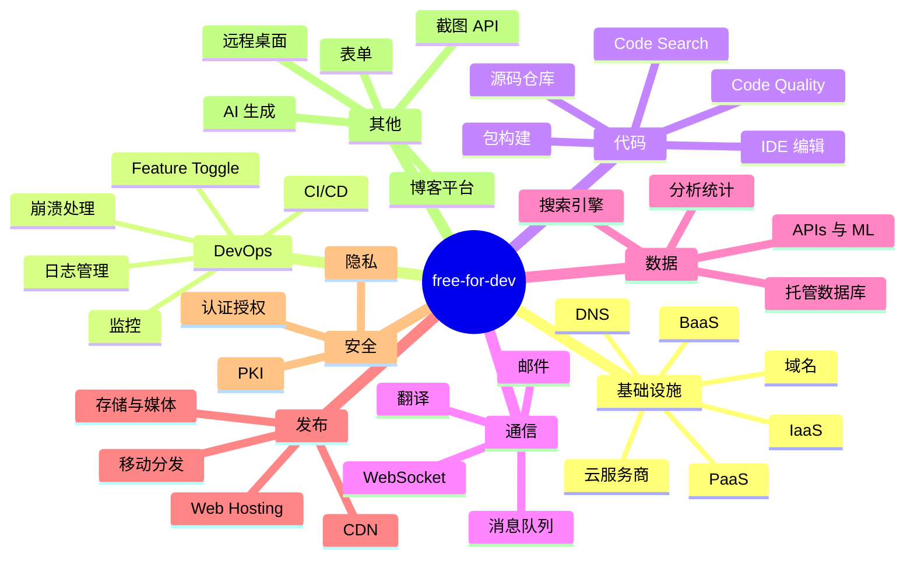
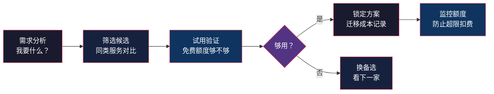

# free-for-dev：开发者免费资源大全

> 基于 [ripienaar/free-for-dev](https://github.com/ripienaar/free-for-dev) 分析（2026-08 版本）。

## 一句话

free-for-dev 是 GitHub 上最知名的**开发者免费资源清单**——收录了 1000+ 个提供免费额度的 SaaS/PaaS/IaaS 服务，按 57 个分类组织，覆盖云服务、CI/CD、监控、邮件、域名、CDN 等开发者日常需要的全部基础设施。

## 项目本身

| 项目 | 说明 |
|------|------|
| 维护者 | R.I. Pienaar（老牌开源维护者） |
| Star 数 | 100k+（GitHub 前 20 最受欢迎仓库） |
| 内容 | 57 个分类，1000+ 服务 |
| 格式 | 纯 Markdown，一个 README 搞定 |
| 贡献方式 | PR——新增/删除条目都有明确规则 |

它就是一个 README 文件，没有代码、没有构建、没有 UI。但它是 GitHub 上 star 最多的仓库之一——这本身就是最好的验证：**开发者对"免费额度"的需求真实存在且巨大**。

## 全貌：57 个分类



## 我挑的重点分类

### 1. 免费云服务商（Major Cloud Providers）

四大云厂商都提供永久免费额度，这是很多人忽略的事实：

| 云厂商 | 免费额度 | 适合场景 |
|--------|---------|---------|
| Oracle Cloud | **永久免费** 4 核 ARM + 24GB 内存 | 个人服务器之王 |
| Google Cloud | $300 首年 + 每月免费额度 | 实验新项目 |
| AWS | 12 个月免费 + 永久免费额度 | Lambda/API 网关 |
| Azure | $200 首年 | .NET 生态 |

**我的看法**：Oracle Cloud 的免费 ARM 实例是现在个人玩家的最优解——24GB 内存跑 Docker、跑数据库集群都够了。缺点是注册审核严格，且出现过回收实例的争议。

### 2. CI/CD 免费额度

| 服务 | 免费额度 | 适合场景 |
|------|---------|---------|
| GitHub Actions | 2000 分钟/月 | 开源项目无限 |
| GitLab CI | 400 分钟/月 | 私有项目 |
| CircleCI | 6000 分钟/月（有门槛） | 团队项目 |
| AppVeyor | 开源免费 | Windows 构建 |
| Azure Pipelines | 1800 分钟/月 | 大项目 |

**我的看法**：开源项目走 GitHub Actions 是零成本的——公开仓库不仅免费还加额度。私有项目的首选是 GitLab 自托管（完全免费）。

### 3. 监控与日志

| 服务 | 免费额度 | 适合场景 |
|------|---------|---------|
| Grafana Cloud | 3 个数据源 + 50GB 日志 | 个人仪表盘 |
| Sentry | 5 万事件/月 | 错误监控 |
| UptimeRobot | 50 个监控器 | 站点可用性 |
| BetterStack | 50GB 日志/月 | 日志聚合 |
| Prometheus 自托管 | 完全免费 | 深度监控 |

### 4. 邮件服务

| 服务 | 免费额度 | 适合场景 |
|------|---------|---------|
| Zoho Mail | 5 个邮箱免费 | 自定义域名邮箱 |
| Cloudflare Email | 完全免费 | 邮件转发 |
| Resend | 3000 封/月 | 事务邮件 |
| SendGrid | 100 封/天 | 小规模通知 |

**我的看法**：Cloudflare Email 转发 + Zoho Mail 收发的组合，让你零成本拥有"自定义域名邮箱"——这对个人品牌很重要。

### 5. 域名与 DNS

| 服务 | 免费额度 | 适合场景 |
|------|---------|---------|
| Freenom | 免费域名（已停新注册） | 曾经的神器 |
| Cloudflare DNS | 完全免费 | 全世界最快的 DNS |
| DuckDNS | 免费子域名 | 动态 IP 场景 |
| eu.org | 免费 .org 子域名 | 个人域名 |

**我的看法**：Freenom 倒了之后，eu.org 是最靠谱的免费域名来源，但审核慢。实际建议：一年几十块的 .xyz/.top 域名 + Cloudflare DNS，体验远超免费方案。

### 6. CDN 与静态托管

| 服务 | 免费额度 | 适合场景 |
|------|---------|---------|
| Cloudflare Pages | 无限带宽 | 静态站 |
| Netlify | 100GB/月 | 静态站 + 函数 |
| Vercel | 100GB/月 | Next.js 应用 |
| GitHub Pages | 无限 | 文档站 |
| jsDelivr | 完全免费 | npm 文件 CDN |

**我的看法**：静态博客首选 Cloudflare Pages——无限带宽、全球节点、免费 SSL，还能套自己的域名。Vercel 胜在 Next.js 体验。

### 7. 数据库即服务

| 服务 | 免费额度 | 适合场景 |
|------|---------|---------|
| Supabase | 500MB PostgreSQL | 全栈应用 |
| Neon | 0.5GB 存储 | Serverless Postgres |
| PlanetScale | 免费开发者计划 | MySQL 分片 |
| Upstash | Redis 免费层 | Serverless Redis |
| Cloudflare D1 | 5GB | 边缘数据库 |

**我的看法**：Supabase 是"免费 Postgres + 认证 + 存储"的瑞士军刀，个人项目从它开始几乎零成本。

## 使用策略：怎么用这份清单



### 实战组合：零成本跑一个完整项目

```
域名:     eu.org 或 .xyz（~¥10/年）
DNS:      Cloudflare（免费）
静态站:   Cloudflare Pages（免费，无限带宽）
API:      Cloudflare Workers（10 万请求/天）
数据库:   Supabase（500MB Postgres）
认证:     Supabase Auth（免费）
CI/CD:    GitHub Actions（公开仓库免费）
监控:     Grafana Cloud（免费层）
日志:     BetterStack（50GB/月）
邮箱:     Cloudflare Email（免费转发）
错误:     Sentry（5 万事件/月）
CDN:      jsDelivr（免费）
```

这套组合的月成本 ≈ **0 元**（域名年费除外），却拥有生产级的基础设施。我自己的博客就是这样跑的。

## 避坑指南

免费额度最大的坑是**超限扣费**：

| 坑 | 表现 | 解法 |
|----|------|------|
| 忘记删除实例 | 云厂商月初扣费 | 到期提醒 + 账单监控 |
| 误触发付费功能 | 某个 API 调用超限 | 阅读免费额度细则 |
| 信用卡校验 | 注册时冻结小额资金 | 用虚拟信用卡或跳过 |
| 免费额度偷偷变更 | 服务商调整条款 | 关注服务商公告 |
| 数据不可迁移 | 被锁定在某个服务 | 开始就用开源格式 |

**铁律：凡是绑定信用卡的服务，要么设好账单告警，要么到期前主动删卡。** 免费资源的隐形成本就是"你的注意力"。

## 维护规则（来自仓库 CONTRIBUTING）

这个仓库为什么能维持质量？它的贡献规则值得学习：

- 新条目必须是**真实免费**的（有免费层，不是试用期）
- 必须写明免费额度的**具体数字**（不是"有免费版"）
- 免费额度变更时，条目会被**移除或标注**
- 表格格式统一，方便 diff 和 PR 审查

这种"数字必须具体 + 变更必须更新"的纪律，让 1000+ 条目的清单保持可信。

## 与 Tailscale 的配合

free-for-dev 的清单里有一类特殊资源：**tunneling / VPN**。之前写的 [Tailscale 指南](tailscale-guide.md) 里提到的"异地组网"，配合这份清单里的免费云主机（Oracle ARM），可以搭出零成本的异地服务集群：

```
Oracle ARM（家庭网络外）
  └─ Tailscale 组网
      ├─ 家里的 NAS
      ├─ 公司电脑
      └─ 云上 Postgres
```

## 总结

free-for-dev 的核心价值不是"省钱"，而是**降低试错成本**——开发者的创意在没有收入时，最贵的就是基础设施账单。这份清单让"零成本验证想法"成为可能。

建议使用方式：

1. **收藏仓库**，需要时按分类查
2. **关注变更**——免费额度是动态的
3. **组合使用**——多个免费层拼出完整方案
4. **贡献回馈**——发现新的免费服务，提 PR

> 提醒：免费额度随时可能变更，用之前去官网确认最新条款。
