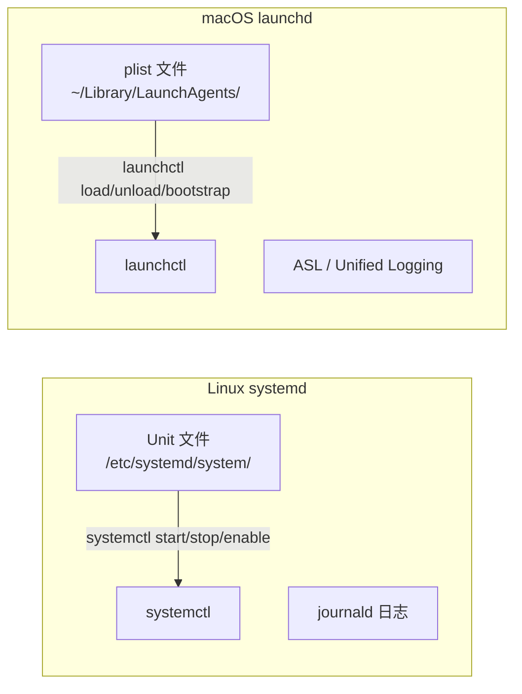

# systemd 与 launchd：Linux 与 macOS 的服务管理对比

> Linux 用 systemctl 管服务，macOS 用 launchctl 管守护进程。两者都能让程序开机自启、挂了重启、定时执行——但方式和哲学完全不同。这篇文章从一个同时用两台机器开发的人的角度，把两边的高频操作对齐。

## 各自是什么

**systemd** 是 Linux 世界的 init 系统，掌管 PID 1。启动后它负责拉起所有用户空间进程，维护 cgroup 层级，收集日志。`systemctl` 是对外暴露的管理命令行。

**launchd** 是 macOS 的 init 替代品，从 Mac OS X Tiger（2005）就开始服役。它同样掌管 PID 1，负责启动系统服务和用户守护进程。`launchctl` 是对外暴露的管理工具。

两者都是 PID 1——这意味着它们不只是「服务管理工具」，而是操作系统启动后的第一个用户态进程。它们挂了，系统就挂了。

## 核心概念对齐



| 概念 | systemd | launchd |
|------|---------|---------|
| 配置文件 | Unit file（`.service`/`.timer`） | Property List（`.plist`） |
| 配置格式 | INI 风格 | XML（或二进制 plist） |
| 管理命令 | `systemctl` | `launchctl` |
| 开机自启 | `systemctl enable` | `launchctl load` 放到正确目录 |
| 日志系统 | journald（`journalctl`） | Unified Logging（`log show`） |
| 定时任务 | `.timer` unit | `StartCalendarInterval` 键 |

## systemd 篇

### Unit 文件

```ini
# /etc/systemd/system/myapp.service
[Unit]
Description=My Web Application
After=network.target postgresql.service
Requires=postgresql.service

[Service]
Type=simple
User=myapp
WorkingDirectory=/opt/myapp
ExecStart=/opt/myapp/bin/server --config /etc/myapp/config.toml
ExecReload=/bin/kill -HUP $MAINPID
Restart=on-failure
RestartSec=5
Environment=NODE_ENV=production
EnvironmentFile=/etc/myapp/env

[Install]
WantedBy=multi-user.target
```

逐个段拆解：

**`[Unit]`**——元信息和依赖关系：
- `After=network.target`：等网络就绪后再启动，但不等于依赖网络（只是排队靠后）
- `Requires=postgresql.service`：强依赖——postgresql 挂了，myapp 也会被停掉
- `Wants=`：弱依赖——postgresql 挂了，myapp 继续跑

**`[Service]`**——进程管理：
- `Type=simple`：默认值，systemd 认为 `ExecStart` 启动的进程就是主进程。适合大多数不 fork 的应用
- `Type=forking`：传统 UNIX 守护进程模式——父进程 fork 子进程后退出。systemd 等父进程退出后才知道服务启好了
- `Type=notify`：支持 sd_notify 协议——应用就绪后主动通知 systemd。这是最优方案，避免了 Type=forking 的竞态和 Type=simple 的时序不确定
- `Restart=on-failure`：非零退出码时重启。`always` 会连正常退出都重启（通常不需要）
- `RestartSec=5`：两次重启间隔 5 秒，防止疯狂重启循环

**`[Install]`**——安装信息：
- `WantedBy=multi-user.target`：被哪个 target 拉进来。`multi-user.target` 是多用户文本模式，绝大多数服务挂在这里

### 常用操作

```bash
# ---------- 生命周期 ----------
sudo systemctl start myapp          # 启动
sudo systemctl stop myapp           # 停止
sudo systemctl restart myapp        # 重启
sudo systemctl reload myapp         # 重载配置（发 SIGHUP，需 ExecReload=）
sudo systemctl enable myapp         # 开机自启
sudo systemctl disable myapp        # 取消自启
sudo systemctl mask myapp           # 彻底禁止启动（连手动 start 都不行）

# ---------- 状态 ----------
systemctl status myapp              # 服务状态 + 最近 10 行日志
systemctl is-active myapp           # 是否运行中
systemctl is-enabled myapp          # 是否开机自启
systemctl list-units --type=service # 所有 service unit
systemctl list-unit-files --type=service  # 所有已安装的 service
systemctl list-timers               # 所有 timer（定时任务）

# ---------- 日志 ----------
journalctl -u myapp                 # 该服务的全部日志
journalctl -u myapp -f              # 实时 tail
journalctl -u myapp --since "10 min ago"
journalctl -u myapp -p err          # 只看 ERROR 及以上

# ---------- 排查 ----------
systemctl cat myapp                 # 显示 unit 文件内容
systemctl show myapp                # 显示所有运行时属性
systemctl daemon-reload             # 改完 unit 文件后重新加载
systemctl edit myapp                # 覆盖 unit 文件（创建 drop-in）
```

### Timer——替代 cron

```ini
# /etc/systemd/system/backup.timer
[Unit]
Description=Daily backup timer

[Timer]
OnCalendar=daily
Persistent=true              # 如果错过了（关机中），启动后补跑

[Install]
WantedBy=timers.target
```

```ini
# /etc/systemd/system/backup.service
[Service]
Type=oneshot
ExecStart=/usr/local/bin/backup.sh
```

```bash
sudo systemctl enable backup.timer
sudo systemctl start backup.timer
systemctl list-timers          # 查看下次触发时间
```

对比 cron：可以通过 `systemctl` 统一管理（不像 cron 分散在各用户），有 Persistent 补跑机制，日志统一进 journald。

## launchd 篇

### plist 文件

```xml
<?xml version="1.0" encoding="UTF-8"?>
<!DOCTYPE plist PUBLIC "-//Apple//DTD PLIST 1.0//EN"
  "http://www.apple.com/DTDs/PropertyList-1.0.dtd">
<plist version="1.0">
<dict>
    <key>Label</key>
    <string>com.example.myapp</string>

    <key>ProgramArguments</key>
    <array>
        <string>/opt/myapp/bin/server</string>
        <string>--config</string>
        <string>/etc/myapp/config.toml</string>
    </array>

    <key>WorkingDirectory</key>
    <string>/opt/myapp</string>

    <key>EnvironmentVariables</key>
    <dict>
        <key>NODE_ENV</key>
        <string>production</string>
    </dict>

    <key>RunAtLoad</key>
    <true/>

    <key>KeepAlive</key>
    <true/>

    <key>StandardOutPath</key>
    <string>/var/log/myapp/stdout.log</string>
    <key>StandardErrorPath</key>
    <string>/var/log/myapp/stderr.log</string>

    <key>UserName</key>
    <string>myapp</string>
</dict>
</plist>
```

关键键值：

| 键 | 说明 | systemd 对应 |
|----|------|-------------|
| `Label` | 唯一标识符，反向 DNS 风格 | Unit 文件名 |
| `ProgramArguments` | 可执行文件 + 参数数组 | `ExecStart=` |
| `RunAtLoad` | 加载时立即启动 | `systemctl start` + `enable` |
| `KeepAlive` | 进程退出后自动重启 | `Restart=always` |
| `StartInterval` | 每 N 秒运行一次 | `.timer` unit |
| `StartCalendarInterval` | 按日历时间运行 | `.timer` unit + `OnCalendar=` |
| `WorkingDirectory` | 工作目录 | `WorkingDirectory=` |
| `EnvironmentVariables` | 环境变量字典 | `Environment=` |
| `StandardOutPath` | stdout 重定向 | journald 自动收集 |
| `StandardErrorPath` | stderr 重定向 | journald 自动收集 |
| `UserName` | 以哪个用户运行 | `User=` |
| `WatchPaths` | 监控文件变化后启动 | `.path` unit |
| `Sockets` | 监听 socket 激活 | `.socket` unit |

### plist 目录与作用域

launchd 有严格的目录分层——文件放在哪决定谁管、什么时候启动：

| 目录 | 作用域 | 启动时机 |
|------|--------|---------|
| `/System/Library/LaunchDaemons/` | 系统守护进程 | 系统启动（root 运行） |
| `/Library/LaunchDaemons/` | 全局守护进程 | 系统启动（root 运行） |
| `/Library/LaunchAgents/` | 全局用户代理 | 用户登录 |
| `~/Library/LaunchAgents/` | 当前用户代理 | 该用户登录 |

**Daemon vs Agent**：Daemon 在系统启动时运行，通常以 root 身份（如网络服务、数据库）。Agent 在用户登录时运行，以当前用户身份（如菜单栏工具、同步程序）。区分得很清楚——你不会把个人同步脚本写成 Daemon。

### 常用操作

```bash
# ---------- 加载与卸载 ----------
# GUI 用户（macOS 10.10+）
launchctl bootstrap gui/501 ~/Library/LaunchAgents/com.example.myapp.plist
launchctl bootout gui/501/com.example.myapp

# root 用户（Daemon）
sudo launchctl bootstrap system /Library/LaunchDaemons/com.example.myapp.plist
sudo launchctl bootout system/com.example.myapp

# ---------- 手动启停 ----------
launchctl kickstart gui/501/com.example.myapp    # 强制启动（如未运行）
launchctl start com.example.myapp               # 启动
launchctl stop com.example.myapp                # 停止（KeepAlive 会自动重启！）

# ---------- 查看状态 ----------
launchctl list                              # 所有已加载的服务
launchctl list com.example.myapp            # 指定服务（PID + 退出码）
launchctl print gui/501/com.example.myapp   # 完整配置和状态
launchctl print system/com.example.myapp    # Daemon 版本

# ---------- 排查 ----------
launchctl unload ~/Library/LaunchAgents/com.example.myapp.plist  # 旧版卸载方式
launchctl load ~/Library/LaunchAgents/com.example.myapp.plist    # 旧版加载方式
# 新系统用 bootstrap/bootout，load/unload 是遗留 API
```

### 日志查看

macOS 不用 journald——它的 Unified Logging 系统更底层：

```bash
# 查看 launchd 相关日志
log show --predicate 'subsystem == "com.apple.launchd"' --last 1h

# 查看特定服务的日志
log show --predicate 'process == "myapp"' --last 30m
log stream --predicate 'process == "myapp"'    # 实时
```

但大多数自己写的 plist 服务直接用 `StandardOutPath`/`StandardErrorPath` 重定向到文件就够了——简单直接，不需要和 Unified Logging 打交道。

## 高频操作对照表

| 操作 | systemctl | launchctl |
|------|-----------|-----------|
| 启动服务 | `systemctl start foo` | `launchctl start foo` |
| 停止服务 | `systemctl stop foo` | `launchctl stop foo` |
| 开机自启 | `systemctl enable foo` | plist 放对目录 + `RunAtLoad` |
| 禁止自启 | `systemctl disable foo` | `launchctl bootout` + 删 plist |
| 重启服务 | `systemctl restart foo` | `launchctl stop foo && launchctl start foo` |
| 重载配置 | `systemctl daemon-reload` | `launchctl bootout` + `bootstrap` |
| 查看状态 | `systemctl status foo` | `launchctl list foo` |
| 查看日志 | `journalctl -u foo` | `tail -f /var/log/foo/stderr.log` |
| 列出所有 | `systemctl list-units` | `launchctl list` |
| 创建定时任务 | `.timer` unit | `StartCalendarInterval` plist |
| 进程挂了重启 | `Restart=on-failure` | `KeepAlive` |

## 一个实际例子：把同一个应用同时部署到 Linux 和 macOS

假设有一个 Python HTTP 服务 `myserver.py`，要求：开机自启、以普通用户运行、挂了自动重启、日志写到文件。

### Linux 版本

```ini
# /etc/systemd/system/myserver.service
[Unit]
Description=My Python Server
After=network.target

[Service]
Type=simple
User=myuser
WorkingDirectory=/home/myuser/app
ExecStart=/home/myuser/app/venv/bin/python myserver.py
Restart=on-failure
RestartSec=5
StandardOutput=append:/var/log/myserver/stdout.log
StandardError=append:/var/log/myserver/stderr.log

[Install]
WantedBy=multi-user.target
```

```bash
sudo systemctl daemon-reload
sudo systemctl enable --now myserver
```

### macOS 版本

```xml
<?xml version="1.0" encoding="UTF-8"?>
<!DOCTYPE plist PUBLIC "-//Apple//DTD PLIST 1.0//EN"
  "http://www.apple.com/DTDs/PropertyList-1.0.dtd">
<plist version="1.0">
<dict>
    <key>Label</key>
    <string>com.example.myserver</string>

    <key>ProgramArguments</key>
    <array>
        <string>/Users/myuser/app/venv/bin/python</string>
        <string>/Users/myuser/app/myserver.py</string>
    </array>

    <key>WorkingDirectory</key>
    <string>/Users/myuser/app</string>

    <key>RunAtLoad</key>
    <true/>

    <key>KeepAlive</key>
    <true/>

    <key>StandardOutPath</key>
    <string>/Users/myuser/log/myserver-stdout.log</string>
    <key>StandardErrorPath</key>
    <string>/Users/myuser/log/myserver-stderr.log</string>
</dict>
</plist>
```

```bash
# 放到用户的 LaunchAgent 目录
cp com.example.myserver.plist ~/Library/LaunchAgents/
launchctl bootstrap gui/$(id -u) ~/Library/LaunchAgents/com.example.myserver.plist
# 因为设置了 RunAtLoad，bootstrap 时就会启动
```

## 核心差异

| 维度 | systemd | launchd |
|------|---------|---------|
| 配置格式 | INI 风格，人类友好 | XML，冗长但有工具生成 |
| 依赖管理 | `Requires=` / `Wants=` / `After=` / `Before=` | 无显式依赖——靠 socket 激活和 `KeepAlive` 间接表达 |
| 日志 | journald 自动收集 stdout/stderr + 结构化字段 | 需手动指定 `StandardOutPath`，或接入 Unified Logging |
| Socket 激活 | `.socket` unit | `Sockets` 键 |
| 定时任务 | `.timer` unit（systemd 原生） | `StartCalendarInterval` + `StartInterval`（plist 内嵌） |
| 文件监控 | `.path` unit | `WatchPaths` 键 |
| 用户态管理 | `systemctl --user`（用户级 systemd） | LaunchAgent vs LaunchDaemon 目录区分 |
| 管理哲学 | 统一——一切是 unit | 分散——plist 放对目录就是声明 |

**systemd 更「工程化」**——显式依赖、结构化的日志、完整的单元类型体系。适合生产服务器——你有明确的启动顺序和依赖关系。

**launchd 更「声明式」**——把 plist 放在正确的目录就是对系统说「请管理这个程序」。没有依赖声明，靠 socket 激活和 `KeepAlive` 解决问题。适合桌面应用和开发环境——你通常不需要复杂的启动顺序。

## 总结

如果你是 Linux 运维转到 macOS 开发（或反过来），记住这几条就够了：

- **讲清楚要跑什么**：systemd 用 `ExecStart=`，launchd 用 `ProgramArguments`
- **开机自启**：systemd 用 `enable` + `[Install]`，launchd 用 `RunAtLoad` + 放对目录
- **挂了重启**：systemd 用 `Restart=`，launchd 用 `KeepAlive`
- **看日志**：systemd 用 `journalctl -u`，launchd 在文件里（你手动指定的路径）
- **重载配置**：systemd 改完文件要 `daemon-reload`，launchd 要 `bootout` + `bootstrap`
