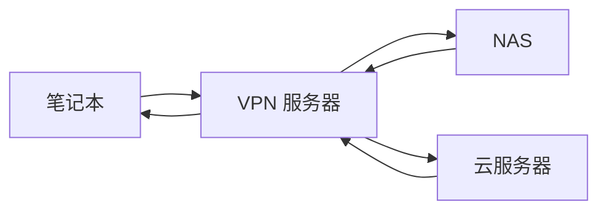
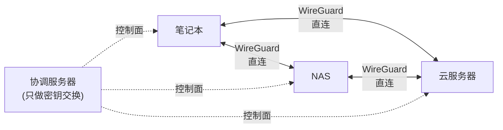
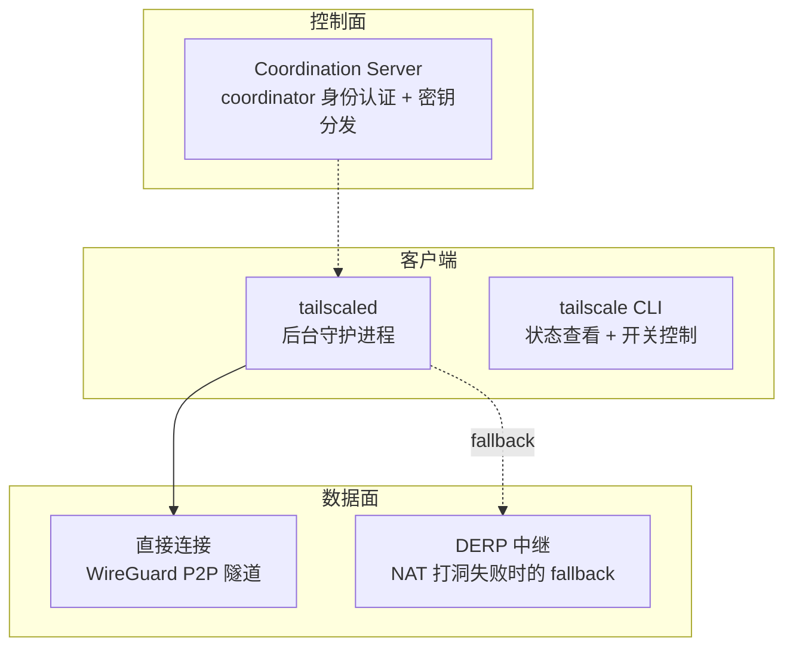

# Tailscale：WireGuard 的正确打开方式

> 基于 Tailscale v1.98，[github.com/tailscale/tailscale](https://github.com/tailscale/tailscale)，BSD-3 协议，33k+ Stars。

## 传统 VPN 的痛苦

你有一台家里的 NAS、一台公司的开发机、一台云上的服务器。你想从任何地方安全地访问它们——互相之间也要能通信。

传统方案：搭一个 OpenVPN 或 WireGuard 服务器，手动配密钥、路由表、防火墙规则。每加一台设备，就把配置复制过去、改 IP、重启。设备多了之后，你会发现自己在维护一套**手工编织的 IP 地址表**——哪台机器对应哪个 IP、哪个子网走哪个网关、哪条隧道连不上该排查什么。

Tailscale 的核心承诺：**安装、登录、完成**。不需要配置服务器，不需要手动交换密钥，不需要写路由规则。它基于 WireGuard 协议，但把"配 WireGuard 最痛苦的部分"——密钥分发、NAT 穿透、节点发现——全部自动化了。

## 不是 VPN 服务器，是 Mesh 网络

传统 VPN 是**星型拓扑**——所有流量经过中心服务器：



Tailscale 是**Mesh 拓扑**——设备之间直接通信：



协调服务器只做两件事：**身份认证**（你登录 Google/GitHub/微软账号）和**密钥分发**（每个节点拿到其他节点的公钥）。真正的数据流量不经过 Tailscale 的服务器——设备之间直接建立 WireGuard 隧道。

## 三层架构



### 控制面：Coordination Server

每个设备首次运行 `tailscale up` 时，会生成一对 WireGuard 密钥。协调服务器验证你的身份（通过 SSO），然后把你的公钥分发给 tailnet 中其他设备。所有设备的公钥交换完成后，控制面的工作基本就结束了——后续的加密通信是设备之间直接进行的。

### 数据面：直接连接或 DERP 中继

Tailscale 优先尝试**直接 P2P 连接**。它的 NAT 穿透能力（`disco/` 模块）非常激进——即使两台设备都在 NAT 后面，也能在大多数情况下打洞成功。如果实在打不通（比如两端都是对称 NAT），流量走 DERP（Designated Encrypted Relay for Packets）中继服务器——这些是 Tailscale 在全球部署的转发节点，流量端到端加密，中继节点看不到明文。

### 客户端：tailscaled + tailscale

```bash
# 安装
$ curl -fsSL https://tailscale.com/install.sh | sh

# 登录 —— 打开浏览器，用 Google/GitHub 账号认证
$ sudo tailscale up

# 查看你的 tailnet 里的所有设备
$ tailscale status
# 100.64.0.1   macbook       macOS       active; direct
# 100.64.0.2   nas           linux       active; direct
# 100.64.0.3   cloud-server  linux       active; relay (derp)
```

每个设备在 tailnet 里获得一个**固定的 100.x.y.z IP 地址**（CGNAT 地址空间）。这个 IP 在设备加入 tailnet 时分配，之后除非删除设备否则不会变。你可以直接用这个 IP 访问其他设备——就像它们在同一个局域网里。

## 你实际上怎么用

```bash
# SSH 到家里的 NAS —— 不需要配公网 IP，不需要端口转发
$ ssh user@100.64.0.2

# 访问公司开发机的 Jupyter
$ open http://100.64.0.3:8888

# 把云上的数据库映射到本地（通过 Tailscale Serve）
$ tailscale serve tcp 5432 postgres://100.64.0.5:5432
```

### 子网路由：把整个局域网接进来

Tailscale 不只是连单台设备——你可以把一台设备设为**子网路由器**，让 tailnet 里所有设备都能访问它所在的物理网络：

```bash
# 在公司的一台机器上：把它设为子网路由器
$ tailscale up --advertise-routes=192.168.1.0/24

# 现在从家里的笔记本可以直接访问公司内网的打印机
$ ping 192.168.1.50
```

### Exit Node：用远程设备的网络出口上网

```bash
# 把云服务器设为出口节点
$ tailscale up --advertise-exit-node

# 从笔记本：所有流量通过云服务器的网络出口
$ tailscale set --exit-node=100.64.0.5
```

这在需要"假装在某个地区上网"或"在不安全的公共 Wi-Fi 上保护流量"时非常有用。

## 不止是 VPN：Tailscale 的扩展功能

| 功能 | 做什么 | 关键词 |
|---|---|---|
| **Tailscale SSH** | 不需要配 SSH key，用 Tailscale 身份登录 | `tailscale up --ssh` |
| **Taildrive** | tailnet 内的安全文件共享 | `drive/` 模块 |
| **Funnel** | 把本地服务暴露到公网（需要 Tailscale 付费版） | `tailscale funnel 8080` |
| **Serve** | tailnet 内 HTTPS 服务暴露 | `tailscale serve / proxy` |
| **Kubernetes Operator** | 把 K8s 集群接入 tailnet | `k8s-operator/` |
| **ACL / 访问控制** | 细粒度控制哪些设备能访问哪些端口 | JSON 策略配置 |
| **Device Posture** | 设备合规检查（OS 版本、是否加密等） | `posture/` 模块 |

## 和传统 VPN 的对比

| | OpenVPN / IPsec | 裸 WireGuard | Tailscale |
|---|---|---|---|
| 配置复杂度 | 高（证书、路由表、防火墙） | 中（密钥交换、Peer 配置） | **低（安装 + 登录）** |
| 拓扑结构 | 星型（经过服务器） | 任意（需手动配置） | **Mesh 自动组网** |
| NAT 穿透 | 依赖服务器转发 | ❌ 需自己解决 | ✅ **自动打洞** |
| 身份认证 | 证书 / 预共享密钥 | 预共享密钥 | **SSO（Google/GitHub/MS）** |
| 密钥轮换 | 手动 | 手动 | **自动** |
| 移动端体验 | 差 | 不支持 | **iOS/Android 原生 App** |
| 免费额度 | N/A | N/A | **100 设备免费** |

Tailscale 的本质不是"又一个 VPN 工具"——它把 VPN 从**网络层的配置问题**变成了**身份层的授权问题**。你不配 IP、不配路由、不配密钥——你用你是谁（SSO 身份）来决定你能访问什么。

## 怎么开始用

```bash
# 1. 安装
$ curl -fsSL https://tailscale.com/install.sh | sh

# 2. 在所有设备上重复步骤 1，然后用同一个账号登录
$ sudo tailscale up

# 3. 看你的网络
$ tailscale status

# 4. 用 tailnet IP 直接访问
$ ssh user@100.64.x.y
```

免费版支持 100 台设备——对个人开发者和中小团队足够了。

## 小结

Tailscale 是 WireGuard 之上的产品化层。它解决的不是加密（WireGuard 已经做到了），而是**可用性**——让非网络工程师也能在 2 分钟内建立起一个跨越家庭、办公室、数据中心的加密网络。它的核心设计哲学：**网络拓扑应该从身份自动推导，而不是从 IP 地址手动配置。**
