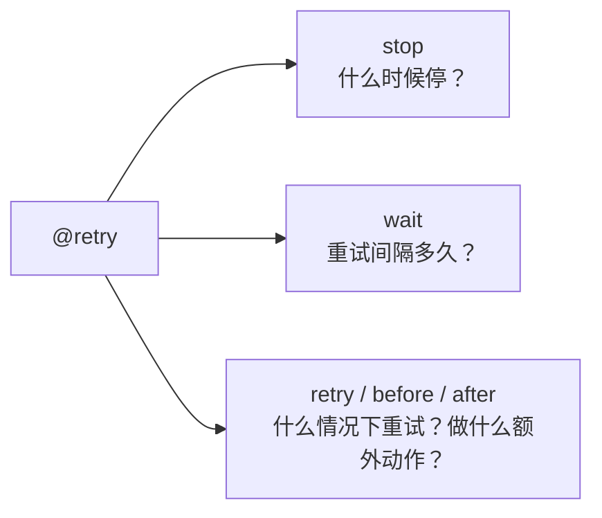

# Tenacity：Python 重试库的正确打开方式

> 网络抖动、API 限流、数据库死锁——这些临时性故障不应该让整个请求失败。Tenacity 是 Python 生态里最成熟的重试库，Apache 2.0 协议，从已停止维护的 retrying 分支而来。这篇文章覆盖从最简 `@retry` 到自定义重试策略的全部用法。

## 为什么需要重试库

```python
# 没有重试——第一次失败就放弃
import requests

def fetch_data(url):
    response = requests.get(url, timeout=5)
    return response.json()

# 手写重试——样板代码侵蚀业务逻辑
import time

def fetch_data_with_retry(url, max_retries=3):
    for attempt in range(max_retries):
        try:
            response = requests.get(url, timeout=5)
            return response.json()
        except requests.RequestException:
            if attempt == max_retries - 1:
                raise
            time.sleep(2 ** attempt)  # 手动指数退避
```

五个 API 调用 = 五份重试样板代码。Tenacity 把重试逻辑从业务代码中抽离：

```python
from tenacity import retry, stop_after_attempt, wait_exponential

@retry(stop=stop_after_attempt(3), wait=wait_exponential(multiplier=1, max=10))
def fetch_data(url):
    response = requests.get(url, timeout=5)
    return response.json()
```

核心思想：**重试策略是横切关注点，不应该和业务逻辑混在一起**。这和装饰器篇讨论的设计哲学一脉相承。

## 快速开始

```bash
pip install tenacity
```

```python
import random
from tenacity import retry

@retry
def do_something_unreliable():
    if random.randint(0, 10) > 1:
        raise Exception("Something went wrong")
    return "Success!"
```

不带任何参数时，默认行为：**永远重试，不等待，任何 Exception 都触发重试**。适合临时性故障——数据库死锁、网络超时——不适合逻辑错误（如果函数本身有 bug，永远重试也不会成功）。

## 三大控制维度

Tenacity 把重试策略拆成三个正交的维度，每个维度用一组函数组合：



### Stop——什么时候停止重试

```python
from tenacity import retry, stop_after_attempt, stop_after_delay, stop_before_delay, stop_never

# 最多重试 7 次
@retry(stop=stop_after_attempt(7))

# 最多重试 10 秒
@retry(stop=stop_after_delay(10))

# 在第 10 秒之前还能重试——超过 10 秒后不再发起新重试
@retry(stop=stop_before_delay(10))

# 组合条件——10 秒或 5 次，哪个先到算哪个（| 操作符）
@retry(stop=(stop_after_delay(10) | stop_after_attempt(5)))

# 永不停止（默认）
@retry(stop=stop_never)
```

`stop_after_delay` vs `stop_before_delay` 的差别：前者在重试过程中检查——第 5 次重试花了 9 秒，第 6 次还可以跑（因为还没到 10 秒）。后者在第 6 次重试开始前计算：这次跑完会超过 10 秒吗？如果是，就不跑了。对时限敏感的场景用后者。

`|` 操作符实现了「或」语义——任何一个条件满足就停。对应还有 `&`（与）：两个都满足才停。

### Wait——重试间隔多久

```python
from tenacity import wait_fixed, wait_random, wait_exponential, wait_random_exponential

# 固定等待 2 秒
@retry(wait=wait_fixed(2))

# 随机 1-2 秒
@retry(wait=wait_random(min=1, max=2))

# 指数退避——2^x * 1 秒，下限 4 秒，上限 10 秒
@retry(wait=wait_exponential(multiplier=1, min=4, max=10))
# 等待序列：4s, 4s, 8s, 10s, 10s, 10s...

# 固定 + 随机抖动——至少 3 秒，额外加 0-2 秒随机数
@retry(wait=wait_fixed(3) + wait_random(0, 2))
# 避免惊群效应——大量重试请求不会在同一时刻同时到达

# 指数退避 + 随机抖动
@retry(wait=wait_random_exponential(multiplier=1, max=60))
```

`wait_fixed` + `wait_random` 的组合通过 `+` 运算符实现——固定底数加上随机扰动。这在分布式系统中特别重要——多个客户端同时失败时，如果都用固定间隔重试，会在同一时刻一起重试（thundering herd）。随机抖动让重试分散在时间轴上：

```
无抖动：|--2s--|--2s--|--2s--|   ← 所有客户端同时重试
        ↑      ↑      ↑

有抖动：|--2.3s--|--3.1s--|--2.7s--|  ← 重试时刻随机分散
         ↑        ↑         ↑
```

### Condition——什么情况下重试

```python
from tenacity import retry_if_exception_type, retry_if_result, retry_any, retry_all

# 只在特定异常时重试
@retry(retry=retry_if_exception_type(IOError))

# 只重试 IOError，不重试 ValueError
@retry(retry=retry_if_exception_type((IOError, TimeoutError)))

# 根据返回值决定是否重试
def is_none(value):
    return value is None

@retry(retry=retry_if_result(is_none))
def might_return_none():
    return None if random.random() > 0.5 else "Got it!"

# 组合——结果为空 OR（|）特定异常
@retry(retry=(retry_if_result(is_none) | retry_if_exception_type(IOError)))

# 返回 False 且没有异常时也重试
@retry(retry=retry_if_result(lambda x: x is False))
```

`retry_if_result` 是一个容易忽略的能力——不是所有失败都抛异常。API 返回 `{"status": "error"}` 不抛异常，函数返回 `None` 也不抛异常。`retry_if_result` 让你基于返回值做决策。

## 实际场景

### 场景一：API 调用——指数退避 + 抖动

```python
import requests
from tenacity import retry, stop_after_attempt, wait_random_exponential, retry_if_exception_type

@retry(
    stop=stop_after_attempt(5),
    wait=wait_random_exponential(multiplier=1, max=60),
    retry=retry_if_exception_type(requests.RequestException),
)
def call_api(endpoint, payload):
    """调用外部 API——网络抖动自动重试，最多 5 次"""
    response = requests.post(endpoint, json=payload, timeout=10)
    response.raise_for_status()
    return response.json()
```

### 场景二：数据库操作——确保幂等性

```python
import psycopg2
from tenacity import retry, stop_after_attempt, wait_exponential

@retry(
    stop=stop_after_attempt(3),
    wait=wait_exponential(multiplier=1, max=10),
    retry=retry_if_exception_type(psycopg2.OperationalError),
)
def update_user_balance(user_id, amount):
    """更新用户余额——只在操作错误（死锁、连接断开）时重试"""
    with get_db() as conn:
        with conn.cursor() as cur:
            cur.execute(
                "UPDATE users SET balance = balance + %s WHERE id = %s",
                (amount, user_id)
            )
```

关键：重试的函数本身必须幂等。`UPDATE balance = balance + 100` 如果被重试两次，就加了 200——重试不是原因，函数设计不是幂等才是问题。对于非幂等操作，用唯一键 + `INSERT ... ON CONFLICT DO NOTHING` 或业务层的 idempotency key。

### 场景三：重试前重置状态

```python
from tenacity import retry, stop_after_attempt, before_log
import logging

logger = logging.getLogger(__name__)

@retry(
    stop=stop_after_attempt(3),
    before=lambda retry_state: logger.info(
        f"第 {retry_state.attempt_number} 次尝试"
    ),
)
def send_with_reconnect(data):
    """发送数据——连接断开后重试前自动重连"""
    if not connection.is_alive():
        connection.reconnect()   # 重试前重置状态
    connection.send(data)
```

`before` 在每次尝试（包括第一次）之前执行。`retry_state` 提供了丰富的上下文：

```python
retry_state.attempt_number    # 当前第几次尝试（从 1 开始）
retry_state.outcome.failed    # 是否失败
retry_state.outcome.exception()  # 失败的异常对象
retry_state.idle_for          # 已经等了多久
retry_state.seconds_since_start  # 从第一次尝试开始过了多少秒
```

对应的还有 `after`（每次尝试之后）：

```python
import logging
from tenacity import retry, stop_after_attempt, after_log

logging.basicConfig(level=logging.INFO)

@retry(
    stop=stop_after_attempt(5),
    after=after_log(logger, logging.WARNING),
)
def log_on_failure():
    raise Exception("Oops")
# 每次失败后自动输出 WARNING 级别日志
```

## 异步支持

```python
import aiohttp
from tenacity import retry, stop_after_attempt, wait_exponential

@retry(stop=stop_after_attempt(3), wait=wait_exponential(multiplier=1))
async def fetch_async(url):
    async with aiohttp.ClientSession() as session:
        async with session.get(url, timeout=aiohttp.ClientTimeout(total=5)) as resp:
            return await resp.json()

# 调用
# data = await fetch_async("https://api.example.com/data")
```

`@retry` 对 async 函数和同步函数的用法完全一致——Tenacity 自动检测并适配。不需要 `@retry_async` 这种专门装饰器。

## 统计信息

```python
from tenacity import retry, stop_after_attempt, RetryError

@retry(stop=stop_after_attempt(3))
def might_fail():
    raise Exception("Nope")

try:
    might_fail()
except RetryError as e:
    print(f"最终失败，共尝试 {e.last_attempt.attempt_number} 次")
    print(f"总耗时 {e.last_attempt.seconds_since_start:.1f} 秒")
    # RetryError.last_attempt 包含了最后一次尝试的完整上下文
```

`RetryError` 是 Tenacity 在重试策略耗尽后抛出的异常。和直接访问 `retry_state` 不同，它的 `last_attempt` 包含了最后一次尝试的状态信息。

## 自定义重试策略

当内置的 stop/wait/retry 不够用时，直接写函数：

```python
from tenacity import retry, retry_if_exception

def retry_on_specific_errors(exception):
    """只在特定错误消息时重试"""
    if not isinstance(exception, requests.HTTPError):
        return False
    # 429 (Rate Limit) 和 503 (Service Unavailable) 重试
    # 401 (Unauthorized) 和 404 (Not Found) 不重试
    return exception.response.status_code in (429, 503)

@retry(retry=retry_on_specific_errors)
def call_with_rate_limit(url):
    response = requests.get(url)
    response.raise_for_status()
    return response.json()
```

自定义 stop 也一样：

```python
from tenacity import retry

def stop_on_specific_result(retry_state):
    """返回特定值时停止——不再重试"""
    if retry_state.outcome and not retry_state.outcome.failed:
        result = retry_state.outcome.result()
        if result == "skip":
            return True
    return False

@retry(stop=stop_on_specific_result)
def maybe_skip():
    ...
```

任何接收 `retry_state` 参数并返回 `bool` 的函数都可以作为 stop 条件。同样，任何接收 `exception` 参数返回 `bool` 的函数都可以作为 retry 条件。

## 完整模式组合

```python
@retry(
    # 停止条件：最多 5 次或 30 秒
    stop=(stop_after_attempt(5) | stop_after_delay(30)),

    # 等待策略：指数退避 + 随机抖动
    wait=wait_exponential(multiplier=1, min=2, max=30) + wait_random(0, 1),

    # 重试条件：网络错误或特定 HTTP 状态码
    retry=(retry_if_exception_type(requests.RequestException) & retry_on_specific_errors),

    # 每次尝试前记录日志
    before=before_log(logger, logging.INFO),

    # 每次失败后记录错误
    after=after_log(logger, logging.WARNING),
)
def robust_api_call(url):
    response = requests.get(url)
    response.raise_for_status()
    return response.json()
```

## 总结

| 需求 | Tenacity 方案 |
|------|-------------|
| 永远重试（不推荐） | `@retry`（默认） |
| 固定次数 | `stop=stop_after_attempt(5)` |
| 超时停止 | `stop=stop_after_delay(30)` |
| 固定间隔 | `wait=wait_fixed(2)` |
| 指数退避 | `wait=wait_exponential(multiplier=1, max=60)` |
| 防止惊群 | `wait=wait_fixed(3) + wait_random(0, 2)` |
| 只重试特定异常 | `retry=retry_if_exception_type(IOError)` |
| 根据返回值重试 | `retry=retry_if_result(lambda x: x is None)` |
| 异步函数 | `@retry`（自动适配 async） |

Tenacity 的 API 设计值得学习——通过 `|` 和 `&` 组合条件、通过 `+` 组合等待策略，把一个复杂的状态机变成声明式的组合表达式。这和 Python 装饰器的思想一脉相承：把横切关注点从业务代码中抽出来，用声明式的方式表达。
