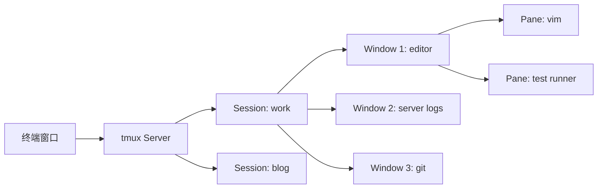

# tmux：终端复用器的正确打开方式

> SSH 断了，跑了半小时的训练脚本没了——这是每个用终端的人的噩梦。tmux 解决的问题很简单：**终端会话和你的 SSH 连接解耦**。退出终端、断开 SSH、甚至关掉笔记本——tmux 里的东西都在跑，回来就能接上。

## tmux 是什么

tmux = **t**erminal **mu**ltiple**x**er。它在你和终端之间加了一层中间人：



四层结构：

| 层级 | 概念 | 类比 |
|------|------|------|
| Server | tmux 后台进程 | 操作系统 |
| Session | 一组 window 的集合 | 一个项目 |
| Window | 一个全屏终端 | 一个浏览器 tab |
| Pane | window 的分割区域 | 一个分屏 |

Session 是最关键的概念——它不和任何终端窗口绑定。你在一个终端里创建 session，关掉终端，打开另一个终端 attach 回去——里面的进程一直活着。

## 安装

```bash
# macOS
brew install tmux

# Linux
sudo apt install tmux        # Debian/Ubuntu
sudo yum install tmux        # RHEL/CentOS
```

## 十分钟上手

```bash
# 创建一个命名 session
tmux new -s work

# 分屏——这就是 tmux 80% 的使用价值
Ctrl+b %     # 垂直分屏（左右）
Ctrl+b "     # 水平分屏（上下）

# 在 pane 之间跳转
Ctrl+b ← → ↑ ↓

# 离开 session（不关闭——后台运行）
Ctrl+b d     # detach

# 重新连接
tmux attach -t work

# 查看所有 session
tmux ls
```

`Ctrl+b` 是默认的 prefix key——先按 `Ctrl+b`，松开，再按下一个键。不是同时按。

## 高频操作速查

### Session 管理

```bash
tmux new -s <name>         # 新建命名 session
tmux attach -t <name>      # 连接已有 session
tmux ls                    # 列出所有 session
tmux kill-session -t <name> # 杀掉 session
Ctrl+b $                    # 重命名当前 session
Ctrl+b d                    # detach
```

### Window 管理

```bash
Ctrl+b c     # 创建新 window
Ctrl+b ,     # 重命名当前 window
Ctrl+b n     # 下一个 window
Ctrl+b p     # 上一个 window
Ctrl+b 0-9   # 跳到编号为 N 的 window
Ctrl+b &     # 关闭当前 window（确认后）
```

### Pane 操作

```bash
Ctrl+b %     # 垂直分屏（左右）
Ctrl+b "     # 水平分屏（上下）
Ctrl+b x     # 关闭当前 pane（确认后）
Ctrl+b z     # 全屏/取消全屏当前 pane
Ctrl+b {     # 当前 pane 左移
Ctrl+b }     # 当前 pane 右移
Ctrl+b 空格  # 循环切换 pane 布局
Ctrl+b !     # 把 pane 提升为独立 window
```

### 滚动与复制

```bash
Ctrl+b [     # 进入复制模式（可上下滚动）
  ↑ ↓        # 逐行滚动
  Ctrl+u     # 上半页
  Ctrl+d     # 下半页
  / 搜索内容  # 搜索
  q          # 退出复制模式

# 推荐：开启 vi 模式后用 vim 快捷键滚动（见下文配置）
```

## 三个实际场景

### 场景一：远程服务器跑训练——断开连接也不怕

```bash
# SSH 到服务器
ssh myserver

# 启动或连接 tmux
tmux new -As training   # -A: 存在就 attach，不存在就 new

# 跑训练
python train.py --epochs 100

# 关掉终端——训练继续跑
# 第二天从任何地方 SSH 回去
ssh myserver
tmux attach -t training
# 训练还在跑，日志全在
```

`-A`（attach-or-new）是日常最常用的组合——不用先 `tmux ls` 检查是否存在。

### 场景二：本地开发——一个 window 一个服务

```bash
tmux new -s dev

# Window 0: 编辑器
Ctrl+b c                    # Window 1
cd project && vim .

# Window 1: 开发服务器
Ctrl+b c                    # Window 2
cd project && npm run dev

# Window 2: 测试
Ctrl+b c                    # Window 3
cd project && npm test -- --watch

# Window 3: git
Ctrl+b c                    # Window 4
cd project && git status

# Ctrl+b 0-4 在所有 window 间跳转
```

不用开四个终端窗口——一个 tmux 搞定。每个 window 都独立，不会互相干扰。

### 场景三：分屏看日志 + 操作

```bash
# 上半屏：tail 实时日志
Ctrl+b "        # 水平分屏
tail -f /var/log/app.log

# 下半屏：操作
Ctrl+b ↓        # 跳到下屏
curl localhost:8080/health
systemctl restart myapp

# 上半：看日志变化
# 下半：继续操作——一个终端搞定
```

## 配置文件——解决前缀键太远的问题

默认 `Ctrl+b` 离 `Ctrl` 太远，改成 `Ctrl+a`：

```bash
# ~/.tmux.conf
# 前缀键改为 Ctrl+a
set -g prefix C-a
unbind C-b
bind C-a send-prefix

# 鼠标支持——点击切换 pane、拖拽调整大小
set -g mouse on

# 启动窗口编号从 1 开始（不用 0）
set -g base-index 1

# pane 编号从 1 开始
set -g pane-base-index 1

# 减少 escape-time 延迟（从 500ms 降到 10ms）
set -sg escape-time 10

# 256 色支持
set -g default-terminal "screen-256color"

# 直观的分屏快捷键
bind | split-window -h -c "#{pane_current_path}"   # Ctrl+a | 垂直分屏
bind - split-window -v -c "#{pane_current_path}"   # Ctrl+a - 水平分屏
# -c 让新 pane 的工作目录等于当前 pane 的目录

# vim 风格的 pane 切换
bind h select-pane -L
bind j select-pane -D
bind k select-pane -U
bind l select-pane -R

# 快速 reload 配置
bind r source-file ~/.tmux.conf \; display "Config reloaded!"
```

加载新配置：

```bash
tmux source-file ~/.tmux.conf
```

改成 `Ctrl+a` 之后，操作变单手——小指按住 Ctrl，食指按 a。习惯了就再也回不去 `Ctrl+b`。

## 复制模式开启 vi 键位

```bash
# ~/.tmux.conf
set -g mode-keys vi

# 进入复制模式后：
#   / 搜索
#   n 下一个匹配
#   y 复制选中文本
#   q 退出复制模式

# vim 风格选择——按 v 开始选择，按 y 复制
bind -T copy-mode-vi v send -X begin-selection
bind -T copy-mode-vi y send -X copy-selection-and-cancel

# 用前缀键 + y 复制到系统剪贴板（macOS）
bind-key -T copy-mode-vi y send-keys -X copy-pipe-and-cancel "pbcopy"
```

## 插件——用 TPM 管理

[tmux-plugins/tpm](https://github.com/tmux-plugins/tpm) 是 tmux 的插件管理器：

```bash
git clone https://github.com/tmux-plugins/tpm ~/.tmux/plugins/tpm
```

```bash
# ~/.tmux.conf
# 插件列表
set -g @plugin 'tmux-plugins/tpm'
set -g @plugin 'tmux-plugins/tmux-sensible'     # 默认优化
set -g @plugin 'tmux-plugins/tmux-resurrect'    # 重启后恢复 session
set -g @plugin 'tmux-plugins/tmux-continuum'    # 自动保存和恢复

# TPM 必须放在最后
run '~/.tmux/plugins/tpm/tpm'
```

装完后 `Ctrl+a I`（大写 i）安装插件。

三个值得装的选择：

- **tmux-resurrect**：重启电脑后恢复 tmux 环境——session、window、pane 布局全还原。`Ctrl+a Ctrl+s` 保存，`Ctrl+a Ctrl+r` 恢复
- **tmux-continuum**：每隔 15 分钟自动保存，重启后自动恢复。配合 resurrect 用
- **tmux-sensible**：开箱即用的优化配置——延长 escape-time、开启 focus-events、合理的 history-limit

## 日常惯用语

```bash
# 不想加 -s 的情况——记住这个
tmux new -As <name>    # attach or new → 永远能用

# 临时操作——看完日志就关
tmux new -As temp
# ... 操作 ...
Ctrl+b d && tmux kill-session -t temp

# 远程协作——两个人同时 attach 同一个 session（默认行为是各自独立 view）
tmux new -s pair
# 另一个人：
tmux attach -t pair
# 两人看到一模一样的画面，同一个键盘输入
# 适合结对编程或远程排错演示
```

## 总结

tmux 的核心价值就三个字：**不丢会话**。分屏、多 window、插件都是锦上添花。

```bash
tmux new -As work    # 创建或连接
Ctrl+a |             # 分屏
Ctrl+a d             # 离开
tmux attach -t work  # 回来
```

这四行记熟，就够日常用了。剩下的边用边查。
